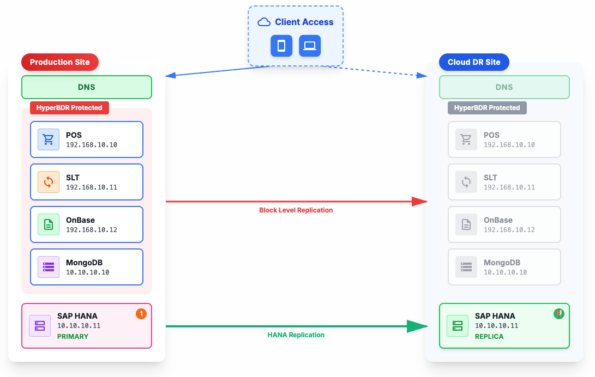

# HyperBDR SAP HANA Hybrid Cloud DR Solution Best Practices

This document is based on a real DR drill project for a Latin American telecommunications operator (including financial services) on Huawei Cloud. It is designed for market and partner audiences, highlighting **HyperBDR Orchestration capabilities** in SAP HANA scenarios: orchestration coordinates the DR takeover process, **first calling HANA Replication to recover the database**, then **calling HyperBDR Boot-in-Cloud to launch** the application layer, achieving a hybrid DR solution.

***

## 1. Project Overview

### 1.1 Customer and Scenario

| Dimension                    | Description                                                                                                                                                                                                                        |
| ---------------------------- | ---------------------------------------------------------------------------------------------------------------------------------------------------------------------------------------------------------------------------------- |
| **Industry / Region**        | Telecommunications operator (including financial services), Latin America (Honduras / Costa Rica)                                                                                                                                  |
| **Business Characteristics** | Core businesses include **billing and credit**, point-of-sale transactions (POS), document management (OnBase), etc., involving financial transactions and customer identity verification                                          |
| **Key Systems**              | **SAP** (S/4HANA core transactions, CAR customer activity analysis, HPI reporting), POS point-of-sale systems, OnBase document workflows, MongoDB, etc.                                                                            |
| **Business System Scale**    | **50 hosts**, approximately **50+ TB** of storage                                                                                                                                                                                  |
| **Source Environment**       | **VMware** virtualization environment, production environment on-premises                                                                                                                                                          |
| **DR Target**                | DR environment on Huawei Cloud; drill validates RPO/RTO, ensuring billing, credit, and other financial businesses can recover in a **controlled, timely, and consistent** manner during DR switchover without affecting production |

This project is a **typical SAP HANA Disaster Recovery (DR)** scenario: SAP-centric, with supporting billing, credit, point-of-sale, and other financial business systems, achieving cloud DR through **HyperBDR DR and orchestration capabilities**. This scenario has extremely high requirements for data consistency and recovery time, making it suitable as a reference case for **financial/telecommunications industry SAP DR**.

### 1.2 HyperBDR Core Value in This Project

* **Orchestration capability is the most prominent point of this document**: The takeover process is coordinated by **HyperBDR Orchestration**—**first calling HANA Replication to recover the database**, then **calling HyperBDR Boot-in-Cloud to launch** application layer hosts (including SLT and 50 others), achieving controlled and orderly DR takeover.

* **Hybrid DR Solution**: By orchestrating SAP HANA Replication and HyperBDR, achieving a hybrid DR architecture of "database-level real-time replication + host-level orchestrated recovery", balancing RPO/RTO requirements with cost-effectiveness.

* **Object Storage Technology**: Using object storage (OBS) as an intermediate storage layer, **reducing target-side usage costs**, and launching complete business systems in the cloud through **Boot-in-Cloud**, which is HyperBDR's distinctive capability.

* **Agentless Approach**: This project primarily uses **VM agentless mode** (source is VMware), requiring no agent installation on the source side, reducing deployment complexity and operational burden.

***

## 2. Business Challenges and HyperBDR Responses

SAP HANA DR often faces the following challenges, which this project addresses through **HyperBDR DR and orchestration capabilities**:

| Challenge                                | Description                                                                                                                                                                                                                                                                                                           | HyperBDR Response                                                                                                                                                                                                                                                    |
| ---------------------------------------- | --------------------------------------------------------------------------------------------------------------------------------------------------------------------------------------------------------------------------------------------------------------------------------------------------------------------- | -------------------------------------------------------------------------------------------------------------------------------------------------------------------------------------------------------------------------------------------------------------------- |
| **System Complexity**                    | SAP has strong dependencies with SLT, CAR, HPI, and surrounding applications (POS point-of-sale, OnBase documents, MongoDB), requiring coordinated switching; financial businesses have extremely high data consistency requirements; the scale of **50 hosts and 50+ TB storage** increases orchestration complexity | HyperBDR's **orchestration capability** supports **50 hosts** through **Boot-in-Cloud** parallel recovery and dependency management, ensuring billing and credit data consistency during switching through fixed timelines and responsible parties                   |
| **High RPO/RTO Requirements**            | Financial transactions and analysis such as billing and credit cannot tolerate long interruptions or significant data loss; customer identity verification (e.g., Valkiria ID queries) must be available in real-time                                                                                                 | **Orchestration-driven takeover**: Orchestration first calls HANA Replication to achieve SAP HANA level RPO≈0, RTO<5 min, then calls Boot-in-Cloud to quickly recover application layer VMs, controlling overall RTO within 2 hours                                  |
| **Target-side Costs**                    | Traditional DR solutions require large storage resources on the target side, with high costs                                                                                                                                                                                                                          | **Object Storage Technology**: HyperBDR uses object storage (OBS) as an intermediate storage layer, **reducing target-side usage costs**, and launching complete business systems in the cloud through **Boot-in-Cloud**, which is HyperBDR's distinctive capability |
| **Bandwidth and Synchronization**        | SLT and post-drill resynchronization are constrained by bandwidth, affecting recovery time                                                                                                                                                                                                                            | HyperBDR supports **policy-based synchronization** (periodic/policy synchronization), coordinating with HANA Replication bandwidth requirements, prioritizing critical replication links                                                                             |
| **Deployment and Operations Complexity** | Traditional DR solutions require agent installation on the source side, increasing deployment and operational burden                                                                                                                                                                                                  | **Agentless Approach**: HyperBDR uses VM agentless mode, requiring no agent installation on the source side, reducing deployment complexity and operational burden                                                                                                   |

These challenges are common in most SAP cloud DR scenarios, so the **HyperBDR DR and orchestration capabilities** demonstrated in this project have **reusable best practices** value.

***

## 3. HyperBDR Solution and Architecture

### 3.1 Overall Approach: Orchestration-Driven Takeover Process

**HyperBDR Orchestration** is the core driver of the takeover process, coordinating all recovery actions:

1. **Orchestration first calls HANA Replication**: Recover SAP HANA database (on-premises → Huawei Cloud), achieving database-level RPO≈0, RTO<5 min.

2. **Orchestration then calls HyperBDR Boot-in-Cloud**: Launch application layer hosts (including SLT and 50 others, approximately 50+ TB storage) with one click, critical applications ready within 9 min–2 h; using object storage (OBS) to reduce target-side costs, agentless mode to reduce deployment complexity.

Orchestration schedules HANA Replication and Boot-in-Cloud in sequence, forming "database-level + host-level" dual protection, balancing performance and cost.

### 3.2 Architecture Highlights

* **Production Side (VMware)**: SAP HANA (S/4, CAR), SLT, POS, OnBase, etc., deployed in customer's on-premises VMware environment.

* **DR Side (Huawei Cloud)**:

  * HANA secondary node (real-time replication through HANA Replication)

  * Application layer hosts (including SLT and **50 hosts**, orchestrated by HyperBDR to **call Boot-in-Cloud** after HANA recovery)

* **Storage Layer**: **Object Storage (OBS)** as intermediate storage layer (approximately 50+ TB), **reducing target-side usage costs**, supporting **Boot-in-Cloud** to launch complete business systems in the cloud.

* **Replication Relationships**:

  * HANA Replication (real-time, database-level)

  * HyperBDR (periodic/policy synchronization, host-level, through OBS)

The following diagram shows the high-level architecture of this project, demonstrating the **HyperBDR orchestration-driven takeover** (first HANA Replication, then Boot-in-Cloud) hybrid DR solution:

*Figure 1 High-Level Architecture: HANA Replication + HyperBDR Hybrid DR Solution*

### 3.3 HyperBDR Core Capabilities Demonstrated in This Project

| HyperBDR Capability              | Application in This Project                                                                                                                                                                                                                                           | Value                                                                                                                        |
| -------------------------------- | --------------------------------------------------------------------------------------------------------------------------------------------------------------------------------------------------------------------------------------------------------------------- | ---------------------------------------------------------------------------------------------------------------------------- |
| **Orchestration Capability**     | Takeover process coordinated by orchestration: **first calling HANA Replication to recover database**, then **calling Boot-in-Cloud to launch** 50 application layer hosts, parallel recovery and dependency management, critical applications ready within 9 min–2 h | **Most prominent point of this solution**: Orchestration as the core driver, achieving controlled and orderly DR takeover    |
| **Boot-in-Cloud**                | Using OBS as intermediate storage layer (approximately 50+ TB), reducing target-side usage costs, **Boot-in-Cloud** launching complete business systems in the cloud                                                                                                  | Reducing target-side storage costs, improving DR solution economics; **Boot-in-Cloud** capability is HyperBDR's core feature |
| **Agentless Mode**               | VM agentless mode, no agent installation required on source side                                                                                                                                                                                                      | Reducing deployment complexity and operational burden, improving customer acceptance                                         |
| **Policy-based Synchronization** | Supports periodic/policy synchronization, coordinating with HANA Replication bandwidth requirements                                                                                                                                                                   | Flexible response to different RPO/RTO requirements, optimizing bandwidth usage                                              |

***

## 4. Implementation Highlights and Drill Best Practices

### 4.1 Data Replication Phase

During the data replication phase before the drill, this project adopted a hybrid replication strategy:

* **SAP HANA Database Replication**: Real-time database-level replication through SAP HANA Replication, from production SAP HANA to DR SAP HANA, ensuring database-level RPO≈0.

* **Application Host Replication**: Host-level block storage replication through HyperBDR, replicating data from approximately 50 production hosts (including SLT, POS, OnBase, MongoDB, and other application systems) to object storage (OBS), reducing target-side storage costs.

  * **Critical Host Replication Strategy**: For approximately 26 critical application hosts (such as SLT, core SAP applications, etc.), using **15-minute** replication frequency to ensure smaller RPO for critical business systems and lower data loss risk.

  * **Other Host Replication Strategy**: For the remaining approximately 24 hosts, using **3-hour** replication frequency, optimizing bandwidth usage and storage costs while ensuring data security.

Data replication is continuous, providing the data foundation for subsequent drills and takeovers. HyperBDR's policy-based synchronization capability supports flexible configuration of replication frequency for different hosts based on business importance, achieving a balance between RPO requirements and cost-effectiveness.

### 4.2 Drill and Takeover Phase Best Practices

Drills and takeovers are critical stages for validating DR solution effectiveness. This project uses a **HyperBDR Orchestration**-driven takeover process. The following are detailed steps and best practices during the drill:

#### 4.2.1 Pre-Drill Preparation: Simulating Production Business Synchronization Stop

Before the drill begins, it is necessary to simulate the synchronization cut-off process in a real disaster scenario, ensuring the drill does not affect the production environment. This project's pre-drill preparation includes:

| Step                                      | Time                                  | Key Actions                                                            | Purpose                                                                                                                               |
| ----------------------------------------- | ------------------------------------- | ---------------------------------------------------------------------- | ------------------------------------------------------------------------------------------------------------------------------------- |
| **SLT Synchronization Alignment**         | Approximately 3 hours before drill    | HyperBDR SLT automatic/manual synchronization, ensuring data alignment | Complete final data synchronization before cut-off, reducing data loss                                                                |
| **Stop SLT Replication**                  | Approximately 3 hours before drill    | Stop SLT at source (Tigo), controlled stop of replication              | Simulate production environment stop, align CAR synchronization before cut-off                                                        |
| **Stop HyperBDR Synchronization**         | Approximately 2.5 hours before drill  | Stop synchronization of all VMs in HyperBDR (approximately 50 hosts)   | Simulate synchronization cut-off, reduce bandwidth requirements; this is the standard process during real takeover (complete cut-off) |
| **Stop Secondary Instance Communication** | Approximately 15 minutes before drill | Stop secondary SAP HANA instance communication, maintain DR isolation  | Ensure DR environment isolation from production environment, HyperBDR agents maintain communication but are inactive                  |

**Key Points of Pre-Drill Preparation:**

* Pre-drill preparation steps are only executed before test scenarios (drills), and may differ in real takeovers

* Controlled synchronization stop ensures data integrity, avoiding continued production data changes during the drill

* Simulating cut-off validates DR solution effectiveness in real disaster scenarios

#### 4.2.2 Drill and Takeover Phase

| Phase                                      | Objective                                          | Detailed Steps and HyperBDR Key Actions                                                                                                                                                                                                                                                                                                                                                                                                                                                                                   | Time and Results                                                                                                                                                                                                                                                                              |
| ------------------------------------------ | -------------------------------------------------- | ------------------------------------------------------------------------------------------------------------------------------------------------------------------------------------------------------------------------------------------------------------------------------------------------------------------------------------------------------------------------------------------------------------------------------------------------------------------------------------------------------------------------- | --------------------------------------------------------------------------------------------------------------------------------------------------------------------------------------------------------------------------------------------------------------------------------------------- |
| **Phase 1: Takeover Start**                | Database recovery                                  | 1. **Orchestration first calls HANA Replication** to take over SAP HANA database&#xA;- CAR database takeover: 20 seconds&#xA;- Modify hosts file: 6 minutes&#xA;- S4 database takeover: 1 minute 20 seconds&#xA;2\. Start SLT on Huawei Cloud: 48 minutes&#xA;3\. Verify database connections and status                                                                                                                                                                                                                  | • SAP HANA total takeover time: < 5 minutes&#xA;• SAP HANA ready: within approximately 5 minutes after takeover&#xA;• SLT ready: 48 minutes                                                                                                                                                   |
| **Phase 2: Infrastructure Launch**         | Applications and dependencies ready                | 1. **Orchestration then calls Boot-in-Cloud** to launch application layer hosts&#xA;2\. Create instances through HyperBDR: approximately 30 VMs created during drill (50 hosts total protected)&#xA;- Creation time: 9 minutes to 2 hours 3 minutes&#xA;- Critical applications: POS, SAP HPI&#xA;3\. Initial configuration and hosts file adjustment: 20 minutes&#xA;4\. Initial application function verification: progressive testing as VMs become available                                                          | • Critical application creation time: 9 minutes to 2 hours 3 minutes&#xA;• POS infrastructure: < 2 hours 30 minutes&#xA;• OnBase infrastructure: approximately 3 hours 40 minutes                                                                                                             |
| **Phase 3: DR Operation Verification**     | Business and stability verification                | 1. Verify VM functions recovered through **Boot-in-Cloud**&#xA;2\. Test application layer functions (POS, OnBase, MongoDB, etc.)&#xA;3\. SAP Router (EIP) test: successful cloud access verification&#xA;4\. Verify business continuity (billing, credit, and other financial businesses)&#xA;5\. Monitor system stability and performance                                                                                                                                                                                | • Application servers running stably, response times within normal expected range&#xA;• Active Directory successfully verified and accessible on Huawei Cloud&#xA;• POS MongoDB: some nodes ready                                                                                             |
| **Phase 4: Wrap-up and Resynchronization** | Restore production replication, no residual impact | 1. Stop secondary SAP HANA, begin configuration for fast resynchronization&#xA;2\. DR VM shutdown and deletion: controlled cleanup&#xA;3\. Restore VPN: successfully restore connectivity&#xA;4\. HANA Replication resynchronization:&#xA;- CAR resynchronization: approximately 12 hours&#xA;- S4 resynchronization: approximately 12 hours (after bandwidth optimization)&#xA;5\. HyperBDR replication recovery, re-establish host-level replication&#xA;6\. Bandwidth optimization: increase from 200 Mbps to 400 Mbps | • CAR resynchronization: approximately 12 hours&#xA;• S4 resynchronization (before optimization): over 48 hours (failed due to bandwidth limitations)&#xA;• S4 resynchronization (after optimization): approximately 12 hours&#xA;• Post-drill recovery time (after optimization): < 19 hours |

**HyperBDR Best Practice Points During Drill:**

* **Orchestration-driven takeover**: **HyperBDR Orchestration** coordinates the entire takeover process—**first calling HANA Replication to recover database**, then **calling Boot-in-Cloud to launch** application layer hosts. Orchestration ensures correct recovery order, preventing applications from starting before the database is ready, avoiding connection failures.

* **Parallel Recovery and Dependency Management**: HyperBDR's orchestration capability supports multiple VMs through **Boot-in-Cloud** parallel recovery while managing dependencies between applications. Critical applications start first, shortening overall recovery time; 50 hosts can complete recovery within 2 hours.

* **Boot-in-Cloud**: Using OBS as an intermediate storage layer, **reducing target-side usage costs**, and launching complete business systems (50 hosts, 50+ TB storage) in the cloud through **Boot-in-Cloud**, which is HyperBDR's core distinctive capability.

* **Bandwidth and Priority Coordination**: During post-drill resynchronization, HyperBDR's policy-based synchronization can coordinate with HANA Replication bandwidth requirements, prioritizing critical replication links. This project optimized bandwidth (200→400 Mbps), reducing post-drill recovery time from approximately 48 hours to <19 hours.

***

## 5. Key Results and Metrics

Using HyperBDR orchestration-driven hybrid DR solution, the following results can be achieved during DR drills and takeover processes, demonstrating **measurable outcomes of HyperBDR DR and orchestration capabilities in SAP HANA scenarios**:

| Metric                                             | Result                                                             | HyperBDR Contribution                                                                                                              |
| -------------------------------------------------- | ------------------------------------------------------------------ | ---------------------------------------------------------------------------------------------------------------------------------- |
| **SAP HANA Takeover**                              | RTO < 5 minutes, RPO ≈ 0                                           | HANA Replication (database-level)                                                                                                  |
| **SAP HANA Ready**                                 | Within approximately 5 minutes after takeover                      | HANA Replication                                                                                                                   |
| **SLT Ready**                                      | 48 minutes                                                         | HyperBDR **Boot-in-Cloud** launching SLT                                                                                           |
| **Application Layer Ready**                        | Critical application creation time: 9 minutes to 2 hours 3 minutes | HyperBDR **Boot-in-Cloud** launching application layer hosts (approximately 30 VMs created during drill, 50 hosts total protected) |
| **Infrastructure (POS)**                           | < 2 hours 30 minutes                                               | HyperBDR **Boot-in-Cloud** launching POS-related VMs                                                                               |
| **Infrastructure (OnBase)**                        | Approximately 3 hours 40 minutes                                   | HyperBDR **Boot-in-Cloud** launching OnBase VMs                                                                                    |
| **Post-Drill Recovery Time (Before Optimization)** | Approximately 48 hours (bandwidth 200 Mbps)                        | HyperBDR policy-based synchronization + HANA Replication coordination                                                              |
| **Post-Drill Recovery Time (After Optimization)**  | < 19 hours (after bandwidth optimization to 400 Mbps)              | HyperBDR policy-based synchronization + HANA Replication coordination                                                              |

Note: Values may vary under different environments and bandwidth conditions, but the **HyperBDR orchestration-driven hybrid DR architecture** is replicable.

***

## 6. Project Summary

This project successfully validated the effectiveness of **HyperBDR DR and orchestration capabilities** in SAP HANA scenarios, achieving a cloud DR solution for a Latin American telecommunications operator (including financial services). Key project achievements are as follows:

### 6.1 Key Achievements

* **SAP HANA Database Takeover**: RTO < 5 minutes, RPO ≈ 0, achieving database-level real-time replication through HANA Replication

* **Rapid Application Layer Recovery**: 50 hosts launched through HyperBDR **Boot-in-Cloud**, critical applications ready within 9 minutes to 2 hours 3 minutes

* **Hybrid DR Architecture Validation**: Successfully validated hybrid DR solution of "database-level real-time replication + host-level orchestrated recovery", with orchestration coordinating the entire takeover process

* **Cost Optimization**: Reduced target-side storage costs through object storage (OBS) technology, with 50+ TB storage using object storage solution, significantly improving DR solution economics

* **Agentless Deployment**: Using VM agentless mode (source is VMware), reducing deployment complexity and operational burden

### 6.2 Project Value

This project demonstrates the core value of **HyperBDR Orchestration capabilities** in complex SAP HANA DR scenarios:

* **Orchestration-driven Takeover**: **HyperBDR Orchestration** coordinates DR takeover process, **first calling HANA Replication to recover database**, then **calling Boot-in-Cloud to launch** application layer hosts, achieving controlled and orderly takeover, with overall RTO controlled within 2 hours

* **Hybrid DR Solution**: By orchestrating SAP HANA Replication and HyperBDR, achieving hybrid DR architecture of "database-level real-time replication + host-level orchestrated recovery", balancing RPO/RTO requirements with cost-effectiveness

* **Boot-in-Cloud**: Using OBS as intermediate storage layer, **reducing target-side usage costs**, and launching complete business systems (50 hosts, 50+ TB storage) in the cloud through **Boot-in-Cloud**, which is HyperBDR's core distinctive capability

* **Policy-based Synchronization**: Supports flexible configuration of replication frequency based on business importance (critical hosts 15 minutes, other hosts 3 hours), achieving balance between RPO requirements and cost-effectiveness

### 6.3 Typical Scenario

This project covers a typical combination of **SAP S/4HANA + CAR + HPI + surrounding applications (POS, OnBase, MongoDB)**, particularly the DR scenario of "billing and credit + SAP core systems" in the **financial/telecommunications industry**. The project validated HyperBDR's DR capabilities at a scale of 50 hosts and 50+ TB storage, providing representative and reference value for similar customers.
