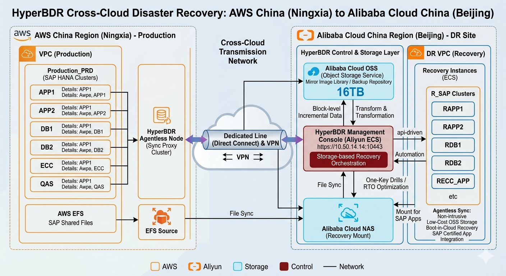

# HyperBDR SAP Semiconductor Industry Hybrid Cloud DR Best Practices

This document is based on the semiconductor industry customer SAP System Cross-Cloud Disaster Recovery project, focusing on demonstrating HyperBDR's application in SAP core business system cross-cloud disaster recovery scenarios.

## 1. Project Overview

### 1.1 Customer & Scenario

| **Dimension**                | **Description**                                                                                                                                   |
| ---------------------------- | ------------------------------------------------------------------------------------------------------------------------------------------------- |
| **Customer**                 | semiconductor industry customer                                                                                                                   |
| **Industry/Region**          | Semiconductor / Cross-Cloud Off-Site Disaster Recovery                                                                                            |
| **Business Characteristics** | Core production system SAP ERP + SAP HANA, involving critical business continuity, high availability requirements                                 |
| **Key Systems**              | SAP Application System (ABAP System + SAP HANA System), including production environment (PRD) and non-production environments (ECC, QAS)         |
| **Business Scale**           | Production environment 4 hosts (2 APP + 2 DB), non-production environment 4 hosts                                                                 |
| **Source Environment**       | AWS China (cn-northwest-1a/cn-northwest-1b)                                                                                                       |
| **DR Objectives**            | Establish AWS to Alibaba Cloud cross-cloud off-site disaster recovery solution, avoid single cloud vendor lock-in risk, resist regional disasters |

This project is a typical case of SAP core business system cross-cloud disaster recovery, suitable as a reference case for scenarios with high critical business continuity requirements.

### 1.2 HyperBDR's Core Value in This Project

* **AWS Agentless Migration**: Adopting an agentless method to directly read underlying storage, avoiding Agent installation on production SAP hosts, ensuring business stability, and reducing operational complexity.

* **Boot in Cloud**: Using object storage as an intermediate layer to enable one-click cloud startup, significantly reducing target-side storage costs while supporting rapid business recovery, meeting RTO < 5 hours requirement.

* **Policy-Based Synchronization**: Based on RPO < 24 hours requirement, flexibly configuring synchronization strategies, supporting regular backup and manual synchronization, ensuring data consistency.

## 2. Business Challenges & HyperBDR's Response

SAP core business system cross-cloud disaster recovery scenarios often face the following challenges. This project provides solutions through through HyperBDR:

| **Challenge**                                        | **Description**                                                                                                                                                                                                                              | **HyperBDR's Response**                                                                                                                                                                                                                                                                                                    |
| ---------------------------------------------------- | -------------------------------------------------------------------------------------------------------------------------------------------------------------------------------------------------------------------------------------------- | -------------------------------------------------------------------------------------------------------------------------------------------------------------------------------------------------------------------------------------------------------------------------------------------------------------------------- |
| **Critical Business Continuity Requirements**        | SAP system is a core production system, unable to perform production system stop-write, shutdown, or active-standby switch operations during drills, placing extremely high requirements on low-intrusiveness of disaster recovery solution. | HyperBDR adopts an agentless architecture, deploying an independent Agentless conversion node in AWS to directly read underlying storage, achieving business-unaware backup without modifying production environment host configurations, supporting drill zero business interruption.                                     |
| **Cross-Cloud Heterogeneous Environment Adaptation** | From AWS to Alibaba Cloud, need to ensure SAP system (ABAP + HANA) runs normally in Alibaba Cloud environment, including driver adaptation, network configuration, system parameters, etc.                                                   | HyperBDR's automated driver adaptation capability automatically identifies source instance specifications and injects drivers adapted to Alibaba Cloud architecture, ensuring driver compatibility across cloud environments, supporting one-click startup of SAP systems.                                                 |
| **Data Consistency Assurance**                       | Adopting file-level synchronization (EFS → NAS) and host-level disaster recovery replication two methods, need to ensure data integrity and consistency of both synchronization mechanisms, avoiding data loss or corruption.                | HyperBDR adopts object storage as an intermediate medium, combined with policy-based synchronization capabilities, supporting regular backup and manual synchronization, ensuring integrity and consistency of data synchronization, while forming dual-layer data protection with file-level synchronization (EFS → NAS). |

These challenges are common in most SAP core business system disaster recovery scenarios, so the HyperBDR capabilities demonstrated in this project have reusable best practice value.

## 3. HyperBDR Solution & Architecture

### 3.1 Overall Approach

This project adopts a dual-layer data synchronization architecture, combining file-level synchronization (EFS → NAS) and host-level disaster recovery replication (HyperBDR object storage), ensuring data integrity and consistency. The HyperBDR console is deployed on the Alibaba Cloud side, responsible for global scheduling, policy configuration, and disaster recovery drill command. The core advantage of this solution is that no Agent needs to be installed on production SAP hosts, significantly reducing deployment and maintenance complexity, while utilizing the low-cost characteristics of object storage to achieve cost-effective long-term data retention. The network layer adopts a dedicated line + VPN dual-link design, ensuring reliability of cross-cloud network connectivity.

### 3.2 Architecture Key Points

* **Production (AWS China)**: Deploy production environment (PRD) 4 hosts (2 ABAP APP + 2 SAP HANA DB), adopting high-availability architecture with application layer active-active and database layer active-active. Also deploy non-production environments (ECC, QAS) 4 hosts. Deploy independent Agentless conversion node, directly reading underlying storage via agentless method, avoiding impact on production environment.

* **DR (Alibaba Cloud China)**: Deploy HyperBDR console, responsible for global scheduling, policy configuration, and disaster recovery drill command. Target environment supports startup of SAP systems (ABAP + HANA), ensuring compatibility with source system. Deploy object storage (OSS) as disaster recovery storage for host-level data, deploy file storage (NAS) as disaster recovery storage for file-level data.

* **Storage Layer**: Adopt dual-layer data synchronization architecture, host-level data synchronized through object storage (OSS), file-level data synchronized through file storage (NAS). Object storage as intermediate medium, significantly reducing storage costs, supporting long-term retention of SAP system data.

* **Replication**: Configure policy-based synchronization, supporting regular backup and manual synchronization. RPO < 24 hours, RTO < 5 hours. Data replication process is continuous, providing data foundation for subsequent drills and takeover.

* **Network Layer**: Connect local data center, AWS and Alibaba Cloud through dedicated line, achieving cross-cloud network connectivity. Reserve VPN as backup link when dedicated line is abnormal, ensuring network reliability.

### 3.3 HyperBDR Core Capabilities in This Project

| **HyperBDR Capability**          | **Application in This Project**                                                                                                                                                                                                                 | **Value**                                                                                                                                                                                                     |
| -------------------------------- | ----------------------------------------------------------------------------------------------------------------------------------------------------------------------------------------------------------------------------------------------- | ------------------------------------------------------------------------------------------------------------------------------------------------------------------------------------------------------------- |
| **AWS Agentless Migration**      | Deploying independent Agentless conversion node in AWS to directly read underlying storage of 8 SAP hosts (production + non-production), without installing any Agent on production SAP hosts.                                                  | Avoids impact on SAP production environment, ensures business stability, supports drill zero business interruption, while reducing operational complexity and post-maintenance costs.                         |
| **Automated Driver Adaptation**  | Automatically identifies source SAP host instance specifications and injects drivers adapted to Alibaba Cloud architecture, ensuring driver compatibility across cloud environments, supporting one-click startup of SAP systems (ABAP + HANA). | Achieves deep technical mapping and automated conversion from AWS to Alibaba Cloud, supporting rapid startup of SAP systems, ensuring business continuity.                                                    |
| **Boot in Cloud**                | Using object storage as an intermediate layer to enable one-click cloud startup, significantly reducing target-side storage costs while supporting rapid business recovery, meeting RTO < 5 hours requirement.                                  | Utilizes low-cost characteristics of object storage to achieve cost-effective long-term data retention, while supporting rapid business recovery, meeting SAP system RTO requirements.                        |
| **Policy-Based Synchronization** | Based on RPO < 24 hours requirement, flexibly configuring synchronization strategies, supporting regular backup and manual synchronization, ensuring integrity and consistency of data synchronization.                                         | Optimizes network bandwidth utilization through policy-based synchronization, ensuring integrity and consistency of data synchronization, while supporting manual synchronization to meet drill requirements. |

## 4. Implementation & DR Drill Best Practices

### 4.1 Data Replication Phase

In the data replication phase before drills, this project adopts a dual-layer data synchronization architecture:

* **File-Level Synchronization (EFS → NAS)**: File data of each system (PRD/ECC/QAS) on AWS side synchronizes to EFS, synchronizes EFS data to Alibaba Cloud NAS through dedicated line. NAS serves as disaster recovery storage for file-level data, ensuring integrity and consistency of file data.

* **Host-Level Disaster Recovery Replication (Agentless → OSS)**: Agentless node reads underlying storage of each host, synchronizes data to Alibaba Cloud object storage OSS through dedicated line. OSS serves as disaster recovery storage for host-level data, supporting long-term retention of SAP system data.

* **Policy-Based Synchronization**: Based on RPO < 24 hours requirement, flexibly configuring synchronization strategies, supporting regular backup and manual synchronization. Data replication process is continuous, providing data foundation for subsequent drills and takeover.

The data replication process is continuous, providing the data foundation for subsequent drills and takeover.

### 4.2 Drill & Takeover Phase Best Practices

Drills and takeover are key steps to verify the effectiveness of the disaster recovery solution. This project uses MPV drill mode, verifying disaster recovery capabilities without affecting production systems. The following are the detailed steps and best practices during the drill:

#### 4.2.1 Pre-Drill Preparation

| **Step**                                     | **Time**                | **Key Actions**                                                                                                                                     | **Purpose**                                                                                         |
| -------------------------------------------- | ----------------------- | --------------------------------------------------------------------------------------------------------------------------------------------------- | --------------------------------------------------------------------------------------------------- |
| **Network Connectivity Verification**        | 1 hour before drill     | Verify network connectivity between AWS and Alibaba Cloud, check dedicated line status, confirm VPN as backup link is available.                    | Ensure data transmission channel is unblocked, avoiding network issues during drill.                |
| **Data Synchronization Status Confirmation** | 30 minutes before drill | Check data integrity in object storage (OSS) and file storage (NAS), confirm latest data has been successfully synchronized.                        | Ensure drill data is latest available, verify data consistency.                                     |
| **Target Resource Preparation**              | 15 minutes before drill | Check target resource status on Alibaba Cloud side, ensure HyperBDR console is running normally, verify target instance specification availability. | Ensure target resources are ready, avoiding drill failure due to insufficient resources.            |
| **Driver Adaptation Verification**           | 10 minutes before drill | Verify automated driver adaptation function, confirm Alibaba Cloud architecture drivers adapted for source SAP hosts are prepared.                  | Ensure driver compatibility across cloud environments, supporting one-click startup of SAP systems. |

**Key Points of Pre-Drill Preparation:**

* **Network Dual-Link Protection**: Ensure both dedicated line and VPN are available before drill, VPN serves as backup link when dedicated line is abnormal, ensuring network reliability.

* **Dual-Layer Data Integrity Validation**: Perform integrity validation on data in object storage (OSS) and file storage (NAS) before drill, confirm latest data has been successfully synchronized without corruption.

* **SAP System Parameter Preparation**: Prepare SAP system related parameters before drill (such as hosts file configuration, database parameters, etc.), ensuring SAP system can run normally after drill.

#### 4.2.2 Drill & Takeover Phase

| **Phase**                      | **Objective**                            | **Detailed Steps & HyperBDR Key Actions**                                                                                                                                                           | **Time & Results**                                                                                                                      |
| ------------------------------ | ---------------------------------------- | --------------------------------------------------------------------------------------------------------------------------------------------------------------------------------------------------- | --------------------------------------------------------------------------------------------------------------------------------------- |
| **Drill Initiation**           | Initiate disaster recovery drill process | Select drill target in HyperBDR console, configure drill parameters (such as drill scope, drill time). Console automatically schedules resources and pulls latest data from object storage.         | Initiation time: < 5 minutes; Result: Drill process successfully initiated.                                                             |
| **ECS Startup**                | Startup target ECS instances             | HyperBDR automated driver adaptation function injects drivers adapted to Alibaba Cloud architecture for 8 SAP hosts. Boot in Cloud function quickly pulls target ECS instances from object storage. | Startup time: approximately 1-2 hours; Result: 8 SAP hosts successfully started, driver adaptation successful.                          |
| **NAS Synchronization**        | Synchronize file-level data              | Synchronize AWS EFS data to Alibaba Cloud NAS through dedicated line, ensuring integrity and consistency of file-level data.                                                                        | Synchronization time: approximately 2-3 hours; Result: File-level data synchronization completed, data consistency verification passed. |
| **SAP Basis Configuration**    | Configure SAP system                     | Basis team completes the SAP system configuration, including hosts file configuration, database service startup, SAP service startup, etc.                                                          | Configuration time: approximately 1-2 hours; Result: SAP system configuration completed, services running normally.                     |
| **Business System Validation** | Verify business system availability      | According to predefined business validation scripts, check if business system functions are normal. Including queries, reports, basic business processes, etc.                                      | Validation time: approximately 1-2 hours; Result: Business system functions normal, data consistency verification passed.               |
| **Drill Completion & Cleanup** | Complete drill and cleanup resources     | After drill completion, end drill in HyperBDR console, automatically cleanup temporary resources created during drill process, ensuring no impact on production environment.                        | Cleanup time: < 1 hour; Result: Resource cleanup completed, production environment not affected.                                        |

**HyperBDR Best Practice Points During Drill:**

* **Drill Zero Business Interruption**: Adopting MPV drill mode, drill does not affect production system operation, achieving drill zero business interruption, meeting continuity requirements of SAP core business systems.

* **Dual-Layer Data Synchronization Validation**: Verify data integrity of object storage (OSS) and file storage (NAS) during drill process, ensuring consistency and reliability of both synchronization mechanisms.

* **SAP System Configuration Automation**: Utilizing HyperBDR's automation capabilities, reducing manual configuration workload, lowering human error risk, improving drill efficiency.

* **Drill Timeline Management**: Proceed in an orderly manner according to drill timeline (ECS startup → NAS synchronization → Basis configuration → business validation), ensuring drill process is controllable and traceable.

## 5. Key Results & Metrics

Adopting HyperBDR dual-layer data synchronization cross-cloud disaster recovery solution, the following results can be achieved during DR drills and takeover:

| **Metric**                         | **Result**                                                 | **HyperBDR's Contribution**                                                                                                                                                                                                   |
| ---------------------------------- | ---------------------------------------------------------- | ----------------------------------------------------------------------------------------------------------------------------------------------------------------------------------------------------------------------------- |
| **RPO (Recovery Point Objective)** | < 24 hours                                                 | Policy-based synchronization supports flexible configuration of synchronization strategies, ensuring data loss window minimized, meeting RPO < 24 hours requirement.                                                          |
| **RTO (Recovery Time Objective)**  | < 5 hours                                                  | Boot in Cloud function combined with object storage intermediate layer achieves rapid infrastructure startup (approximately 1-2 hours), overall recovery time controlled within 5 hours, meeting SAP system RTO requirements. |
| **Data Synchronization Integrity** | 100% (Object storage + NAS dual-layer verification passed) | Dual-layer data synchronization architecture (object storage + NAS) ensures data integrity and consistency, two synchronization mechanisms mutually verify, improving data reliability.                                       |
| **SAP System Adaptation Rate**     | 100% (8/8 SAP hosts successfully adapted)                  | Automated driver adaptation supports cross-cloud driver adaptation of SAP systems (ABAP + HANA), adaptation rate 100%, ensuring SAP systems can run normally.                                                                 |
| **Drill Business Interruption**    | 0 (Drill zero business interruption)                       | AWS Agentless Migration adopts agentless architecture, supports MPV drill mode, drill does not affect production system operation, achieving drill zero business interruption.                                                |
| **Network Reliability**            | Dedicated line + VPN dual-link protection                  | Achieve cross-cloud network connectivity through dedicated line, VPN serves as backup link, ensuring network reliability, avoiding drill failure due to network issues.                                                       |

Note: Values may vary under different environments and bandwidth conditions, but HyperBDR dual-layer data synchronization cross-cloud disaster recovery solution has replicability.

## 6. Project Summary

This project successfully verified HyperBDR's effectiveness in SAP core business system cross-cloud disaster recovery scenarios, achieving an AWS to Alibaba Cloud cross-cloud disaster recovery solution for semiconductor industry customer. The key achievements of the project are as follows:

### 6.1 Key Achievements

* **SAP System Cross-Cloud Disaster Recovery**: Successfully achieving cross-cloud disaster recovery of SAP ERP + SAP HANA systems from AWS to Alibaba Cloud, verifying HyperBDR's applicability in SAP core business system scenarios.

* **Dual-Layer Data Synchronization Mechanism**: Adopting file-level synchronization (EFS → NAS) + host-level disaster recovery replication (object storage) dual-layer data synchronization architecture, ensuring data integrity and consistency, improving data reliability.

* **Drill Zero Business Interruption**: Adopting MPV drill mode, drill does not affect production system operation, achieving drill zero business interruption, meeting continuity requirements of SAP core business systems.

### 6.2 Project Value

This project demonstrates HyperBDR's core value in SAP core business system cross-cloud disaster recovery scenarios:

* **Avoid Single Cloud Vendor Lock-In Risk**: Achieving cross-cloud disaster recovery, effectively avoiding single cloud vendor lock-in risk, providing multi-cloud strategy choices for enterprises.

* **Resist Regional Disasters**: Off-site disaster recovery architecture, effectively resisting regional disasters, ensuring business continuity, improving enterprise anti-risk capability.

* **Drill Zero Business Interruption**: Adopting MPV drill mode, drill does not affect production system operation, achieving drill zero business interruption, meeting continuity requirements of SAP core business systems.

### 6.3 Typical Scenarios

This project covers typical scenarios including SAP core business system cross-cloud disaster recovery, dual-layer data synchronization, drill zero business interruption, having representativeness and reference value for similar customers. Particularly for SAP core business systems requiring cross-cloud disaster recovery without affecting production environment, best practices provided by this project have important reference significance.
