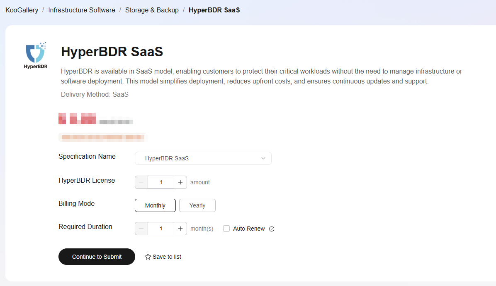
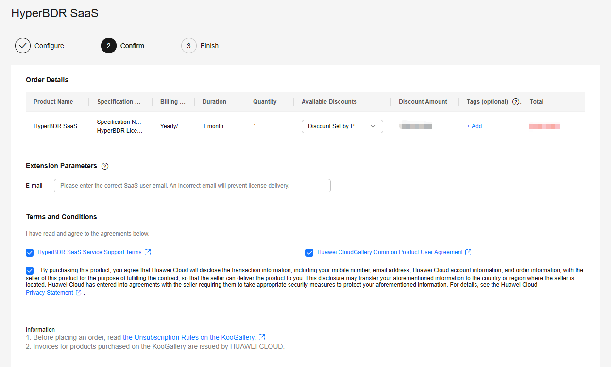
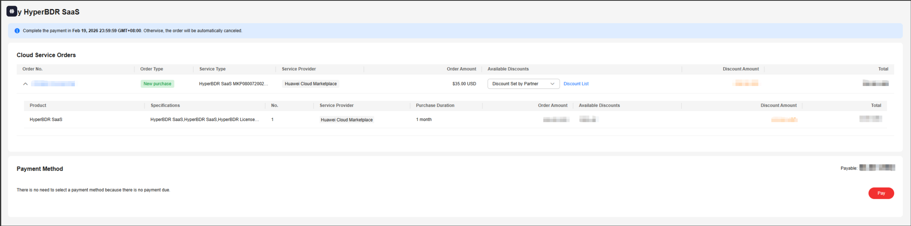
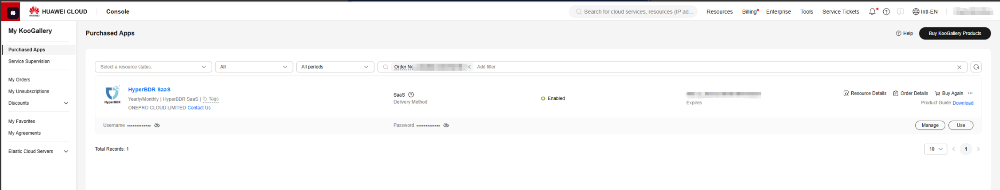
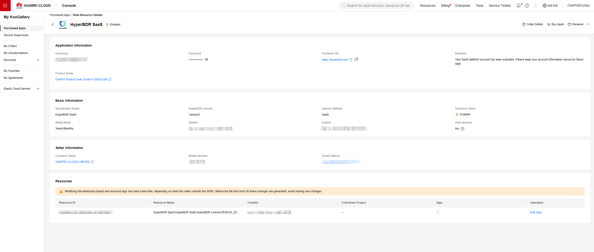
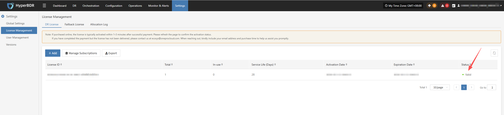

# Huawei KooGallery Purchasing Guide

## 1. Initial purchase

### 1.1 Visit the Order Page

* Select the Specification Name, HyperBDR License, Billing Model, and Required Duration

* Click the “Continue to Submit” button to proceed to the next step.

> If continuous subscription is required, select “Auto Renew.”

### 1.2 Purchase Confirmation

* Enter E-mail (required)

* Review and check the “Terms and Conditions”

* Click the “Pay Now” button to proceed to the next step

> **1.** **The email address must match the one associated with your OnePro-DR-SaaS platform account. The license will be automatically activated for that account.**
>
> **2. If you have already created a OnePro-DR-SaaS platform account, enter the registered email address. The license will be automatically activated for the corresponding account.**

### 1.3 Finalize the Order

* Confirm the purchased product details (record the Order No.)

* Click “Pay” to complete the payment

### 1.4 Retrieve License Information

* **Navigate to the My KooGallery console**

* **Go to “Purchased Apps” and search for the purchased service using the Order No.**

* **Click “Resource Details” to view the service details**

* **Record the Username and Password under “Application Information”**

> The Username and Password correspond to the Business email and Password used to log in to the DR-SaaS platform. The DR-SaaS platform homepage is the Frontend URL.

### 1.5 Automatic license activation on the OnePro-DR-SaaS platform

* **Log in to the OnePro-DR-SaaS platform using the information provided in the KooGallery service details**

* **Go to Settings → License Management → DR License to view the automatically activated license**

## 2. Renewal

### 2.1 Automatic Renewal via KooGallery

* Go to the **My KooGallery** console

* Open **Purchased Apps** to view the new service. If the status is **Enabled**, it means the license has been automatically activated

### 2.2 Automatic License Activation on the OnePro-DR-SaaS Platform

* Log in to the OnePro-DR-SaaS platform

* Click **Settings → License Management → DR License** to view the automatically activated license

