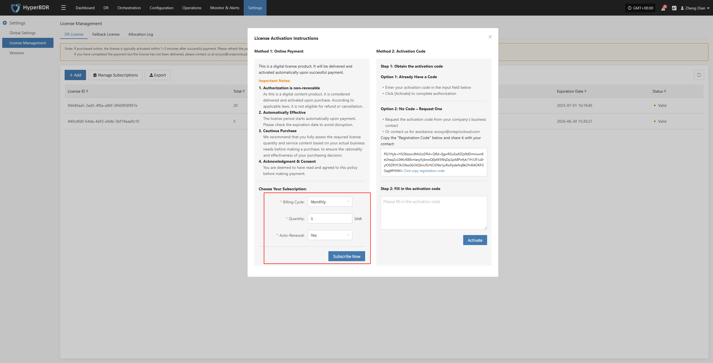
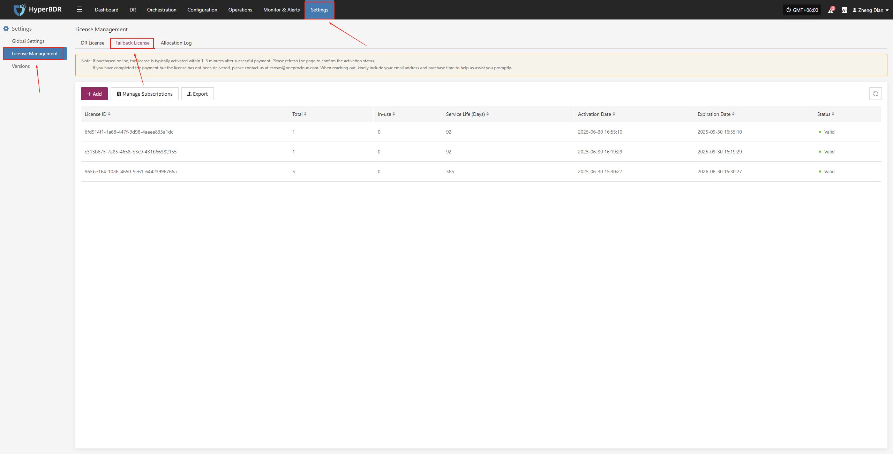
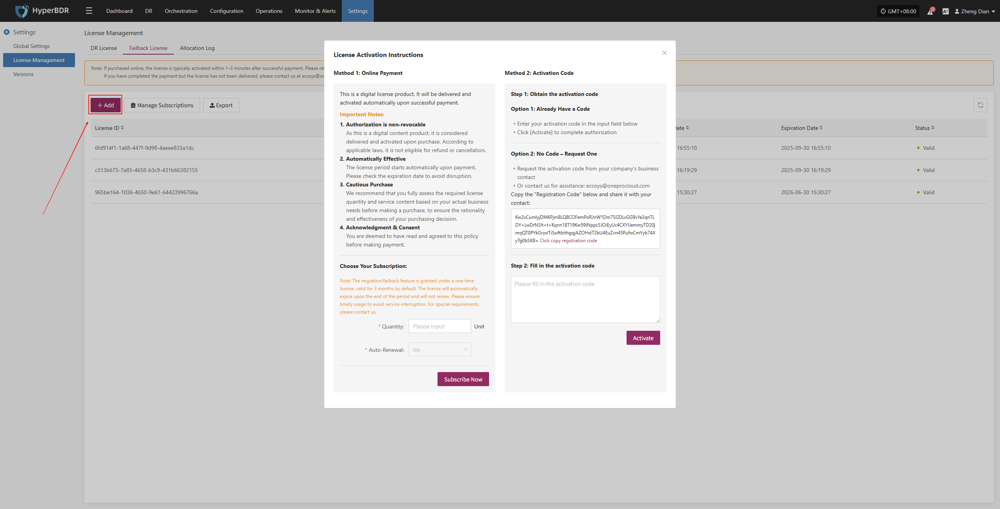
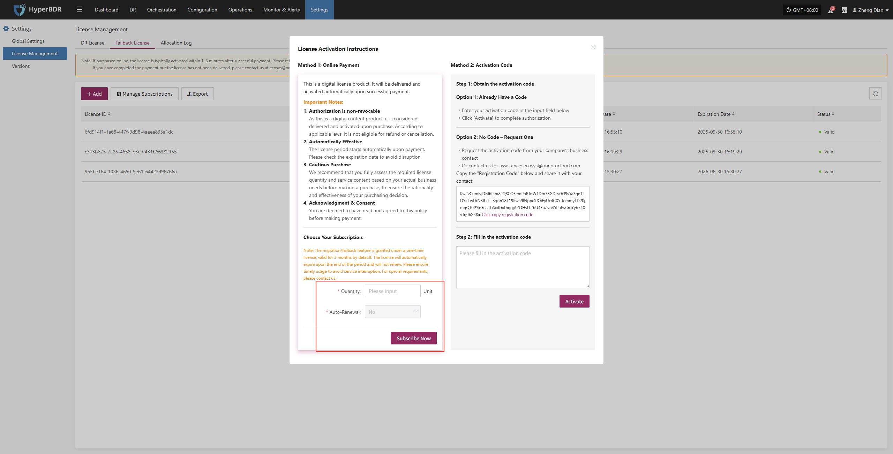
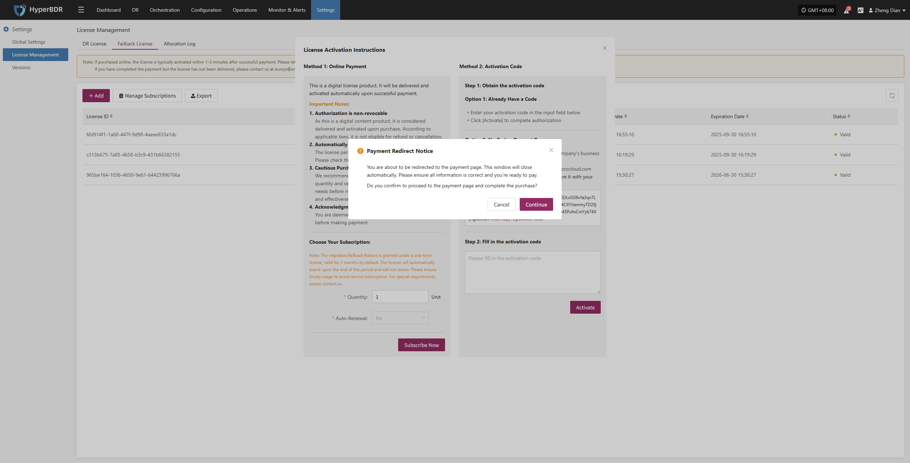
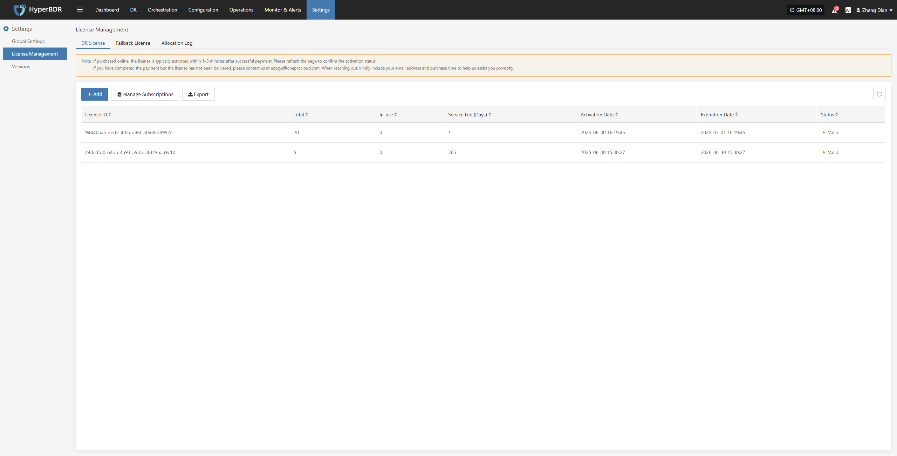

# **Online Payment**

## **DR Authorization Steps**

1. After logging in to the console, click "Settings" > "License Management" > "DR License" in the top navigation bar to enter the license management page.

2. Click the "Add" button in the upper right corner of the page to enter the license information entry page.

3. Select the **Billing Cycle** (supports Monthly or Annually), **Quantity**, and whether to enable **Auto-Renewal** according to your needs. After confirming the information, click "Subscribe Now".

>Important Notes:
>1. Authorization is non-revocable
>As this is a digital content product, it is considered delivered and activated upon purchase. According to applicable laws, it is not eligible for refund or cancellation.
>2. Automatically Effective
>The license period starts automatically upon payment. Please check the expiration date to avoid disruption.
>3. Cautious Purchase
>We recommend that you fully assess the required license quantity and service content based on your actual business needs before making a purchase, to ensure the rationality and effectiveness of your purchasing decision.
>4. Acknowledgment & Consent
>You are deemed to have read and agreed to this policy before making payment.

4. After clicking **"Subscribe Now"** to submit the subscription request, the system will pop up a confirmation prompt to confirm whether to jump to the third-party payment platform. After clicking **"Continue"**, the system will open the payment page in a new window. Once payment is completed, the subscription is considered successful.

5. On the redirected payment page, enter valid payment authentication information and click **"Subscribe"** to confirm the payment. The system will process the payment request, and once completed, the selected subscription license will take effect immediately.

6. After the license subscription is completed, the system will automatically redirect to the console homepage. You can then access and use the subscribed features and services normally.

> To thank our users, an equal number of one-time fallback licenses will be automatically included with each disaster recovery license purchase. These licenses are for fallback use only, valid for one-time use, and share the same validity period as the disaster recovery license. They cannot be renewed but can be purchased separately. Please use them within the validity period to ensure uninterrupted service. For more details, click the Manage Subscriptions button on the page.

## **Failback Authorization Steps**

1. After logging in to the console, click "Settings" > "License Management" > "Failback License" in the top navigation bar to enter the license management page.

2. Click the "Add" button in the upper right corner of the page to enter the license information entry page.

3. Fill in the required license quantity according to your business needs. The system currently does not support auto-renewal. After completing the information, click "Subscribe Now" to proceed to the payment process.

>Important Notes:
>1. Authorization is non-revocable
>As this is a digital content product, it is considered delivered and activated upon purchase. According to applicable laws, it is not eligible for refund or cancellation.
>2. Automatically Effective
>The license period starts automatically upon payment. Please check the expiration date to avoid disruption.
>3. Cautious Purchase
>We recommend that you fully assess the required license quantity and service content based on your actual business needs before making a purchase, to ensure the rationality and effectiveness of your purchasing decision.
>4. Acknowledgment & Consent
>You are deemed to have read and agreed to this policy before making payment.
>5. Notes
> The migration/failback feature is granted under a one-time license, valid for 3 months by default. The license will automatically expire at the end of the period and will not renew. Please use it in time to avoid service interruption. For special requirements, please contact us.

4. After clicking **"Subscribe Now"** to submit the subscription request, the system will pop up a confirmation prompt to confirm whether to jump to the third-party payment platform. After clicking **"Continue"**, the system will open the payment page in a new window. Once payment is completed, the subscription is considered successful.

5. On the redirected payment page, enter valid payment authentication information and click **"Subscribe"** to confirm the payment. The system will process the payment request, and once completed, the selected subscription license will take effect immediately.

6. After the license subscription is completed, the system will automatically redirect to the console homepage. You can then access and use the subscribed features and services normally.

