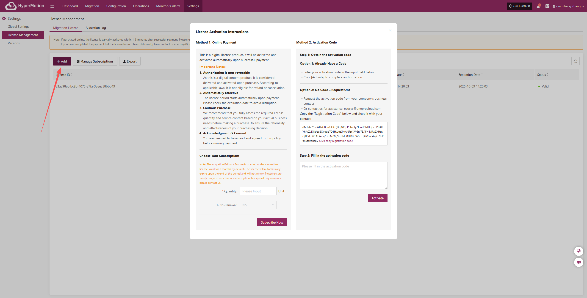

# **Activation Code**

## **Migration Authorization Steps**

### **Already Have a Activation Code**

1. After logging in to the console, click "Settings" > "License Management" > "Migration License" in the top navigation bar to enter the license management page.

2. Click the "Add" button in the upper right corner of the page to enter the license information entry page.

3. Enter your activation code in the input box below and click the **Activate** button to complete the authorization binding.

### **No Activation Code – Request One**

1. After logging in to the console, click "Settings" > "License Management" > "Migration License" in the top navigation bar to enter the license management page.

2. Click the "Add" button in the upper right corner of the page to enter the license information entry page.

3. Request the activation code from your company’s business contact,Or contact us for assistance: ecosys@oneprocloud.com

Copy the "Registration Code" below and share it with your contact:

4. After obtaining the activation code, enter it in the input box below and click the **Activate** button to complete the authorization binding.

