# HyperBDR Oracle ASM Disk Migration Solution

## 1. Document Overview

### 1.1 Background

In Agent-based and VMware Agentless scenarios where Oracle ASM disks are non-shared disks, HyperMotion and HyperBDR do not directly support operating-system-level migration or disaster recovery for Oracle systems that contain ASM partitions. To meet Oracle host migration or disaster recovery requirements, this best practice uses a separated migration approach: HyperBDR migrates the operating system and Oracle/Grid software, while RMAN migrates the database data stored in ASM.


### 1.2 Objectives

This document provides a combined HyperBDR and RMAN migration solution for Oracle ASM disk scenarios. The objectives are:

- Use HyperBDR to migrate the Oracle host system disk.
- Use RMAN to migrate Oracle data stored in ASM DiskGroup.
- Keep the target ASM data disk as an independent cloud disk that can be retained and reused.
- Use `open read only` for intermediate validation.
- Use `open resetlogs` only during the final cutover.

### 1.3 Scope

- Oracle database data is managed by ASM.
- ASM data disks are non-shared disks.
- HyperBDR/HyperMotion is responsible for system disk migration.
- RMAN can be used for database backup and recovery.
- The target platform can create or attach independent ASM data disks.

### 1.4 Out of Scope

- RAC or multi-node ASM scenarios where ASM data disks are shared storage and the original shared-storage architecture must be preserved.
- Scenarios where the target platform cannot create, attach, or retain independent ASM data disks.
- Scenarios where RMAN backup and recovery cannot be used for the source database.
- Scenarios where the source database is not in `ARCHIVELOG` mode and cannot be switched to `ARCHIVELOG` mode.
- Scenarios that require final cutover without stopping business writes.

### 1.5 Terminology

| Term | Description |
| --- | --- |
| HyperBDR | Performs full/incremental system disk synchronization and starts the target Drill host. |
| Drill host | A temporary validation or recovery host started by HyperBDR at the target side. |
| ASM data disk | An independent data disk that stores Oracle ASM DiskGroup data. |
| RMAN Level 0 | The baseline full backup in the RMAN incremental backup chain. |
| RMAN Level 1 cumulative | A cumulative incremental backup based on the Level 0 backup. |
| Final incremental backup | The last Level 1 cumulative backup performed before final cutover. |
| `open read only` | Opens the database in read-only mode for intermediate validation. |
| `open resetlogs` | Opens the database officially during final cutover. |

## 2. Overall Solution Design

### 2.1 Overall Architecture

This solution separates system disk migration from ASM data migration:

- HyperBDR migrates the system disk and does not directly migrate ASM data disks.
- Oracle/Grid software is migrated to the target host together with the system disk.
- ASM database data is migrated through RMAN.
- The target ASM data disk is an independent cloud disk whose lifecycle is independent of the Drill host.
- The target Drill host may be started or rebuilt multiple times by HyperBDR, while the ASM data disk is retained and manually reattached.

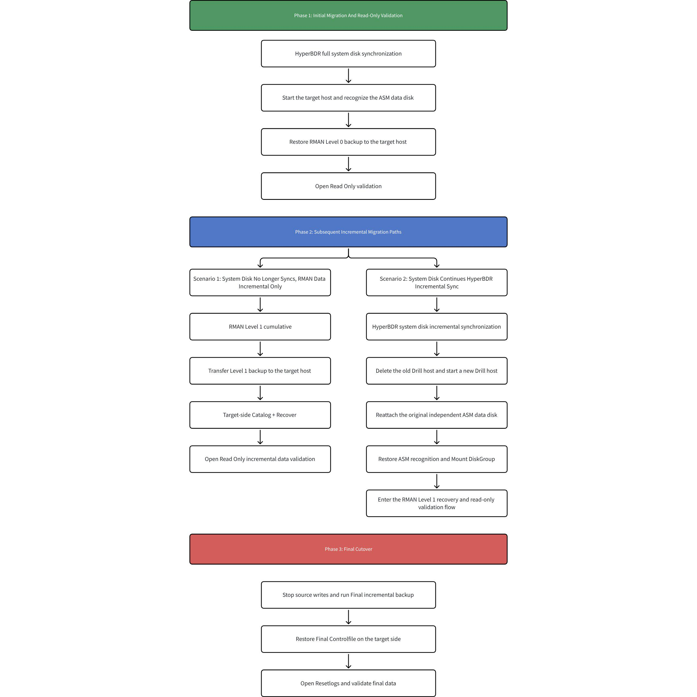

### 2.2 Migration Objects and Handling Methods

| Migration Object | Handling Method | Description |
| --- | --- | --- |
| System disk | HyperBDR | Performs full/incremental synchronization and starts the target host. |
| Oracle/Grid software | HyperBDR | Migrated with the system disk. |
| ASM data disk | Independent target cloud disk | Manually created or attached; not deleted with the target host; can be reattached and reused. |
| ASM disk identification | UDEV/ASMLib/AFD/multipath, etc. | Recreated at the target side according to the source ASM disk management method. |
| Oracle data | RMAN | Migrated through Level 0, Level 1 cumulative, and final incremental backups. |
| Database validation | SQL/RMAN | Intermediate read-only validation and final validation after resetlogs. |

### 2.3 Data Migration Paths

The migration path is divided into two parts:

- System disk path: the source system disk is synchronized to the target side through HyperBDR, and a target Drill host is started.
- ASM data path: the source database is backed up by RMAN, the backup files are transferred to the target host, and the database is restored to the target ASM DiskGroup.

### 2.4 ASM Data Disk Lifecycle

The target ASM data disk exists as an independent cloud disk and is not deleted with the Drill host.

When HyperBDR continues system disk incremental synchronization and restarts the Drill host, the old Drill host may be deleted. After the new Drill host is started, the original ASM data disk must be reattached from the cloud platform, and the ASM disk identification method must be restored.

When an existing ASM data disk is reattached, do not reinitialize the disk and do not recreate the existing DiskGroup. Only restore disk identification and mount the existing DiskGroup.

### 2.5 Overall Process

The overall process consists of three major phases:

- Initial migration and read-only validation: HyperBDR completes full system disk synchronization, the target ASM data disk is prepared, and RMAN Level 0 restore is validated in read-only mode.
- Follow-up incremental migration: choose the subsequent path based on whether the system disk continues to be synchronized by HyperBDR.
- Final cutover: stop writes on the source side, perform the final incremental backup, run final recovery on the target side, and open the database with `open resetlogs`.

## 3. Prerequisites and Risk Notes

### 3.1 Source-Side Prerequisites

- The source Oracle database must be in `ARCHIVELOG` mode.
- RMAN backup must work correctly on the source side.
- Oracle/Grid users must be able to log in normally.
- Source ASM DiskGroup status must be normal.
- The source RMAN backup directory must have sufficient free space.

### 3.2 Target-Side Prerequisites

- Oracle/Grid software is migrated to the target host with the system disk.
- The target side can create or attach independent ASM data disks.
- The target side can restore the ASM disk path according to the source ASM disk identification method.
- The target ASM DiskGroup can be created or mounted.

### 3.3 Network and Storage Requirements

- Network connectivity between the source host and HyperBDR/HyperMotion platform must be normal for full and incremental system disk synchronization.
- The target cloud platform must be able to start Drill hosts and support manual creation, attachment, and retention of independent data disks.
- The source RMAN backup directory must have enough space for Level 0, Level 1 cumulative, final incremental, archived log, control file, and spfile backups.
- The target side must have enough space to receive RMAN backup files and restore data into ASM DiskGroup.
- Backup files must be transferable from source to target, for example through `scp`, object storage, an intermediate host, or another file transfer method.
- If the target Drill host may be deleted and rebuilt by HyperBDR, the ASM data disk must be retained as an independent cloud disk and must not be deleted with the Drill host.

### 3.4 High-Risk Operations

- Intermediate validation must use `open read only`; do not run `open resetlogs`.
- `open resetlogs` is allowed only during final cutover.
- After `open resetlogs`, old incremental backups in the previous recovery chain cannot be applied.
- When reattaching an existing ASM data disk, do not recreate the existing DiskGroup.
- Do not format or initialize an existing ASM data disk.

### 3.5 Solution Limitations

- HyperBDR/HyperMotion migrates only the system disk and does not directly migrate database data inside ASM data disks.
- ASM data migration depends on RMAN backup and recovery. Migration time is affected by database size, archived log volume, backup compression efficiency, and file transfer speed.
- Intermediate validation can only use `open read only`. Once `open resetlogs` is executed, the current incremental recovery chain ends.
- Before final cutover, source-side business writes or the source database must be stopped to ensure no new data changes are generated after the final incremental backup.
- If HyperBDR continues system disk incremental synchronization and rebuilds the Drill host, the target ASM data disk must be reattached and ASM disk identification must be restored.
- When reattaching an existing ASM data disk, only mount the existing DiskGroup. Do not recreate the DiskGroup, format the disk, or initialize the disk.
- The test environment in this document uses UDEV for ASM disk identification. Other ASM identification methods must be adjusted according to the actual environment, but the target ASM must be able to identify the same data disk and mount the DiskGroup.

### 3.6 Rollback Principles

The rollback principles are to protect the source environment, protect the existing ASM data disk, and avoid ending the RMAN recovery chain before final cutover.

- Before final cutover, the source database and business system remain the production environment; the target side is used only for restore validation.
- During intermediate validation, the target database must use `open read only` and must not use `open resetlogs`, so later RMAN incremental backups can still be applied.
- If target restore or validation fails, clear the target restore result, reattach the ASM data disk or recreate the target ASM DiskGroup if this is a first restore, and restore again from Level 0 or the latest available recovery point.
- If HyperBDR Drill host rebuild fails, the source production environment is not affected, and the retained ASM data disk must not be deleted.
- If final pre-cutover checks fail, stop the cutover, keep source business running, and rerun RMAN incremental backup and target validation.
- Once the target database runs `open resetlogs` and officially takes over, the old RMAN incremental recovery chain ends and old incremental backups cannot be applied.

## 4. Source ASM Environment Analysis

### 4.1 ASM Disk Identification Method

Oracle ASM disks can be identified and managed in multiple ways, such as UDEV rules, Oracle ASMLib, ASM Filter Driver, multipath device paths, or direct raw device paths.

Different environments may present ASM disks differently, for example `/dev/asm_data_1`, `ORCL:DATA01`, `AFD:DATA01`, `/dev/mapper/mpathX`, or `/dev/sdX`. Before migration, confirm how the source ASM DiskGroup is built and what disks are used.

In the test environment of this document, ASM disks are managed through UDEV rules and raw disk devices. UDEV creates a stable ASM soft link: `/dev/asm_data_1`.

### 4.2 DiskGroup Information Collection

```sql
su - grid
sqlplus / as sysasm
```

```sql
set linesize 200
col diskgroup_name format a20
col redundancy_type format a12
col diskgroup_state format a12
col disk_name format a20
col disk_path format a40
col disk_state format a12

select
  dg.name as diskgroup_name,
  dg.type as redundancy_type,
  dg.state as diskgroup_state,
  d.name as disk_name,
  d.path as disk_path,
  d.state as disk_state,
  d.total_mb,
  d.free_mb
from v$asm_diskgroup dg, v$asm_disk d
where dg.group_number = d.group_number
order by dg.name, d.name;
```

Example output:

```text
DISKGROUP_NAME  REDUNDANCY  DG_STATE   DISK_NAME   DISK_PATH       DISK_STATE  TOTAL_MB
DATA            EXTERN      MOUNTED    DATA_0000   /dev/asm_data_1 NORMAL      102400
```

### 4.3 ASM Disk Path and Permission Collection

View the UDEV rule:

```bash
cat /etc/udev/rules.d/99-oracle-asmdevices.rules
```

Example output:

```bash
KERNEL=="dm-*",ENV{DM_UUID}=="mpath-36000c2962ed0f5630da60edb30a9d864",SYMLINK+="asm_data_1",OWNER="grid",GROUP="asmadmin",MODE="0660"
```

The rule confirms:

```text
ASM stable identification method: UDEV
ASM soft link name: /dev/asm_data_1
Device match condition: DM_UUID=mpath-36000c2962ed0f5630da60edb30a9d864
Device owner: grid
Device group: asmadmin
Device permission: 0660
```

### 4.4 Collection Result Template

```text
DiskGroup name:
DiskGroup redundancy type:
DiskGroup current state:
ASM disk count:
ASM disk name:
ASM disk path:
ASM disk state:
ASM disk capacity:
Underlying physical device:
ASM disk stable identification method:
Device owner, group, and permission:
Disk unique identifier or stable match condition:
```

## 5. Migration Process Overview

### 5.1 Phase 1: System Disk Migration

HyperBDR performs full system disk synchronization and starts the target Drill host. Oracle/Grid software is migrated to the target side with the system disk.

### 5.2 Phase 2: Target ASM Data Disk Preparation

Create or attach an independent ASM data disk on the target side, and restore the target ASM disk path according to the source ASM identification method.

### 5.3 Phase 3: RMAN Level 0 Baseline Restore

Run RMAN Level 0 full backup on the source side, restore the database on the target side, and validate it with `open read only`.

### 5.4 Phase 4: RMAN Level 1 Incremental Restore

During business operation, run RMAN Level 1 cumulative incremental backup on the source side. On the target side, catalog the backup, recover the database, and validate it with `open read only`.

### 5.5 Phase 5: Final Cutover

After stopping source writes or shutting down the source database, run the final Level 1 cumulative backup. On the target side, restore the final control file, run `restore database force` and `recover database noredo`, and finally run `open resetlogs`.

## 6. HyperBDR System Disk Migration

### 6.1 Agent Scenario

#### 6.1.1 Install Agent

When installing the Agent, if the installation stops because the ASM raw disk is not mounted, add the corresponding parameter according to the prompt to skip the ASM raw disk and synchronize other mounted disks.

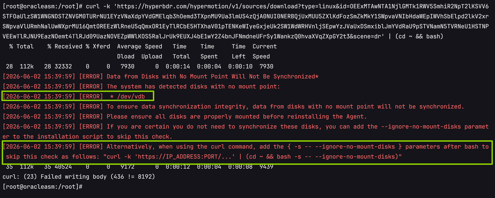

```bash
curl -k 'https://IP_ADDRESS:PORT/...' | (cd ~ && bash -s -- --ignore-no-mount-disks)
```

#### 6.1.2 Data Synchronization

After installation, use HyperBDR/HyperMotion to perform full and incremental data synchronization.

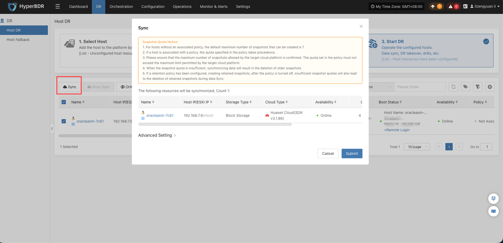

#### 6.1.3 Start Host

After synchronization, start the host through HyperBDR/HyperMotion.

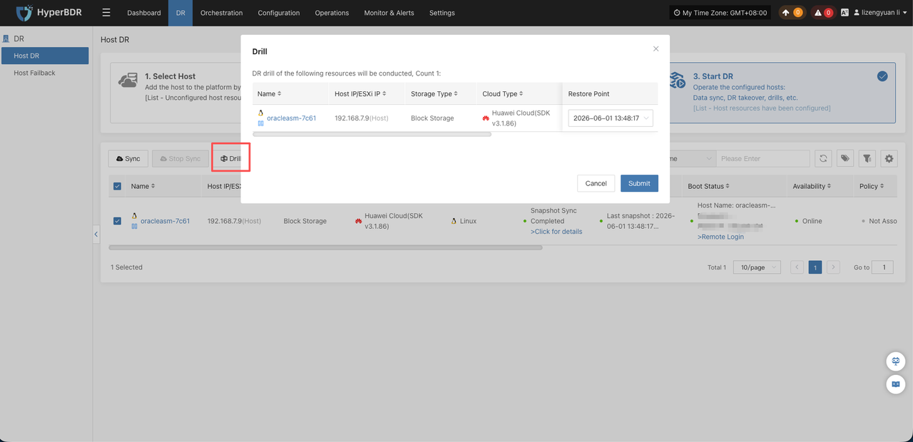

> The skipped ASM raw disk is not automatically created when the host is started by HyperBDR/HyperMotion. Create disks with the corresponding number and capacity on the target cloud platform and manually attach them to the started host.

### 6.2 VMware Agentless Scenario

- If the source ASM disk is a non-shared disk on VMware, for example a VMDK disk, use HyperBDR to synchronize both the system disk and data disk normally. RMAN-based separate ASM disk synchronization is not required.
- If the source ASM disk is shared storage on VMware and is not a VMDK disk, use HyperBDR for system disk synchronization and RMAN for data disk synchronization. The RMAN procedure is the same as in the Agent scenario.

### 6.3 Target Host Startup Validation

- HyperBDR startup is complete on the platform page.

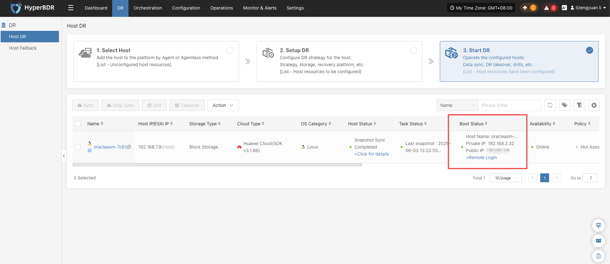

- The host can be accessed normally through VNC.

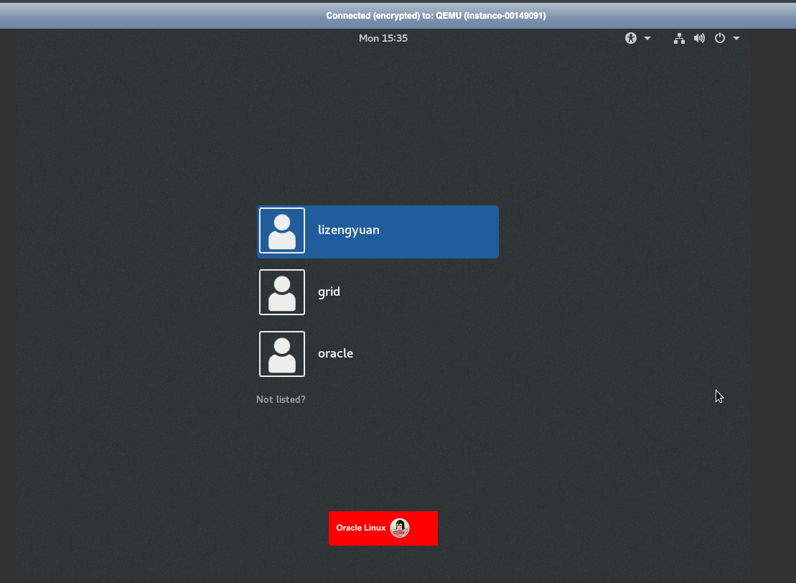

### 6.4 Notes

- ASM raw disks are not automatically migrated by HyperBDR.
- The target side must manually create or attach ASM data disks based on the ASM collection result.

## 7. Target ASM Data Disk Preparation and Identification

### 7.1 First Restore Scenario

If this is the first database restore on the target side, prepare a new ASM data disk and create a new ASM DiskGroup according to the source DiskGroup name, redundancy type, disk path, and permission requirements.

### 7.2 Reattaching an Existing ASM Data Disk

If the target machine is rebuilt and an existing ASM data disk is reattached, do not reinitialize the disk and do not recreate the DiskGroup. Restore only the ASM disk identification method and mount the existing DiskGroup.

### 7.3 UDEV Example

After creating and attaching the data disk on the cloud platform, confirm the device:

```bash
[root@oracleasm:/root]# lsblk
NAME        MAJ:MIN RM  SIZE RO TYPE MOUNTPOINT
vda         248:0    0  100G  0 disk
├─vda1      248:1    0    1G  0 part /boot
└─vda2      248:2    0   99G  0 part
  ├─ol-root 249:0    0   50G  0 lvm  /
  ├─ol-swap 249:1    0  7.9G  0 lvm  [SWAP]
  └─ol-home 249:2    0 41.1G  0 lvm  /home
vdb         248:16   0  101G  0 disk
```

In this test environment, `/dev/vdb` is mapped to the stable ASM path `/dev/asm_data_1`.

```bash
cp /etc/udev/rules.d/99-oracle-asmdevices.rules /etc/udev/rules.d/99-oracle-asmdevices.rules.bak
echo 'KERNEL=="vdb", SYMLINK+="asm_data_1", OWNER="grid", GROUP="asmadmin", MODE="0660"' > /etc/udev/rules.d/99-oracle-asmdevices.rules
```

Reload UDEV:

```bash
udevadm control --reload-rules
udevadm trigger
```

Validate:

```bash
ls -l /dev/asm_data_1
```

### 7.4 Other ASM Identification Methods

If the actual environment uses ASMLib, AFD, multipath, or direct raw device paths, do not copy the UDEV rules in this document directly. The target side must still meet the following goals:

```text
ASM can identify the target data disk.
The ASM disk path is consistent with the path used during restore.
Device permissions allow the grid user to access the disk.
The target data disk capacity meets the source ASM disk requirement.
DiskGroup name and redundancy type are consistent with the migration design.
For the first restore, DiskGroup can be created.
When reattaching an existing ASM disk, only mount DiskGroup; do not recreate it.
```

### 7.5 ASM Identification Validation

Create ASM DiskGroup:

```bash
su - grid

asmca -silent \
-createDiskGroup \
-diskGroupName DATA \
-disk '/dev/asm_data_1' \
-redundancy EXTERNAL
```

Expected output:

```text
Disk Group DATA created successfully.
```

Validate ASM status:

```sql
su - grid
sqlplus / as sysasm
```

Run SQL:

```sql
select
    dg.name,
    dg.state,
    d.name,
    d.path
from v$asm_diskgroup dg,v$asm_disk d
where dg.group_number=d.group_number;
```

Expected result:

```sql
DATA
MOUNTED
DATA_0000
/dev/asm_data_1
```

Confirm ASM status:

```sql
su - grid
asmcmd lsdg
asmcmd lsdsk
```

Expected output:

```text
[root@oracleasm:/root]# su - grid
[grid@oracleasm:/home/grid]$ asmcmd lsdg
State    Type    Rebal  Sector  Block       AU  Total_MB  Free_MB  Req_mir_free_MB  Usable_file_MB  Offline_disks  Voting_files  Name
MOUNTED  EXTERN  N         512   4096  1048576    103424   103372                0          103372              0             N  DATA/
[grid@oracleasm:/home/grid]$ asmcmd lsdsk
Path
/dev/asm_data_1
```

## 8. RMAN Level 0 Full Restore and Read-Only Validation

The RMAN Level 0 backup and target read-only validation process is independent of the underlying ASM disk identification method. As long as the target ASM instance is normal, the target DiskGroup has been created or mounted, and the required ASM paths are available, this section can be executed.

### 8.1 Check Source Archive Mode

```bash
su - oracle
sqlplus / as sysdba
```

```sql
select name, open_mode, log_mode from v$database;
```

The result must be `ARCHIVELOG`. If not, the customer must enable archive mode.

### 8.2 Check Existing Backup Records

```bash
su - oracle
rman target /

list backup summary;
```

If old backup records exist, clean them as required:

```sql
crosscheck backup;
delete noprompt expired backup;
crosscheck archivelog all;
delete noprompt expired archivelog all;
```

### 8.3 Create Backup Directory

```bash
mkdir -p /backup/rman_inc
chown -R oracle:oinstall /backup/rman_inc
```

### 8.4 Source Level 0 Backup

```bash
su - oracle
rman target /
```

```sql
sql "alter system archive log current";

run {
  allocate channel c1 device type disk format '/backup/rman_inc/lv0_%d_%T_%U.bkp';
  allocate channel c2 device type disk format '/backup/rman_inc/lv0_%d_%T_%U.bkp';

  backup as compressed backupset
    incremental level 0
    database
    tag 'ASM_MIG_LV0';

  release channel c1;
  release channel c2;
}

sql "alter system archive log current";

backup as compressed backupset
  archivelog all
  format '/backup/rman_inc/arch_lv0_%d_%T_%U.arc'
  tag 'ASM_MIG_ARCH_LV0';

backup current controlfile
  format '/backup/rman_inc/ctl_%d_%T_%U.ctl'
  tag 'ASM_MIG_CTL';

backup spfile
  format '/backup/rman_inc/spfile_%d_%T_%U.bkp'
  tag 'ASM_MIG_SPFILE';
```

Check backup:

```sql
list backup summary;

List of Backups
===============
Key     TY LV S Device Type Completion Time #Pieces #Copies Compressed Tag
------- -- -- - ----------- --------------- ------- ------- ---------- ---
66      B  0  A DISK        01-JUN-26       1       1       YES        ASM_MIG_LV0
67      B  0  A DISK        01-JUN-26       1       1       YES        ASM_MIG_LV0
68      B  0  A DISK        01-JUN-26       1       1       YES        ASM_MIG_LV0
69      B  0  A DISK        01-JUN-26       1       1       YES        ASM_MIG_LV0
70      B  A  A DISK        01-JUN-26       1       1       YES        ASM_MIG_ARCH_LV0
71      B  F  A DISK        01-JUN-26       1       1       NO         ASM_MIG_CTL
72      B  F  A DISK        01-JUN-26       1       1       NO         ASM_MIG_SPFILE
```

```bash
ls -lh /backup/rman_inc/
```

```bash
-rw-r----- 1 oracle asmadmin 313M Jun  1 14:16 arch_lv0_ORCL_20260601_2e4pit7r_1_1.arc
-rw-r----- 1 oracle asmadmin 9.4M Jun  1 14:16 ctl_ORCL_20260601_2f4pit9j_1_1.ctl
-rw-r----- 1 oracle asmadmin 196M Jun  1 14:15 lv0_ORCL_20260601_2a4pit6j_1_1.bkp
-rw-r----- 1 oracle asmadmin  90M Jun  1 14:15 lv0_ORCL_20260601_2b4pit6j_1_1.bkp
-rw-r----- 1 oracle asmadmin 1.1M Jun  1 14:15 lv0_ORCL_20260601_2c4pit7n_1_1.bkp
-rw-r----- 1 oracle asmadmin  96K Jun  1 14:15 lv0_ORCL_20260601_2d4pit7n_1_1.bkp
-rw-r----- 1 oracle asmadmin  96K Jun  1 14:16 spfile_ORCL_20260601_2g4pit9t_1_1.bkp
```

### 8.5 Transfer Backup Files

Package the backup directory and transfer it to the target host:

```bash
cd /backup/
tar -zcvf asm_backup_onepro.tar.gz rman_inc/
```

### 8.6 Target Database Restore

Extract the backup package:

```bash
tar -zxvf asm_backup_onepro.tar.gz -C /backup/
```

Create a temporary target pfile:

```bash
cat > /tmp/initorcl.ora <<'EOF'
*.db_name='orcl'
*.compatible='11.2.0.4.0'
*.control_files='+DATA/orcl/controlfile/control01.ctl'
*.db_create_file_dest='+DATA'
*.db_recovery_file_dest='+DATA'
*.db_recovery_file_dest_size=20G
*.sga_target=1G
*.pga_aggregate_target=256M
EOF
```

Start the instance:

```sql
su - oracle
sqlplus / as sysdba

startup nomount pfile='/tmp/initorcl.ora';
exit
```

Restore data:

```sql
rman target /

restore controlfile from '/backup/rman_inc/ctl_actual_file_name.ctl';
alter database mount;
catalog start with '/backup/rman_inc/' noprompt;
restore database;
```

Check the maximum archived log sequence:

```sql
list backup of archivelog all;
```

Recover to maximum archived log sequence + 1:

```sql
run {
set until sequence 23 thread 1;
recover database;
}
```

### 8.7 Read-Only Validation

```sql
sqlplus / as sysdba

alter database open read only;
select name, open_mode from v$database;
```

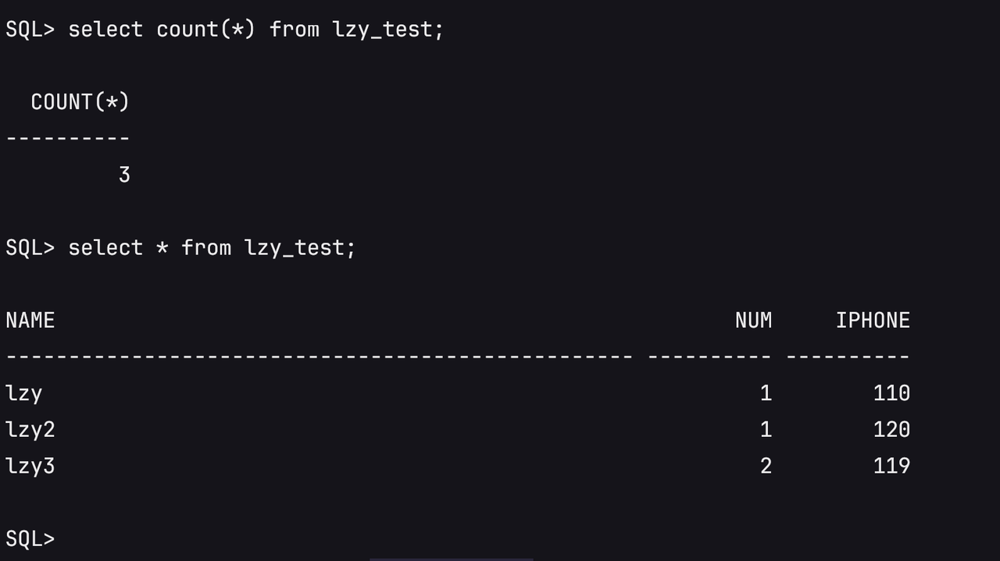

### 8.8 Return to Mount State After Validation

```sql
shutdown immediate;
startup mount pfile='/tmp/initorcl.ora';
exit
```

## 9. Follow-Up Incremental Migration

### 9.1 Scenario 1: System Disk No Longer Synchronized, RMAN Incremental Only

The system disk is no longer synchronized. Only database incremental data continues to be synchronized through RMAN.

Source Level 1 cumulative backup:

```sql
su - oracle
rman target /

sql "alter system archive log current";

run {
  allocate channel c1 device type disk format '/backup/rman_inc/lv1_%d_%T_%U.bkp';
  allocate channel c2 device type disk format '/backup/rman_inc/lv1_%d_%T_%U.bkp';

  backup as compressed backupset
    incremental level 1 cumulative
    database
    tag 'ASM_MIG_LV1';

  release channel c1;
  release channel c2;
}

sql "alter system archive log current";

backup as compressed backupset
  archivelog all not backed up 1 times
  format '/backup/rman_inc/arch_lv1_%d_%T_%U.arc'
  tag 'ASM_MIG_ARCH_LV1';

backup current controlfile
  format '/backup/rman_inc/ctl_lv1_%d_%T_%U.ctl'
  tag 'ASM_MIG_CTL_LV1';
```

Check backup files:

```bash
ls -lh /backup/rman_inc/ | grep lv1

-rw-r----- 1 oracle asmadmin 2.0M Jun  1 17:24 arch_lv1_ORCL_20260601_2l4pj8ad_1_1.arc
-rw-r----- 1 oracle asmadmin 9.4M Jun  1 17:24 ctl_lv1_ORCL_20260601_2m4pj8ak_1_1.ctl
-rw-r----- 1 oracle asmadmin 1.4M Jun  1 17:23 lv1_ORCL_20260601_2h4pj87a_1_1.bkp
-rw-r----- 1 oracle asmadmin 1.8M Jun  1 17:23 lv1_ORCL_20260601_2i4pj87a_1_1.bkp
-rw-r----- 1 oracle asmadmin 1.1M Jun  1 17:23 lv1_ORCL_20260601_2j4pj883_1_1.bkp
-rw-r----- 1 oracle asmadmin  96K Jun  1 17:23 lv1_ORCL_20260601_2k4pj883_1_1.bkp
```

### 9.2 Scenario 2: System Disk Continues HyperBDR Incremental Synchronization, Database Continues RMAN Incremental Synchronization

In this scenario, the target Drill host is used only as a staged validation host.

After each HyperBDR incremental synchronization, the platform deletes the current Drill host and starts a new Drill host based on the latest system disk data. Because the ASM data disk is an independent cloud disk and is not deleted with the Drill host, reattach the original ASM data disk to the new Drill host from the cloud platform.

Process:

- Run HyperBDR incremental synchronization for the system disk.


- Shut down the target database and ASM, then shut down the temporary test host.
- Restart the Drill host through HyperBDR and select the latest snapshot.

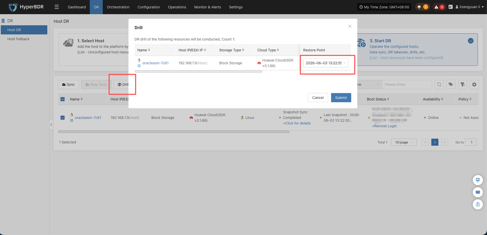

- Manually attach the original ASM data disk to the new recovery host from the target cloud platform.

```text
[root@oracleasm:/root]# lsblk
NAME        MAJ:MIN RM  SIZE RO TYPE MOUNTPOINT
vda         248:0    0  100G  0 disk
├─vda1      248:1    0    1G  0 part /boot
└─vda2      248:2    0   99G  0 part
  ├─ol-root 249:0    0   50G  0 lvm  /
  ├─ol-swap 249:1    0  7.9G  0 lvm  [SWAP]
  └─ol-home 249:2    0 41.1G  0 lvm  /home
vdb         248:16   0  101G  0 disk
```

- Restore the ASM disk identification method.

Modify the udev rules.

Since the cloud platform does not provide a standard SCSI WWID, it needs to be changed to use the device letter/name.

```bash
cp /etc/udev/rules.d/99-oracle-asmdevices.rules /etc/udev/rules.d/99-oracle-asmdevices.rules.bak
echo 'KERNEL=="vdb", SYMLINK+="asm_data_1", OWNER="grid", GROUP="asmadmin", MODE="0660"' > /etc/udev/rules.d/99-oracle-asmdevices.rules
```

Reload UDEV:

```bash
udevadm control --reload-rules
udevadm trigger
```

Validate:

```bash
ls -l /dev/asm_data_1
```

```bash
ls -l /dev/asm_data_1
```

- Start ASM and mount DiskGroup.

```sql
su - grid
sqlplus / as sysasm
```

Check ASM:

```sql
select instance_name, status from v$instance;
select name, state from v$asm_diskgroup;
```

If ASM is not started, manually start it:

```sql
startup;
```

If DATA is not mounted, manually mount it:

```sql
alter diskgroup DATA mount;
```

Verify:

```sql
select
    dg.name,
    dg.state,
    d.name,
    d.path
from v$asm_diskgroup dg,v$asm_disk d
where dg.group_number=d.group_number;
```

```sql
DATA
MOUNTED
DATA_0000
/dev/asm_data_1
```

- Start the database to `MOUNT`.

Create a temporary target pfile:

```sql
cat > /tmp/initorcl.ora <<'EOF'
*.db_name='orcl'
*.compatible='11.2.0.4.0'
*.control_files='+DATA/orcl/controlfile/control01.ctl'
*.db_create_file_dest='+DATA'
*.db_recovery_file_dest='+DATA'
*.db_recovery_file_dest_size=20G
*.sga_target=1G
*.pga_aggregate_target=256M
EOF
```

Start the instance:

```bash
su - oracle
sqlplus / as sysdba
```

```sql
startup pfile='/tmp/initorcl.ora';
alter database open read only;
```

Return to Mount State After Validation:

```sql
select * from lzy_test;
```

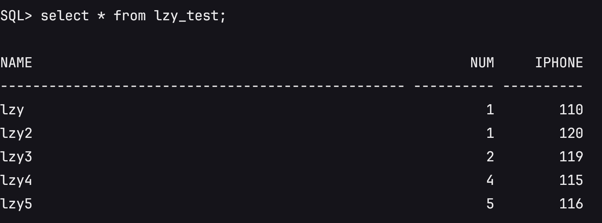

```sql
shutdown immediate;
startup mount pfile='/tmp/initorcl.ora';
```

- Reuse the RMAN incremental backup and restore procedure in Scenario 1.

### 9.3 Difference Between the Two Scenarios

| Item | Scenario 1: System disk no longer synchronized | Scenario 2: System disk continues HyperBDR incremental synchronization |
| --- | --- | --- |
| Target host | Remains unchanged | Deleted and rebuilt |
| ASM data disk | Continuously attached | Must be reattached |
| ASM identification | Existing identification remains | Identification must be restored again |
| RMAN incremental backup | Continues | Continues |
| Validation method | `open read only` | `open read only` |

### 9.4 Incremental Validation

Transfer Level 1 backup files to `/backup/rman_inc/` on the target host:

```bash
cd /backup/
tar -zcvf asm_backup_lv1_onepro.tar.gz rman_inc/lv1_* rman_inc/arch_lv1_* rman_inc/ctl_lv1_*
```

Extract the backup package on the target side:

```bash
tar -zxvf asm_backup_lv1_onepro.tar.gz -C /backup/
```

Recover incremental data on the target side:

```sql
su - oracle
rman target /

catalog start with '/backup/rman_inc/' noprompt;
list backup of archivelog all;
```

```sql
  List of Archived Logs in backup set 77
  Thrd Seq     Low SCN    Low Time  Next SCN   Next Time
  ---- ------- ---------- --------- ---------- ---------
  1    23      1433826    01-JUN-26 1438683    01-JUN-26
  1    24      1438683    01-JUN-26 1438783    01-JUN-26
```

Confirm the maximum archived log sequence, then recover to maximum sequence + 1:

```sql
run {
set until sequence 25 thread 1;
recover database;
}

exit
```

Read-only validation:

```sql
sqlplus / as sysdba

alter database open read only;
```

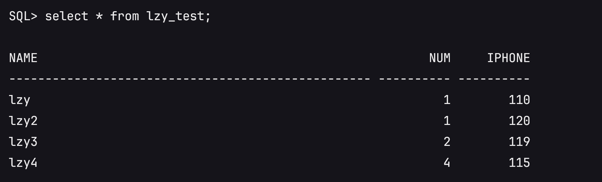

Return to mount state after validation:

```sql
shutdown immediate;
startup mount pfile='/tmp/initorcl.ora';
exit
```

> To continue incremental synchronization and testing, repeat the same procedure.

## 10. Final Cutover Process

### 10.1 Pre-Cutover Checks

Confirm that the source side, target side, ASM data disk, and RMAN backup chain are ready for cutover.

- Confirm that the target side has completed Level 0 and previous Level 1 incremental restore, and the latest read-only validation passed.
- Confirm that the target database is currently in `MOUNT` state and `open resetlogs` has not been executed.
- Confirm that the target ASM instance is normal and the target DiskGroup has been mounted.
- Confirm that the target ASM data disk is the independent data disk to be used for production takeover, and it has not been reinitialized or recreated.
- Confirm that the source database is in `ARCHIVELOG` mode and RMAN backup works normally.
- Confirm that the source-side write stop method is clear, such as stopping application services, stopping database writes, or directly shutting down the source database.
- Confirm that the final incremental backup directory has sufficient space.
- Confirm that RMAN backup files can be transferred to the target side.
- Confirm that target-side application access, listener, IP/DNS/connection string, or related cutover method is clear.

### 10.2 Stop Source Writes and Perform Final Incremental Backup

The source side must no longer generate new business changes. Then switch the final archived logs and perform the final backup.

If the write stop method is unclear, directly stop the source database:

```sql
su - oracle
sqlplus / as sysdba

alter system archive log current;
shutdown immediate;
startup mount;
exit
```

Final Level 1 cumulative backup:

```sql
rman target /

backup as compressed backupset
  archivelog all not backed up 1 times
  format '/backup/rman_inc/arch_final_%d_%T_%U.arc'
  tag 'ASM_MIG_ARCH_FINAL';

run {
  allocate channel c1 device type disk format '/backup/rman_inc/lv1_final_%d_%T_%U.bkp';
  allocate channel c2 device type disk format '/backup/rman_inc/lv1_final_%d_%T_%U.bkp';

  backup as compressed backupset
    incremental level 1 cumulative
    database
    tag 'ASM_MIG_LV1_FINAL';

  release channel c1;
  release channel c2;
}

backup current controlfile
  format '/backup/rman_inc/ctl_final_%d_%T_%U.ctl'
  tag 'ASM_MIG_CTL_FINAL';

backup spfile
  format '/backup/rman_inc/spfile_final_%d_%T_%U.bkp'
  tag 'ASM_MIG_SPFILE_FINAL';
```

### 10.3 Transfer Backup Files to the Target Host

```bash
ls -lh /backup/rman_inc/ | grep final

-rw-r----- 1 oracle asmadmin 9.4M Jun  2 10:32 ctl_final_ORCL_20260602_2r4pl4hs_1_1.ctl
-rw-r----- 1 oracle asmadmin 5.1M Jun  2 10:32 lv1_final_ORCL_20260602_2n4pl4gr_1_1.bkp
-rw-r----- 1 oracle asmadmin 4.7M Jun  2 10:32 lv1_final_ORCL_20260602_2o4pl4gs_1_1.bkp
-rw-r----- 1 oracle asmadmin 1.1M Jun  2 10:32 lv1_final_ORCL_20260602_2p4pl4hm_1_1.bkp
-rw-r----- 1 oracle asmadmin  96K Jun  2 10:32 lv1_final_ORCL_20260602_2q4pl4hn_1_1.bkp
-rw-r----- 1 oracle asmadmin  96K Jun  2 10:32 spfile_final_ORCL_20260602_2s4pl4hv_1_1.bkp
```

Transfer the final incremental backup files to the target side:

```bash
cd /backup/
tar -zcvf asm_backup_final_onepro.tar.gz rman_inc/*_final_*
```

### 10.4 Extract Target Backup Package

```bash
tar -zxvf asm_backup_final_onepro.tar.gz -C /backup/
```

### 10.5 Target Final Recover

```sql
su - oracle

sqlplus / as sysdba
shutdown abort;
startup nomount pfile='/tmp/initorcl.ora';
exit
```

```sql
rman target /

restore controlfile from '/backup/rman_inc/ctl_final_ORCL_20260602_2r4pl4hs_1_1.ctl';
alter database mount;
catalog start with '/backup/rman_inc/' noprompt;
restore database force;
recover database noredo;
```

### 10.6 Open Database with Resetlogs

```sql
sqlplus / as sysdba

alter database open resetlogs;
```

> After `alter database open resetlogs` is executed, old incremental backups from the previous recovery chain cannot be applied.

### 10.7 Application Validation

```text
select * from lzy_test;
```

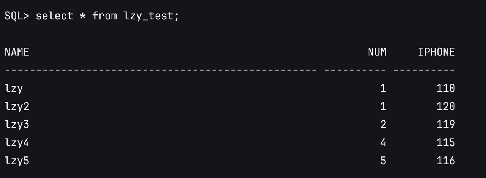

### 10.8 Post-Cutover Processing

After `open resetlogs` and business validation are complete, perform post-cutover checks to ensure the target database can operate as the new production environment.

- Confirm database status:

```sql
select name, open_mode, database_role from v$database;
select instance_name, status from v$instance;
```

- Confirm key business data validation, such as core table data, business login, application query, and write tests.
- Confirm that listener service is normal and that application connection strings, IP, DNS, or load balancer configurations have been switched to the target side.
- Retain the source environment for an observation period. After confirming target-side business stability, handle source resources according to project requirements.

## 11. Acceptance Criteria

After completion, validate the solution from the perspectives of system disk, ASM, database, business validation, and cutover status.

- HyperBDR system disk migration is complete and the target host can start normally.
- The target Oracle/Grid software environment is available, and Oracle/Grid users can log in normally.
- The target ASM data disk is correctly attached and ASM disk identification is restored.
- The target ASM DiskGroup status is normal.
- The target database can start and open normally.
- After final cutover, the database is in `READ WRITE` state.
- Key business data validation passes, and core table data is consistent with the source data before final write stop.
- The application system can connect to the target database normally.
- Core application functions, such as login, query, and write operations, pass validation.
- The source environment is not damaged and can be retained for observation or decommissioned according to project requirements.

## 12. Troubleshooting and Rollback

Troubleshooting and rollback in this solution are based on protecting the source production environment and the target ASM data disk. Before final cutover, the source side remains the primary environment. If target restore fails, restore again on the target side first without affecting source business.

Common troubleshooting cases:

| Issue | Handling Method |
| --- | --- |
| Target ASM cannot identify the disk | Check whether the cloud disk has been attached, whether the device path is correct, and whether UDEV/ASMLib/AFD/multipath configuration matches the source collection result. |
| ASM DiskGroup cannot be mounted | Confirm disk path, permission, owner/group, and whether the disk has been initialized or incorrectly recreated. If it is an existing ASM data disk, do not recreate DiskGroup. |
| Database startup reports missing spfile | Start the database with a temporary pfile or restore spfile from RMAN backup. |
| RMAN catalog cannot find backup files | Confirm that backup files have been transferred to the target side, the directory path is correct, and Oracle user has read permission. |
| `recover database` requests missing archived logs | Check whether RMAN archived log backup contains the required sequence. For intermediate validation, use `set until sequence` with maximum backed-up sequence + 1. |
| `open resetlogs` is mistakenly executed during intermediate validation | The old incremental recovery chain ends and old incremental backups cannot be applied. Clean the target side and restore again from Level 0. |
| `open resetlogs` fails after final recover | Check whether final controlfile is used, whether `restore database force` is executed, and whether `recover database noredo` is used. |
| ASM is unavailable after HyperBDR rebuilds the Drill host | Reattach the original ASM data disk from the cloud platform, restore ASM disk identification, and mount the original DiskGroup. |

Rollback principles:

- Before final cutover, if target restore fails, keep source running and restore again on the target side.
- If intermediate validation fails, do not run `open resetlogs`; catalog backup files again and recover to a validatable state.
- If the target Drill host is deleted or rebuilt, retain the ASM data disk, reattach it, and continue recovery.
- If final pre-cutover checks fail, stop cutover and keep source business running.
- If the target database has already run `open resetlogs` and taken over business, rollback is no longer part of the old RMAN incremental recovery chain and must be handled through a separate business fallback plan.

## 13. Appendix

### Appendix A: RMAN Command Templates

This appendix summarizes common RMAN backup, restore, and validation commands. Adjust database name, backup directory, control file backup name, and archived log sequence before execution.

#### Level 0 Baseline Backup Template

```sql
sql "alter system archive log current";

run {
  allocate channel c1 device type disk format '/backup/rman_inc/lv0_%d_%T_%U.bkp';
  allocate channel c2 device type disk format '/backup/rman_inc/lv0_%d_%T_%U.bkp';

  backup as compressed backupset
    incremental level 0
    database
    tag 'ASM_MIG_LV0';

  release channel c1;
  release channel c2;
}

sql "alter system archive log current";

backup as compressed backupset
  archivelog all
  format '/backup/rman_inc/arch_lv0_%d_%T_%U.arc'
  tag 'ASM_MIG_ARCH_LV0';

backup current controlfile
  format '/backup/rman_inc/ctl_%d_%T_%U.ctl'
  tag 'ASM_MIG_CTL';

backup spfile
  format '/backup/rman_inc/spfile_%d_%T_%U.bkp'
  tag 'ASM_MIG_SPFILE';
```

#### Level 1 Cumulative Incremental Backup Template

```sql
sql "alter system archive log current";

run {
  allocate channel c1 device type disk format '/backup/rman_inc/lv1_%d_%T_%U.bkp';
  allocate channel c2 device type disk format '/backup/rman_inc/lv1_%d_%T_%U.bkp';

  backup as compressed backupset
    incremental level 1 cumulative
    database
    tag 'ASM_MIG_LV1';

  release channel c1;
  release channel c2;
}

sql "alter system archive log current";

backup as compressed backupset
  archivelog all not backed up 1 times
  format '/backup/rman_inc/arch_lv1_%d_%T_%U.arc'
  tag 'ASM_MIG_ARCH_LV1';

backup current controlfile
  format '/backup/rman_inc/ctl_lv1_%d_%T_%U.ctl'
  tag 'ASM_MIG_CTL_LV1';
```

#### Read-Only Validation Recovery Template

```sql
catalog start with '/backup/rman_inc/' noprompt;
list backup of archivelog all;

run {
  set until sequence <maximum archived log sequence + 1> thread 1;
  recover database;
}
```

After recovery:

```sql
alter database open read only;
select name, open_mode from v$database;
```

Return to mount after validation:

```sql
shutdown immediate;
startup mount pfile='/tmp/initorcl.ora';
```

#### Final Incremental Restore Template

```sql
shutdown abort;
startup nomount pfile='/tmp/initorcl.ora';

restore controlfile from '/backup/rman_inc/ctl_final_actual_file_name.ctl';
alter database mount;
catalog start with '/backup/rman_inc/' noprompt;
restore database force;
recover database noredo;
```

Open the database officially:

```sql
alter database open resetlogs;
```

> `open resetlogs` is allowed only during final cutover. After it is executed, old incremental backups from the previous recovery chain cannot be applied.

### Appendix B: ASM Information Collection SQL

This appendix collects source ASM DiskGroup name, disk path, capacity, and status. The collection result is used to create or re-identify ASM data disks on the target side.

```sql
set linesize 200
col diskgroup_name format a20
col redundancy_type format a12
col diskgroup_state format a12
col disk_name format a20
col disk_path format a40
col disk_state format a12

select
  dg.name as diskgroup_name,
  dg.type as redundancy_type,
  dg.state as diskgroup_state,
  d.name as disk_name,
  d.path as disk_path,
  d.state as disk_state,
  d.total_mb,
  d.free_mb
from v$asm_diskgroup dg, v$asm_disk d
where dg.group_number = d.group_number
order by dg.name, d.name;
```

Minimum information to record:

| Item | Recorded Value |
| --- | --- |
| DiskGroup name | DATA |
| DiskGroup redundancy type | EXTERN |
| DiskGroup state | MOUNTED |
| ASM disk name | DATA_0000 |
| ASM disk path | /dev/asm_data_1 |
| ASM disk capacity | 100GB |
| ASM disk state | NORMAL |
| ASM disk identification method | UDEV |
| Device owner/group/permission | OWNER="grid", GROUP="asmadmin", MODE="0660" |
| Whether target needs a new DiskGroup | First restore scenario: create DATA DiskGroup. |
| Whether target is reattaching an existing DiskGroup | After HyperBDR rebuilds the Drill host: yes. Reattach the original ASM data disk and mount DATA only; do not recreate DiskGroup. |

### Appendix C: UDEV Example

In this test environment, the target side maps the cloud disk to the stable ASM path `/dev/asm_data_1` through UDEV.

```bash
cp /etc/udev/rules.d/99-oracle-asmdevices.rules /etc/udev/rules.d/99-oracle-asmdevices.rules.bak
echo 'KERNEL=="vdb", SYMLINK+="asm_data_1", OWNER="grid", GROUP="asmadmin", MODE="0660"' > /etc/udev/rules.d/99-oracle-asmdevices.rules

udevadm control --reload-rules
udevadm trigger

ls -l /dev/asm_data_1
```

Expected result:

```bash
/dev/asm_data_1 -> vdb
```

If the actual environment does not use UDEV, adjust according to the source ASM disk identification method. The target ASM must be able to identify the target data disk, and the device permission must allow access by the `grid` user.

### Appendix D: Test Environment Description

| Item | Test Environment Record |
| --- | --- |
| Source operating system | Oracle Linux Server 7.4 |
| Oracle Database version | 11.2.0.4.0 |
| Grid Infrastructure version | 11.2.0.4.0 |
| Database SID | orcl |
| DiskGroup name | DATA |
| DiskGroup redundancy type | EXTERN |
| Source ASM disk path | /dev/asm_data_1 |
| ASM disk identification method | Source: UDEV + multipath dm device;<br>Target test: UDEV + cloud disk device name vdb |
| RMAN backup directory | /backup/rman_inc |
| HyperBDR migration method | Agent scenario |
| Whether target Drill host is rebuilt | Scenario 1: no;<br>Scenario 2: yes |
| Whether ASM data disk is independently retained | Yes. ASM data disk is not deleted with the Drill host. |

### Appendix F: Version Revision Record

| Version | Date | Author | Change Description |
| --- | --- | --- | --- |
| v1.0 | 2026-06-08 | Li Zengyuan | Initial version. Completed overall solution, migration process, validation process, and cutover process. |
