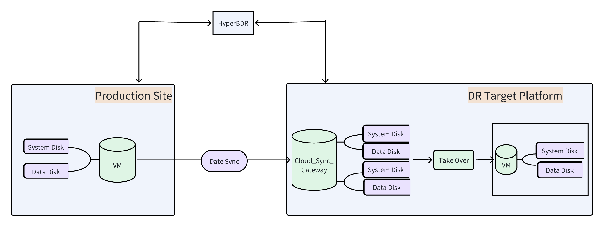

# Cloud Failback to VMware

## **Scene description**

This document is applicable to the operation process of safely switching back to the original VMware environment for business systems that have taken over disaster recovery to the Cloud Computing Platform without expanding the computing resources of the source production environment.

Using a WordPress host running in a VMware environment as an example, demonstrate how to complete the business failback from the cloud disaster recovery platform and ensure normal service access is restored.

## Architecture diagram

> Disaster recovery takeover architecture : disaster recovery from the source production environment to the target cloud

> Disaster recovery failback architecture: failback from the target cloud to the source production environment

## Operation process

### **Add the host to be failback to the disaster recovery platform**

"Configuration"--"Product Site"--"Failback"--"Failback Agent"--"Copy command"

Log in to the host to be failback through SSH and execute the Agent installation command

After completing registration, the failback host will be displayed in the disaster recovery Console

### **Create a snapshot for the VMware original host (must be done before failback)**

Note: To prevent data loss caused by a failback failure, a snapshot of the original VMware host needs to be created.

### **Download and upload LiveCD-HyperDoor mirroring to VMware**

Get the `Livecd-HyperDoor.iso `mirroring file

Upload to VMware cluster ISO library:

Go to the **ISO content library&#x20;**&#x61;nd select **Import Item**

Select the file and click **Import**

### **Boot host using LiveCD mirroring**

Turn off the host power and edit the settings.

Add **CD/DVD drive&#x20;**&#x64;evice

Select the uploaded ISO file

Configure the BIOS boot sequence and set the CD drive as the first boot item

Start the host, select the **CD-ROM boot&#x20;**, and enter the Ubuntu temporary system

After pressing "F10", click "Yes" in the dialog box that pops up.

Select "Try or Install Ubuntu" ,Then wait the host boot successful

**Note&#x20;**: After successful startup, you need to manually configure the IP Address (such as `192.168.7.61 `) to be consistent with the VMware original host IP.

Configure IP Address Operation Command:

cp /etc/netplan/00-installer-config.yaml.bak /etc/netplan/00-installer-config.yaml
vi /etc/netplan/00-installer-config.yaml

After the configuration is complete, save and exit.

Execute the command to restart the network interface card operation.

netplan apply&#x20;

Command to view IP:

ip a s

### Add a failback transition host in the DR console

Enter the host information (default password: `Acb@132.Inst `) and click **Next**

### **Configuring disaster recovery failback parameters**

Enter the "Setup failback"**&#x20;**&#x69;nterface and follow the instructions to complete the configuration

### **Performing data synchronization**

Initiate data synchronization from the target cloud disaster recovery environment to the VMware production environment

### Failbac&#x6B;**&#x20;verification (pre-production testing)**

**Description&#x20;**: This step will clone the host in VMware for testing (time depending on the amount of data)

Clone host:

According to your own on-site environment, follow the steps indexed by VMware to perform cloning.

Cloning is successful.

Boot the clone host using `LiveCD-HyperDoor.iso `(refer to step 3.4)

Repair system driver (replace `sda`according to actual disk):

minitgt-fix /dev/sda&#x20;

Wait for the driver repair to succeed.

Shut down the host, remove the optical drive device and boot from the disk

Host started successfully. Configure a temporary IP Address for this host (Example: 192.168.7.65)

Adjust the business configuration and verify WordPress service access in the browser.

### **Formal implementation of failback takeover**

Note: Before the formal failback takeover, the business service of the failback host needs to be stopped, and then the final incremental synchronization needs to be performed on the disaster recovery failback platform

### **Verify Failback Results**

Confirm that the host is starting normally and the service is available

First, shut down the failback target machine, then uninstall the CD/DVD and reboot from the disk

After closing the CD boot, reboot and wait for startup.

Successfully launched

### **Business system testing**

Reconfigure IP Address to verify service status by accessing WordPress via browser

**At this point, the VMware production environment failback operation is complete.**
