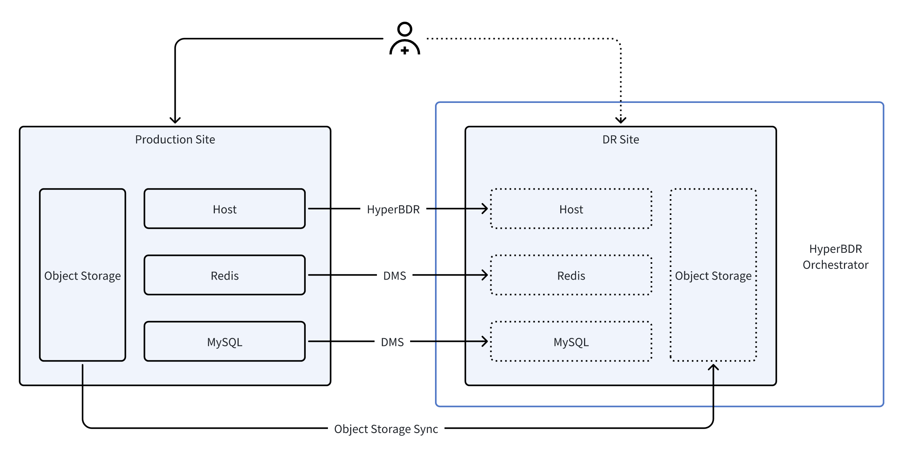
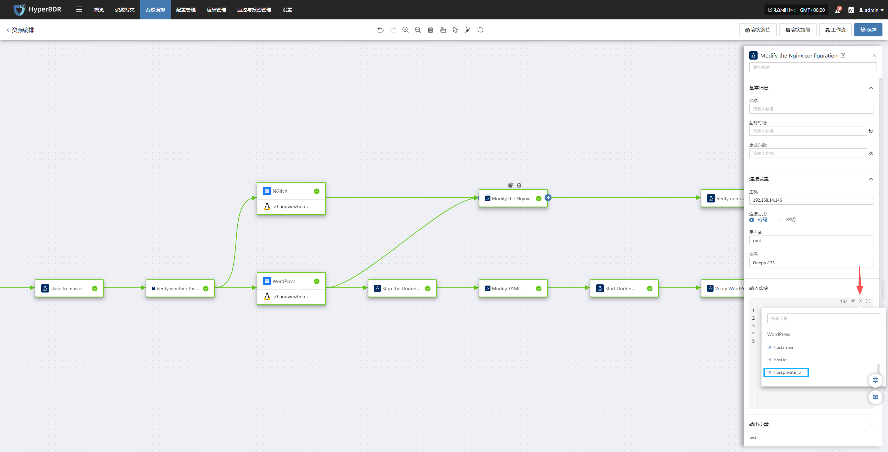
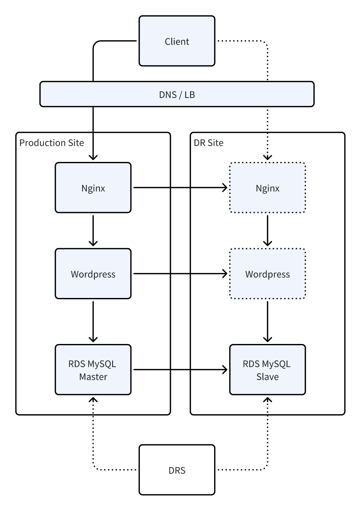

# HyperBDR Orchestration

## 1. Why is the orchestration function needed?

With the digital transformation of enterprises and the widespread application of Cloud Service, IT architecture is undergoing profound changes. HyperBDR was initially developed as a **software focusing on host-level DR&#x20;**&#x70;rimarily used to protect and restore various application systems deployed on hosts.

However, with the evolution of IT architecture, especially after enterprises migrate to the cloud, the underlying software system is undergoing significant changes. On the one hand, traditional monolithic components are being disassembled into multiple Cloud Native services—for example, databases have evolved into Relational Database Services (RDS), traditional NAS file services are gradually being replaced by object storage or file storage, and Middleware has also been decomposed into various cloud-based Middleware services. On the other hand, many critical business systems such as Oracle RAC, SAP HANA, etc., still operate in the form of proprietary architectures and need to collaborate in parallel with these Cloud Native capabilities, which further raises the requirements for overall architecture design and DR solutions.

The changes in this architecture make it difficult for a single software to cover the protection capabilities of all components, and also bring&#x20;**&#x20;new business continuity challenges&#x20;**. In a Cloud Native environment, applications are no longer monolithic systems, but consist of multiple distributed components that operate collaboratively. Once a disaster occurs, simple host recovery is no longer sufficient to ensure the overall recovery of the business.&#x20;

Therefore, while continuously strengthening its host protection capabilities, HyperBDR has gradually expanded its focus to**the overall recoverability at the business level**. This means that, beyond host protection, HyperBDR needs to assume the role of**orchestration and coordination for business-level DR**.

## 2. Role of HyperBDR in Cloud Native DR

In the face of the increasing complexity of Cloud Native architecture, HyperBDR has redefined its own positioning -&#x20;

&#x20;In addition to continuing to provide robust host-level backup and recovery capabilities, it no longer attempts to replace cloud providers in implementing data synchronization functions for various Cloud Native services such as databases, object storage, and middleware. Instead, it shifts its focus to the unified control and orchestration of the overall DR process, ensuring that the final business switchover results are predictable, verifiable, and implementable.&#x20;

In other words, HyperBDR focuses on the ultimate goal of "restoring business operations" rather than the specific data transfer process. The underlying data replication, synchronization, and snapshotting are handled by each cloud service or dedicated tool, while HyperBDR orchestrates the recovery logic of these heterogeneous components to achieve unified&#x20;**&#x20;DR switchover orchestration and business recovery control&#x20;**.&#x20;

This design concept makes HyperBDR the&#x20;**&#x20;scheduling and orchestration center (Orchestration Center)&#x20;**&#x20;in the enterprise DR system, building a unified cross-layer, cross-platform DR control plane through integration with Cloud Native services, databases, storage systems, and middleware.&#x20;

## 3. Design Concept of the Orchestration Function

The core objective of HyperBDR's orchestration function is&#x20;**&#x20;an automated, standardized, and visualized DR switching process&#x20;**.
&#x20;It separates the configuration management of DR resources (hosts, databases, object storage, etc.) from the logic of DR processes (startup sequence, dependencies, verification steps) through the approach of "decoupling resources from processes".&#x20;

This architecture brings two major advantages:&#x20;

* **Flexibility** —— Users can freely define DR processes without delving into the technical details of managing each component.

* **Scalability** —— HyperBDR can integrate more external services through plug-ins or command execution (locally or remotely), enabling hybrid orchestration across clouds and architectures.

In a typical Cloud Native DR architecture, applications are usually composed of various Cloud Native resources, including compute hosts, Redis, databases, and object storage. Each type of component relies on its own data replication and recovery mechanism: at the host level, continuous replication is performed through HyperBDR, Redis and databases use the Cloud Native DMS data transfer service, and object storage is synchronized through a dedicated replication tool.&#x20;



During formal DR drills or fault switching processes, HyperBDR Orchestrator integrates these heterogeneous services into an integrated process through unified orchestration capabilities. It first executes API calls to the cloud DMS service via a pre-configured remote Jump Server, promotes Redis and databases to read-write instances on the DR side; then pauses the synchronization of object storage to ensure data consistency; finally, leverages HyperBDR's host recovery capabilities to batch start all compute hosts and perform necessary configuration adjustments. Through this end-to-end automated process, the entire application stack can be switched to the DR site in a consistent, controllable, and minimally human-intervened manner.

## 4. Scenario 1: VMware to Cloud Business DR (MySQL HA)

### 4.1 Customer Scenarios and Requirements

This client is a company that mainly focuses on online display, and its corporate homepage serves as the primary entry point for the outside world to learn about them. To ensure the long-term stable operation of their official website, they have deployed WordPress and Nginx services in a VMware environment and used the MySQL master-slave mechanism to ensure real-time synchronization of content updates.&#x20;

As business develops, customers are increasingly worried about the risk of "official website downtime" - whether due to VMware host failures, storage issues, or accidents with the virtual machines themselves. Once the official website becomes inaccessible, it not only results in potential customer loss but also directly impacts the brand image.&#x20;

However, during the communication, the client raised a very practical question:**&#x20;"We are not a large internet company and have limited budget. Is there a reliable DR solution that does not lead to cost overruns?"&#x20;**

Their core demands have thus become more specific and cost-conscious:&#x20;

* **When a failure occurs, the website can resume access within 15 minutes, but the DR architecture cannot be overly expensive.&#x20;**

* **MySQL data must not be lost, but the synchronization mechanism is expected to be as simple as possible without adding too much operation and maintenance cost.**

* **Services like WordPress and Nginx can operate stably under normal circumstances, so there's no need to set up a bunch of complex components specifically for DR.**

* **Backup and DR resources need to be allocated as needed, rather than incurring long-term high costs.**

To prevent data loss in the worst-case scenario, they still regularly back up relevant files of WordPress and Nginx to the cloud, but they do not want to maintain an expensive active-active architecture for a long time just for "possible accidents" - this is the most typical cost contradiction for small and medium-sized enterprises.&#x20;

### 4.2 Overall Architecture

Based on the user's dual requirements of "the official website cannot be shut down" and "DR costs being controllable", we designed a set of**highly available but not over-invested**active-standby architecture. While the solution is running in the production environment, it continuously synchronizes critical data to the DR site through a lightweight mechanism, without the need to build expensive cross-site active-active or a large amount of Remnant Inventory.

When a VMware host or virtual machine fails, the system can automatically or manually switch to the DR site within a short period of time to ensure uninterrupted access to the official website; while the DR resources usually only maintain necessary operations without causing continuous cost consumption.&#x20;

&#x20;The architecture diagram shows the data synchronization method, backup strategy, and switching process between production and DR, enabling customers to clearly understand that&#x20;**&#x20;this is not an expensive "luxury DR system" but a practical solution centered on business continuity and cost balance.&#x20;**


### 4.3 Implementation Plan

#### Resource Inventory

The following resource list outlines the hardware, software, and network environment required for system deployment, ensuring that the business can operate normally both locally and in the cloud, and supporting rapid DR and data protection.&#x20;

| Type                          | Name/Specification/Quantity | Usage Instructions                                                                                        |
| ----------------------------- | --------------------------- | --------------------------------------------------------------------------------------------------------- |
| VMware Host                   | 3 units                     | Deploy MySQL 5.7, WordPress, and Nginx respectively for business operations in the production environment |
| Cloud Host                    | 1 unit                      | Deploy a MySQL slave instance for cloud DR                                                 |
| Database                      | MySQL 5.7                   | Configure master-slave synchronization with cloud MySQL to ensure data consistency                        |
| Web Service                   | WordPress + Nginx           | Frontend application and proxy service                                                                    |
| Backup Service                | HyperBDR SaaS               | WordPress and Nginx Host Backup                                                                           |
| Network                       | VPN                         | Ensure secure and stable data synchronization between VMware and the cloud                                |
| MySQL Master-Slave Management | mah                         | Used to switch MySQL master-slave database configuration                                                  |

First, we used HyperBDR to provide unified DR protection for two business hosts; subsequently, through HyperBDR's orchestration capabilities, we automated the design of the business recovery process. The following figure shows the overall process effect after orchestration. The specific execution steps are as follows:


#### **Step 1: Restore the cloud host&#x20;**

**Objective**:&#x20;

Recover the host in the cloud to automatically take over the work of the production environment, and migrate the WordPress website from "local" to "cloud" to continue running.&#x20;


**Orchestration Process**:&#x20;

* If a host on VMware fails, the operation and maintenance personnel only need to click to initiate the DR process.&#x20;

* The system will automatically restore the corresponding cloud host according to the pre-established DR strategy in HyperBDR, but keep it in a powered-off state, and subsequent power-on operations will be performed in the specified order.&#x20;

(Technical operations are automatically completed by the system, and users do not need to manually intervene.)&#x20;

#### **Step 2: Check if the cloud database is available**

**Objective**:&#x20;

&#x20;Confirm that the cloud MySQL standby database is functioning properly to ensure that subsequent switches will not pose data risks.&#x20;**&#x20;Orchestration process:&#x20;**

* The system will actively "ping" the MySQL slave database in the cloud to check if it is online.&#x20;

(Corresponding command: `ping -c 1 192.168.7.144`)&#x20;

If the database standby is offline, the system will block the process to avoid the risk of switching.&#x20;

#### **Step 3: Switch the database (promote the slave database to the master database)**

**Objective**:&#x20;

Make the cloud-based MySQL officially the new primary database, so that all subsequent data reads and writes of WordPress are directed to the cloud.&#x20;


**Orchestration Process**:&#x20;

* If the detection result is normal, the system will promote the slave database in the cloud to the "master database".&#x20;

```bash
masterha_master_switch --conf=/etc/mha.cnf --master_state=dead --dead_master_host=192.168.7.141 --new_master_host=192.168.7.144 --orig_master_is_new_slave --interactive=0 --running_updates_limit=10000 --ignore_last_failover --verbose --force
```

* Then the system will detect again whether the cloud MySQL is fully available.&#x20;

```bash
/usr/local/mysql/bin/mysqladmin -uroot -p111111 -h 192.168.7.144 ping --connect-timeout=300
```

#### **Step 4: Synchronously update Nginx and WordPress configurations (automatically executed)&#x20;**

**Objective**:&#x20;

Ensure that both the Web entry (Nginx) and the WordPress application can correctly connect to the cloud primary database and continue to provide services externally **.&#x20;**


**Arrangement Process:**

* **Nginx Server:&#x20;**

  * The system will automatically modify the Nginx configuration for you, replacing the old address with the new cloud address.&#x20;

  * Then check if the Nginx configuration is correct, and reload it to make the adjustments take effect immediately.&#x20;

  ```bash
  "cp /etc/nginx/nginx.conf /etc/nginx/nginx.conf.bak && sed -i 's/192\.168\.7\.143/WordPress/{x}host.private_ip/g' /etc/nginx/nginx.conf && nginx -t && systemctl reload nginx"
  ```



  * Finally, the system will simulate a user visit once to confirm that Nginx can already provide services externally normally.

  ```bash
  curl -sSL --retry 60 --retry-delay 5 --max-time 300 --connect-timeout 10 --fail http://NGINX/{x}host.private_ip
  ```

* **WordPress Server:**

  * The system will first stop the WordPress container (because some configurations cannot be modified while the container is running).&#x20;

  ```bash
  /usr/local/bin/docker-compose -f /home/wordpress/wordpress-compose.yaml down
  ```

  * Automatically modify the database address of WordPress; change the configuration from "Original Production MySQL" to "Cloud Main Database".

  ```bash
  "cp /home/wordpress/wordpress-compose.yaml /home/wordpress/wordpress-compose.yaml.bak && sed -i 's#- WORDPRESS_DB_HOST=.*#- WORDPRESS_DB_HOST=192.168.7.144#' /home/wordpress/wordpress-compose.yaml"
  ```

  * The container is restarted, and the system automatically checks whether the restart is successful.&#x20;

  ```bash
  /usr/local/bin/docker-compose -f /home/wordpress/wordpress-compose.yaml up -d
  ```

  ```bash
  curl -sI --retry 60 --retry-delay 5 --max-time 300 --connect-timeout 10 --fail http://WordPress/{x}host.private_ip:18080
  ```

* **Update WordPress internal configuration (no restart required)**

  * Ensure that the internal website address, access entry, Cookie settings, etc. of WordPress are all consistent with the cloud environment.&#x20;

  * The system will automatically clean up the old site address configuration and write in the new cloud access address.&#x20;

  * These configurations take effect immediately without the need to restart WordPress.

  ```sql
  "sed -i \"/define('WP_HOME'/d; /define('WP_SITEURL'/d; /define('COOKIE_DOMAIN'/d\" /home/wordpress/config/wp-config.php && echo -e \"define('WP_HOME', 'http://NGINX/{x}host.private_ip');\ndefine('WP_SITEURL', 'http://NGINX/{x}host.private_ip');\ndefine('COOKIE_DOMAIN', false);\" >> /home/wordpress/config/wp-config.php"
  ```

#### **Step 5: DNS Switchover**

**Objective**:&#x20;

Ensure that users access the business system using the original access path.&#x20;


**Orchestration Process**:&#x20;

**Method 1: Process orchestration method (no need to reserve fixed IPs, lowest cost, but depends on network reachability and DNS TTL/convergence latency during task execution)&#x20;**&#xA;&#x20;Dynamically update DNS during switching via scripts or automated processes, triggered on demand, with zero additional cost, but depends on network and platform timeliness during execution.&#x20;

**Method 2: Fixed IP Preset Method (Requires long-term retention of IP, with higher costs)&#x20;**&#xA;&#x20;Bind a set of stable reserved IPs in DNS in advance, which can take effect immediately upon switching, offering the best timeliness, but requires continuous payment for the fixed IPs.&#x20;

#### **Step 6: Business Verification (the most critical step)**

**Objective**:&#x20;

Confirm that the user has fully switched to the cloud when accessing the website, and that the page is normal, the speed is stable, and the data is consistent.

## 5. Scenario 2: Cross-region DR for the same cloud (host + Relational Database Service RDS)

### 5.1 Customer Scenarios and Requirements

With the steady growth of the official website business, this client's trust in the Cloud Computing Platform has also been continuously increasing. Initially, they adopted the model of "local production + cloud DR", which still required maintaining VMware hosts, storage devices, and network environments.

&#x20;However, as local devices gradually age, customers are increasingly reluctant to invest additional resources in local data centers - including data center leasing, power, cooling, maintenance labor, etc., all of which are continuously increasing costs.&#x20;

During the communication with us, they proposed new goals:&#x20;

**"Can we completely host our business on the cloud without maintaining any local resources, while still achieving cross-regional DR to avoid regional-level failures in cloud services themselves?"&#x20;**

This is exactly the typical inflection point that many enterprises will encounter after several years of migrating to the cloud:&#x20;

* Cloud services are very stable, but they have also heard news about "a brief unavailability of an Available Zone of a cloud provider";

* No longer wants to maintain local infrastructure, but also cannot put all eggs in one basket;&#x20;

* Still need to control costs and do not want to implement enterprise-level large investment solutions such as the "active-active architecture".

Based on these practical demands, their goals have gradually become clear:

* **The business is fully hosted in the cloud, and local servers are no longer maintained.&#x20;**

* **The database hopes to use the RDS provided by the cloud provider to reduce the operation and maintenance burden.&#x20;**

* **Cross-regional DR is still required to prevent major failures in an Available Zone.**

* **The switching time should preferably be controlled within 15 minutes to ensure uninterrupted access to the official website.&#x20;**

* **The overall architecture should take cost into account and avoid the expensive active-active solution.&#x20;**

### 5.2 Overall Architecture

After understanding the client's business direction, we designed for them a set of&#x20;**&#x20;architecture that is fully cloud-based, cost-controllable, and has strong cross-regional DR capabilities&#x20;**.&#x20;

The business database uses&#x20;**&#x20;RDS&#x20;**&#x20;on the cloud, which not only benefits from a mature master-slave mechanism but also reduces users' investment in database operation and maintenance. To achieve a higher level of cross-region DR capability, we introduced&#x20;**&#x20;DRS DR service&#x20;**&#x20;- it can synchronize the data of the RDS master database to the remote RDS DR instance in real time.&#x20;

DRS continuously parses database logs and synchronizes incremental data, ensuring that the databases in the two regions always remain highly consistent. In the event of unavailability in the production region, cross-region network failures, or even data center-level failures, DRS can promote the DR instance to a new primary database within minutes and complete the business redirection switch, keeping the recovery time objective (RTO) of the entire business within 15 minutes and the recovery point objective (RPO) close to 0.

Meanwhile, through HyperBDR, we have unified the orchestration of cross-region recovery of business hosts, automated switching of website services, and final business verification, enabling the entire failover process to run automatically without the need for operations and maintenance personnel to perform operations item by item.

The final cross-regional architecture is shown in the following figure:&#x20;

* Production Area Operation Business

* Data is synchronized to the DR area in real time

* During a failure, HyperBDR + DRS cooperate to perform automated switching&#x20;

* Website entry, application services, and databases were all restored within 15 minutes

* The overall cost remains controllable, and there is no need to invest in an expensive active-active architecture&#x20;

This is a&#x20;**&#x20;practical-level DR solution that is cloud-centric, has cross-regional capabilities, and takes into account both cost and maintainability&#x20;**.&#x20;



### 5.3 Implementation Plan

#### Resource Inventory

The following resource list shows all the resources used in this scenario. The system can ensure the stable operation of the business in the cloud and support rapid DR switching and comprehensive data protection capabilities.&#x20;

| Area         | Server Role | Remarks                                                                                                                   |
| ------------ | ----------- | ------------------------------------------------------------------------------------------------------------------------- |
| Beijing One  | Jump Server | Only used for remotely executing commands, and it stores Huawei Cloud API call files                                      |
| Beijing One  | Wordpress   | HyperBDR DR Protection Source Machine                                                                      |
| Beijing One  | Nginx       | HyperBDR DR Protection Source Machine                                                                      |
| Beijing One  | RDS         | The resource specification is MySQL 5.7.44, and it is configured as the primary node in combination with the DRS service  |
| Beijing One  | DRS Service | Whether the switch is completed is determined based on the current area where the DRS is located                          |
| Shanghai One | RDS         | The resource specification is MySQL 5.7.44, and it is configured as a standby node in combination with the DRS service    |

The following process demonstrates the complete operational steps from cloud takeover in the production environment, configuration switching to business verification, ensuring business continuity, data consistency, and application availability.&#x20;


Before starting to use the orchestration function, you need to prepare a **Jump Server node**. Jump Server is a **transit node for executing remote commands**, which can replace manual operations on the target server to achieve batch or automated remote management. Any host that can access the target network and be remotely operated through the HyperBDR server can serve as a Jump Server, not limited to just a few fixed nodes.

The operating requirements are as follows:&#x20;

* Jump Server node servers need to pre-install commonly used operation and maintenance commands such as python3, pip3, sshpass, etc.

* Upload the required scripts to the Jump Server.

  * Active-standby switchover script:[Click to download](https://hyperbdr-system-image-do-not-delete.obs.ap-southeast-3.myhuaweicloud.com/Best_Practices/master.py)

  * Task Status Details Script:[Click to Download](https://hyperbdr-system-image-do-not-delete.obs.ap-southeast-3.myhuaweicloud.com/Best_Practices/master_status.py)

  > After downloading and uploading the file is completed, please make sure to modify the region and task ID to the actual values in the script.&#x20;

* Ensure that the HyperBDR server can remotely access the Jump Server.&#x20;

* Ensure that Jump Server can access the target network to execute subsequent commands.&#x20;

#### Step 1: Restore the cloud host&#x20;

**Objective**:&#x20;

In a Shanghai region, the host automatically took over the work of the production environment, restoring the WordPress and Nginx services from "Beijing 1" to "Shanghai 1" to continue running.&#x20;


**Orchestration Process**:&#x20;

* When a regional failure occurs in the production environment, the operation and maintenance personnel only need to click to initiate the DR process.&#x20;

* The system will automatically restore the corresponding cloud host according to the pre-established DR strategy in HyperBDR, but keep it in a powered-off state, and subsequent power-on operations will be carried out in the specified order.&#x20;

(Technical operations are automatically completed by the system, and users do not need to manually intervene.)&#x20;

#### **Step 2: Switch the database (promote the slave database to the master database)&#x20;**

**Objective**:&#x20;

Use the relational database DR service to change the Shanghai region to the primary database and change the location where the application writes to the database.&#x20;


**Orchestration Process**:&#x20;

* The system will promote the source standby database to the "new primary database".&#x20;

```bash
export CLOUD_SDK_AK="your AK"
export CLOUD_SDK_SK="your SK"
/usr/bin/python3 /root/master.py
```
The complete script example is as follows:

```bash
# coding: utf-8

import os
from huaweicloudsdkcore.auth.credentials import BasicCredentials
from huaweicloudsdkdrs.v3.region.drs_region import DrsRegion
from huaweicloudsdkcore.exceptions import exceptions
from huaweicloudsdkdrs.v3 import *

if __name__ == "__main__":
    # The AK and SK used for authentication are hard-coded or stored in plaintext, which has great security risks. It is recommended that the AK and SK be stored in ciphertext in configuration files or environment variables and decrypted during use to ensure security.
    # In this example, AK and SK are stored in environment variables for authentication. Before running this example, set environment variables CLOUD_SDK_AK and CLOUD_SDK_SK in the local environment
    ak = os.environ["CLOUD_SDK_AK"]
    sk = os.environ["CLOUD_SDK_SK"]

    credentials = BasicCredentials(ak, sk)

    client = DrsClient.new_builder() \
        .with_credentials(credentials) \
        .with_region(DrsRegion.value_of("Region")) \
        .build()

    try:
        request = BatchSwitchoverRequest()
        listJobsbody = [
            "Job_id"
        ]
        request.body = BatchSwitchoverReq(
            jobs=listJobsbody
        )
        response = client.batch_switchover(request)
        print(response)
    except exceptions.ClientRequestException as e:
        print(e.status_code)
        print(e.request_id)
        print(e.error_code)
        print(e.error_msg)
```

* The system will verify whether the switch is successful. When the switch fails, the system will block the process to avoid switching risks.&#x20;

```bash
export CLOUD_SDK_AK="your AK"
export CLOUD_SDK_SK="your SK"
python3 /root/master_status.py
```
The complete script example is as follows:

```bash
# coding: utf-8

import os
import time
from huaweicloudsdkcore.auth.credentials import BasicCredentials
from huaweicloudsdkdrs.v3.region.drs_region import DrsRegion
from huaweicloudsdkcore.exceptions import exceptions
from huaweicloudsdkdrs.v3 import *

# =======================================
# Configuration variables (editable)
# =======================================
AK = os.environ.get("CLOUD_SDK_AK")
SK = os.environ.get("CLOUD_SDK_SK")
REGION = "Region"

# Multiple job IDs separated by commas
JOB_IDS = "Job_id"

# Retry configuration
TOTAL_ATTEMPTS = 3          # total queries including the first one
RETRY_INTERVAL = 30         # seconds

# =======================================
# Function to query DRS job status
# =======================================
def query_jobs(client, job_list):
    request = BatchListJobDetailsRequest()
    request.body = BatchQueryJobReqPage(jobs=job_list)
    return client.batch_list_job_details(request)


# =======================================
# Main Program
# =======================================
if __name__ == "__main__":

    if not AK or not SK:
        raise RuntimeError("The environment variables CLOUD_SDK_AK / CLOUD_SDK_SK are not set")

    job_list = [i.strip() for i in JOB_IDS.split(",") if i.strip()]

    credentials = BasicCredentials(AK, SK)

    client = DrsClient.new_builder() \
        .with_credentials(credentials) \
        .with_region(DrsRegion.value_of(REGION)) \
        .build()

    for attempt in range(1, TOTAL_ATTEMPTS + 1):

        try:
            print(f"Querying job status... (Attempt {attempt}/{TOTAL_ATTEMPTS})")

            response = query_jobs(client, job_list)
            resp_dict = response.to_dict()
            job_results = resp_dict.get("results", [])

            down_found = False

            for job in job_results:
                job_id = job.get("id")
                direction = job.get("job_direction")
                status = job.get("status")

                print(f"[Job {job_id}] direction={direction}, status={status}")

                if direction == "down":
                    down_found = True

            if not down_found:
                print("All jobs direction are OK. No retry required.")
                exit(0)

            if attempt < TOTAL_ATTEMPTS:
                print(f"'down' state detected. Retrying in {RETRY_INTERVAL} seconds...\n")
                time.sleep(RETRY_INTERVAL)
            else:
                print("ERROR: Reached max attempts. Job still in 'down' state. Exiting.")
                exit(1)

        except exceptions.ClientRequestException as e:
            print("Exception during request:")
            print("Status Code:", e.status_code)
            print("Request ID:", e.request_id)
            print("Error Code:", e.error_code)
            print("Error Message:", e.error_msg)
            exit(1)
```

#### **Step 3: DNS Switch&#x20;**

**Objective**:&#x20;

Ensure that users access the business system using the original access path.&#x20;


**Orchestration Process**:&#x20;

**Method 1: Process orchestration method (no need to reserve fixed IPs, lowest cost, but depends on network reachability and DNS TTL/convergence latency during task execution)&#x20;**&#xA;&#x20;Dynamically update DNS during switching via scripts or automated processes, triggered on demand, with zero additional cost, but depends on network and platform timeliness during execution.&#x20;

* Adjust the Nginx configuration to proxy to the new address (if intrusive operations cannot be performed, it can be completed through pre- and post-script functions)

```typescript
sshpass -p "password" ssh -o StrictHostKeyChecking=no -o UserKnownHostsFile=/dev/null root@nginx/{x}host.public_ip  "sed -i 's/192\.168\.9\.209/wordperss/{x}host.private_ip/g' /etc/nginx/nginx.conf && nginx -t && systemctl reload nginx"
```

* Modify Hosts host mapping

```bash
sed -i 's/114\.115\.235\.149/nginx/{x}host.public_ip/g' /etc/hosts && ping -c 1 oneprotestwordpress.test
```

* Test domain name access

```bash
curl -sSL --retry 60 --retry-delay 5 --max-time 5 --connect-timeout 10 --fail http://oneprotestwordpress.test
```

**Method 2: Fixed IP Preset Method (Requires long-term retention of IP, with higher costs)&#x20;**&#xA;&#x20;Bind a set of stable reserved IPs in DNS in advance, which can take effect immediately upon switching, offering the best timeliness, but requires continuous payment for the fixed IPs.&#x20;

#### Step 4: Business Verification&#x20;

**Objective**:&#x20;

Confirmed that when the user accessed the website, it had fully switched to Shanghai One operation, and the page was normal, the speed was stable, and the data was consistent.

## 6. Summary

HyperBDR's process-based resource group orchestration function is an important feature for Hybrid Cloud DR in 2025. The launch of this feature will effectively address the issue of hybrid orchestration of multiple Cloud Native DR components in the cloud environment, providing strong automated support for the DR of Cloud Native applications. Through this feature, users can implement a more efficient DR process, reduce manual intervention and operational errors, thereby significantly improving recovery efficiency and system availability.

