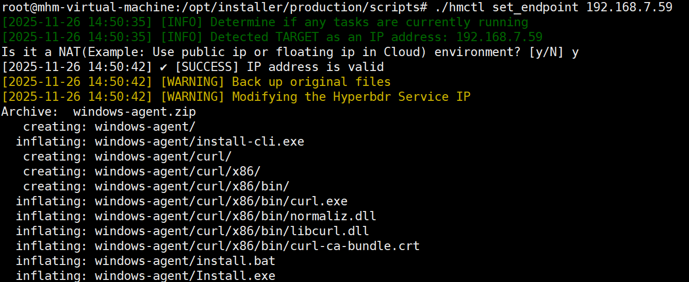
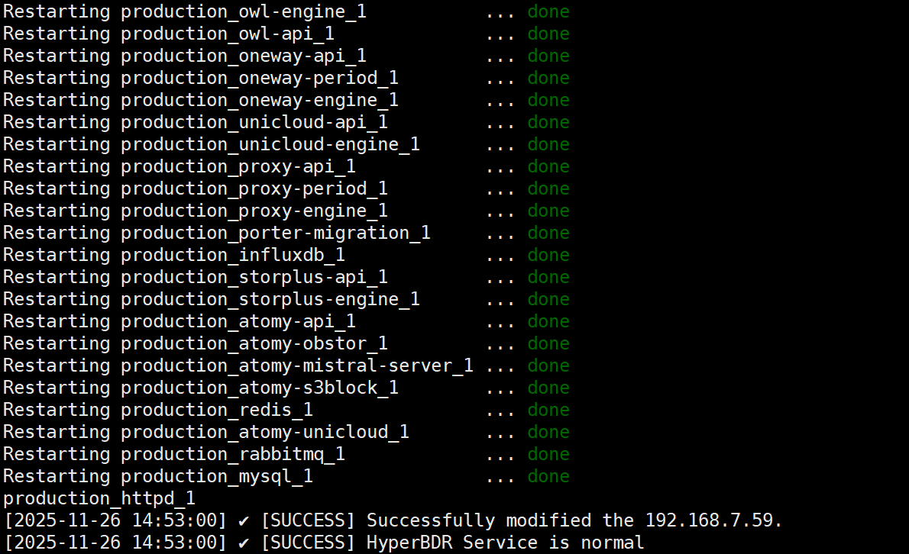
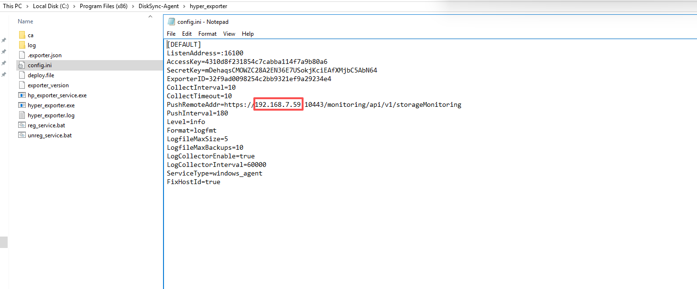
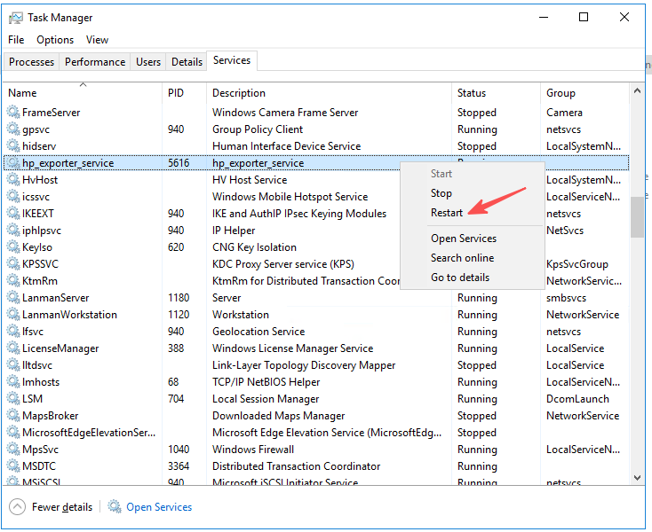
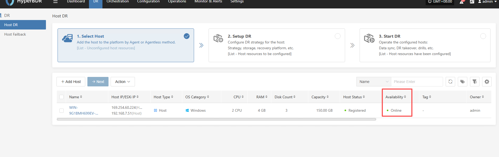
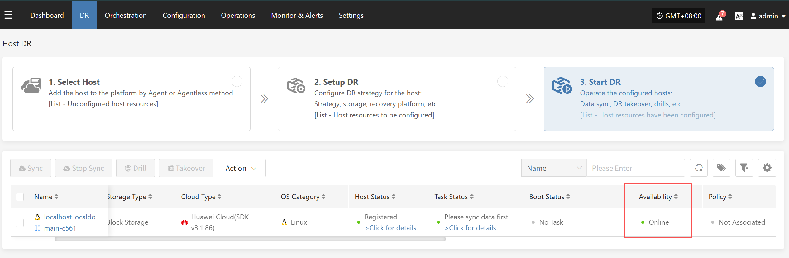
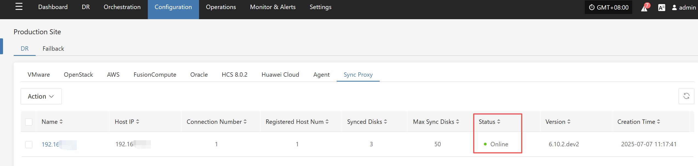

# HyperMotion / HyperBDR Service IP Change Guide

## Scene description

This document is applicable to those who want to change the HyperBDR service address after completing the deployment of HyperBDR Console.  

If other HyperBDR components (Windows Agent, Linux Agent, Sync Proxy, and Cloud Sync Gateway) have been installed and deployed, you need to modify the configuration of the relevant components after changing the HyperBDR service address.

## Operation process
### HyperBDR Console

> Please ensure that there are no ongoing tasks in HyperBDR.  

1.Log in to the HyperBDR server  

2.Execute the command to change the IP address of the HyperBDR control network  

``` shell
## <New Console Service IP> is the HyperBDR control network IP that needs to be changed.
cd /opt/installer/production/scripts/ && ./hmctl set_endpoint <New Console Service IP>
```

  
  


---

### Windows Agent

If Windows Agent has already been installed, the Console IP address configuration of Windows Agent needs to be modified after the HyperBDR service address changes.  

> Please make the change to the Windows Agent after completing the HyperBDR service address change.  

1.Log in to the system where the Windows Agent is located  

2.Open Windows Agent and stop the service  

  

3.Modify the IP of the Console Endpoint (HyperBDR control network IP) and start the service  

  

4.Modify the configuration of the Windows Agent monitoring service  

The default location of the configuration file is: C:\Program Files (x86)\DiskSync-Agent\hyper_exporter\config.ini  

  

Change the IP address to the new IP after the HyperBDR Console update and save the file.  

5.Restart the Windows Agent monitoring service  

Service Name: hp_exporter_service  

  

6.Make sure the Windows Agent host in the HyperBDR Console is Online.  

  

---
### Linux Agent

If Linux Agent has already been installed, the Console IP address configuration of Linux Agent needs to be modified after the HyperBDR service address changes.  

> Please make the change to the Linux Agent after completing the HyperBDR service address change.  

1.Log in to the system where the Linux Agent is located. 
 
2.Modify the configuration file and restart the service.  

``` shell
## <Old Console Service IP> is the HyperBDR control network IP before the change, and <New Console Service IP> is the HyperBDR control network IP that needs to be changed.
sed -i 's/<Old Console Service IP>/<New Console Service IP>/g' /etc/sysconfig/egisplus-agent && systemctl restart egisplus-agent.service
sed -i 's/<Old Console Service IP>/<New Console Service IP>/g' /usr/local/hyper_exporter/config.ini && systemctl restart hyper-exporter-agent.service
```

3.Make sure the Linux Agent host in the HyperBDR Console is Online  

  

---
### Sync Proxy

If Sync Proxy has already been installed and deployed, the Console IP address configuration of Sync Proxy needs to be modified after the HyperBDR service address changes.  

> Please make the change of Sync Proxy after completing the address change of HyperBDR service.  

1.Log in to the system where Sync Proxy is located.  

2.Modify the configuration file and restart the service.  

``` shell
## <Old Console Service IP> is the HyperBDR control network IP before the change, and <New Console Service IP> is the HyperBDR control network IP that needs to be changed.
sed -i 's/<Old Console Service IP>/<New Console Service IP>/g' /etc/hamal/hamal.conf && docker restart hamal
sed -i 's/<Old Console Service IP>/<New Console Service IP>/g' /opt/hyper_exporter/config.ini && systemctl restart hyper_exporter.service
```

3.Make sure the Sync Proxy host in the HyperBDR Console is Online  

  

---
### Cloud Sync Gateway

If Cloud Sync Gateway has been installed and deployed, the Console IP address configuration of Cloud Sync Gateway needs to be modified after the HyperBDR service address changes.  

> Please make the change of Cloud Sync Gateway after completing the address change of HyperBDR service.  

1.Log in to the system where Cloud Sync Gateway is located.  

2.Modify the configuration file and restart the service.  

``` shell
## <Old Console Service IP> is the HyperBDR control network IP before the change, and <New Console Service IP> is the HyperBDR control network IP that needs to be changed.
systemctl stop watchman.service s3block.service && sed -i 's/<Old Console Service IP>/<New Console Service IP>/g' /etc/sgateway/s3block_config.ini && systemctl start watchman.service 
```

3.Make sure the Cloud Sync Proxy host in the HyperBDR Console is Online  

  

