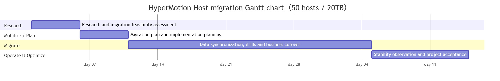
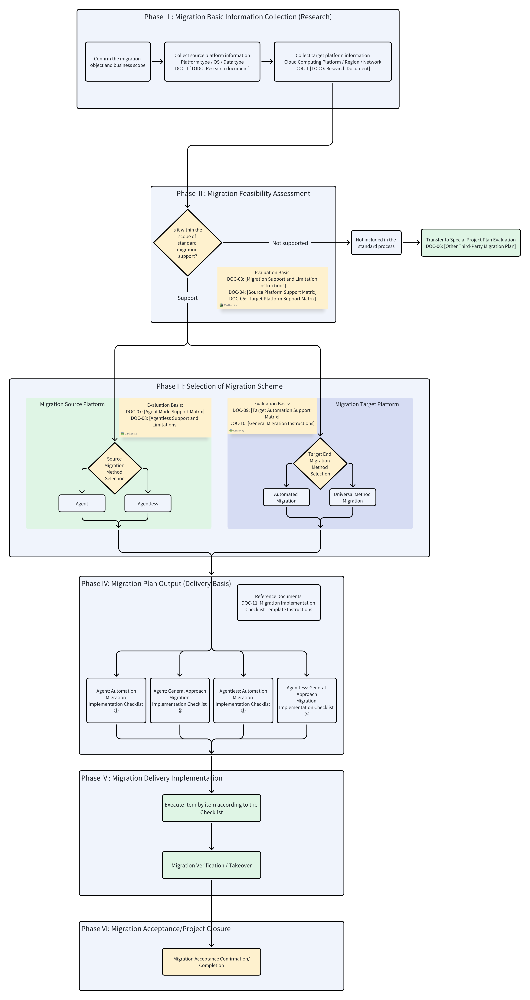
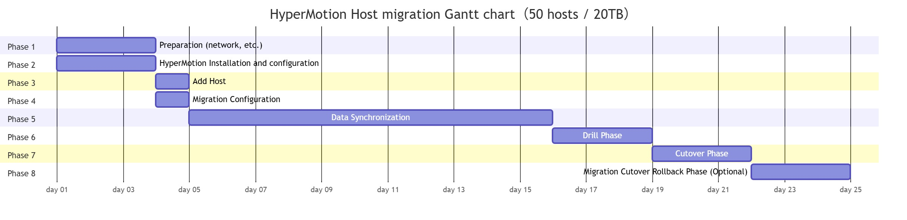

# Best Practices for Migration Project Delivery
## 1. Document description

This document aims to guide migration service providers (Managed Service Providers, hereinafter referred to as MSP) in the **migration service delivery** scenario , standardize and efficiently use HyperMotion products to complete project implementation and delivery.
The document focuses on the key issues and best practices that need to be paid attention to during the migration process based on HyperMotion product capabilities. It clarifies the work points and boundaries of each stage to reduce migration risks, improve migration success rates, and ensure business continuity and stable system operation.

## 2. 2. Delivery Phase Description 

Referring to the AWS Migration Framework, the project delivery of migration services can generally be divided into  **Assess** ,  **Mobilize / Plan** ,  **Migrate** , and  **Operate & Optimize**  four phases. Each phase is both interconnected and has its own focus, jointly ensuring the controllability and success rate of the migration project. 

| Phase     | Stage Goal          | Key Focus Areas                                |
| -------- | ---------------- | ---------------------------------------- |
| Assess | Confirm the feasibility of migration | Host Support Confirmation: Investigate the source host type (physical machine / virtual machine), operating system and kernel version, virtualization platform type, and evaluate whether it is within the scope supported by HyperMotion. Business Relevance Analysis: Identify the dependencies between the host and other systems, databases, middleware, and shared data, providing a basis for subsequent cutover window and migration sequence planning. Migration solutions for unsupported components: For migration objects not supported by HyperMotion (such as file-level data, relational database RDS, object storage, etc.), it is necessary to clearly adopt open-source tools or native migration solutions of the Cloud Computing Platform to supplement and implement them, and ensure the overall migration process is coordinated and consistent.  |
| Plan | Develop an executable migration plan | Network and Deployment Planning: Sort out user business network specifications, complete the deployment network planning for HyperMotion, and ensure the connectivity between the source and target environments and the bandwidth required for migration. Migration Plan Formulation: Based on the powerful Boot in Cloud drill function of HyperMotion, the migration process is verified, and finally the cutover window period, migration mode, and cutover strategy are determined. Migration Window and Risk Assessment: Assess the impact of the migration window on business operations, identify potential risks, and develop response measures to ensure that the migration is controllable, secure, and efficient.  |
| Implement (Migrate) | Complete host migration safely and controllably | Environment Preparatory Work: Complete the environment preparation for the source and target ends, including system configuration, readiness of dependent components, and resource verification. Network and Permission Configuration: Configure network connectivity and access policies to ensure secure and controllable access between the production environment and the target environment; meanwhile, complete the necessary permission configuration.  Mirroring Upload and Environment Deployment: Upload the mirroring required for migration to the target environment, and complete the deployment and related configuration of HyperMotion.  Migration Configuration and Drill: Complete the configuration of migration tasks before the official migration, and use the HyperMotion drill function to conduct full-process verification to ensure that the migration process is correct and executable.   Formal Migration and Business Takeover: Execute the formal migration based on the drill results, complete the business takeover from the source to the target, and ensure business continuity and system stability.  |
| Operation (Operate) | Ensure the stable operation of the host after migration  | Performance and Stability Monitoring: Check the performance metrics of the migrated host through monitoring tools, verify whether the resources meet the business requirements, and pay attention to the stability of the system operation. Migration Result Verification: Confirm the integrity of migrated data and the availability of business functions, while checking the resource consumption bill of the Cloud Computing Platform to ensure that resource usage meets expectations.   Business Operation Confirmation: Conduct a comprehensive inspection of business systems and related services to ensure that all applications are operating normally.  Daily operation and maintenance, and problem handling: Establish an operation and maintenance mechanism to promptly respond to and handle abnormal events, ensuring the continuous and stable operation of the system. |

## 3. Project Process Overview
The migration plan selection process starts with basic information research.  
First, determine whether the object to be migrated is within the migration scope supported by the platform.
- For **objects that support migration** , enter the standard migration solution selection process, generate the corresponding migration implementation checklist based on the source-side access method and target-side takeover method, and enter the delivery phase. 
- For **objects that do not support migration** (such as databases, special applications, or non-standard systems), they are not included in the standard migration process, and other solutions or special project migration plans need to be evaluated according to the actual situation.

## 4. Research phase
| To Do     | To-Do Items          | Description      | Executor | Completion Status |
| -------- | ---------------- | --------- | ----- | ------- |
| 1 | Host and Environment Information Collection | Collect source host type (physical machine / virtual machine), operating system and kernel version, virtualization platform type, and evaluate HyperMotion supportability | User/MSP |  |
| 2 | Business Relevance Analysis | Analyze the dependencies between the host and other hosts, databases, middleware, and shared data, and identify critical business access paths  | User/MSP |  |
| 3 | Confirmation of Non-Support for Component Migration Plan | Determine alternative migration solutions for objects not supported by HyperMotion (file-level data, relational databases, object storage, etc.) | MSP |  |
| 4 | Migration Plan Output | Summarize the research results and output the overall migration plan, including migration methods, sequence, and cutover window recommendations | MSP |  |

### To-do 1: Host and environment information collection
**Objective**
Collect the source host type (TCE-metal/virtual machine), operating system and kernel version, virtualization platform type, and evaluate the support of HyperMotion to provide a basis for subsequent migration feasibility analysis. Ensure the completeness and accuracy of the collected information to determine whether HyperMotion can support target host migration and identify possible unsupported objects.
**Reference Implementation Plan**
- Can HyperMotion be used for migration?
  - Question 1: Is the migration object a host?
    - is : The migration objects are in the host form (including physical machines, virtual machines, cloud hosts, etc.), which can be directly supported by HyperMotion. 
    - No : The migration object is in non-host form (such as relational database services, data migration involving only NAS or object storage, Oracle RAC, etc.), and the corresponding migration plan needs to be planned separately in the to-do 3: component migration plan confirmation .
  - Question 2: Which method should be used for migration?
    x86 hosts that do not support the Agentless method can theoretically be migrated using the agent-based method. 
    - Supported Scope of Agentless Mode
      - VMware: https://docs.oneprocloud.com/zh/product-overview/limitations/vmware-agentless.html
      - OpenStack(Ceph): https://docs.oneprocloud.com/zh/product-overview/limitations/openstack-ceph-agentless.html
      - FusionCompute: https://docs.oneprocloud.com/zh/product-overview/limitations/huawei-fusioncompute-agentless.html
      - AWS: https://docs.oneprocloud.com/zh/product-overview/presales/deep-in-aws-agentless-mode.html
      - Huawei Cloud: https://docs.oneprocloud.com/zh/product-overview/limitations/huawei-cloud-agentless.html
      - Oracle Cloud: https://docs.oneprocloud.com/zh/product-overview/limitations/oracle-cloud-agentless.html
      - Huawei Cloud Stack(HCS 8.0.2 + OceanStor Dorado 8000 V6): https://docs.oneprocloud.com/zh/product-overview/limitations/huawei-hcs-agentless.html
  - Question 3: What is the operating system support scope?
    - Agent mode support scope: [Source OS Support Matrix-v3](https://oneprocloud.feishu.cn/sheets/VRqksSPEPhRTPStp3kVcItXNnyh?sheet=Y9fpqO)
    - Agentless mode support scope: [Source OS Support Matrix-v3](https://oneprocloud.feishu.cn/sheets/VRqksSPEPhRTPStp3kVcItXNnyh?sheet=0MJNYC)
- How to conduct manual research?
  - Quick research on the source host: https://docs.oneprocloud.com/zh/product-overview/presales/hyperbdr-agent-investigation.html
  - Quick Investigation of Source VMware Hosts:https://docs.oneprocloud.com/en/product-overview/presales/hyperbdr-vmware-investigation.html
- How to conduct research in an automated manner? 
  The export list method of the production platform can be used, or open-source automated research tools can be adopted; 
  - Automated Host Collection Tool:https://docs.oneprocloud.com/zh/product-overview/presales/auto-host-info-collector.html
- How to fill out the survey form?
  - Download the investigation template:https://hyperbdr-system-image-do-not-delete.obs.ap-southeast-3.myhuaweicloud.com/Host%28Windows%20or%20Linux%29%20Quick%20Investigation%20information%20template.xlsx
### To-Do 2: Business Relevance Analysis 
**Objective**
Identify the dependencies of the source host in the business system, providing a basis for migration sequence planning and cutover window determination, to ensure business continuity and system stability during the migration process. 
**Reference Implementation Plan**
- What does the business system relationship research include?
  - Dependencies between hosts (such as clusters, active-standby, upstream and downstream calls); 
  - The association relationship between the host and databases, middleware, and key services; 
  - Dependencies on shared files, object storage, or other data sources accessed by the host; 
- What does network research mainly include? 
  - Business access paths and key network topology nodes;
  - Best Practices for Business Network Planning:https://docs.oneprocloud.com/zh/userguide/technical-practices/network-planning.html
  - HyperMotion Network Deployment Planning:https://docs.oneprocloud.com/en/product-overview/presales/dr-network-planning-recommendations.html
### To-Do 3: Confirmation of the unsupported component migration plan
**Objective**
For migration objects not supported by HyperMotion (such as file-level data, relational databases, object storage, etc.), alternative migration solutions are clearly adopted to ensure the integrity of the overall migration. 
**Reference Implementation Plan**
Here are some migration methods for common Cloud Native services, provided for reference only:
- File-level Data Migration Tool (rclone):https://rclone.org
- Container / Kubernetes Migration Tool (Velero):https://velero.io
- MySQL Database Migration Tool (mysqldump):https://dev.mysql.com/doc/refman/8.0/en/mysqldump.html
- PostgreSQL Database Migration Tool (pg_dump):https://www.postgresql.org/docs/current/app-pgdump.html
- Cloud Object Storage Migration Tool (AWS S3 CLI):https://aws.amazon.com/cli/
- Cloud Object Storage Migration Tool (Azure AzCopy):https://learn.microsoft.com/en-us/azure/storage/common/storage-use-azcopy
### To-Do 4: Output of Migration Plan
**Objective**
Based on the results of the preliminary research, summarize and output a complete host migration plan to provide clear guidance for the implementation phase and ensure that the migration is controllable and proceeds smoothly.
**Reference Implementation Plan**
The migration plan is the core basis of the entire migration project and must be ensured to be complete and accurate. 
1. Migration Methods and Supporting Notes 
  - List whether each host can use HyperMotion migration
  - For components not supported by HyperMotion, clearly define alternative migration plans and tools 
2. Business Relevance and Migration Sequence
  - Indicates the dependencies between hosts and critical business paths
  - Determine the migration sequence and cutover window recommendations
3. Migration Window and Risk Assessment 
  - Plan the migration time window based on business access characteristics and system relevance
  - Identify potential risks and propose countermeasures
4. Environment and Network Planning
  - Preparation of Source and Target Environment 
  - Network Connectivity and Access Policy Configuration

**can execute the migration scenario delivery checklist**  
[Checklist for Actual Deliverable Scenarios](#Appendix: Checklist for Actual Deliverable Scenarios)

## 5. Planning Phase

| To Do     | To-Do Items          | Description      | Executor | Completion Status |
| -------- | ---------------- | --------- | ----- | ------- |
| 1 | User Business Network Planning and HyperMotion Deployment Network Planning | Environmental pre-preparation: Sort out user business network specifications, confirm network connectivity and bandwidth requirements, and provide a foundation for subsequent HyperMotion deployment and migration. Network and Permission Configuration: Based on the user's network plan, complete the network configuration for HyperMotion deployment, ensure secure and controllable access between the production environment and the target environment, and complete the necessary permission settings. | User/Partner |  |
| 2 | Migration Drill Planning | Migration Configuration and Drill: Conduct migration drills based on the Boot in Cloud feature to verify the feasibility of the migration process and ensure that the migration steps are correct and executable.  | User/Partner |  |
| 3 | Migration and Cutover Planning | 迁Migration Sequence and Risk Assessment: Determine the migration sequence and cutover window based on business relevance and system dependencies, assess potential risks, and develop response measures.  | User/Partner |  |

### To-Do 1: User Business Network Planning and HyperMotion Deployment Network Planning
**Objective**
Provide a stable and controllable underlying network environment for HyperMotion deployment and subsequent migration, while meeting the requirements of the migration cutover window period, ensure that user business IP addresses remain unchanged as much as possible, thereby reducing network adjustment costs and business risks after migration, and ensuring network connectivity and access security. 
**Reference Implementation Plan**
This step selects the appropriate access method for the user business network and the deployment plan for HyperMotion based on the conclusions of the previous user business network research. 
- Best Practices for Business Network Planning:https://docs.oneprocloud.com/zh/userguide/technical-practices/network-planning.html
- HyperMotion Network Deployment Planning:https://docs.oneprocloud.com/en/product-overview/presales/dr-network-planning-recommendations.html

### To-Do 2: Migration Drill Planning
**Objective**
Plan the migration drill plan in batches with **business systems as the dimension**, clarify the drill scope, drill method, and verification objectives of each business system, and provide a clear and executable plan basis for the actual drill after the subsequent HyperMotion deployment is completed.
This phase focuses on **solution design and plan output**, and does not involve the execution of specific drill operations.
**Reference Implementation Plan**
Based on the results of the previous business correlation analysis and network planning, this step groups each business system, plans the order of migration exercises and exercise strategies, and clarifies which systems can be verified through HyperMotion's **Boot in Cloud** capability.
Relevant conclusions need to be updated uniformly in the migration plan document as input for subsequent implementation stages.

### To-Do 3: Migration and Cutover Planning
**Objective**
According to **the principle of batch migration of business systems**, plan the overall migration and cutover approach, clarify the migration batches, priorities, and recommended cutover windows for each business system, and provide a unified cutover strategy and risk control framework for the formal migration phase. This phase focuses on **cutover plan and strategy design** and does not involve actual cutover execution.
**Reference Implementation Plan**
This step, based on the dependencies of business systems, the plan for migration drills, and the results of business importance assessment, formulates an overall plan for phased migration and cutover, including suggestions for cutover sequence, potential risk points, and the design of fallback strategies, and incorporates the final conclusions into the migration plan. 

### To-Do 4: Migration Cutover Rollback
**Objective**
During the migration planning phase, in response to potential risks of migration cutover failure or unacceptable business risks, a migration cutover rollback plan shall be designed in advance, clearly defining the rollback trigger conditions, rollback methods, and operation boundaries, to ensure that in the event of an anomaly during the formal cutover process, the business can be quickly restored to the source operation state within a controllable time window, minimizing the risk of business interruption and the scope of business impact. 
**Reference Implementation Plan**
During the migration planning phase, it is necessary to determine whether a migration cutover rollback plan needs to be developed based on the business importance and the results of the cutover risk assessment, and to clarify the applicable business systems or migration batches. The rollback plan needs to pre-define the rollback trigger conditions and the time window for executable rollback, clarify the rollback implementation method, including the cutback of the business access path, the source-side recovery strategy, and the target-side resource handling principles, and agree on the rules for handling data discrepancies during the rollback process. At the same time, the rollback decision-maker and decision-making process should be clarified to ensure that the rollback operation can be executed quickly and controllably in case of an exception during the cutover process. 
## 6. Implementation Phase

### Phase 1: Preparation Phase for Network, Production Environment, and Target Platform Basic Environment

| To Do     | To-Do Items          | Description      | Executor | Completion Status |
| -------- | ---------------- | --------- | ----- | ------- |
| 1 | Target Platform Network Creation | Create a network on the target platform according to the preliminary plan | MSP / Cloud Platform |  |
| 2 | Network Preparation and Connectivity Activation | Establish network connectivity between the production environment and the target environment Select the appropriate network method: public network, VPN, or dedicated line Confirm that the network bandwidth meets the migration requirements, including full and incremental data transfer | MSP / Cloud Platform / User |  |
| 3 | Production Platform Preset | Agent Mode: Obtain the username and password of the host administrator Agentless Mode: Configure a username and password with necessary permissions for data synchronization | MMSP / Cloud Platform |  |
| 4 | Production Platform Mirroring Upload | Ubuntu 24.04 mirroring needs to be prepared. If not available, please download it from this location: https://docs.oneprocloud.com/userguide/installation/quick-installation.html#_6-image-upload | MSP / User |  |
| 5 | Pre-configuration of the target platform | Configure AccessKey and Secret Key, and create an API key with the necessary permissions on the target Cloud Computing Platform | MSP / Cloud Platform |  |
| 6 | Target Platform Mirroring Upload | Upload different mirroring lists according to different scenarios: https://docs.oneprocloud.com/userguide/installation/quick-installation.html#_6-image-upload | MSP / Cloud Platform |  |

- Block Storage Network Deployment Requirements:https://docs.oneprocloud.com/zh/product-overview/presales/dr-network-planning-recommendations.html#%E5%9D%97%E5%AD%98%E5%82%A8%E9%83%A8%E7%BD%B2%E8%A7%A3%E5%86%B3%E6%96%B9%E6%A1%88
- Object Storage Network Deployment Requirements:https://docs.oneprocloud.com/zh/product-overview/presales/dr-network-planning-recommendations.html#%E5%AF%B9%E8%B1%A1%E5%AD%98%E5%82%A8%E9%83%A8%E7%BD%B2%E6%96%B9%E6%A1%88

### Phase 2: HyperMotion Installation and Configuration

| To Do     | To-Do Items          | Description      | Executor | Completion Status |
| -------- | ---------------- | --------- | ----- | ------- |
| 1 | HyperMotion Console Deployment | Create a host for deploying the HyperMotion Console on the target Cloud Computing Platform according to the officially recommended specifications Complete the deployment of the HyperMotion Console within the specified VPC   Verify the network connectivity between the Console host, the source end, and other migration components | MSP |  |
| 2 | Product Activation | Complete the authorization application and activate the product in the HyperMotion Console. | MSP / OneProCloud |  |
| 3 | Source-side Synchronization Agent Configuration (Agentless Mode Only) | Deploy Sync Proxy in Agentless scenarios such as VMware, OpenStack, or AWS to ensure that Sync Proxy runs properly on the Console | MSP / User |  |
| 4 | Authentication Settings for Source-Side Agentless Platform | Configure authentication information for source platforms (such as VMware, OpenStack, AWS) to automatically synchronize the list of migratable hosts. After authentication is completed, the system automatically retrieves the list of hosts that support agentless migration.  | MSP / User |  |
| 5 | Target Platform Configuration | Block Storage Mode:  https://docs.oneprocloud.com/userguide/dr/configuration/dr-site.html Object Storage Mode: https://docs.oneprocloud.com/userguide/dr/configuration/storage-configuration.html https://docs.oneprocloud.com/userguide/dr/configuration/dr-site-configuration.html | MSP / Cloud Platform |  |

### Phase 3: Add Host

| To Do     | To-Do Items          | Description      | Executor | Completion Status |
| -------- | ---------------- | --------- | ----- | ------- |
| 1 | Source Host Registration in Agentless Mode | Select eligible hosts from the synchronously obtained host list, register them to the HyperMotion Console, and include them in the scope of migration management. | MSP / User |  |
| 2 | Agent Mode Source Registration | Install Linux / Windows Agent on the source host.  Completed Agent installation and successfully registered it to the HyperMotion Console. | MSP / User |  |

### Phase 4: Migration Configuration

| To Do     | To-Do Items          | Description      | Executor | Completion Status |
| -------- | ---------------- | --------- | ----- | ------- |
| 1 | Migration Preconfiguration  | Configure migration parameters for registered hosts in the HyperMotion Console, including storage mode selection, pre-configuration of computing/storage/network resources, and specify the migration strategy to prepare for drills and formal cutovers. | MSP |  |

### 阶段五：数据同步

| To Do     | To-Do Items          | Description      | Executor | Completion Status |
| -------- | ---------------- | --------- | ----- | ------- |
| 1 | First full synchronization triggered | Trigger the first full synchronization task manually or through a strategy to initiate the initial replication of source data to the target.  | MSP |  |
| 2 | Incremental Synchronization (Optional)  | Trigger one or more incremental synchronizations as required by the migration plan to shorten the final cutover window.  | MSP |  |

### Phase 6: Drill Phase

| To Do     | To-Do Items          | Description      | Executor | Completion Status |
| -------- | ---------------- | --------- | ----- | ------- |
| 1 | Drill | In the HyperMotion Console, perform one - click startup verification on the synchronized hosts. | MSP / User |  |
| 2 | Drill Host Verification | Verify the startup status of the host to ensure that the host can boot normally to the operating system login page. | MSP |  |
| 3 | Drill Host Business Verification | Verify the restored business system to ensure its normal operation. configurations, services, databases, etc., to ensure the normal operation of the business system. | User |  |
| 4 | Clean and verify the host | After the verification is completed, clean up the verification host on the HyperMotion Console to save costs. | MSP |  |

Before system migration or cutover, if there is a lack of pre-migration drills, it may face serious business and data risks. Migration drills can proactively identify and address potential issues in the simulation environment, ensuring smooth business migration and data security, and conducting real verification of business continuity and data integrity from the business side, thus fully leveraging the advantages of the simulation environment. 
Specifically, migration drills can reduce the following risks:
- Risks of data integrity and business availability 
 Without drills, data synchronization may experience loss or inconsistency, and business systems may fail to start or operate properly on the target platform, directly affecting production systems and user access. Drills can verify data accuracy and system availability from both technical and business perspectives, identifying issues in advance. 
- Risk of exposure to potential issues 
 If potential issues such as host startup failures and data problems only surface during the official cutover, even the colleagues responsible for migrating product delivery may not be able to locate and resolve the issues in a short period, increasing the likelihood of cutover failure. 
- Cutover failure and fallback risk
 Lack of drills may lead to uncontrollable issues during cutover that cannot be addressed in a timely manner, thus triggering fallback, prolonging service interruption time, and increasing the complexity of operation and maintenance.
- Business Continuity Risk
 After the migration, core business processes may experience anomalies, affecting business continuity and user experience, and even damaging the company's reputation. Drills can be conducted through a simulation environment to verify from the perspective of business processes, ensuring that key business operations can still run smoothly after the migration.

Conclusion: Early migration drills are essential measures to reduce cutover risks, ensure business continuity, and safeguard data integrity. By conducting real drills in a simulation environment, the team can identify issues in advance, optimize the plan, and verify continuity and data integrity from the business end, thereby minimizing the risk of migration failure.

### Phase 7: Cutover Phase

| To Do     | To-Do Items          | Description      | Executor | Completion Status |
| -------- | ---------------- | --------- | ----- | ------- |
| 1 | Participant Confirmation | Confirm participants and their roles:  1. Migration Service Provider: Performs migration tool operations. 2. Application Operator: Handles downtime and configuration changes. 3. Application User: Verify business services. 4. Application Vendor: Provide support as needed. | MSP / Customer |  |
| 2 | Define the cutover window | Confirm the switching time window based on business requirements (considering business impact and on-site conditions). | Customer |  |
| 3 | Release Business Cutover Service Suspension Notice | Confirm the scope of personnel involved in the service cutover, prepare the content of the notice, and issue the cutover announcement after review and confirmation.  | Customer |  |
| 4 | Stop Service | Stop the application services running inside the business system for this cutover to ensure that no new data is written to the source system. | Customer |  |
| 5 | Incremental Data Synchronization | Incremental synchronization can be triggered manually on the Console or automatically through synchronization policies (for the last service cutover, it is recommended to perform data synchronization manually to synchronize the last incremental data after service suspension to the target side).  After the takeover system is shut down, perform the last incremental synchronization. By increasing the synchronization frequency, the amount of data synchronized in the last synchronization can be reduced. | MSP |  |
| 6 | Start the cutover host | Initiate the migration cutover action in the HyperMotion Console. | MSP |  |
| 7 | Cutover Host Verification | Verify the startup status of the migration target host to ensure that the host can boot normally to the operating system login page. | Customer |  |
| 8 | Post-cutover service adjustment operation (optional) | Based on the issues identified in previous drills, make necessary configuration adjustments to the business system, such as updating DNS settings, modifying access routes, etc., to ensure the system can operate stably after migration. | Customer |  |

## Phase 8: Migration Cutover Rollback Phase (Optional)

| To Do     | To-Do Items          | Description      | Executor | Completion Status |
| -------- | ---------------- | --------- | ----- | ------- |
| 1 | Check the migration plan and confirm that the rollback trigger conditions have been met | Is the trigger condition consistent with the plan?| Customer |  |
| 2 | Officially confirm the initiation of the fallback process | Whether a clear fallback decision has been made | MSP / Customer |  |
| 3 | Stop or freeze the external business access of the target end | Whether to avoid concurrent external access between the source and target ends | MSP |  |
| 4 | Execute business access path switch back | Has user access switched back to the source? | MSP |  |
| 5 | Confirm the operating status of the source host and the business system | Whether the host and service are properly started | MSP |  |
| 6 | Perform business function verification | Is the core business function available? | MSP / Customer |  |
| 7 | Process target-side resources (close / retain for problem analysis) | Whether to avoid data conflicts | MSP |  |
| 8 | Record the reason for rollback and the problem phenomenon | Whether a problem record has been formed | MSP |  |
| 9 | Discussion on organizational problem review and solution optimization | Whether a follow-up improvement conclusion has been formed | MSP |  |
| 10 | Confirm the follow-up processing strategy (re-run / adjust the plan / postpone the migration)  | Is the next step plan clearly defined? | MSP / Customer |  |

**Phase Description**
This phase is used to execute the rollback operation in accordance with the migration and cutover rollback plan confirmed during the planning phase when a serious anomaly occurs and cannot be resolved within an acceptable time frame during the formal migration and cutover process or within the observation window period after the cutover is completed. 
This phase is an optional phase and will only be executed after the fallback trigger conditions are met and a formal decision is made. 

## 7. Operation and Maintenance Phase

| To Do     | To-Do Items          | Description      | Executor | Completion Status |
| -------- | ---------------- | --------- | ----- | ------- |
| 1 | Observation of Migration Stability | After the migration is completed, monitor the operation status of the business system and host, verify whether the system stability and performance indicators meet the expectations, and promptly record and handle any abnormal situations  | MSP / Customer |  |
| 2 | Migration Completion Acceptance | After completing the migration and delivery, confirm that all business systems and dependent components are operating normally, officially transition to the daily operation and maintenance phase, and archive the migration results and related documents  | MSP / Customer |  |

## Appendix: Checklist for Actual Deliverable Scenarios
You can select the corresponding migration scenario checklist based on the actual project research information, and execute each item step by step according to the checklist chapter steps to complete the project PoC and delivery completion process.

| Migration Source      | Migration Target           | checklist      | Description |
| -------- | ---------------- | --------- | ----- |
| Agent | Automation |  |  |
| Agentless | Automation |  |  |
| Agent | Generic Mode |  |  |
| Agentless | Generic Mode |  |  |
