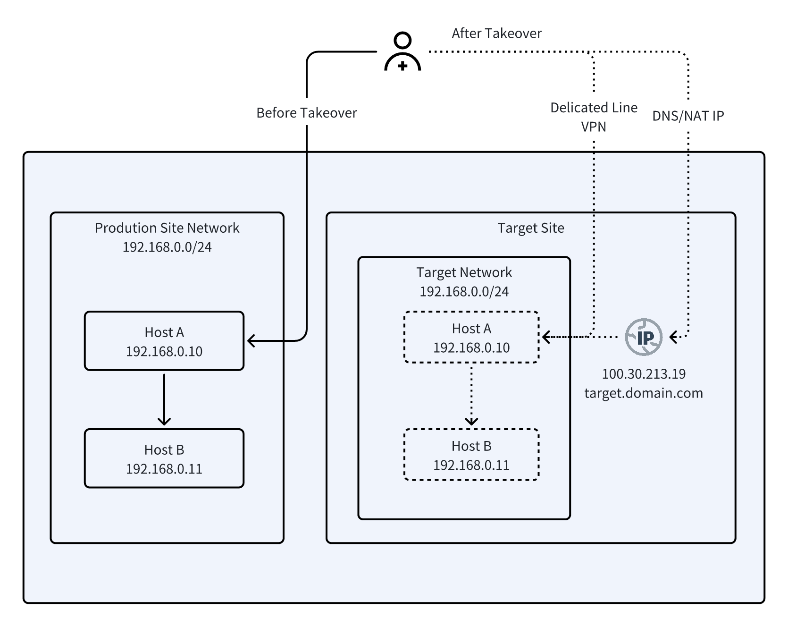
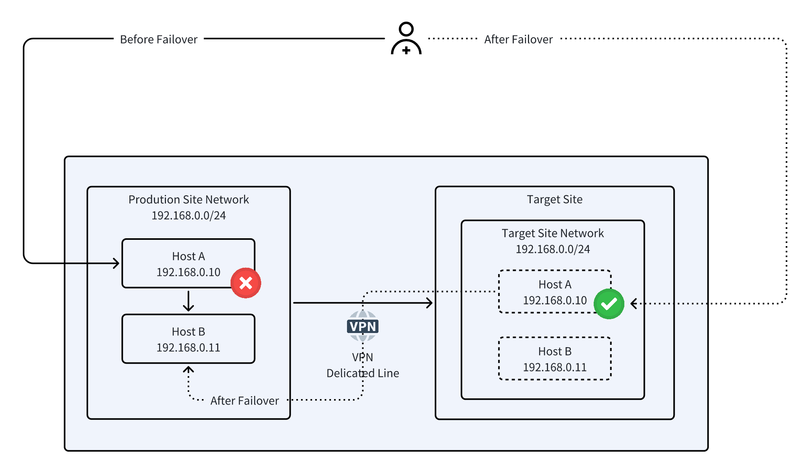
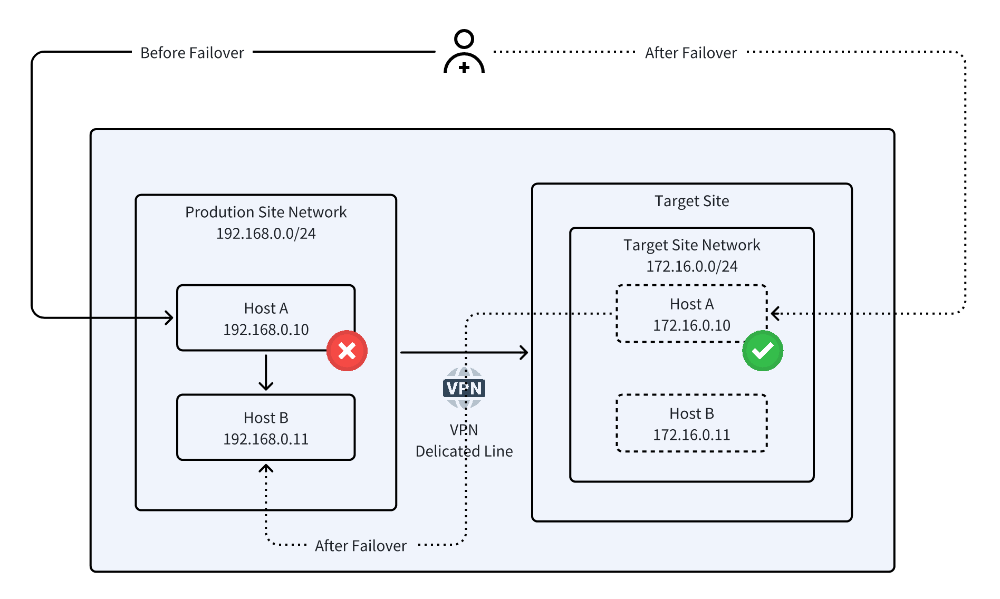
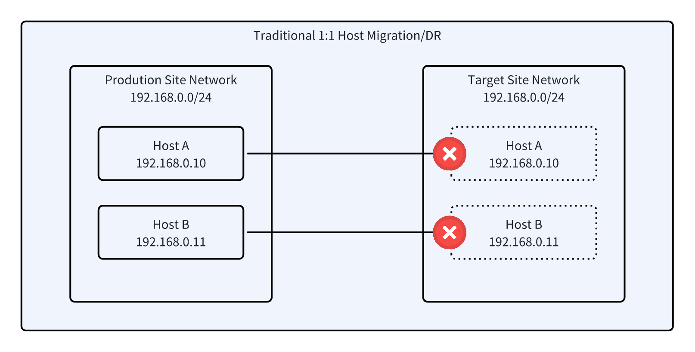
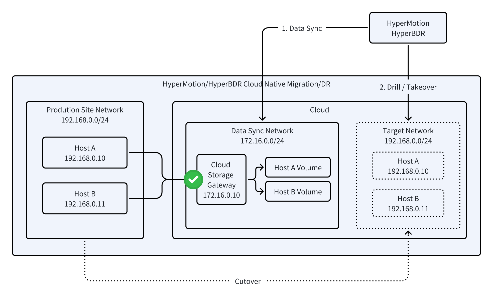

# Migration & DR Network Planning Best Practices

## 1. **Network Planning for Host Migration and Disaster Recovery**

::: warning
Before reading this best practice, we recommend reviewing [Network Planning Overview](../../product-overview/presales/dr-network-planning-recommendations.md) for a better understanding of the overall design.
:::

Network planning is critical for both host migration and disaster recovery, as it impacts implementation complexity, business continuity, and cutover or failover feasibility.

**Common goals:**
* Ensure uninterrupted business operations.
* Simplify user access paths.
* Maintain internal system connectivity.

**Key considerations:**
- User access, internal connectivity, IP strategy, business continuity, testing, and security compliance.

**Differences:**
* **Migration:** Focuses on cutover, requiring the target environment to be ready for smooth, one-time switchover and long-term operation.
* **Disaster Recovery:** Focuses on testing and failover, enabling parallel operation with production and rapid switch-over with smooth fallback.

By combining migration and DR planning, enterprises get a unified framework that highlights shared principles while addressing scenario-specific needs.

## 2. **Network Planning Best Practices**

### **Overview**

This section presents a unified approach to network planning for both host migration and disaster recovery. While the triggers and goals differ slightly—migration focuses on moving systems from the source to the cloud or another data center, whereas disaster recovery emphasizes rapid failover in the backup environment—the core requirements remain the same: IP management, internal connectivity, user access paths, testing, and security compliance.

A single framework covering the three typical scenarios makes planning, comparison, and implementation easier and more consistent.

| **Scenario ID** | **Typical Scenario**                 | **Description**                                                                                                                                                       | **Internal Network**                   | **Need to Access Production Hosts?** | **User Access to Business Network**                                                                                                                               | **Network Complexity** | **Notes / Advantages**                                                                                                                                                                                                                                                       |
| --------------- | ------------------------------------ | --------------------------------------------------------------------------------------------------------------------------------------------------------------------- | -------------------------------------- | ------------------------------------ | ----------------------------------------------------------------------------------------------------------------------------------------------------------------- | ---------------------- | ---------------------------------------------------------------------------------------------------------------------------------------------------------------------------------------------------------------------------------------------------------------------------- |
| Scenario 1      | Full Cloud Migration / Full Takeover | 1. Internal system connectivity remains unchanged, original IPs preserved.&#xA;2\. User access routes updated via DNS/NAT/Delicated Link/VPN to cloud or DR platform. | Same CIDR as production, IPs preserved | No                                   | 1. NAT: IP changes for access.&#xA;2\. DNS: update mappings, considering propagation delay.&#xA;3\. Delicated Link/VPN: users access services without IP changes. | Low                    | Minimal network modifications.&#xA;Advantages: preserves original architecture, low migration/DR risk, strong business continuity, simple implementation.                                                                                                                    |
| Scenario 2      | Partial Cloud / Partial Takeover     | 1. Internal network aligned with production, original IPs preserved.&#xA;2\. User access routes remain unchanged.                                                     | Same CIDR as production, IPs preserved | Yes                                  | Unchanged                                                                                                                                                         | High                   | Complex network setup (requires Layer 2 extension, e.g., VXLAN).&#xA;Advantages: user experience unchanged, high compatibility, migrated/DR hosts can communicate directly with non-migrated hosts.                                                                          |
| Scenario 3      | Partial Cloud / Partial Takeover     | 1. Internal network redesigned, CIDR updated, IPs reassigned.&#xA;2\. User access routes may change.                                                                  | CIDR updated, IPs reassigned           | Yes                                  | User access paths may change                                                                                                                                      | Medium                 | Flexible network design for complex or conflicting address spaces.&#xA;Project complexity: requires cross-team coordination, but simulation reduces risks.&#xA;Advantages: simulation and automation minimize risk, supports long-term architecture upgrades and compliance. |

### **Scenario 1: Full Cloud Migration / Full Takeover (Internal IP Retention)**

#### **Applicable Scenarios**

* On-premises migration or DR takeover (traditional environment → private cloud).
* Migration or takeover from on-premises to public cloud.
* Same-cloud, cross-cloud, or remote DR takeover.

#### **Overview**

* Target hosts retain the same internal IPs as the source, ensuring smooth application migration or rapid takeover with minimal changes.
* External user access paths can be switched flexibly via DNS, NAT, or Direct Link/VPN, ensuring uninterrupted business access.

#### **Key Principles**

1. **Internal IP consistency:** Hosts maintain the same CIDR and IPs as production, ensuring internal connectivity and system dependency compatibility.
2. **Flexible external access:** User access is adjusted through DNS, NAT, or Direct Link/VPN as needed.
3. **Low network complexity:** No major network redesign required; only access paths need configuration.
4. **Controlled business continuity:** Pre-planned and rehearsed access switching minimizes downtime during migration or takeover.

#### **Network Implementation Options**

* **Direct Link / VPN (Recommended):** Connect target platform directly, retain source IPs, business access unaffected.
* **DNS switch:** Update domain resolution to point to target hosts, considering DNS propagation time.
* **NAT mapping:** Map external access addresses to target hosts’ internal IPs for seamless switching.

#### **HyperMotion / HyperBDR Configuration and Usage**

##### **Rehearsal Stage (Migration or DR Drill)**

* **Isolated environment:** Plan the target network using the same subnet as production, preserving internal IPs while fully isolating from the source network to prevent conflicts.
* **IP retention verification:** Enable “Preserve Original IP” and provide access via external NAT for business verification.
* **Validation and cleanup:** After verification, remove test hosts while retaining network configuration for the official cutover.

##### **Official Cutover Stage**

* **Select target network:** Apply the planned network and enable “Preserve Original IP.”
* **Pause services and incremental sync (migration scenario):** Briefly stop source services, complete the final incremental sync, and shut down source hosts.
* **Start target hosts:** Launch hosts from the latest snapshot with original IPs intact.
* **Network switch:** Adjust user access paths (DNS, NAT, or Direct Link/VPN) according to plan to complete the formal network cutover.

#### **Network Architecture**

### **Scenario 2: Partial Cloud Migration / Partial DR (Layer 2 Extension)**

#### **Applicable Scenarios**

* Internal migration or DR takeover within an on-premises data center (traditional environment to private cloud).
* Migration or takeover from on-premises to public cloud.
* Intra-cloud or cross-cloud migration / remote DR takeover.

#### **Scenario Overview**

* Target hosts retain the same CIDR and original IPs after migration or takeover, ensuring internal system compatibility and seamless communication.
* User access paths remain unchanged, maintaining high business continuity and direct access to cloud-hosted systems.

#### **Core Principles**

* **Internal IP consistency:** Target hosts use the same CIDR as production, preserving internal connectivity.
* **Stable external access:** User access requires no changes, providing a consistent experience.
* **High network complexity:** Requires Layer 2 extension or VXLAN setup, dependent on source environment support.
* **Optimal business continuity:** Target hosts can communicate directly with non-migrated hosts, maximizing system compatibility.

#### **Network Solutions**

* **VXLAN tunnels:** Extend Layer 2 across sites or clouds.
* **L2 VPN / MPLS VPLS:** Achieve remote Layer 2 connectivity over WAN.
* **SDN Layer 2 extension:** Dynamically join VLANs to include target hosts in the source broadcast domain.
* **Physical switch VLAN trunk:** Low-latency Layer 2 connectivity in the same provider or data center environment.
* **Cloud-native services:** e.g., AWS Transit VPC, Azure L2 VPN, Huawei Cloud ESW.

#### **HyperMotion / HyperBDR Usage**

##### **Rehearsal Stage (Migration or DR Drill)**

* **Isolated validation:** Plan target network using the same subnets as source while fully isolating from production to avoid conflicts.
* **IP retention verification:** Enable “Preserve Original IP” and validate connectivity via Direct Link/VPN or internal routing.
* **Validation and cleanup:** After rehearsal, remove test hosts but retain network configuration for the official cutover.

##### **Official Cutover Stage**

* **Select target network:** Use the planned network and enable “Preserve Original IP.”
* **Pause business & incremental sync (migration scenario):** Briefly stop target host operations, complete final incremental sync.
* **Start target hosts:** Launch from the latest snapshot, maintaining original IPs.
* **Network verification:** Ensure target hosts can communicate with non-migrated production hosts, with no changes needed for user access paths.

#### Network Architecture

### **Scenario 3: Partial Cloud Migration (Network Redesign)**

#### **Applicable Scenarios**

* Partial cloud migration or DR takeover where the target network conflicts with the source environment or requires re-planning.
* Cloud or remote data centers use new subnets; original IPs cannot be retained.
* User access paths need adjustment or optimization (original direct access unavailable; DNS, NAT, load balancer, or Direct Link/VPN can be used).
* Cross-region or cross-cloud migration/takeover with internal IP conflicts, requiring new IP planning.
* High system compatibility and security requirements necessitate redesigned network and addressing schemes.
* Network implementation constraints prevent rapid full-scale redesign; IP changes enable faster deployment.

#### **Scenario Overview**

* Hosts require new CIDR and IP reassignment after migration or takeover.
* User access paths may change and need adjustment to fit the new network.
* Using simulation environments and HyperMotion/HyperBDR automation ensures safe migration or takeover and controlled business continuity.

#### **Core Principles**

* **Simulation for risk mitigation:** Build an isolated simulation environment on the target platform to validate business logic, data integrity, and connectivity, identifying potential issues in advance.
* **Flexible planning:** Adjust network design and IP allocation based on actual conditions, reducing pre-migration complexity.
* **Cross-team collaboration:** Migration or takeover requires close coordination among application vendors, business units, and network/security teams.
* **Automation support:** HyperMotion/HyperBDR pre/post scripts automatically update host configurations, enabling one-step cutover or takeover and minimizing manual errors.

#### **Network Solutions**

* **IP & CIDR adjustment:** Apply a new addressing plan on the target network.
* **Access path adjustment:** Route user traffic through DNS, NAT, load balancer, or Direct Link/VPN to the new hosts.
* **Simulation validation:** Test business functions and network connectivity in an isolated environment to confirm feasibility.

#### **HyperMotion / HyperBDR Usage**

##### **Rehearsal Stage (Migration or DR Drill)**

* **Isolated validation:** Create an isolated network on the target platform, configure new IPs, and simulate production conditions to avoid conflicts with the source.
* **Access verification:** Validate business connectivity and access paths via DNS, NAT, load balancer, or Direct Link/VPN; record configuration changes and update pre/post scripts.
* **Validation & cleanup:** After rehearsal, remove test hosts but retain network configuration for the official cutover.

##### **Official Cutover Stage**

* **Select target network:** Deploy the planned network with new IP configuration.
* **Pause business & incremental sync (migration scenario):** Temporarily stop source operations during the cutover window and complete the final incremental sync.
* **Start target hosts:** Launch from the latest snapshot, automatically applying IP changes and network switch.
* **Network verification:** Confirm connectivity between target hosts, non-migrated source hosts, and user access paths to ensure business continuity.

#### Network Architecture

## 3. **HyperMotion / HyperBDR Original IP Retention: Principles and Mechanism**

### **Requirements and Pain Points**

Maintaining the original IP during host migration or DR takeover is crucial for smooth business continuity. Key benefits include:

* **Seamless access:** Applications and clients continue using the original IP, avoiding access failures or interruptions caused by IP changes.
* **Compatibility with legacy configurations:** Minimizes changes needed for systems or scripts that rely on hard-coded IPs.
* **Reduced network adjustment complexity:** Security groups, firewalls, and ACLs remain valid, lowering operational risk.
* **Simplified operations integration:** Monitoring, logging, and CMDB tools bound to IPs can be reused without extra synchronization.
* **Smooth migration and fast takeover:** Supports cross-datacenter or cross-cloud migration/DR, enabling rapid switchover and shorter recovery times.

### **Key Technical Requirements for IP Retention**

To ensure target hosts can continue using source IPs while meeting network requirements, the following conditions must be satisfied:

1. **Block-level full host migration**

   * Complete disk-level copy from underlying block storage is required, ensuring full restoration of system and data disks.
   * Internal OS network configurations (static IP, routing, DNS, etc.) must migrate along with the disks to avoid missing network settings after cutover.

2. **Synchronization method and switchover strategy**

   * **Synchronization method:** The target host remains powered off during data sync, receiving data only, preventing IP conflicts between source and target.
   * **Switchover strategy:** During DR drills or takeover, the target host can quickly activate the original IP for seamless business takeover.

**Traditional Migration/DR Approach**

* Data is transferred in a 1:1 manner. During sync or takeover, the target host uses a temporary IP; the original IP is restored only after cutover.
* Drills and official switchover are complex, with high operational difficulty, increasing the risk of network conflicts or business interruption.

**HyperMotion / HyperBDR Data Migration and Takeover**

* **Synchronization Mechanism:** Data is received via the cloud sync gateway, which can use any chosen subnet. The target host remains powered off during data reception to prevent conflicts from simultaneous source and target operation.
* **IP Retention:** During startup, the target network matches the source environment, allowing migrated or takeover hosts to retain their original IPs without additional configuration.
* **Business Safety:** Drills or takeovers do not impact source-side operations, enabling verification of business continuity and system connectivity.
* **Simplified Switchover:** With pre-planning and simulation validation, migration or DR switchover is efficient, controlled, and lowers operational risk.

3.  **Support for Migration and DR Drills**

* **Drill Capability:** Must allow migration or DR drills so users can verify target host availability and IP retention without impacting production systems.
* **Risk Control:** Ensure validation is completed before the official cutover or takeover to minimize migration or DR switchover risks.

## 4. **Summary**

HyperMotion and HyperBDR are cloud-native host migration and disaster recovery solutions, natively designed to support diverse cloud environments and complex network architectures, easily handling cross-data-center, cross-cloud, and remote DR scenarios.

* **Seamless IP Retention:** Hosts can retain their original IPs during migration or takeover, avoiding changes to access paths or internal dependencies; user access and system connectivity remain fully transparent.
* **High Business Continuity:** Supports isolated drills and official cutovers with controlled risk, ensuring no business interruption during migration or takeover.
* **Automation and Control:** Pre- and post-scripts in HyperMotion/HyperBDR automate host configuration adjustments, simplifying cutover or takeover operations and reducing manual errors.
* **Compatibility and Flexibility:** Adapts to various network architectures and cross-VPC or cross-region migrations, allowing both IP retention and safe IP changes in network transformation scenarios.
* **Low Operational Cost:** Security groups, firewalls, ACLs, monitoring, logging, and CMDB tools can be reused directly, significantly reducing operational overhead.

Compared with traditional storage-centric migration or DR solutions:

* Synchronization and cutover operations are complex, often requiring temporary IPs, making drills difficult and error-prone.
* Cloud adaptation is limited, with low efficiency for cross-data-center or cross-cloud migrations and DR takeovers.
* Heavy reliance on skilled operators, with steep learning curves.

In cloud environments, HyperMotion/HyperBDR provides the most efficient migration and DR solution in its class, delivering a **fast, smooth, and transparent** experience, making it the best choice for enterprises to ensure business continuity and DR readiness in the cloud.
