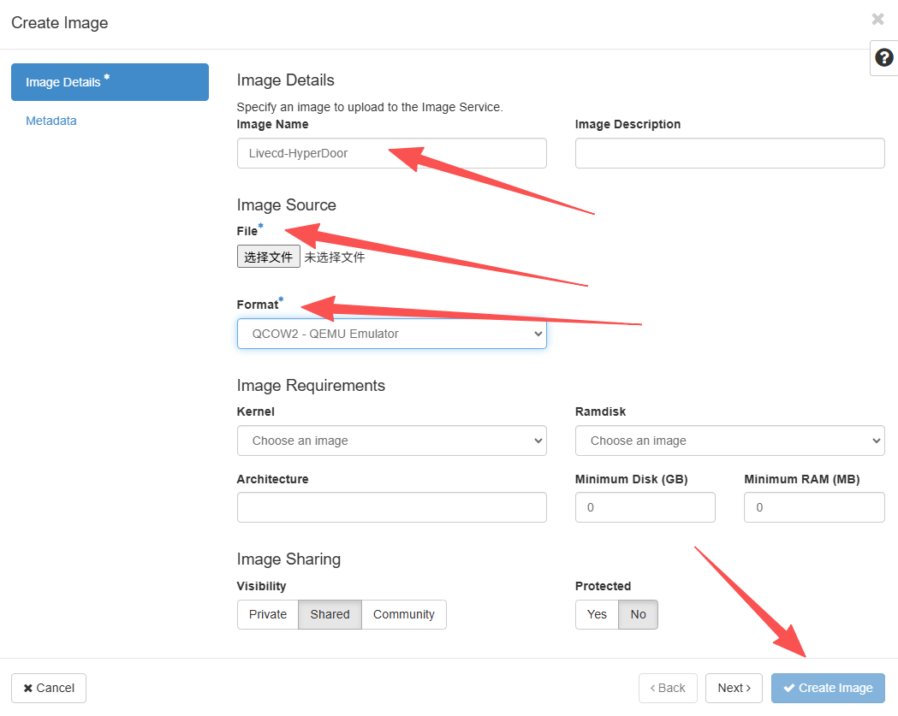
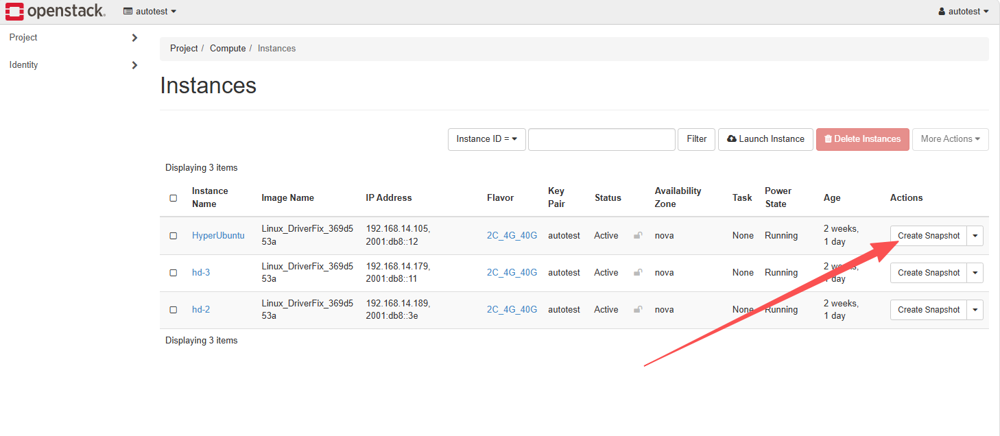
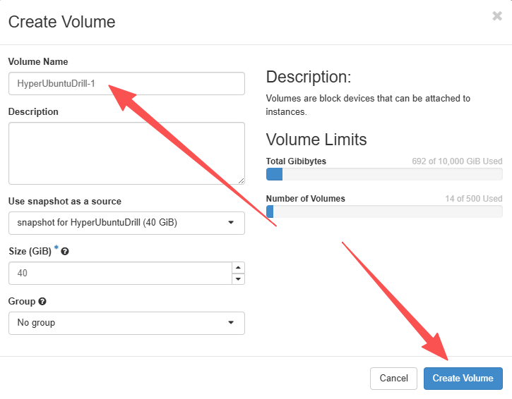
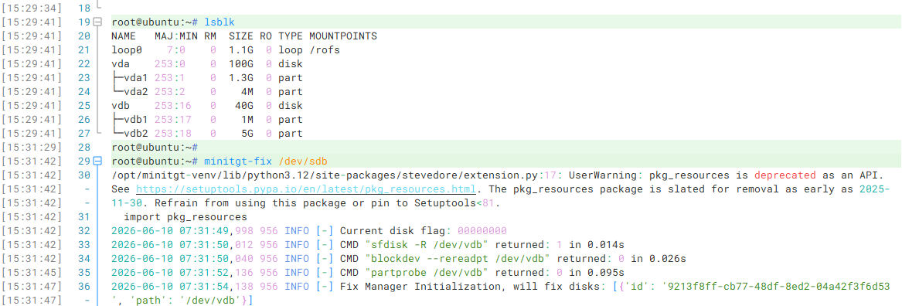
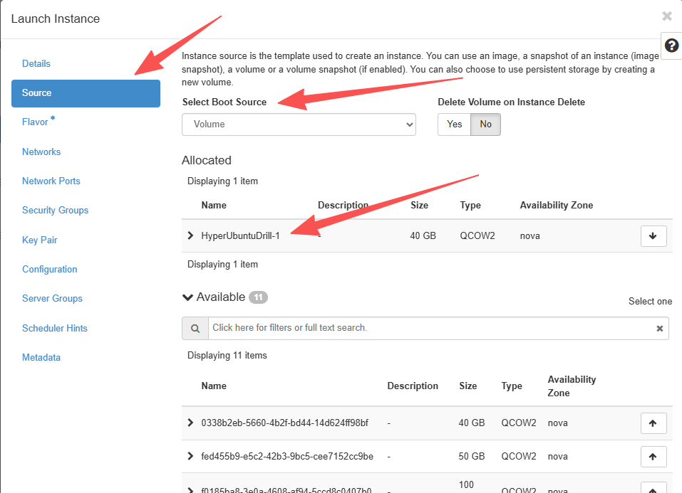

# OpenStack Failback Drill Reference Guide

## Preparatory Work

- Transition host with synchronization completed: HyperUbuntu

- Downloaded transitional host mirroring: Livecd\-HyperDoor\.qcow2

## Overview of OpenStack Drill

## Upload mirroring to OpenStack

Log in to OpenStack, click in sequence to enter Project, Compute, Images, and then click the Create Image button\. 

After entering the pop\-up window page for creating mirroring, fill in the following information: 

Image Name: Livecd\-HyperDoor
Image Source: Select the downloaded mirroring file
Format: Select QCOW2

Then click the Create Image button to complete the mirroring upload\. 

## Copy and synchronize the volume of the transition host upon completion

Locate the HyperUbuntu host and click the Create Snapshot button\. 

Enter HyperUbuntuDrill in the Snapshot Name of the open dialog box, then click the Create Snapshot button\.

At this time, entering Project, Volumes, and Volume Snapshots allows you to view the snapshot list of all volumes on the current host: 

Create all snapshots named snapshot for HyperUbuntuDrill as volume backups:

## Use mirroring to boot a new host 

Enter Project, Compute, Images, find the Livecd\-HyperDoor mirroring, and click the Launch button\. 

Enter a new instance name, select the instance specification, and provide the same network information\. 

Enter the size of Volume Size, which must be larger than the system disk of the HyperUbuntu source end\. 

Click Launch Instance to complete instance creation\.

## Mount the copied volume to the newly booted host

Enter Project, Volumes, Volumes, find the volume created by the snapshot, and mount the volume to the HyperUbuntuDrill instance according to the original host order\. 

## Execute driver repair on the drill host

Log in to the HyperUbuntuDrill host that has just completed booting via the Console or SSH, and execute minitgt\-fix to complete driver repair; 

If UEFI to BIOS conversion is required, please refer to the document: xxx\. 

If WinPE repair is needed, please refer to the document: xxx\. 

Final output `Inject driver for linux successful.` indicates that the driver repair was successful\.

## Start a new instance using the repaired volume 

Delete the HyperUbuntuDrill host, then set the repaired system volume to be bootable\. 

Locate the system volume, then click Edit Volume and check Bootable\. 

Start a new host using the system volume and mount other data volumes to the new host\. 

In the newly launched host Source, set Select Boot Source to Volume, choose the system disk for Allocated, and if there are other data volumes, they can be mounted together\. 

## 