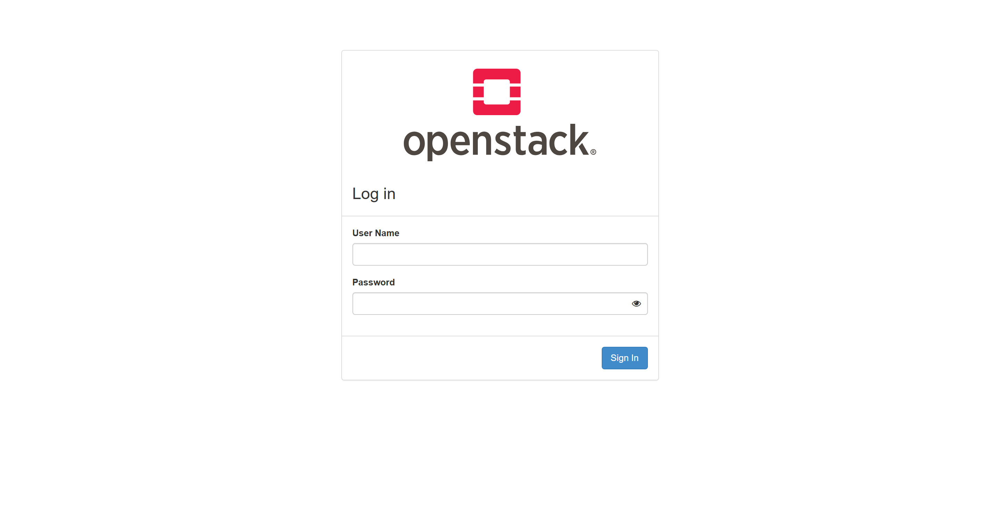
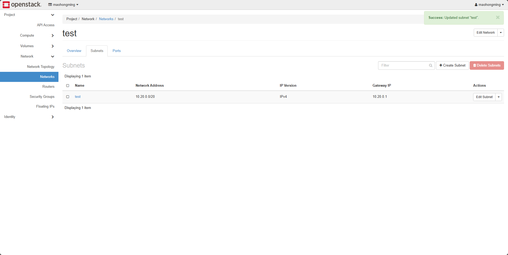

# Configuring OpenStack Subnet DHCP Allocation Pools to Prevent IP Conflicts Causing Boot Host Failures — Best Practice

| Document Version | Applicable Product | Applicable Platform | Document Type |
|------------------|--------------------|----------------------|---------------|
| V1.0 | HyperBDR / HyperMotion | OpenStack | Best Practice |

---

## 1. Overview

When using **HyperBDR / HyperMotion** to recover source hosts to an **OpenStack** platform, HyperBDR/HyperMotion automatically creates a **Transition Host** (a Drill/Recovery instance) on the OpenStack platform. This instance is used to pull backup data, perform block-level incremental synchronization, and finally boot the recovery target host. The IP address of the Transition Host is assigned by the **DHCP service** of the corresponding OpenStack subnet.

When the customer's on-premises source production network is **L2-connected** (e.g., via VXLAN, OVS GRE/VLAN, underlay routing, or carrier leased line) to the OpenStack business network, the IP assigned by OpenStack DHCP **may conflict with IP addresses already in use on the source production network**. IP conflicts will directly cause:

- The Transition Host becomes unreachable, causing the host Drill/Takeover task to fail;
- Real production hosts on the production network may be affected, causing service outages.

**HyperBDR/HyperMotion currently does not support custom IP (custom fixed_ip) for the Transition Host**. To fundamentally avoid IP conflicts, administrators can **proactively adjust the OpenStack subnet DHCP allocation pool** to **exclude IP ranges already used on the production network**.

This document provides the **complete best practice** for the above scenario:

- Scenario background and risk analysis;
- How to configure the OpenStack subnet DHCP allocation pool via the OpenStack Dashboard (Horizon) console;
- Verification steps after implementation;
- Key considerations.

---

## 2. Applicable Scenarios

| Scenario | Applicable? |
|----------|-------------|
| HyperBDR/HyperMotion recovers hosts to OpenStack; source production network and OpenStack business network are L2-connected | ✅ Strongly recommended |
| HyperBDR/HyperMotion recovers hosts to OpenStack; source production network and OpenStack business network are L3-routed | ⚠️ Evaluation recommended |
| HyperBDR/HyperMotion recovers hosts to OpenStack; source production network and OpenStack business network are fully isolated | ❌ Not required |

---

## 3. Risks and Impact

| Risk | Description | Severity |
|------|-------------|----------|
| The Transition Host receives the same IP as a production host | Causes ARP/ND flapping and traffic black-holing | 🔴 High |
| HyperBDR/HyperMotion cannot reach the service ports of the Transition Host | Causes Drill/Takeover task to fail | 🔴 Critical |

---

## 4. Solution

By **re-planning and locking the DHCP allocation pool** on the OpenStack subnet, ensure that IPs assigned to Transition Hosts fall within a **safe range outside the production network's occupied IPs**.

### 4.1 How It Works

By default, OpenStack Neutron creates an `allocation_pool` based on the subnet CIDR and assigns IPs to virtual machines in order from that pool. Neutron **is not aware** of physical production network IP usage, so the administrator must **explicitly exclude**:

- Real host IPs on the production network;
- Production gateway, router interfaces, and virtual IPs (VIPs);
- Reserved ranges used by other systems.

### 4.2 Recommended Implementation Flow

```
1. Inventory the source production network's used IPs
   (switch ARP tables, IPAM, CMDB)
        ↓
2. Plan a DHCP allocation range on OpenStack that does not overlap with production
        ↓
3. Adjust the allocation_pool on the OpenStack subnet
        ↓
4. Verify: create a test VM and inspect the assigned IP
        ↓
5. Run a HyperBDR/HyperMotion Drill/Takeover to validate end-to-end
```

---

## 5. Procedure

### 5.1 Prerequisites

1. Inventory the IP ranges already in use in the source production environment.
2. Confirm with the network/business team:
   - Production gateway IP;
   - Business VIP / load balancer VIP;
   - Planned reserved IP ranges.

### 5.2 Procedure: Configure via OpenStack Dashboard (Horizon)

#### Step 1: Log in to Horizon

Log in to the OpenStack Dashboard with an administrator account.



#### Step 2: Navigate to the Subnet List

Click: **Project → Network → Networks**, find the network used by HyperBDR recovery, and click the **subnet name** attached to that network.


#### Step 3: Edit the Subnet

On the subnet details page, click the **"Edit Subnet"** button at the top right.


#### Step 4: Adjust the Allocation Pools

In the **"Allocation Pools"** section:

- **Delete** the default pool that covers the entire range;
- **Add** two "safe" pools:
  - One near the beginning of the subnet;
  - One near the end of the subnet (recommended for Transition Hosts / use the tail range for easier operations).


Example: assume the HyperBDR recovery subnet is `10.20.0.0/22`, and production used IPs are concentrated in `10.20.0.0 – 10.20.1.255`:

- Safe range 1: `10.20.2.0 – 10.20.2.255`
- Safe range 2: `10.20.3.0 – 10.20.3.254` (reserve `.255` as gateway)
- **DHCP allocation pools**: `10.20.2.0,10.20.2.255` and `10.20.3.0,10.20.3.254`

#### Step 5: Save and Wait for DHCP Reload

Click **"Save"**. Neutron will automatically notify the `neutron-dhcp-agent` (dnsmasq) to reload its configuration.



---

## 6. Verification

### 6.1 OpenStack-Side Verification

1. Create a **test VM** in the subnet (any image, any flavor) and check whether the assigned IP falls within the new safe range.
2. Inside the VM, run `ip addr` and `ip route` to confirm:
   - The assigned IP belongs to the new pool;
   - The default gateway is still the subnet's `gateway_ip`;
   - The gateway is reachable via ping.

### 6.2 End-to-End Verification

1. Log in to the HyperBDR / HyperMotion console.
2. Select any source host and create a **Drill** task.
3. Start the drill and observe:
   - The Transition Host is created successfully;
   - The Transition Host IP falls within the new allocation pool;
   - The Drill task completes successfully.

---

## 7. Considerations

| # | Consideration |
|---|---------------|
| 1 | Modifying the subnet allocation pool is an **online operation**. It does not affect running VMs, but **newly created VMs** will get IPs from the new pool. |
| 2 | The subnet's `gateway_ip` **must not** be inside the allocation pool, otherwise Neutron will refuse to create. |
| 3 | If the customer uses VRRP / Keepalived VIPs, be sure to **explicitly exclude** the VIP IPs from the allocation pool. |
| 4 | After modifying the allocation pool, it is recommended to restart the DHCP agent or reload `neutron-dhcp-agent` on the controller node to avoid dnsmasq caching. |
| 5 | If IPv6 is also used in the same subnet, adjust the IPv6 `allocation_pools` accordingly. |
| 6 | It is recommended to record the source production network's used IPs in an IPAM platform and refresh the OpenStack allocation pool in sync when changes occur. |

---

## 8. Appendix

### 8.1 Glossary

| Term | Description |
|------|-------------|
| Allocation Pool | The IP range within an OpenStack Neutron subnet that is allowed to be assigned to VMs by DHCP |
| Transition Host / 过渡主机 | The intermediate instance used by HyperBDR/HyperMotion to pull backups, perform block-level incremental sync, and boot the target host |

### 8.2 References

- OpenStack Neutron Documentation: <https://docs.openstack.org/neutron/latest/>
- HyperBDR Documentation: <https://docs.oneprocloud.com/>

---

