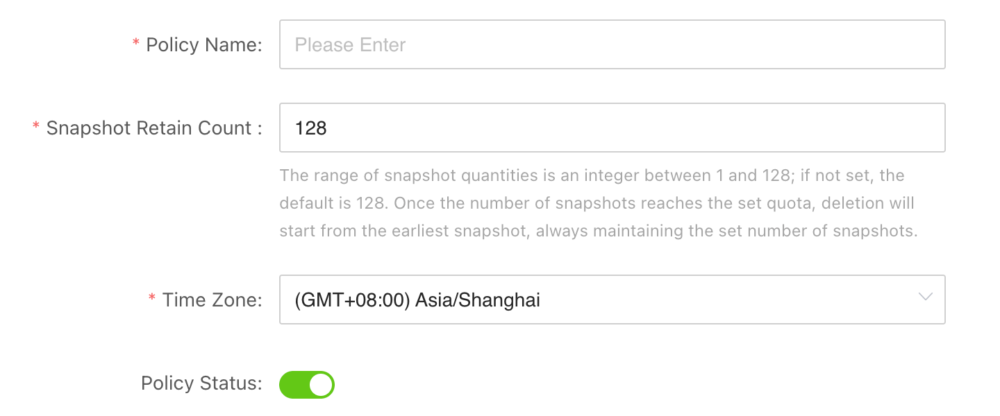
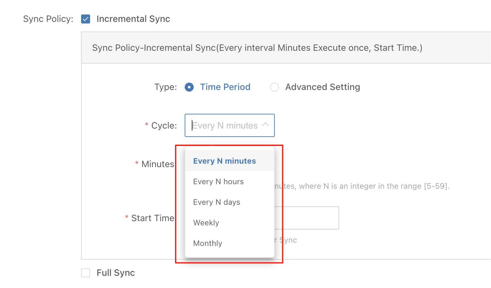
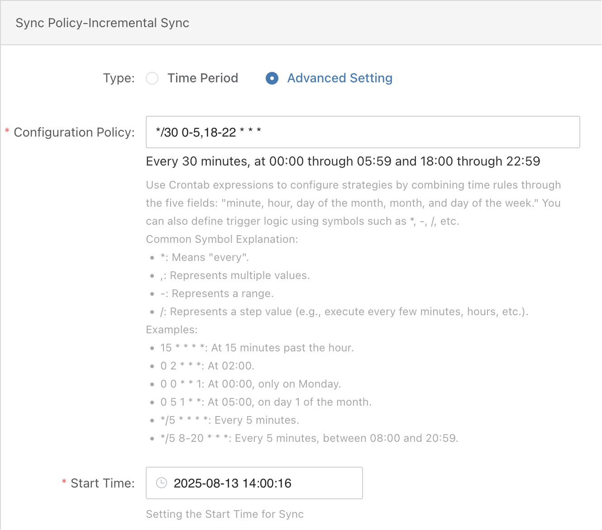
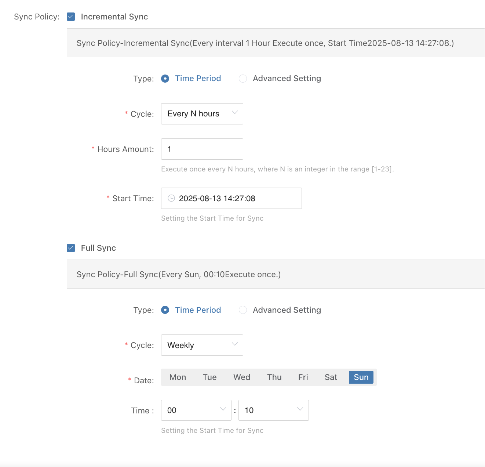
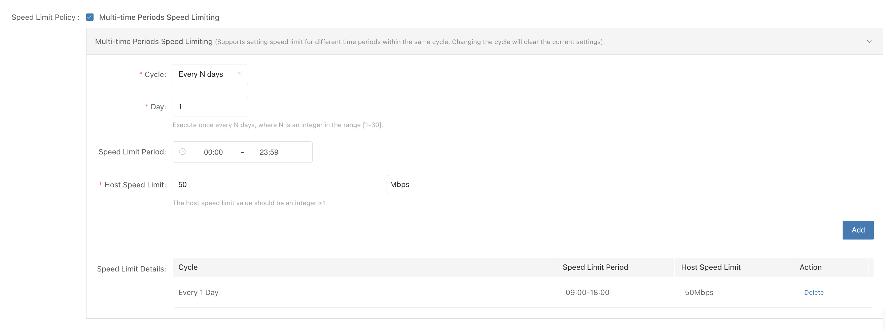
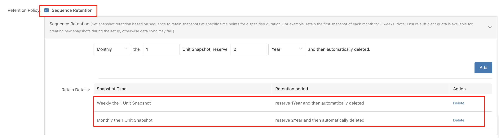
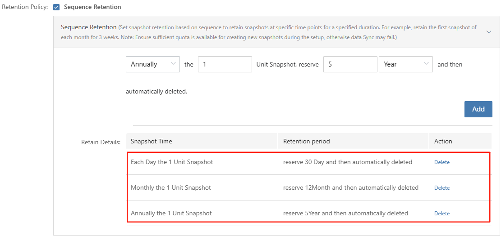

# Policy Management

## Overview

In modern distributed storage and disaster recovery, timely data synchronization and snapshot management are essential for business continuity. HyperBDR is a high-performance solution supporting both block and object storage. Its policy management is designed for flexibility and reliability, meeting the needs of various DR scenarios and multi-host environments.




### Multi-host Policy Binding

HyperBDR lets you assign the same policy to multiple hosts, making it easy to manage data sync and snapshots across different systems. The policy works for both block and object storage, ensuring consistency and simplifying operations.


### Snapshot Limits and Automatic Management

To prevent unlimited storage growth, HyperBDR sets a maximum of **128 snapshots per policy**.

* When the limit is reached, the system automatically deletes the oldest snapshots to free up space.
* If a retention policy is set, the system keeps important snapshots according to your rules and deletes non-retained ones first.
* For block storage, HyperBDR relies on the cloud platform’s native snapshot features. The 128-snapshot limit matches the cloud’s own limits, keeping everything consistent.


### Policy Execution Timezone

Policy schedules follow the timezone of each host. In multi-region deployments, every host runs its policy based on its own local time.

* By default, the system uses your browser’s timezone.
* You can also manually set a specific timezone for a policy to meet cross-region or special scheduling needs.


### Sync Trigger Mechanism

To avoid task pile-up and sync conflicts, HyperBDR uses strict serial execution:

* If a host’s previous sync job is still running, the next scheduled job will wait until it finishes.
* Only when the current job is done and the next scheduled time arrives, a new sync will start.

Set sync intervals based on your data size, source performance, and network bandwidth. Avoid very short intervals to prevent resource bottlenecks.


### Feature Overview

HyperBDR policies support:

* Scheduled incremental sync: regularly sync changed data to reduce data transfer.
* Scheduled full sync: periodically sync all data for complete consistency.
* Bandwidth control: limit sync speed to avoid impacting business networks.
* Snapshot retention: keep important snapshots for compliance or recovery.


## Common Policy Configuration Scenarios

Here are typical ways to set up policies, from simple to advanced, to help you get the most from HyperBDR.


### Fixed-interval Sync

**When to use:**
For businesses with strict RPO (Recovery Point Objective) needs and enough source performance and bandwidth to support frequent syncs.

**How to set up:**

* Use fixed intervals—every few minutes (minimum 5), hourly, daily, weekly, or monthly.
* Set the interval based on your RPO target. Most use minutes or hours.
* Prefer incremental sync to save bandwidth and time.
* Adjust the interval to avoid sync jobs piling up.




### Time-window Sync

**When to use:**
If you want to sync every 30 minutes, but only during off-peak hours (for example, midnight to 6am and 6pm to 11pm).

**How to set up:**

Use crontab-style scheduling to set two time windows for sync jobs:


* 00:00–06:00: sync every 30 minutes
* 18:00–23:00: sync every 30 minutes

```plain text
*/30 0-5,18-22 * * *
```

**Explanation:**

* `*/30`: every 30 minutes
* `0-5,18-22`: hours 0–5 and 18–22
* `* * *`: every day, every month, any weekday




### Alternating Incremental and Full Sync

**When to use:**
If you need hourly incremental syncs, but also want a full sync once a week for complete data integrity.

**How to set up:**

* Create separate policies for incremental and full syncs. For example, run incremental syncs every hour at 27:08, and full syncs every Sunday at 00:10.
* Schedule full syncs before incrementals to avoid overlap. If a previous incremental runs too long, it may block the full sync—monitor job durations and adjust times as needed.



#### Best Practice: Minute-Level Incremental, Monthly Full, and Periodic Drills

In a disaster recovery (DR) solution, incremental synchronization can be performed at a **minute-level**, enabling extremely low RPO during recovery. However, relying solely on incremental updates carries potential risks: long incremental chains, missing differences due to link failures, and accumulated storage fragmentation can all affect data consistency and recoverability.

Industry best practices recommend:

* **Minute-level Incremental** → Ensures continuous data synchronization to meet high availability requirements of production systems.
* **Monthly Full** → Serves as a long-term baseline, regularly calibrating data to mitigate risks from extended incremental chains.
* **Periodic DR Drills** → Validates the effectiveness of the DR system through regular exercises, checking the correctness of full and incremental data and uncovering potential configuration, process, or operational issues.

  * **Key Advantage**: The product’s unique **one-click Boot in Cloud** feature allows DR drills to be executed **without any pre-configuration on the target environment**, enabling high-frequency, low-cost testing in a real environment and effectively ensuring data integrity and DR reliability.

The benefits of this combined strategy include:

1. **Consistency Assurance**: Monthly full synchronization eliminates potential errors accumulated over long incremental periods.
2. **Risk Mitigation**: Even if some incremental data is corrupted, recovery can rely on the full baseline.
3. **Compliance and Audit**: Monthly full points meet regulatory requirements for a complete baseline.
4. **Practical Validation**: One-click drills ensure the DR plan is usable in real scenarios, making data protection not only “designed correctly” but also “reliably executed.”

By adopting a **minute-level incremental + monthly full + one-click periodic drill** strategy, organizations can achieve an optimal balance of **reliability, compliance, and business continuity**, ensuring the long-term availability and trustworthiness of DR sites.

## Bandwidth Limiting

Snapshot sync uses network bandwidth. If not controlled, it can affect business operations during busy times. You can set bandwidth limits per host—once set, all hosts using the policy will follow the limit.


### Tips

* Allow higher sync speeds during off-peak hours to finish jobs quickly.
* Lower sync speeds during business hours to avoid network impact.
* Use time windows to apply limits only when needed.


### Notes

* If the limit is too low, local cache may fill up and block sync jobs.
* Make sure sync frequency is high enough to avoid large cache buildup.


### Example: Limit during business hours, unlimited off-hours

* Set a limit from 09:00 to 18:00 (e.g., 50 Mbps per host).
* No limit outside these hours, so sync jobs finish faster.




## Snapshot Retention

If you don’t set a retention policy, the oldest snapshots are deleted automatically when the limit is reached.

Some industries require keeping certain snapshots for a long time. Use retention rules to protect these important restore points.

Retained snapshots count toward your quota. Make sure you leave enough room for rolling or temporary snapshots.


### Example 1: 128 snapshots total; keep first snapshot of each week for 1 year, and first of each month for 2 years

**Setup:**




**Calculation:**

* Weekly: keep 1 per week for 1 year (about 52–53)
* Monthly: keep 1 per month for 2 years (24)
* Total retained: 76–77
* Remaining quota: about 51–52 for rolling or temporary snapshots


### Example 2: 76 snapshots — fast recovery and long-term retention

**Setup:**

* Hourly snapshots: keep for 24 hours (24 per day, rolling)
* Daily: keep 1 per day for 30 days
* Monthly: keep 1 per month for 12 months
* Annual: keep 1 per year for 5 years



**Calculation:**

* Hourly: 24 (rolling)
* Daily: 30
* Monthly: 12
* Annual: 5
* Overlap: 2 (hourly/daily, monthly/annual)
* Total retained: 69
* Remaining quota: about 7 for rolling or temporary snapshots

**配额占用分析**

* 小时快照：24 份
* 日快照：30 份
* 月快照：12 份
* 年快照：5份
* 重合快照：2 份（小时快照与当日快照 1 份，首月快照与年快照 1 份）
* **固定保留总数：** 69 份（71份 - 2份）
* **剩余可用配额：** 约 7 份，用于日常滚动或临时快照


## Appendix: Crontab Expressions

Crontab expressions use five fields:

```plain text
minute(0-59)   hour(0-23)   day(1-31)   month(1-12)   weekday(0-7, 0 and 7 both mean Sunday)
```

You can combine these fields to set flexible schedules.

**Common symbols:**

| Symbol | Meaning    | Example                                 |
|--------|------------|-----------------------------------------|
| *      | any value  | `* * * * *` → every minute              |
| ,      | list       | `0 9,18 * * *` → at 09:00 and 18:00     |
| -      | range      | `0 8-20 * * *` → every hour 08:00–20:00 |
| /      | step       | `*/5 * * * *` → every 5 minutes         |

**Examples:**

| Expression         | Description                                               |
|-------------------|-----------------------------------------------------------|
| 15 * * * *         | At minute 15 every hour (e.g., 08:15, 09:15)              |
| 0 2 * * *          | At 02:00 every day                                        |
| 0 0 * * 1          | At 00:00 every Monday                                     |
| 0 5 1 * *          | At 05:00 on the 1st of every month                        |
| */5 * * * *        | Every 5 minutes                                           |
| */5 8-20 * * *     | Every 5 minutes between 08:00 and 20:59                   |
| */31 8-20 * * *    | At minute 0 and 31 of each hour between 08:00 and 20:59   |
| 0 0 1 1 *          | At 00:00 on January 1st                                   |
| 0 0-6/2 * * *      | Every 2 hours from 00:00 to 06:00 (00:00, 02:00, 04:00, 06:00) |

**Special case: `*/31 * * * *`**

* Minute: `*/31` means minute 0 and 31 of each hour.
* Other fields are unrestricted.

**Actual times:**

```plain text
00:00, 00:31
01:00, 01:31
...
20:00, 20:31
```

Note: This is not a strict "every 31 minutes" interval—it triggers at minute 0 and 31 of each hour.


