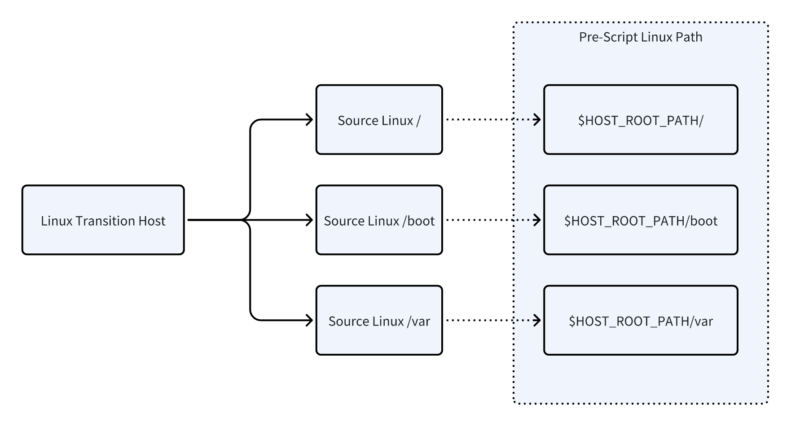
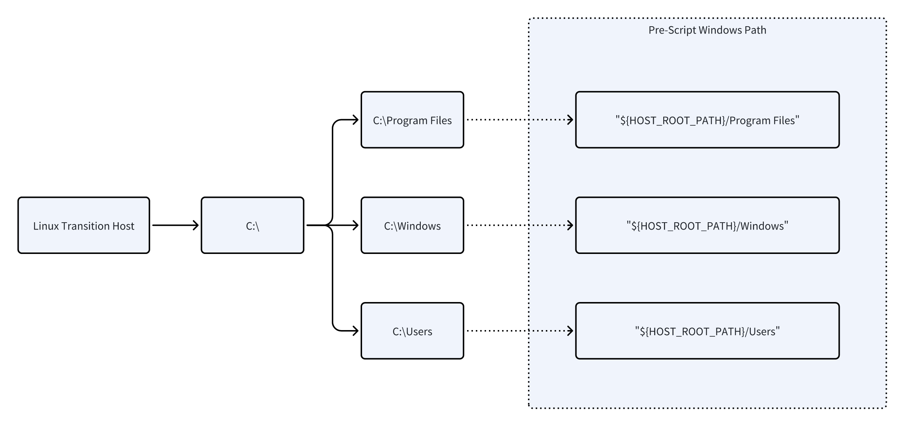

# **Pre & Post Scripts Best Practices**

## **Version Note**

We recommend upgrading to v6.7.0 or later.

## **Why Use Pre-Scripts and Post-Scripts**

In disaster recovery scenarios, different business systems often have varying operating environments and configurations. To maximize both **generality and flexibility** during recovery and quickly restore business operations, HyperMotion / HyperBDR provides advanced settings in the host startup functionality, allowing users to configure **pre-scripts** and **post-scripts**:

* **Pre-scripts**: Execute before host startup by mounting disks for offline modifications. These are ideal for pre-configuration tasks that don't depend on system runtime status, such as batch replacement of configuration files, boot parameter adjustments, initialization file creation, etc. They ensure the system can complete bootstrapping and reach the login interface.

* **Post-scripts**: Execute after system startup completion, leveraging the full operating system and network environment. These are suitable for runtime initialization tasks that require real-time interaction, such as starting critical services, registering business components, loading database initial data, etc.

This pre/post-script design approach enables disaster recovery processes to achieve both **generalized rapid recovery** and **flexible configuration capabilities for business-specific differences**, thereby reducing recovery time (RTO) and minimizing switching risks.

## **Functionality and Operating Principles**

### **1. Pre-Scripts**

* **Execution Timing**
  Executed in the final stage of driver adaptation, before host startup.

* **Execution Environment**

  * Runs on a **temporary transition host**, with the operating system version depending on the product version (e.g., Ubuntu 20.04 / Ubuntu 24.04, with potential future upgrades).

  * Scripts must be **Linux Bash** scripts.

  * **AWS Platform Specifics**:

    * Linux target hosts → executed on Linux transition hosts.

    * Windows target hosts → executed on Windows Server 2019 transition hosts, with scripts requiring `.bat` file format.

* **Working Principle**

  * The transition host mounts user disks related to startup.

  * Scripts can directly edit files on the mounted disk, primarily system/boot files.

* **Scope of Use**

  * Pre-scripts should only be used for boot-related configuration changes.

  * For data disk modifications or runtime-dependent tasks, use post-scripts instead.

* **Limitations**

  * Maximum script length: **4096 characters**.

#### **1.1 Linux Path Mapping**

In scripts, use **$HOST_ROOT_PATH** to reference the target system root partition.



#### **1.2 Windows Path Mapping**

In Windows pre-scripts, use **%HOST_ROOT_PATH%** to reference the target boot drive (typically C:).



On AWS, use a Windows transition host for driver fixes on Windows targets.


### **2. Post-Scripts**

* **Execution Timing**: Automatically runs after the operating system completes startup.

* **Execution Environment**:

  * Linux targets → Bash scripts.
  * Windows targets → .bat scripts.

* **Working Principle**:

  * Executes after the system is operational and can perform system-level tasks.

  * Typical applications:

    * Start or stop services
    * Update configuration files
    * Add Windows registry entries
    * Insert database records

  * Execution behavior:

    * Linux: post-scripts run once and are removed after execution.
    * Windows: post-scripts run once and remain on disk for debugging; they will not run again automatically.

* **Script Locations**:

  * Linux: `/root/.post_script`
  * Windows: `C:\Program Files\Guestfs\Firstboot.Scripts`

* **Limitations**:

  * Maximum script length: **4096 characters**.

## **Best Practices and Debugging Tips**

### **Pre-Script Guidelines**

* Only modify boot/system disk configuration. Avoid complex operations on data disks.
* Keep scripts concise and reliable to ensure successful driver adaptation completion.
* Use `$HOST_ROOT_PATH` (Linux) or `%HOST_ROOT_PATH%` (Windows) to reference the target root, improving portability.
* Pre-script output is not directly displayed in the console UI. Retrieve logs from the transition host or download logs from the platform. Log file locations vary by cloud provider.

#### **Checking Results (Generation-2 Engine)**

```plain text
Search the log /opt/installer/production/logs/mistral/mistral-server.log for:
---Execute user pre scripts---

Below that line, the pre-script content provided by the user will appear, for example:
2025-08-14 17:54:53,496 21096 INFO [-] ---Execute user pre scripts---
+ echo before_pre
```

| Platform Name                            | Chinese Name (Translated)             | Engine Generation | Supported Storage Types                      |
| ---------------------------------------- | ----------------------------------- | ---------------- | -------------------------------------------- |
| Alibaba Cloud Apsara Stack(v3.16.x)      | Alibaba Cloud Private Cloud (v3.16.x) | v2               | Block Storage                                |
| Alibaba Cloud Apsara Stack(v3.18.x)      | Alibaba Cloud Private Cloud (v3.18.x) | v2               | Block Storage                                |
| AWS China(SDK v1.34.93)                  | AWS China                            | v2               | Block Storage; Object Storage                |
| AWS(SDK v1.34.93)                        | AWS                                  | v2               | Block Storage; Object Storage                |
| ctyun JC                                 | China Telecom Joint Cloud            | v2               | Object Storage                               |
| eSurfingCloud4.0                         | China Telecom Cloud 4.0              | v2               | Block Storage                                |
| FiXo Cloud BS                            | FiXo Cloud BS                        | v2               | Block Storage                                |
| FusionCompute(v8.6.x)                    | FusionCompute                        | v2               | Object Storage                               |
| Google Cloud(SDK v1.19.0)                | Google Cloud                         | v2               | Block Storage                                |
| GridCloud                                | Green Energy Cloud                    | v2               | Block Storage                                |
| Huawei Cloud Stack Online(v23.3)         | Huawei Cloud HCS Online               | v2               | Block Storage; Object Storage                |
| Huawei Cloud(Recommended, SDK v3.1.86)   | Huawei Cloud (Recommended, SDK v3.1.86) | v2             | Block Storage; Object Storage                |
| Microsoft Azure(SDK v30.3)               | Microsoft Azure                       | v2               | Block Storage                                |
| Open Telekom Cloud(SDK v3.1.86)          | Open Telekom Cloud                     | v2               | Block Storage; Object Storage                |
| Oracle Cloud(SDK v2.126.3)               | Oracle Cloud                           | v2               | Block Storage                                |
| SMTX OS(v6.x.x)                          | SMTX OS                                | v2               | Block Storage                                |
| Tencent Cloud                            | Tencent Cloud                          | v2               | Object Storage                               |
| Tencent Cloud Enterprise                 | Tencent Cloud Enterprise Edition       | v2               | Block Storage; Object Storage                |
| UCloudStack                              | UCloudStack                            | v2               | Block Storage                                |
| Volcengine                               | Volcengine                             | v2               | Object Storage                               |
| XHERE(NeutonOS_3.x)                      | XHERE (NeutonOS_3.x)                   | v2               | Block Storage; Object Storage                |

#### **Checking Results (Generation-1 Engine)**

```plain text
Search the log /opt/installer/production/logs/unicloud/unicloud-engine.log for:
---Execute user pre scripts---

Below that line, the pre-script content provided by the user will appear, for example:
2025-08-14 17:54:53,496 21096 INFO [-] ---Execute user pre scripts---
+ echo before_pre
```

| Platform Name                            | Chinese Name (Translated)                  | Engine Generation | Supported Storage Types                      |
| ---------------------------------------- | ---------------------------------------- | ---------------- | -------------------------------------------- |
| Alibaba Cloud                            | Alibaba Cloud                              | v1               | Block Storage; Object Storage                |
| Alibaba Cloud Apsara Stack(v3.16.x)      | Alibaba Cloud Private Cloud (v3.16.x)     | v1               | Object Storage                               |
| Alibaba Cloud Apsara Stack(v3.18.x)      | Alibaba Cloud Private Cloud (v3.18.x)     | v1               | Object Storage                               |
| ecloud                                   | China Mobile Cloud                          | v1               | Block Storage; Object Storage                |
| ecloud JC                                | China Mobile Joint Cloud                    | v1               | Block Storage                                |
| GDS                                      | GDS Local Data Center Cloud                  | v1               | Object Storage                               |
| Huawei Cloud Stack(HCS)(v8.2.x / v8.3.x) | Huawei Cloud Stack (HCS)(v8.2.x / v8.3.x)  | v1               | Block Storage                                |
| Jinshan Cloud                            | Kingsoft Cloud                               | v1               | Block Storage                                |
| OpenStackCommunity(Juno+)                | OpenStack Community Version (Juno+)         | v1               | Block Storage; Object Storage                |
| QingCloud                                | QingCloud                                    | v1               | Block Storage                                |
| Tencent Cloud                            | Tencent Cloud                                | v1               | Block Storage                                |
| Tencent Cloud TStack Enterprise          | Tencent Cloud TStack Enterprise Edition     | v1               | Block Storage                                |
| Tencent Cloud TStack Ultimate            | Tencent Cloud TStack Ultimate Edition       | v1               | Block Storage                                |
| TM CAE                                   | TM CAE                                      | v1               | Block Storage; Object Storage                |
| VMware                                   | VMware                                      | v1               | Object Storage                               |
| ZStack(v4.x.x)                           | ZStack(v4.x.x)                              | v1               | Block Storage                                |

### **Post-Script Best Practices**

* Use post-scripts for tasks that must run after startup, such as:

  * Start/stop services
  * Initialize databases
  * Update running system configuration

* Post-scripts can depend on system runtime. Ensure scripts are idempotent (safe to run multiple times) to avoid issues.

* For changes that depend on NICs, services, or boot order, add waiting logic (check service/NIC availability) to reduce errors. Validate scripts on a target platform before use.

**How to check readiness/execution:**

* Check post-script execution (generation-2 engine)

```plain text
Search the log /opt/installer/production/logs/mistral/mistral-server.log for:
----Install post scripts service---
```

Supported cloud platforms and storage types are the same as listed for pre-scripts.

* Check post-script execution (generation-1 engine)

```plain text
Search the log /opt/installer/production/logs/unicloud/unicloud-engine.log for:
----Install post scripts service---
```

Supported cloud platforms and storage types are the same as listed for pre-scripts.

#### **Viewing Execution Output**

* We recommend redirecting stdout and stderr to files within your post-script for easier inspection.

## **Common Usage Examples**

### **1. Pre-Script Examples**

#### **Example: Allow Root SSH Login and Disable SELinux**

```bash
# Modify SSH configuration
sed -i 's/^#PermitRootLogin.*/PermitRootLogin yes/' $HOST_ROOT_PATH/etc/ssh/sshd_config
# Disable SELinux
sed -i 's/^SELINUX=.*/SELINUX=disabled/' $HOST_ROOT_PATH/etc/selinux/config
```

#### **Example: Remove crashkernel=auto for Oracle 6 in KVM and Rebuild grub.cfg**

```bash
set -e
# 1. Edit grub default and remove the field
GRUB_FILE="$HOST_ROOT_PATH/etc/default/grub"
if [ -f "$GRUB_FILE" ]; then
    echo "[INFO] Modifying $GRUB_FILE ..."
    sed -i 's/\s*crashkernel=auto//g' "$GRUB_FILE"
else
    echo "[ERROR] $GRUB_FILE not found"
    exit 1
fi

# 2. Bind necessary system directories for chroot
for dir in dev proc sys run; do
    mount --bind /$dir $HOST_ROOT_PATH/$dir
done

# 3. Detect BIOS or UEFI
if [ -d "$HOST_ROOT_PATH/boot/efi/EFI" ]; then
    echo "[INFO] UEFI detected..."
    chroot "$HOST_ROOT_PATH" /usr/sbin/grub2-mkconfig -o /boot/efi/EFI/redhat/grub.cfg
else
    echo "[INFO] BIOS detected..."
    chroot "$HOST_ROOT_PATH" /usr/sbin/grub2-mkconfig -o /boot/grub2/grub.cfg
fi

# 4. Unmount bound directories
for dir in sys proc dev run; do
    umount $HOST_ROOT_PATH/$dir
done

echo "[INFO] Modification complete."
```

#### **Example: Add a File on Windows**

```batch
:: Create readme.txt in system drive root
echo This system has been pre-configured. >> %HOST_ROOT_PATH%\readme.txt
```

#### **Example: Install a Kernel and Set it as Default on Linux**

**Scenario**: A VM migrated from Azure to AWS needs a generic kernel because the Azure kernel lacks AWS ENA driver.

```bash
ROOT=$HOST_ROOT_PATH

mount --bind /dev $ROOT/dev
mount --bind /sys $ROOT/sys
mount --bind /proc $ROOT/proc
mount --bind /run $ROOT/run

cat <<EOF > /tmp/change-kernel.sh
DEFGRUB=/etc/default/grub
KERNEL=5.15.0-139-generic

apt update
apt install -y linux-image-\$KERNEL

sed -i 's/GRUB_TIMEOUT_STYLE=hidden/GRUB_TIMEOUT_STYLE=menu/g' \$DEFGRUB
sed -i 's/GRUB_TIMEOUT=0/GRUB_TIMEOUT=10/g' \$DEFGRUB
sed -i "s/GRUB_DEFAULT=0/GRUB_DEFAULT=\\\"Advanced options for Ubuntu>Ubuntu, with Linux \\\$KERNEL\\\"/g" \$DEFGRUB

update-grub

exit
EOF

cp /tmp/change-kernel.sh $ROOT/tmp/change-kernel.sh
chroot $ROOT /bin/bash -x /tmp/change-kernel.sh

umount $ROOT/dev $ROOT/sys $ROOT/proc $ROOT/run
```

#### **Example: Remove Problematic Drivers Before Windows Failover**

**Scenario**: A VMware Windows 2016 source contains problematic drivers that cause a blue screen on the target—remove them in a pre-script.

```batch
reged -L -e ${HOST_ROOT_PATH}/Windows/System32/config/SYSTEM << EOF 
 cd \DriverDatabase\DeviceIds\PCI 
 rdel VEN_1AF4&DEV_1001 
 rdel VEN_1AF4&DEV_1042 
 rdel VEN_1AF4&DEV_1001&SUBSYS_00021AF4&REV_00 
 rdel VEN_1AF4&DEV_1042&SUBSYS_11001AF4&REV_01 
 rdel VEN_1AF4&DEV_1004 
 rdel VEN_1AF4&DEV_1048 
 rdel VEN_1AF4&DEV_1004&SUBSYS_00081AF4&REV_00 
 rdel VEN_1AF4&DEV_1048&SUBSYS_11001AF4&REV_01 
 q 
 EOF
```

### **2. Post-Script Examples**

#### **Example: Linux — Wait for Network, Start Services and Initialize Database**

```bash
#!/bin/bash
# Wait for network connectivity
until ping -c 1 8.8.8.8 &> /dev/null; do
    echo "Waiting for network..."
    sleep 3
done

# Start nginx service
systemctl start nginx

# Initialize MySQL (assumes root has no password)
mysql -uroot -e "CREATE DATABASE IF NOT EXISTS myapp; \
    CREATE USER 'myuser'@'%' IDENTIFIED BY 'mypassword'; \
    GRANT ALL PRIVILEGES ON myapp.* TO 'myuser'@'%'; \
    FLUSH PRIVILEGES;"
```

#### **Example: Windows — Delayed Start and Add Registry Key**

```batch
@echo off
:: Wait 30 seconds for system services to start
timeout /t 30 /nobreak

:: Start IIS service
net start W3SVC

:: Add registry key example
reg add "HKLM\SOFTWARE\MyApp" /v InstallDate /t REG_SZ /d "%date%" /f
```

#### **Example: Windows — Set Custom DNS After Boot**

**Scenario**: After migrating to Huawei Cloud, configure DNS on Windows 2016.

```batch
@echo off
setlocal enabledelayedexpansion
for /f "tokens=2 delims==" %%a in ('wmic nic where "NetEnabled=True" get NetConnectionID /value^|findstr .') do (
    set "ADAPTER_NAME=%%a"
    goto :configdns
)
timeout /t 600 /nobreak>nul
echo No active network adapter detected
exit /b
:configdns
netsh interface ip set dns name="%ADAPTER_NAME%" static 100.120.0.15 primary validate=no
netsh interface ip add dns name="%ADAPTER_NAME%" addr=172.24.206.130 index=2 validate=no
netsh interface ip add dns name="%ADAPTER_NAME%" addr=172.24.206.131 index=3 validate=no
```

#### **Example: Windows — Set Static IP and DNS on VMware→HCS Windows 2022**

```batch
@echo off
setlocal enabledelayedexpansion

:retry
for /f "tokens=2 delims==" %%a in ('wmic nic where "NetEnabled=True" get InterfaceIndex /value^|findstr .') do (
    set "INTERFACE_INDEX=%%a"
    set "INTERFACE_INDEX=!INTERFACE_INDEX:~0,-1!"
    netsh interface set interface name=!INTERFACE_INDEX! admin=enable
    goto :configdns
)
timeout /t 5 /nobreak >nul
goto retry

:configdns
netsh interface ip set address name=!INTERFACE_INDEX! source=static addr=10.1.178.113 mask=255.255.255.0 gateway=10.1.178.254
netsh interface ip set dns name=!INTERFACE_INDEX! static 10.1.206.37 primary validate=no
netsh interface ip add dns name=!INTERFACE_INDEX! addr=10.1.224.66 index=2 validate=no
exit /b
```