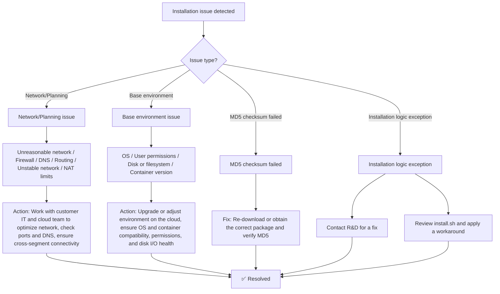
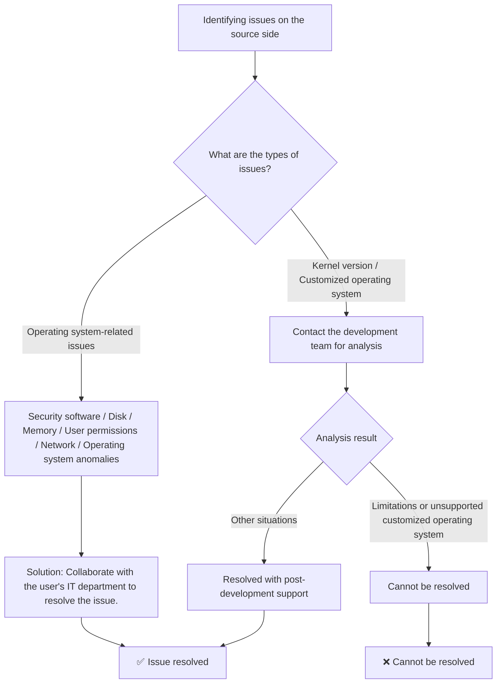
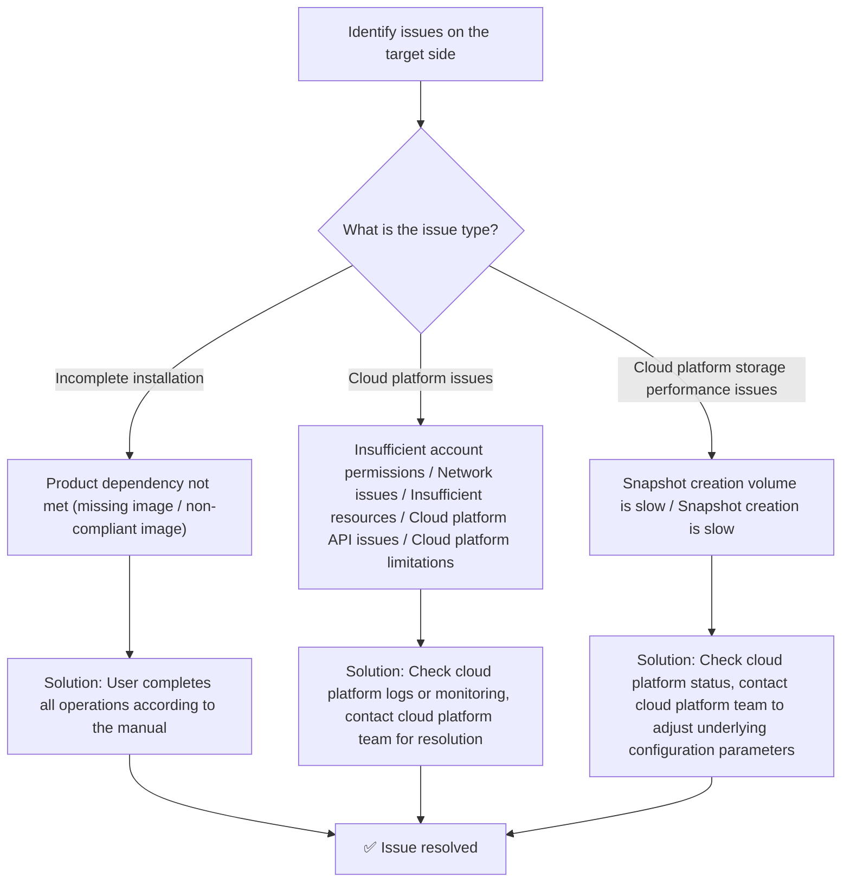
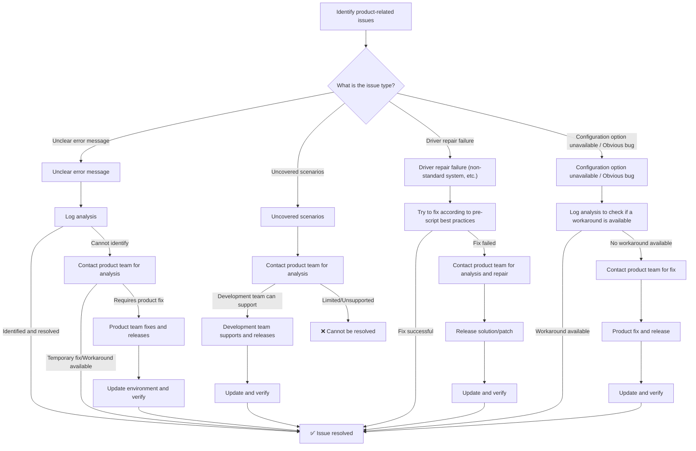
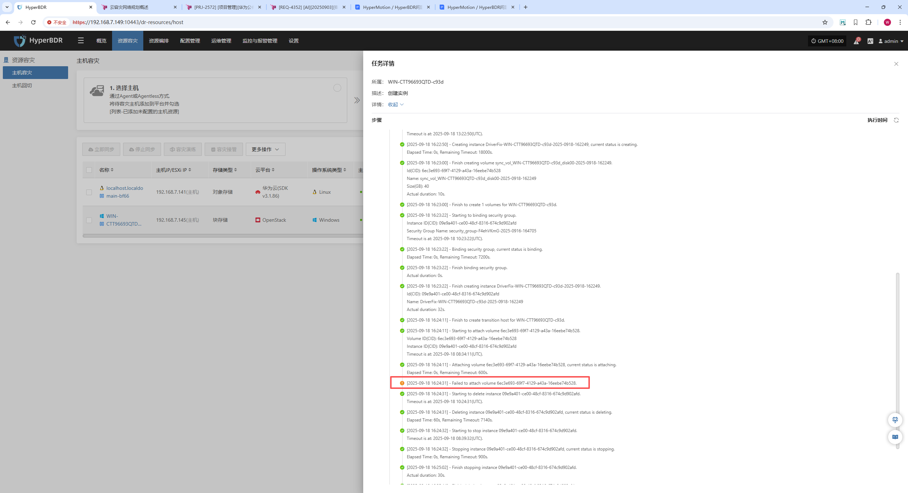
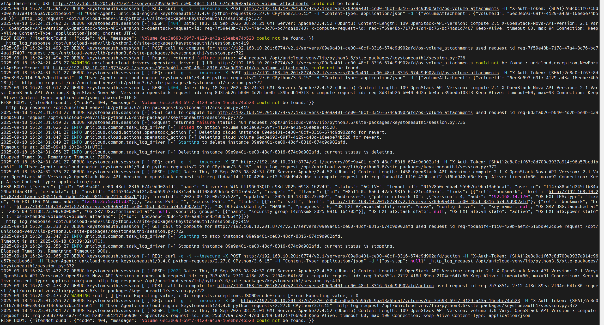
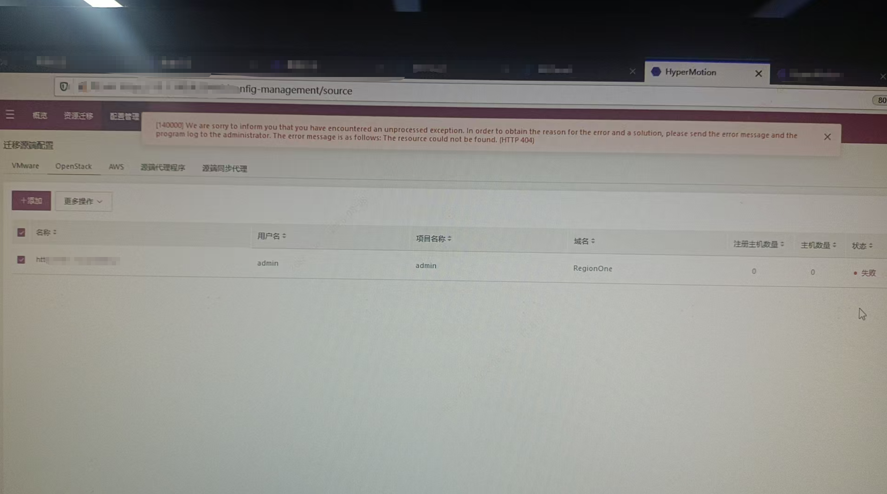
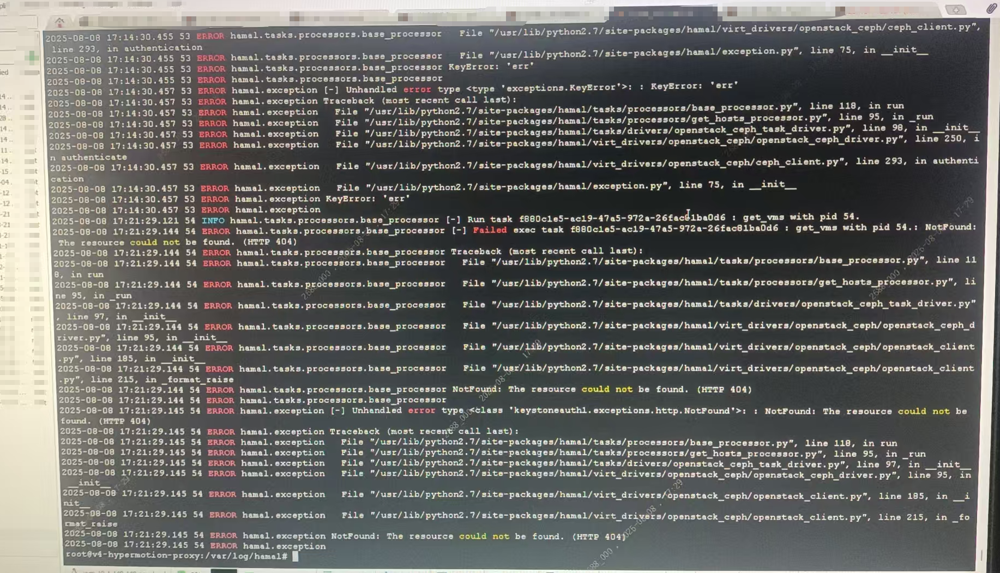

# Troubleshooting

## 1. Overview

This document is for product operations engineers with basic system O&M experience. It provides best practices for diagnosing common issues through product log analysis. With effective log analysis, engineers can quickly locate and resolve exceptions in production, reduce mean time to repair, and improve system stability and business continuity.

Operational issues typically fall into three areas:

* **Source-side issues**
  These are related to the configuration or runtime state of the source environment. Common cases: incorrect auth endpoint, wrong credentials, unreachable or restricted network. By analyzing logs, you can quickly find the root cause and adjust the source environment to restore normal operations.

* **Target-side issues**
  These relate to the state of the target cloud platform or its APIs. Typical exceptions: misconfigured auth, poor network planning, or insufficient resource quotas. Log analysis helps you detect such problems early so migration or DR tasks can proceed after adjustments.

* **Product issues**
  These are tied to the product services themselves or functional defects in specific scenarios. Usual actions include restarting services identified by logs or, if a product defect is confirmed, escalating to R&D for a fix.

A systematic log analysis process helps you quickly distinguish environment-caused issues from product issues, and provides data to guide optimization and iteration. In practice, log analysis is not only a troubleshooting tool—it is essential to stable operations.

## 2. System Architecture

[View details](../om-guide/system-architecture/system-architecture.md)

### Module-to-Log Mapping

| Category | Module Name | Internal Module | Description |
| -------- | ----------- | ---------------- | ----------- |
| Production Site Client | Linux Agent | egisplus-agent | Client module for full lifecycle management of source hosts. |
|  | Windows Agent | Windows Agent | Client module for full lifecycle management of source hosts. |
|  | Sync Proxy | hamal | Agentless client that communicates with nearby virtualization and storage layers, and manages the lifecycle of source virtualization/cloud platforms. |
| Target Platform Client | 3rd Gen Cloud Sync Gateway | s3block | Gateway manager. Writes data directly to target block storage using a user-mode protocol. |
|  | Driver Repair | minitgt | Core program for driver injection and pre/post script execution across OS versions. |
| Production Site Management | Client Registration | proxy | Registration and management of production site nodes. |
|  | Task Management | oneway | Task management for production site nodes. |
| Target Platform Orchestration | Storage Controller | storplus | Software-defined storage controller abstraction that virtualizes cloud block and object storage. |
|  | Object Storage Gateway (Gen 2) | atomy-obstor | Object storage management service. |
|  | Cloud Orchestration | unicloud | Controls host boot processes. |
|  | Cloud Workflow Orchestration | atomy-unicloud | Workflow-engine–based orchestration driver (v2/v3). |
|  | Workflow Engine | mistral | Template-based workflow engine. |
| Control Layer | Migration/DR Scheduler | porter | Lifecycle management for migration, DR, and failback tasks. |
|  | Resource Group Orchestration | ant | Resource group orchestration service. |
|  | Policy Scheduler | crab | Policy management and scheduled task trigger. |
| Operations | O&M Management | owl | Monitoring, alerting, reporting, upgrade, and log collection. |
| UI | User Portal | newmuse | Self-service user interface. |
|  | Admin Portal | supervisor | Administrator management portal. |

### Log Access

| **Category** | **Module Name** | **Internal Module Name** | **Description** |
|---------------|----------------|---------------------------|-----------------|
| **Production Site Client** | Linux Agent | egisplus-agent | Linux Agent client module, responsible for full lifecycle management of source hosts. |
|  | Windows Agent | Windows Agent | Windows Agent client module, responsible for full lifecycle management of source hosts. |
|  | Sync Proxy | hamal | Agentless client module. Handles communication with nearby virtualization and storage layers, and manages the full lifecycle of source virtualization platforms and cloud platforms. |
| **Target Platform** | 3rd Gen Cloud Sync Gateway | s3block | 3rd generation cloud sync gateway program. Uses user-mode protocol to write data directly into target block storage. |
|  | Driver Repair | minitgt | Core driver repair program. Used for driver injection and pre/post script execution across different OS versions. |
| **Production Site Management Services** | Client Registration Management | proxy | Handles registration and management of production site nodes. |
|  | Task Management | oneway | Manages tasks for production site nodes. |
| **Target Platform Orchestration Management** | Storage Controller | storplus | Software-defined storage controller abstraction layer. Virtualizes cloud block storage and object storage as unified storage. |
|  | Object Storage Gateway Management (2nd Gen) | atomy-obstor | Object storage management service. |
|  | Cloud Platform Orchestration | unicloud | Controls the process of host startup. |
|  | Cloud Workflow Orchestration Service | atomy-unicloud | Workflow-based orchestration driver layer (v2/v3). |
|  | Workflow Orchestration Service | mistral | Template-based workflow engine. |
| **Overall Control Layer** | Migration/DR Scheduling | porter | Manages lifecycle of migration, disaster recovery, and failback tasks. |
|  | Resource Group Orchestration | ant | Resource group orchestration service. |
|  | Policy Trigger | crab | Policy management module, used as a scheduler for timed tasks. |
| **Operations Management** | O&M Management | owl | Provides monitoring, alerts, reporting, upgrades, and log collection for operations management. |
| **UI** | User Platform | newmuse | Self-service user interface. |
|  | Admin Platform | supervisor | Management platform for administrators. |


## 3. How to Detect Exceptions

### Installation Exceptions

During installation, exceptions are printed directly in the SSH terminal, typically highlighted with red ERROR messages for quick attention.

### Sync/Boot and Other Exceptions

Clear error prompts are shown in the console. Click to view details and understand the exact issue.

### Alerts and Notifications

Based on your subscription policy, the system emails error logs after failures. You can then sign in to the console to investigate and remediate.

## 4. Resolution Paths

### Installation Phase



### Run Phase

#### Source Side



#### Target Side



#### Product Side



## 5. Logs to Check by Execution Stage

> Note: When issues occur at a stage, prioritize logs marked as (High Priority).

| Stage                         | Service Component         | Owner          | Log Source                       | Log Path                                                                           | Notes                                                                                                                 |
| ----------------------------- | ------------------------ | -------------- | -------------------------------- | ---------------------------------------------------------------------------------- | --------------------------------------------------------------------------------------------------------------------- |
| Install & Registration (Linux/Windows Agent) | Windows Agent(Client)    | Windows Agent | Windows Agent(High Priority)     | Install log: C:\Program Files(x86)\DiskSync-Agent\log\PreInstallation-\<YYYY-MM-DD>.log |                                                                                                                       |
|                               |                          |                |                                  | Program log: C:\Program Files(x86)\DiskSync-Agent\log\DSAgent-\<YYYY-MM-DD>.log         |                                                                                                                       |
|                               | Linux Agent(Client)      | Linux Agent    | Linux Agent(High Priority)       | Install log: Terminal Output Message                                                   |                                                                                                                       |
|                               |                          |                |                                  | Program log: /var/log/egisplus-agent/linux\_agent.log                                  |                                                                                                                       |
|                               | Sync Proxy(Client)       | Sync Proxy     | Sync Proxy(High Priority)        | Install log: Terminal Output Message                                                   |                                                                                                                       |
|                               |                          |                |                                  | Program log: /var/log/hamal/hamal-period.log                                           |                                                                                                                       |
|                               | Proxy(Console)           | Console        | proxy-api                        | Program log: /opt/installer/production/logs/proxy/proxy-api.log                        |                                                                                                                       |
|                               | Porter(Console)          |                | Porter-api                       | Program log: /opt/installer/production/logs/porter/porter-api.log                      |                                                                                                                       |
| Gateway/Temporary Transitional Host Image Build (Block Storage) | storplus(Console)        | Console        | storplus-api                     | Program log: /opt/installer/production/logs/storplus/storplus-api.log                  |                                                                                                                       |
|                               |                          |                | storplus-migration               | Program log: /opt/installer/production/logs/storplus/storplus-migration.log            |                                                                                                                       |
|                               | unicloud(Console)        |                | unicloud-api                     | Program log: /opt/installer/production/logs/unicloud/unicloud-api.log                  |                                                                                                                       |
|                               |                          |                | unicloud-engine(High Priority)   | Program log: /opt/installer/production/logs/unicloud/unicloud-engine.log               |                                                                                                                       |
|                               | mistral(Console)         |                | mistral-server(High Priority)    | Program log: /opt/installer/production/logs/mistral/mistral-server.log                 |                                                                                                                       |
|                               | atomy(Console)           |                | atomy-unicloud                   | Program log: /opt/installer/production/logs/atomy/atomy-unicloud.log                   |                                                                                                                       |
| Gateway/Temporary Transitional Host Image Build (Object Storage) | storplus(Console)        | Console        | storplus-api                     | Program log: /opt/installer/production/logs/storplus/storplus-api.log                  |                                                                                                                       |
|                               | unicloud(Console)        |                | unicloud-api                     | Program log: /opt/installer/production/logs/unicloud/unicloud-api.log                  |                                                                                                                       |
|                               |                          |                | unicloud-engine(High Priority)   | Program log: /opt/installer/production/logs/unicloud/unicloud-engine.log               |                                                                                                                       |
|                               | atomy(Console)           |                | atomy-unicloud                   | Program log: /opt/installer/production/logs/atomy/atomy-unicloud.log                   |                                                                                                                       |
|                               | mistral(Console)         |                | mistral-server(High Priority)    | Program log: /opt/installer/production/logs/mistral/mistral-server.log                 |                                                                                                                       |
| Gateway/Temporary Transitional Host Image Build (General) | storplus(Console)        | Console        | storplus-api                     | Program log: /opt/installer/production/logs/storplus/storplus-api.log                  |                                                                                                                       |
|                               |                          |                | storplus-engine(High Priority)   | Program log: /opt/installer/production/logs/storplus/storplus-engine.log               |                                                                                                                       |
| Data Sync (Block Storage)     | Porter(Console)          | Console        | porter-migration                 | Program log: /opt/installer/production/logs/porter/porter-migration.log                |                                                                                                                       |
|                               | storplus(Console)        |                | storplus-engine                  | Program log: /opt/installer/production/logs/storplus/storplus-engine.log               |                                                                                                                       |
|                               | unicloud(Console)        |                | unicloud-engine                  | Program log: /opt/installer/production/logs/unicloud/unicloud-engine.log               |                                                                                                                       |
|                               | atomy(Console)           |                | atomy-s3block                    | Program log: /opt/installer/production/logs/atomy/atomy-s3block.log                    |                                                                                                                       |
|                               | Proxy(Console)           |                | proxy-engine(High Priority)      | Program log: /opt/installer/production/logs/proxy/proxy-engine.log                     |                                                                                                                       |
|                               |                          |                | proxy-api                        | Program log: /opt/installer/production/logs/proxy/proxy-api.log                        |                                                                                                                       |
|                               | Sync Proxy(Client)       | Sync Proxy     | vm-{host name}(High Priority)    | Program log: /var/log/hamal/vm-{host name}.log                                         |                                                                                                                       |
|                               | Linux Agent(Client)      | Linux Agent    | Linux Agent(High Priority)       | Program log: /var/log/egisplus-agent/linux\_agent.log                                  |                                                                                                                       |
|                               | Windows Agent(Client)    | Windows Agent  | Windows Agent(High Priority)     | Program log: C:\Program Files(x86)\DiskSync-Agent\log\DSAgent-\<YYYY-MM-DD>.log        |                                                                                                                       |
| Data Sync (Object Storage)    | Porter(Console)          | Console        | porter-migration                 | Program log: /opt/installer/production/logs/porter/porter-migration.log                |                                                                                                                       |
|                               | storplus(Console)        |                | storplus-api                     | Program log: /opt/installer/production/logs/storplus/storplus-api.log                  |                                                                                                                       |
|                               | Proxy(Console)           |                | proxy-engine(High Priority)      | Program log: /opt/installer/production/logs/proxy/proxy-engine.log                     |                                                                                                                       |
|                               |                          |                | proxy-api                        | Program log: /opt/installer/production/logs/proxy/proxy-api.log                        |                                                                                                                       |
|                               | Sync Proxy(Client)       | Sync Proxy     | vm-{host name}(High Priority)    | Program log: /var/log/hamal/vm-{host name}.log                                         |                                                                                                                       |
|                               | Linux Agent(Client)      | Linux Agent    | Linux Agent(High Priority)       | Program log: /var/log/egisplus-agent/linux\_agent.log                                  |                                                                                                                       |
|                               | Windows Agent(Client)    | Windows Agent  | Windows Agent(High Priority)     | Program log: C:\Program Files(x86)\DiskSync-Agent\log\DSAgent-\<YYYY-MM-DD>.log        |                                                                                                                       |
| Host Boot (Block Storage)     | Porter(Console)          | Console        | porter-api                       | Program log: /opt/installer/production/logs/porter/porter-api.log                      |                                                                                                                       |
|                               |                          |                | porter-migration                 | Program log: /opt/installer/production/logs/porter/porter-migration.log                |                                                                                                                       |
|                               | storplus(Console)        |                | storplus-api                     | Program log: /opt/installer/production/logs/storplus/storplus-api.log                  |                                                                                                                       |
|                               | unicloud(Console)        |                | unicloud-api                     | Program log: /opt/installer/production/logs/unicloud/unicloud-api.log                  |                                                                                                                       |
|                               |                          |                | unicloud-engine(High Priority)   | Program log: /opt/installer/production/logs/unicloud/unicloud-engine.log               |                                                                                                                       |
|                               | atomy(Console)           |                | atomy-unicloud(High Priority)    | Program log: /opt/installer/production/logs/atomy/atomy-unicloud.log                   |                                                                                                                       |
|                               | mistral(Console)         |                | mistral-server                   | Program log: /opt/installer/production/logs/mistral/mistral-server.log                 |                                                                                                                       |
| Host Boot (Object Storage)    | Porter(Console)          | Console        | porter-api                       | Program log: /opt/installer/production/logs/porter/porter-api.log                      |                                                                                                                       |
|                               |                          |                | porter-migration                 | Program log: /opt/installer/production/logs/porter/porter-migration.log                |                                                                                                                       |
|                               | storplus(Console)        |                | storplus-api                     | Program log: /opt/installer/production/logs/storplus/storplus-api.log                  |                                                                                                                       |
|                               | unicloud(Console)        |                | unicloud-api                     | Program log: /opt/installer/production/logs/unicloud/unicloud-api.log                  |                                                                                                                       |
|                               |                          |                | unicloud-engine(High Priority)   | Program log: /opt/installer/production/logs/unicloud/unicloud-engine.log               |                                                                                                                       |
|                               | atomy(Console)           |                | atomy-obstor(High Priority)      | Program log: /opt/installer/production/logs/atomy/atomy-obstor.log                     |                                                                                                                       |
|                               |                          |                | atomy-unicloud(High Priority)    | Program log: /opt/installer/production/logs/atomy/atomy-unicloud.log                   |                                                                                                                       |
|                               | mistral(Console)         |                | mistral-server                   | Program log: /opt/installer/production/logs/mistral/mistral-server.log                 |                                                                                                                       |
| Host Cleanup                  | Sync Proxy(Client)       | Sync Proxy     | vm-{host name}(High Priority)    | Program log: /var/log/hamal/vm-{host name}.log                                         |                                                                                                                       |
|                               | Proxy(Console)           | Console        | proxy-engine(High Priority)      | Program log: /opt/installer/production/logs/proxy/proxy-engine.log                     |                                                                                                                       |
|                               |                          |                | proxy-api                        | Program log: /opt/installer/production/logs/proxy/proxy-api.log                        |                                                                                                                       |
|                               | Porter(Console)          |                | porter-migration                 | Program log: /opt/installer/production/logs/porter/porter-migration.log                |                                                                                                                       |
|                               | storplus(Console)        |                | storplus-engine                  | Program log: /opt/installer/production/logs/storplus/storplus-engine.log               |                                                                                                                       |
|                               | unicloud(Console)        |                | unicloud-engine(High Priority)   | Program log: /opt/installer/production/logs/unicloud/unicloud-engine.log               |                                                                                                                       |
|                               | atomy(Console)           |                | atomy-unicloud                   | Program log: /opt/installer/production/logs/atomy/atomy-unicloud.log                   |                                                                                                                       |
| Monitoring & Alerting Flow    | Windows Agent(Client)    | Windows Agent  | Windows Agent(High Priority)     | Program log: C:\Program Files(x86)\DiskSync-Agent\hyper\_exporter\hyper\_exporter.log  | Before checking the service log, open Services and confirm hp\_exporter\_service is running; start it if not running. |
|                               | Linux Agent(Client)      | Linux Agent    | Linux Agent(High Priority)       | Program log: /var/log/hyper\_exporter/hyperexporter.log                                | Before checking the service log, run `systemctl status hyper_exporter` (or `hyper-exporter-agent`). Start if stopped; if failed, check the failure reason. |
|                               | owl(Console)             | Console        | owl-api                          | Program log: /opt/installer/production/logs/owl/owl-api.log                            |                                                                                                                       |
|                               |                          |                | owl-engine(High Priority)        | Program log: /opt/installer/production/logs/owl/owl-engine.log                         |                                                                                                                       |

## 6. Log Analysis Method

Goal: quickly identify root causes and provide evidence for remediation. Recommended process:

* Confirm the error

  * From the UI, capture the error time and message.

  * Focus on whether there is a Request ID, Resource ID, or User ID—these are keys to locate logs.

* Find the right logs

  * Locate logs by the current execution stage. See “Logs to Check by Execution Stage”.

  * Ensure timestamps match the incident time to avoid clock-drift confusion.

* Search related logs

  * Use grep to search keywords:

  ```bash
  # -C 50 outputs 50 lines of context before/after the match
  grep -C 50 "<keyword>" <filename>
  ```

  * When you only need before/after:

  ```bash
  grep -B 50 "<keyword>" <filename>   # 50 lines before
  grep -A 50 "<keyword>" <filename>   # 50 lines after
  ```

* Trace the request path

  * Find request_id or trace_id in the logs, then search other services to build the full call chain.

  * Determine whether it is a single-service issue or a cross-service failure.

* Summarize findings

  * Extract critical log snippets.

  * Provide root-cause analysis, e.g., resource missing, network failure, insufficient permissions, and propose actions.

  * If uncertain, package logs and send them to the OnePro team for deep analysis.

### Example: Failed to attach cloud volume

#### UI Error

* When starting a host from the UI, it shows: Failed to attach

* Time: 2025-09-18 16:24:31

* Key info: volume 6ec3e693-69f7-4129-a43a-16eebe74b528



#### Log Search

* Identify logs by the current stage: Host Boot (Block Storage)

* Use grep + keyword to search the log file

```bash
grep -C 50 "volume 6ec3e693-69f7-4129-a43a-16eebe74b528" /opt/installer/production/logs/unicloud/unicloud-engine.log
```

#### Log Snippet



#### Analysis

From the keyword search:

* Nova returns 404 when calling Cinder to attach the volume.

* Root cause: The volume does not exist in Cinder, or the tenant has no access.

#### Actions

* In the target platform, verify the volume exists.

  * If the volume was deleted → ask the user to select a valid volume.

  * If it exists → check for cross-tenant access or confirm the Cinder API is healthy.

* Retry host startup

### Example: Failed to add OpenStack Agentless

#### UI Error

* When adding Agentless in the UI: The resource could not be found (HTTP 404)



#### Log Search

* Identify logs by the current stage: Installation & Registration

* Use grep + keyword to search the log file

```bash
grep -C 50 "The resource could not be found" /var/log/hamal/hamal-period.log
```

#### Log Snippet



#### Analysis

When calling the OpenStack Ceph driver (openstack_ceph_client.py), the requested resource is missing (404).

```bash
ERROR hamal.exception NotFound: The resource could not be found. (HTTP 404)
```

When requesting Keystone/Cinder/Nova APIs, a 404 is returned but not properly handled.

```bash
ERROR hamal.exception [-] Unhandled error type <class 'keystoneauth1.exceptions.http.NotFound'>
```

If the current information is insufficient to determine the root cause, contact the OnePro team for deeper analysis and support.

#### Actions

Submit the error details to the [OnePro Support Portal](https://support.oneprocloud.com/), create a ticket after sign-up/login, get assistance from the technical team, and adjust the program or configuration per their feedback.

## 7. Frontend Troubleshooting

1. Open the web UI and press F12 to open Developer Tools.

2. Use Inspect/Elements to confirm the DOM loads as expected.

3. Switch to Network, refresh the page, and observe API requests.

4. Check HTTP status codes and responses for issues (4xx/5xx or abnormal payloads).

5. If issues appear, capture request details: URL, parameters, and responses for follow-up or escalation.

## Reference

### Cloud Platform Driver Compatibility Matrix

| No. | Platform Name | Chinese Name | Engine Generation | Supported Storage Types | Transitional Host Image Build Method | Image Types | Owner |
| ------------ | ---------------------------------------- | ------------------------------ | ------------------------------ | ------------------------------------- | ----------------------------------------------------- | ---------------------------------------- | ----------------------------------- |
| 1            | Alibaba Cloud                            | 阿里云                            | v1                             | Block Storage                         | Build based on the host                           | Linux                                    | 张天洁                                 |
|              |                                          |                                | v1                             | Object Storage                      | Upload via object storage                         | Linux, Linux UEFI, Windows, Windows UEFI | 张天洁                                 |
| 2            | Alibaba Cloud Apsara Stack(v3.16.x)      | 阿里云 专有云(v3.16.x)               | v2                             | Block Storage                         | Build based on the host                           | Linux                                    | 张天洁                                 |
|              |                                          |                                | v1                             | Object Storage                      | Upload via object storage                         | Linux, Windows                           | 张天洁                                 |
| 3            | Alibaba Cloud Apsara Stack(v3.18.x)      | 阿里云 专有云(v3.18.x)               | v2                             | Block Storage                         | Build based on the host                           | Linux                                    | 张天洁                                 |
|              |                                          |                                | v1                             | Object Storage                      | Upload via object storage                         | Linux, Windows                           | 张天洁                                 |
| 4            | AWS China(SDK v1.34.93)                  | AWS中国(SDK v1.34.93)            | v2                             | Block Storage                         | Build based on the host                           | Linux, Linux UEFI, Windows, Windows UEFI | 张乐                                  |
|              |                                          |                                | v2                             | Object Storage                      | Build based on the host                           | Linux, Linux UEFI, Windows, Windows UEFI | 张乐                                  |
| 5            | AWS(SDK v1.34.93)                        | AWS(SDK v1.34.93)              | v2                             | Block Storage                         | Build based on the host                           | Linux, Linux UEFI, Windows, Windows UEFI | 张乐                                  |
|              |                                          |                                | v2                             | Object Storage                      | Build based on the host                           | Linux, Linux UEFI, Windows, Windows UEFI | 张乐                                  |
| 6            | ctyun JC                                 | 天翼云合营云                         | v2                             | Object Storage                      | Build based on the host                           | Linux, Windows                           | 罗湘儒                                 |
| 7            | ecloud                                   | 移动云                            | v1                             | Block Storage                         | Build based on the host                           | Linux                                    | 赵江波                                 |
|              |                                          |                                | v1                             | Object Storage                      | Upload via object storage                         | Linux, Windows                           | 赵江波                                 |
| 8            | ecloud JC                                | 移动和云                           | v1                             | Block Storage                         | Build based on the host                           | Linux                                    | 郭赫伟                                 |
| 9            | eSurfingCloud4.0                         | 天翼云4.0                         | v2                             | Block Storage                         | Build based on the host                           | Linux                                    | 张乐                                  |
| 10           | FiXo Cloud BS                            | FiXo Cloud BS                  | v2                             | Block Storage                         | Build based on the host                           | Linux                                    | 张天洁                                 |
| 11           | FusionCompute(v8.6.x)                    | FusionCompute(v8.6.x)          | v2                             | Object Storage                      | Build based on the host                           | Linux                                    | 张天洁                                 |
| 12           | Google Cloud(SDK v1.19.0)                | Google Cloud(SDK v1.19.0)      | v2                             | Block Storage                         | Build based on the host                           | Linux                                    | 罗湘儒                                 |
| 13           | GridCloud                                | 绿能云                            | v2                             | Block Storage                         | Build based on the host                           | Linux                                    | 张天洁                                 |
| 14           | GDS                                      | GDS万国数据本地云                     | v1                             | Object Storage                      | Upload via object storage                         | Linux, Windows                           | 张天洁                                 |
| 15           | Huawei Cloud Stack Online(v23.3)         | 华为云 HCS Online(v23.3)          | v2                             | Block Storage                         | Build based on the host                           | Linux                                    | 罗湘儒                                 |
|              |                                          |                                | v2                             | Object Storage                      | Build based on the host                           | Linux                                    | 罗湘儒                                 |
| 16           | Huawei Cloud Stack(HCS)(v8.2.x / v8.3.x) | 华为云Stack(HCS)(v8.2.x / v8.3.x) | v1                             | Block Storage                         | Build based on the host                           | Linux                                    | 张江波                                 |
| 17           | Huawei Cloud(Recommended, SDK v3.1.86)   | 华为云(推荐使用，SDK v3.1.86)          | v2                             | Block Storage                         | Build based on the host                           | Linux                                    | 罗湘儒                                 |
|              |                                          |                                | v2                             | Object Storage                      | Build based on the host                           | Linux                                    | 罗湘儒                                 |
| 18           | Jinshan Cloud                            | 金山云                            | v1                             | Block Storage                         | Build based on the host                           | Linux                                    | 赵江波                                 |
| 19           | Microsoft Azure(SDK v30.3)               | Microsoft Azure(SDK v30.3)     | v2                             | Block Storage                         | Build based on the host                           | Linux                                    | 赵江波                                 |
| 20           | Open Telekom Cloud(SDK v3.1.86)          | Open Telekom Cloud(SDK 3.1.86) | v2                             | Block Storage                         | Build based on the host                           | Linux                                    | 罗湘儒                                 |
|              |                                          |                                | v2                             | Object Storage                      | Build based on the host                           | Linux                                    | 罗湘儒                                 |
| 21           | OpenStackCommunity(Juno+)                | OpenStack社区版本(Juno+)           | v1                             | Block Storage                         | Build based on the host                           | Linux                                    | 赵江波                                 |
|              |                                          |                                | v1                             | Object Storage                      | Upload via object storage                         | Linux, Windows                           | 赵江波                                 |
| 22           | Oracle Cloud(SDK v2.126.3)               | 甲骨文云(SDK v2.126.3)             | v2                             | Block Storage                         | Build based on the host                           | Linux                                    | 赵江波                                 |
| 23           | QingCloud                                | 青云                             | v1                             | Block Storage                         | Build based on the host                           | Linux                                    | 张天洁                                 |
| 24           | SMTX OS(v6.x.x)                          | SMTX OS(v6.x.x)                | v2                             | Block Storage                         | Build based on the host                           | Linux                                    | 张乐                                  |
| 25           | Tencent Cloud                            | 腾讯云                            | v1                             | Block Storage                         | Build based on the host                           | Linux                                    | 赵江波                                 |
|              |                                          |                                | v2                             | Object Storage                      | Upload via object storage                         | Linux, Windows                           | 赵江波                                 |
| 26           | Tencent Cloud Enterprise                 | 腾讯云 专有云企业版                     | v2                             | Block Storage                         | Upload via object storage                         | Linux                                    | 张乐                                  |
|              |                                          |                                | v2                             | Object Storage                      | Upload via object storage                         | Linux                                    | 张乐                                  |
| 27           | Tencent Cloud TStack Enterprise          | 腾讯云 TStack企业版                  | v1                             | Block Storage                         | Build based on the host                           | Linux                                    | 赵江波                                 |
| 28           | Tencent Cloud TStack Ultimate            | 腾讯云 TStack旗舰版                  | v1                             | Block Storage                         | Build based on the host                           | Linux                                    | 赵江波                                 |
| 29           | TM CAE                                   | TM CAE                         | v1                             | Block Storage                         | Build based on the host                           | Linux                                    | 罗湘儒                                 |
|              |                                          |                                | v1                             | Object Storage                      | Upload via object storage                         | Linux                                    | 罗湘儒                                 |
| 30           | UCloud                                   | UCloud                         | v1                             | Object Storage                      | Upload via object storage                         | Linux                                    | 张乐                                  |
| 31           | UCloudStack                              | UCloudStack                    | v2                             | Block Storage                         | Build based on the host                           | Linux                                    | 张乐                                  |
| 32           | VMware                                   | VMware                         | v1                             | Object Storage                      | Upload directly                                     | Linux                                    | 张天洁                                 |
| 33           | Volcengine                               | 火山引擎                           | v2                             | Object Storage                      | Upload via object storage                         | Linux, Windows                           | 赵江波                                 |
| 34           | XHERE(NeutonOS\_3.x)                     | XHERE(NeutonOS\_3.x)           | v2                             | Block Storage                         | Build based on the host                           | Linux                                    | 赵江波                                 |
|              |                                          |                                | v2                             | Object Storage                      | Upload via object storage                         | Linux, Windows                           | 赵江波                                 |
| 35           | ZStack(v4.x.x)                           | ZStack(v4.x.x)                 | v1                             | Block Storage                         | Build based on the host                           | Linux                                    | 张天洁                                 |

