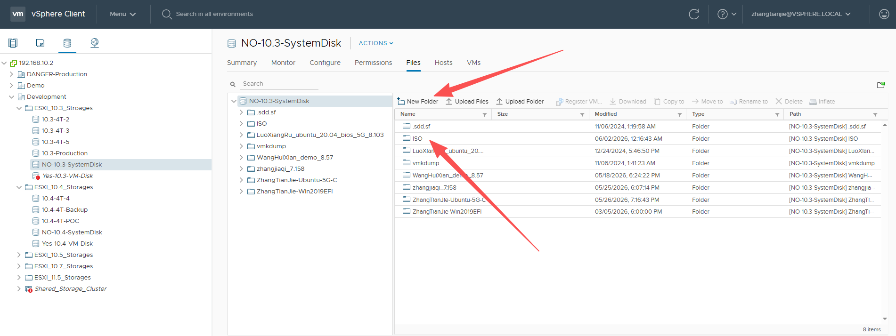
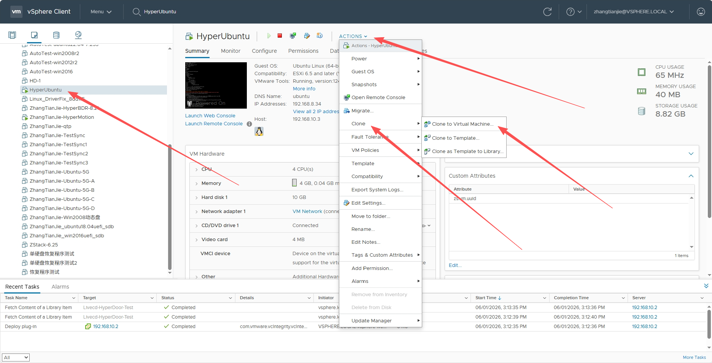
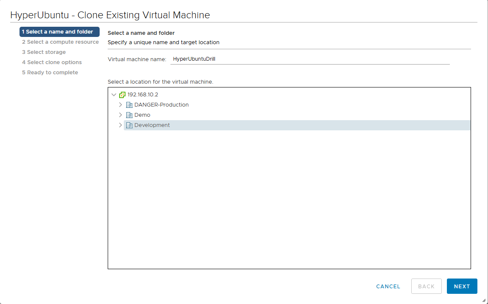
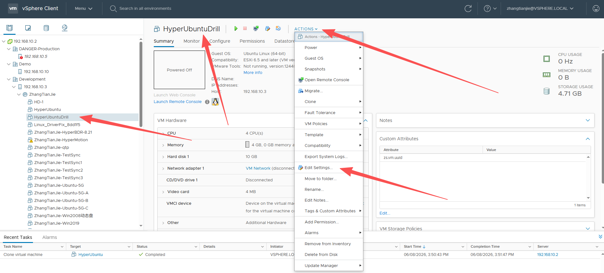
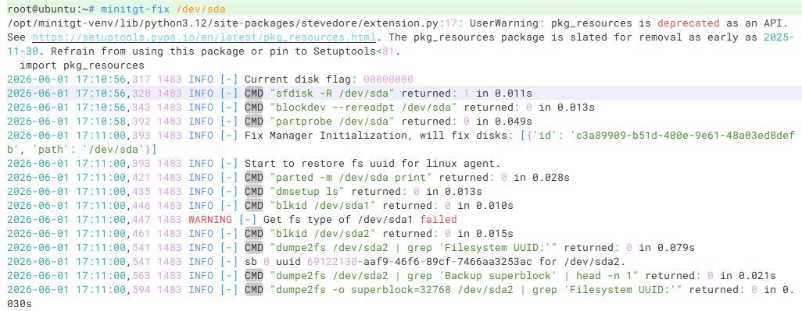
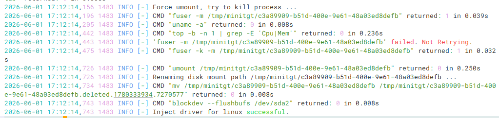

# VMware Failback Drill Reference Guide

## Preparatory Work

- Transition host for which synchronization is completed: HyperUbuntu

- Downloaded transitional host mirroring: Livecd\-HyperDoor\.iso

## Overview of VMware Exercises


## Upload mirroring to VMware

Locate the Datastores where HyperUbuntu resides; 


Click to enter and create a new ISO folder;



Click on the newly created ISO folder, enter it, and then click Upload Files to upload Livecd\-HyperDoor\.iso to the ISO folder;


At this time, Livecd\-HyperDoor\.iso has been successfully uploaded to the Cloud Computing Platform\.

## Transition host with cloning synchronization completed

Find the transition host that has completed synchronization, and use the host cloning capability of the platform to clone a new host for standby\.

> After the cloning process is complete, please verify that the boot mode of the target host is consistent with that of the source host. Under normal circumstances, the cloned host should use the same boot mode as the source host.

Find HyperUbuntu, click ACTIONS, move to Clone, and click Clone to Virtual Machine\.\.\.



Enter the name of the new host, here enter HyperUbuntuDrill, and select computing resources, storage location, etc\. to complete host cloning\. 



## Transition host that guides the completion of cloning

Edit the cloned host HyperUbuntuDrill and set the transitional host mirroring Livecd\-HyperDoor\.iso\.

Find HyperUbuntuDrill, click ACTIONS, click Edit Settings\.\.\.\.\.\. 



Then select Datastore ISO File in the CD/DVD device, click the BROWSE\.\.\. button, and select the ISO mirroring just uploaded\. 


After saving, start the host, and log in after the boot is completed\. The username is root, and the password is Acb@132\.Inst\. 

If DHCP is not available, it is recommended to execute setting\-ip to set the IP address\. Example: 

```Plain Text
# setting-ip <ip> <netmask> <gateway> <dns>
setting-ip 192.168.8.35 255.255.240.0 192.168.0.1 114.114.114.114
```


## Perform driver repair on the cloned host

Log in to the HyperUbuntuDrill host that has just completed booting via the Console or SSH, and execute minitgt\-fix to complete driver repair; 





Final output `Inject driver for linux successful.` indicates that the driver repair was successful\.

## Verify the cloned host

Edit the HyperUbuntuDrill host, remove the CD\-ROM mirroring, restart the virtual machine, and verify whether the host business is normal after the host completes startup\. 

