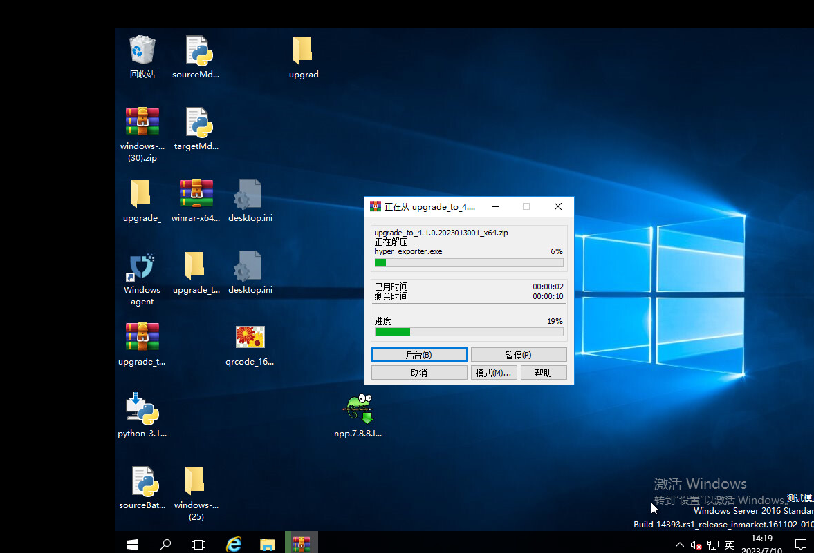

# 云容灾平台（HyperBDR）升级手册

[[toc]]

::: tip
注意：支持升级的最低云容灾平台（HyperBDR）版本是HyperBDR 4.4.0。低于HyperBDR 4.4.0的版本不支持升级到最新版本。 
:::

## 云容灾平台（HyperBDR）服务器升级

[升级包下载链接](https://hyperbdr-system-image-do-not-delete.obs.ap-southeast-3.myhuaweicloud.com/upgrade_incremental_4.4.0_to_5.2.0.tar.gz)

### 获取升级包并解压

- 步骤1：获取升级包URL。

- 步骤2：将升级包下载到**云容灾平台（HyperBDR）控制台** 操作系统，并使用以下命令进行解压：

```shell
tar zxvf upgrade_incremental_4.4.0_to_4.9.0.tar.gz -C /tmp/
```

### 检查当前安装版本

```shell
cat /opt/installer/Version 
HyperBDR_release_v4.9.0_20230928-20230927-1437.tar.gz 
## The installed version is HyperBDR_release_v4.9.0_20230928
```

> 如果云容灾平台（HyperBDR）版本低于4.6.0，请执行以下额外步骤:

```shell
[root@log images]# cd /tmp/upgrade/images
[root@log images]# ls
influxdb-1.7.6.tar.gz  mariadb-10.3.36.tar.gz  rabbitmq-3.8.16.tar.gz  redis-7.0.2-alpine.tar.gz

[root@log images]# docker load -i influxdb-1.7.6.tar.gz
[root@log images]# docker load -i mariadb-10.3.36.tar.gz
[root@log images]# docker load -i rabbitmq-3.8.16.tar.gz
[root@log images]# docker load -i redis-7.0.2-alpine.tar.gz
```

### 更新服务

- 步骤1：替换更新命令:

```shell
cp /tmp/upgrade/scripts/common.sh /opt/installer/production/scripts/
cp /tmp/upgrade/scripts/hmctl /opt/installer/production/scripts/
```

- 步骤2：执行更新命令

```shell
/opt/installer/production/scripts/hmctl upgrade /tmp/upgrade/venvs
```

### 更新配置文件

```shell
mv /opt/installer/production/config/newmuse/json/config.json.bak /opt/installer/production/config/newmuse/json/config.json 
mv /opt/installer/production/config/newmuse/json/s3.json.bak /opt/installer/production/config/newmuse/json/s3.json 
mv /opt/installer/production/config/newmuse/json/targetClouds.json.bak /opt/installer/production/config/newmuse/json/targetClouds.json 
mv /opt/installer/production/config/newmuse-motion/json/config.json.bak /opt/installer/production/config/newmuse-motion/json/config.json 
mv /opt/installer/production/config/newmuse-motion/json/s3.json.bak /opt/installer/production/config/newmuse-motion/json/s3.json 
mv /opt/installer/production/config/newmuse-motion/json/targetClouds.json.bak /opt/installer/production/config/newmuse-motion/json/targetClouds.json
```

### 确认升级后的版本

升级完成后，执行以下命令查看当前云容灾平台（HyperBDR）版本:

```shell
[root@localhost installer]# cat /opt/installer/Version 

HyperBDR_release_v5.2.0_20230928-20230927-1437.tar.gz 

## The installed version is HyperBDR_release_v5.2.0_20230928
```

## 更新**Linux Agent**, **Windows Agent** 和无代理**源端同步代理（Sync Proxy）**

### 限制条件

> 注意：请首先升级云容灾平台（HyperBDR）服务器端。
> V4.10.1之前的安装包不能直接使用更新脚本进行升级。
> 在同步主机或启动主机等任务进行时，禁止执行升级操作。

### 无代理源端同步代理（Sync Proxy）

- 步骤1. 登录到无代理 **源端同步代理（Sync Proxy）** 服务器

```shell

ssh root@<Agentless Sync Proxy Server IP\>

```
- 步骤2. 获取最新的更新脚本

```shell

curl -k -o /usr/local/hyper_exporter/upgrade_hamal.sh https://<HyperBDR IP\>:30080/softwares/upgrade_hamal.sh

```
- 步骤3. 授权执行权限

```shell

chmod +x /root/upgrade.hamal.sh

```
- 步骤4. 执行更新命令

```shell

cd /usr/local/hyper_exporter/


bash /usr/local/hyper_exporter/upgrade_hamal.sh
```

#### Linux Agent

- 步骤1. 登录到Linux Agent主机

```shell

ssh root@<Agent Host IP\>

```

- 步骤2. 获取最新的更新脚本

```shell

curl -k -o /var/lib/egisplus-agent/upgrade_agent.sh https://<HyperBDR-IP\>:30080/softwares/upgrade_agent.sh

```

- 步骤3. 执行更新脚本

```shell

bash /var/lib/egisplus-agent/upgrade_agent.sh

```

#### Windows Agent

- 步骤1. 登录到源Windows Agent服务器桌面

- 步骤2. 下载更新文件到Windows Agent服务器。

```shell

# X64

https://<HyperBDR IP\>:30080/softwares/windows-agent-new/upgrade_to_xxx_x64.zip


# X86
https://<HyperBDR IP\>:30080/softwares/windows-agent-new/upgrade_to_xxx_x86.zip
```


- 步骤3. 解压下载的文件



- 步骤4. 执行Upgrade.exe。


## 对象存储恢复网关

对象存储恢复网关需要重新上传镜像到云平台。


