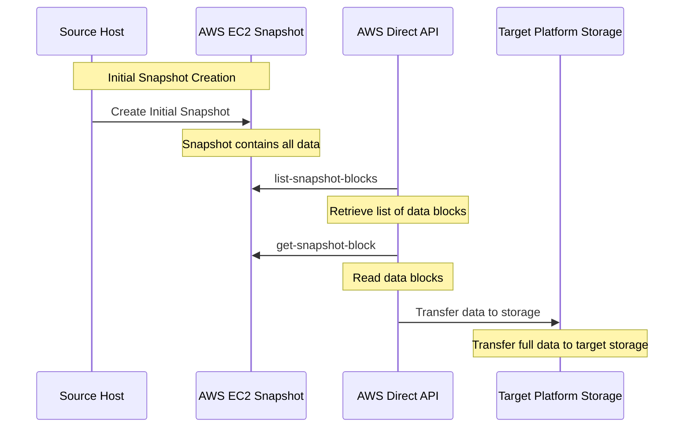
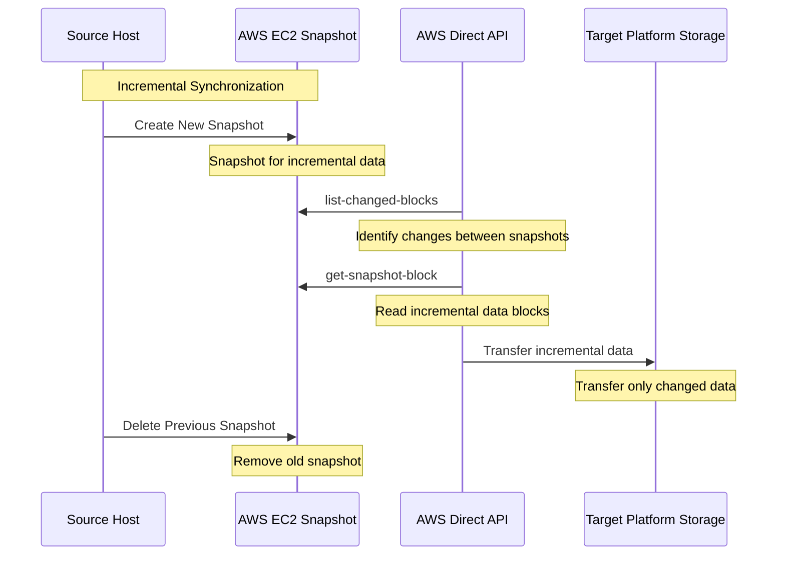

# 深入 AWS 无代理模式

[[toc]]

:::tip
本文档仅适用于 HyperBDR 版本 5.6.0 及以上版本。HyperBDR 版本 5.6.0 计划于 2024 年 6 月 30 日发布。
:::

## 如何工作？

### 概述

本文档介绍了如何使用 AWS Direct API 实现无代理同步。该方法依赖于 AWS EC2 快照，并利用 HyperBDR 实现高效可靠的数据同步。核心思想是利用全量和增量快照功能，通过比较快照之间的差异来同步数据。

### 同步过程

#### 初始快照创建

* 使用 AWS EC2 快照功能创建初始快照。
* 该初始快照包含主机上的所有数据。
* 使用 AWS Direct API 操作 list-snapshot-blocks 和 get-snapshot-block 从该快照读取所有数据并传输到目标平台存储。
* 保留初始快照以进行未来的同步。



#### 后续增量同步

* 在下一个同步期间使用 AWS EC2 快照功能创建新的快照。
* 使用 AWS Direct API 操作 list-changed-blocks 查找新快照和前一个快照之间的差异，识别增量数据。
* 使用 get-snapshot-block 读取并传输增量数据到目标平台存储，确保目标平台是最新的。
* 传输增量数据后，删除前一个快照并保留当前快照以进行下一个同步。




### 技术细节

#### 快照创建

* 使用 AWS EC2 API 创建快照，例如 CreateSnapshot API。
* 确保快照创建过程对生产环境的影响最小。

#### 数据读取和传输

* 使用 list-snapshot-blocks 获取快照中的数据块列表。
* 使用 get-snapshot-block 读取每个数据块并高效地传输到目标平台存储。


#### 增量快照和差异计算

* 使用 list-changed-blocks 获取两个快照之间的更改数据块列表。
* 使用 get-snapshot-block 读取更改的数据块并传输增量数据到目标平台存储。

#### 快照管理

* 保留最新的快照以进行下一个增量同步。
* 定期删除旧快照以节省存储成本并减少管理开销。

### 参考链接

* [Read snapshots with EBS direct APIs](https://docs.aws.amazon.com/ebs/latest/userguide/readsnapshots.html)

## AWS 无代理模式成本计算器(RC)

### 了解成本

AWS 无代理模式的主要成本计算涉及两个主要组件：源端和目标端的开销。本文件重点描述在 AWS 端可能产生的费用。为了计算目标端的开销，我们建议使用 [https://calculator.oneprocloud.com/home](https://calculator.oneprocloud.com/home) 提供的计算器。

### AWS 成本计算器

对于需要数据同步的主机，主要考虑因素包括：

- 总磁盘容量
- 基于恢复点目标 (RPO) 的数据变化率

在计算 AWS 源端成本时，主要组件包括：

- **Sync Proxy EC2 Cost**: 用于在源端建立一个同步代理，用于管理数据传输和同步操作。
- **Data Transfer Cost**: 涉及从源端到目标端的网络数据传输费用。费用可能因跨 AWS 区域或传输到其他云提供商而有所不同。
- **Snapshot Storage Cost**: 至少需要保留一个快照以进行增量数据同步。
- **EBS Direct API Call Cost**: 如果使用 EBS Direct API 进行快照操作，请考虑相应的 API 调用费用。

### 示例

:::tip
本文档中的价格基于 2024 年 6 月 20 日香港地区的 AWS 计算器数据。最新数据请访问 [AWS 计算器网站](https://calculator.aws/#/)。
:::

我们假设有 1 台主机，磁盘容量为 1TB，有效数据为 500GB，RPO 为 1 天，增量数据为 5%。我们正在将数据备份到另一个云平台。每月成本计算如下：

#### 同步代理

我们使用具有 2 个核心和 4 GB 内存的 c5.large EC2 实例，并配备一个专用公共 IP 地址。按需使用成本约为每月 $78.84。

#### 快照

我们需要至少保留一个快照以进行下一次同步。假设我们使用通用用途 SSD (gp2) 卷类型，第一天快照大小为 500GB，第二天快照大小为 25GB。从第二天开始，快照大小保持为 25GB（忽略两个快照重叠的部分）。

```
初始快照成本: 500 GB x 0.0550000000 / 30 = 0.917 USD
每月快照成本: 25 GB x 0.0550000000 USD = 1.375 USD
部分存储月折扣: 1.375 USD x 50% = 0.6875 USD
增量快照成本: 0.6875 USD x (30 - 1) = 19.9375 USD
总快照成本: 0.917 USD + 19.9375 USD = 20.8545 USD
```

#### 数据传输

数据传输从第一天开始为 500GB，由于每天有 5% 的增量变化，从第二天开始逐渐减少到 25GB。现在让我们计算 30 天的总数据传输：

```
初始传输: 500GB
后续传输: 25GB 每天

总传输 = (初始传输 + 后续传输之和)
总传输 = 500GB + (25GB * 29天)
总传输 = 500GB + 725GB
总传输 = 1225GB
互联网: 1225 GB x 0.12 USD 每 GB = 147.00 USD
```

#### EBS Direct API

根据提供的计算过程，以下是如何确定使用 AWS EBS Direct API 操作管理 1225GB 数据的成本：

##### 计算总块数:

- 总数据大小 = 1225 GB * 1024 * 1024 KiB/GB = 1,259,520,000 KiB
- 块大小 = 512 KiB
- 总块数 = 总数据大小 / 块大小 = 1,259,520,000 KiB / 512 KiB = 2,456,250 块

##### 计算 GetSnapshotBlock API 成本:

- 总快照 API 单位 = 总块数 = 2,456,250 块
- 每 1,000 个快照 API 单位成本 = $0.003
- GetSnapshotBlock API 成本 = (总快照 API 单位 / 1,000) * 每 1,000 个快照 API 单位成本
  - = (2,456,250 / 1,000) * $0.003
  - = 2,456.25 * $0.003
  - = $7.36875

##### 计算 ListSnapshotBlocks 和 ListChangedBlocks API 成本:

- Total requests for List APIs = Total blocks / 512 blocks per request
  - = 2,456,250 blocks / 512 blocks per request
  - ≈ 4,796.68 requests (rounded up from 4,796.6796875)
- Cost per 1,000 requests = $0.0006
- List APIs cost = (Total requests / 1,000) * Cost per 1,000 requests
  - = (4,796.68 / 1,000) * $0.0006
  - = 4.79668 * $0.0006
  - = $0.002878008

##### 总成本:

- 总成本 = GetSnapshotBlock API 成本 + List APIs 成本
  - = $7.36875 + $0.002878008
  - ≈ $7.371628

因此，使用 AWS EBS Direct API 管理 1225GB 数据的估计成本约为 **$7.37**。此计算包括根据指定数据大小检索快照块和列出快照信息的所有成本。

#### 总结

我们假设有 1 台主机，每个磁盘容量为 1TB，有效数据为 500GB，RPO 为 1 天，增量数据为 5%。我们正在将数据备份到另一个云平台。每月成本计算如下：

| 描述                                             | 成本 (USD)        |
|---------------------------------------------------------|-------------------|
| EC2 c5.large 实例 (按需，每月)               | $78.84            |
| 总快照成本                                      | $20.8545          |
| 互联网数据传输 (1225 GB x $0.12 每 GB)          | $147.00           |
| EBS Direct API 成本 (管理 1225GB 的数据)        | $7.37             |
| **总估计成本**                                 | **$254.0645**     |
