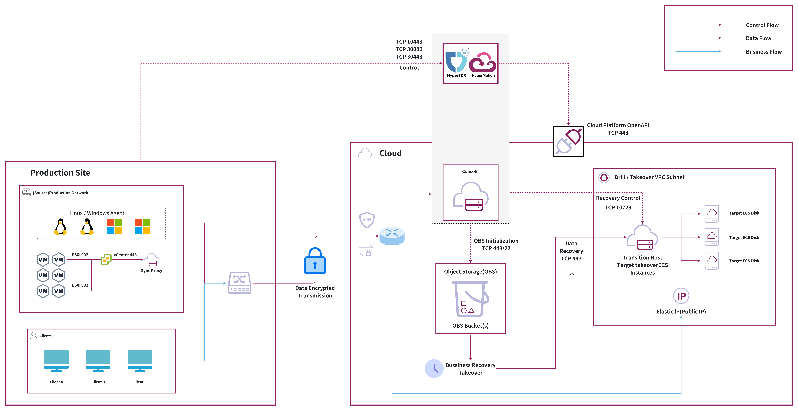
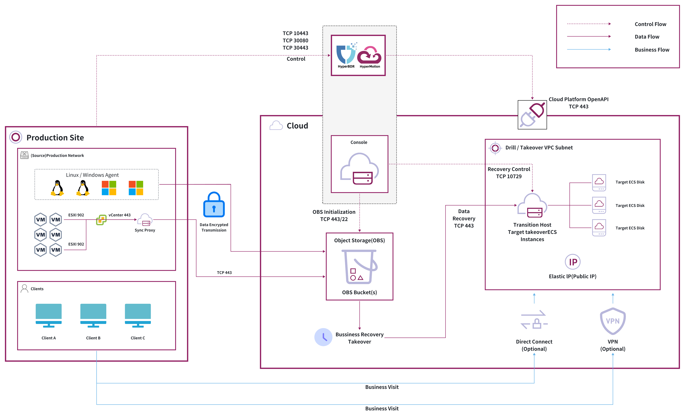
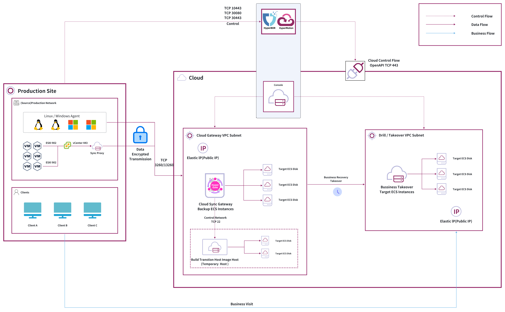
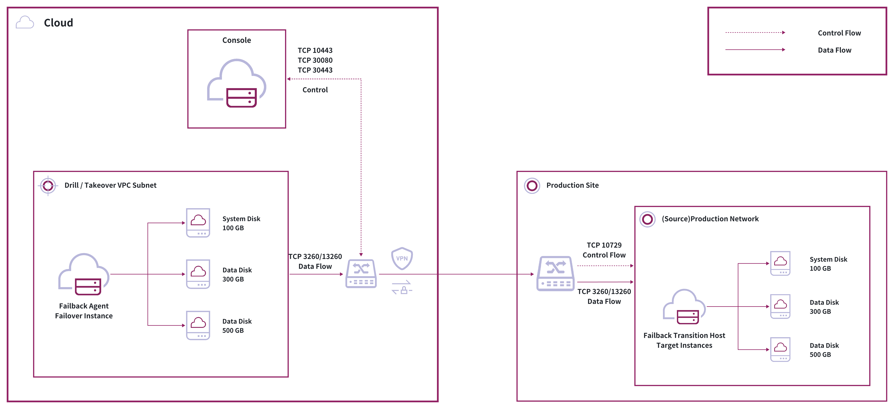
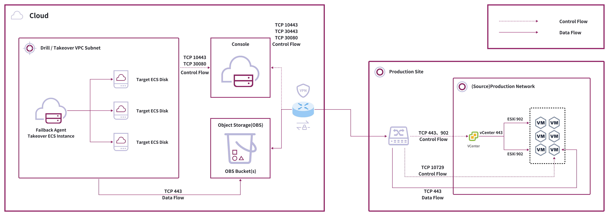

# 云容灾网络规划概述

[[toc]]

本文主要着重于 HyperBDR 网络和灾难恢复接管的合理规划，以及项目启动前所使用的网络。以下是网络规划的基本原则：

- HyperBDR需要部署在容灾平台中，因为一旦生产平台发生故障，HyperBDR在容灾平台上仍然可以正常对业务系统进行恢复。

- HyperBDR对底层所使用的组网形式并没有特别的要求，只要保证网络通讯端口和方向符合HyperBDR需求即可。

- HyperBDR的部署方案取决于生产站点和云容灾站点的连接方式，根据不同的网络连接方案，部署方式上略有差异，所需要的资源不同，成本也有较大差异。

- 对于有状态的业务系统接管，要注意容灾接管所使用的网络与生产网络连接的防火墙策略配置，避免在容灾接管后，容灾接管系统直接连接生产端后造成不正确的数据写入。

## 对象存储部署方案

### 组网方案

| 方案名称 | 数据传输 | 业务访问(容灾接管后) |
| --- | --- | --- |
| 公网方案 | 公网 | 公网 |
| 专线方案(例如：VPN等) | 专线 | 专线 |
| 混合方案 | 公网 | 专线 |

> 注意：灾难后恢复接管后的业务访问

### 开放端口列表

#### 代理

代理包含 Windows 代理和 Linux 代理两种方式。

| **编号** | **来源** | **目标** | **方向** | **端口** | **类型** | **备注** |
| --- | --- | --- | --- | --- | --- | --- |
| 1 | Agent | HyperBDR Console | TCP 单向 | 10443 / 30080 | 控制流 |当使用HyperBDR官方SaaS环境时，应为443/30080 国内SaaS环境: [点击开始迁移](https://hypermotion.oneprocloud.com) [点击开始容灾](https://hyperbdr.oneprocloud.com)|
| 2 | Agent | 对象存储服务 | TCP 单向 | 443 | 数据流 |
| 3 | HyperBDR Console | 对象存储服务 | TCP 单向 | 443 | 控制流 |
| 4 | HyperBDR Console | Transition Host | TCP 单向 | 10729 | 控制流 | 必须在 HyperBDR Console 和容灾演练/接管VM 的 VPC 之间建立 VPC Peering。端口配置将由安全组自动设置，无需特定设置。 |
| 5 | HyperBDR Console | 云 API | TCP 单向 | 443 | 控制流 |
| 6 | Transition Host | 对象存储服务 | TCP 单向 | 443 | 数据流 |

#### VMware 无代理

| **编号** | **来源** | **目标** | **方向** | **端口** | **类型** | **备注** |
| --- | --- | --- | --- | --- | --- | --- |
| 1 | Sync Proxy | vCenter | TCP 单向 | 443 | 控制流 |  |
| 2 | Sync Proxy | ESXi | TCP 单向 | 902 | 数据流 | 所有由 vCenter 管理的 ESXi 的端口 902 |
| 3 | Sync Proxy | HyperBDR Console | TCP 单向 | 10443 / 30080 | 控制流 |当使用HyperBDR官方SaaS环境时，应为443/30080 国内SaaS环境: [点击开始迁移](https://hypermotion.oneprocloud.com) [点击开始容灾](https://hyperbdr.oneprocloud.com)|
| 4 | Sync Proxy | 对象存储服务 | TCP 单向 | 443 | 数据流 |  |
| 5 | HyperBDR Console | 对象存储服务 | TCP 单向 | 443 | 控制流 |  |
| 6 | HyperBDR Console | Transition Host | TCP 单向 | 10729 | 控制流 | 必须在 HyperBDR Console 和容灾演练/接管VM 的 VPC 之间建立 VPC Peering。端口配置将由安全组自动设置，无需特定设置。 |
| 7 | HyperBDR Console | 云 API | TCP 单向 | 443 | 控制流 |  |
| 8 | Transition Host | 对象存储服务 | TCP 单向 | 443 | 数据流 |

#### 华为云 无代理

| **编号** | **来源** | **目标** | **方向** | **端口** | **类型** | **备注** |
| --- | --- | --- | --- | --- | --- | --- |
| 1 | Sync Proxy | HUAWEI API Endpoint | TCP 单向 | 443 | 控制流 |  |
| 2 | Sync Proxy | HyperBDR Console | TCP 单向 | 10443 / 30080 | 控制流 | 当使用 HyperBDR 官方 SaaS 环境时，应为 443/30080 海外 SaaS 环境： [点击开始迁移](https://motion.hyperbdr.com) [点击开始容灾](https://hyperbdr.com) |
| 3 | Sync Proxy | 对象存储服务 | TCP 单向 | 443 | 数据流 |  |
| 4 | HyperBDR | 对象存储服务 | TCP 单向 | 443 | 控制流 |  |
| 5 | HyperBDR Console | Transition Host | TCP 单向 | 10729 | 控制流 | 必须在 HyperBDR Console 和容灾演练/接管 VM 的 VPC 之间建立 VPC Peering。端口配置将由安全组自动设置，无需特定设置。 |
| 6 | HyperBDR Console | 云 API | TCP 单向 | 443 | 控制流 |  |
| 7 | Transition Host | 对象存储服务 | TCP 单向 | 443 | 数据流 | 

### 部署架构

#### 互联网

#### 华为云 互联网

#### 专用网络连接

#### 混合网络

## 块存储部署解决方案

### 网络方案

| 方案 | 数据传输 | 业务访问 |
| --- | --- | --- |
| 公网 | 公网 | 公网 |
| 专用网络连接解决方案（例如 VPN） | 专线 | 专线 |

> 注意：灾难后恢复接管后的业务访问

### 开放端口列表

#### 代理

| **编号** | **来源** | **目标** | **方向** | **端口** | **类型** | **备注** |
| --- | --- | --- | --- | --- | --- | --- |
| 1 | Agent | HyperBDR Console | TCP 单向 | 10443 / 30080 | 控制流 |当使用HyperBDR官方SaaS环境时，应为443/30080 国内SaaS环境: [点击开始迁移](https://hypermotion.oneprocloud.com) [点击开始容灾](https://hyperbdr.oneprocloud.com)|
| 2 | Agent | Cloud Sync Gateway | TCP 单向 | 3260 / 13260 | 数据流 |
| 3 | HyperBDR Console | Cloud Sync Gateway | TCP 单向 | 22 / 10729 / 16100 | 控制流 | 必须在 HyperBDR Console 和容灾演练/接管VM 的 VPC 之间建立 VPC Peering。端口配置将由安全组自动设置，无需特定设置。 |
| 4 | Cloud Sync Gateway | HyperBDR Console | TCP 单向 | 10443 / 30080 | 控制流 |当使用HyperBDR官方SaaS环境时，应为443/30080 国内SaaS环境: [点击开始迁移](https://hypermotion.oneprocloud.com) [点击开始容灾](https://hyperbdr.oneprocloud.com)|
| 5 | HyperBDR Console | 云 API | TCP 单向 | 443 | 控制流 |

#### 无代理

| **编号** | **来源** | **目标** | **方向** | **端口** | **类型** | **备注** |
| --- | --- | --- | --- | --- | --- | --- |
| 1 | Sync Proxy | vCenter | TCP 单向 | 443 | 控制流 |  |
| 2 | Sync Proxy | ESXi | TCP 单向 | 902 | 数据流 | 所有由 vCenter 管理的 ESXi 的端口 902 |
| 3 | Sync Proxy | HyperBDR Console | TCP 单向 | 10443 / 30080 | 控制流 |当使用HyperBDR官方SaaS环境时，应为443/30080 国内SaaS环境: [点击开始迁移](https://hypermotion.oneprocloud.com) [点击开始容灾](https://hyperbdr.oneprocloud.com)  |
| 4 | Sync Proxy | Cloud Sync Gateway | TCP 单向 | 3260 / 13260 | 数据流 |  |
| 5 | HyperBDR Console | Cloud Sync Gateway | TCP 单向 | 22 / 10729 / 16100 | 控制流 | 必须在 HyperBDR Console 和容灾演练/接管 VM 的 VPC 之间建立 VPC Peering。端口配置将由安全组自动设置，无需特定设置。 |
| 6 | Cloud Sync Gateway | HyperBDR Console | TCP 单向 | 10443 / 30080 | 控制流 |当使用HyperBDR官方SaaS环境时，应为443/30080 国内SaaS环境: [点击开始迁移](https://hypermotion.oneprocloud.com) [点击开始容灾](https://hyperbdr.oneprocloud.com)|
| 7 | HyperBDR Console | 云 API | TCP 单向 | 443 | 控制流 |

#### 华为云 无代理

| **编号** | **来源** | **目标** | **方向** | **端口** | **类型** | **备注** |
| --- | --- | --- | --- | --- | --- | --- |
| 1 | Sync Proxy | Huawei API Endpoint | TCP 单向 | 443 | 控制流 |  |
| 2 | Sync Proxy | HyperBDR Console | TCP 单向 | 10443 / 30080 | 控制流 | 当使用 HyperBDR 官方 SaaS 环境时，应为 443/30080 海外 SaaS 环境： [点击开始迁移](https://motion.hyperbdr.com) [点击开始容灾](https://hyperbdr.com) |
| 3 | Sync Proxy | Cloud Sync Gateway | TCP 单向 | 3260 / 13260 | 数据流 |  |
| 4 | HyperBDR Console | Cloud Sync Gateway | TCP 单向 | 22 / 10729 / 16100 | 控制流 | 必须在 HyperBDR Console 和容灾演练/接管 VM 的 VPC 之间建立 VPC Peering。端口配置将由安全组自动设置，无需特定设置。 |
| 5 | Cloud Sync Gateway | HyperBDR Console | TCP 单向 | 10443 / 30080 |  | 当使用 HyperBDR 官方 SaaS 环境时，应为 443/30080 海外 SaaS 环境： [点击开始迁移](https://motion.hyperbdr.com) [点击开始容灾](https://hyperbdr.com) |
| 6 | HyperBDR Console | 云 API | TCP 单向 | 443 | 控制流 |  |

### 部署架构

#### 互联网

#### 华为云 互联网

#### 专用网络连接

## 回切网络规划 — 专线解决方案

在回切过程中，由于需要云端接管主机直接访问生产端IP地址，所以目前只支持专线方案进行回切。

### 块存储方式

#### 部署架构

#### 开放端口列表

| **编号** | **访问来源** | **访问目标** | **通信方向** | **开放端口** | **通讯类型** | **备注** |
| --- | --- | --- | --- | --- | --- | --- |
| 1 | Failback Agent | HyperBDR Console | TCP 单向 | 10443 / 30080 | 控制流 |当使用HyperBDR官方SaaS环境时，应为443/30080 国内SaaS环境: [点击开始迁移](https://hypermotion.oneprocloud.com) [点击开始容灾](https://hyperbdr.oneprocloud.com)|
| 2 | Failback Agent | Failback Transition Host | TCP 单向 | 3260 / 13260 | 数据流 |
| 3 | HyperBDR Console | Failback Transition Host | TCP 单向 | 10729 | 控制流 |
| 4 | Failback Transition Host | HyperBDR Console | TCP 单向 | 10729 | 控制流 |

#### 部署架构 - NAT

#### 开放端口列表

| **编号** | **访问来源** | **访问目标** | **通信方向** | **开放端口** | **通讯类型** | **备注** |
| --- | --- | --- | --- | --- | --- | --- |
| 1 | Failback Agent | HyperBDR Console | TCP 单向 | 10443 / 30080 | 控制流 |当使用HyperBDR官方SaaS环境时，应为443/30080 国内SaaS环境: [点击开始迁移](https://hypermotion.oneprocloud.com) [点击开始容灾](https://hyperbdr.oneprocloud.com)|
| 2 | Failback Agent | Failback Transition Host | TCP 单向 | 3260 / 13260 | 数据流 |
| 3 | Failback Transition Host | HyperBDR Console | TCP 单向 | 10729 | 控制流 |

### 对象存储

#### 部署架构

#### 开放端口列表

| **编号** | **来源** | **目标** | **方向** | **端口** | **类型** | **备注** |
| --- | --- | --- | --- | --- | --- | --- |
| 1 | Failback Agent | HyperBDR Console | TCP 单向 | 10443 / 30080 | 控制流 |当使用HyperBDR官方SaaS环境时，应为443/30080 国内SaaS环境: [点击开始迁移](https://hypermotion.oneprocloud.com) [点击开始容灾](https://hyperbdr.oneprocloud.com)|
| 2 | Failback Agent | 对象存储服务 | TCP 单向 | 443 | 数据流 |
| 3 | HyperBDR Console | 对象存储服务 | TCP 单向 | 443 | 控制流 |
| 4 | HyperBDR Console | Failback Transition Host | TCP 单向 | 10729 | 控制流 |
| 5 | HyperBDR Console | 云 API | TCP 单向 | 443 | 控制流 |
| 6 | HyperBDR Console | vCenter/ESXi | TCP 单向 | 443/902 | 控制流 |
| 7 | Failback Transition Host | 对象存储服务 | TCP 单向 | 443 | 数据流 |

## 容灾网络规划

### 用户网络

我们以某客户生产环境的网络为例，说明不同方式下的网络规划，以下为用户现有的网络架构拓扑图：

用户网络分配如下：

| 网络名称 | 网段 | 用途 |
| --- | --- | --- |
| 用户客户端桌面网络 | 192.168.0.0/24 | 用于桌面电脑访问业务网络 |
| 业务系统A | 192.168.4.0/24 | 业务系统A所在网络 |
| 业务系统B | 10.227.129.0/24 | 业务系统B所在网络，该网络为VMware业务网地址 |
| VMware 管理网络 | 10.227.230.0/24 | VMware资源管理网地址 |

### 专线解决方案 1

生产网络和接管子网是不同的。

#### 架构

#### 防火墙策略

| 生产子网 | 接管子网 | 生产网络访问接管网络 | 接管网络访问生产网络 |
| --- | --- | --- | --- |
| 192.168.0.0/24   192.168.4.0/24 | 192.168.104.0/24 | 允许 | 拒绝 |
| 192.168.0.0/24   10.227.129.0/24 | 10.227.229.0/24 | 允许 | 拒绝 |

解释：

- 用户访问：在目标云平台侧使用不同的子网地址作为接管网络，生产侧可以直接通过专线访问云上的VPC，用户也可以通过VPN客户端直接连接至云端的VPN后访问业务网络。

- 防火墙设定：为了防止接管后的主机，错误的访问原有主机，所以限制接管后的主机直接访问生产网络，根据策略需求情况对指定端口进行放行。

### 专线方案 2

生产网络和接管子网是相同的。

#### 架构

#### 防火墙策略

| 生产子网 | 接管子网 | 生产网络访问接管网络 | 接管网络访问生产网络 |
| --- | --- | --- | --- |
| 192.168.0.0/24   192.168.4.0/24 | 192.168.4.0/24 | 不允许 | 不允许 |
| 192.168.0.0/24   10.227.129.0/24 | 10.227.129.0/24 | 不允许 | 不允许 |

说明:

- 防火墙设定：为了防止接管后的主机，和原有主机发生冲突，所以严格限制接管后的主机与原有生产网络地址的访问，根据策略需求情况对指定端口进行放行。

### 公网

#### 架构

#### 防火墙策略

用户通过公网地址直接访问接管后的业务系统，防火墙需要放行对公网访问的需要。
