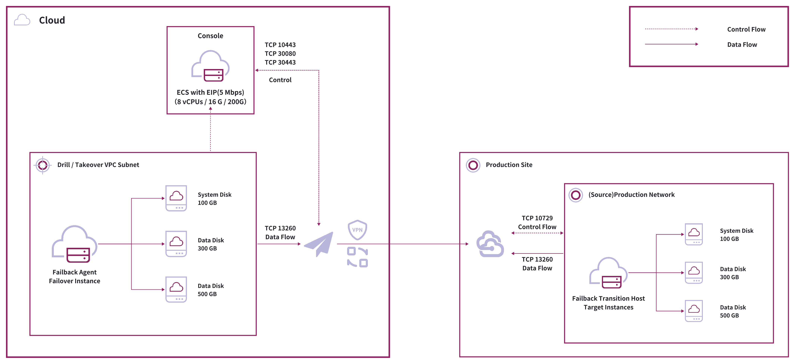
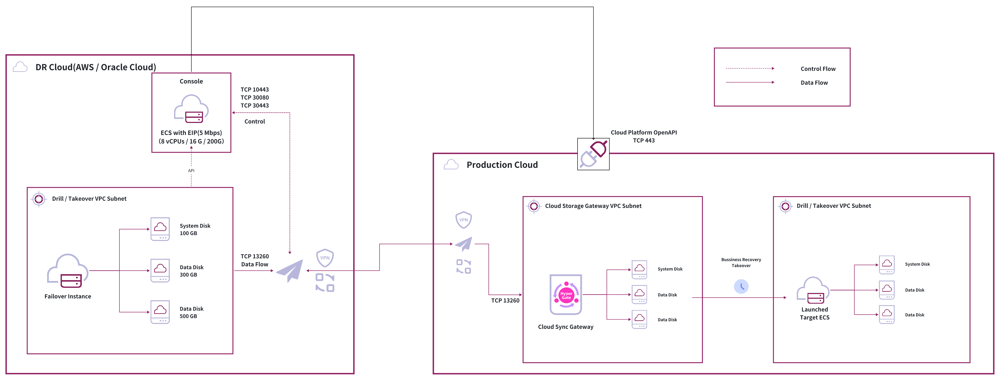

# 容灾回切实现原理

## 什么是容灾回切

容灾回切是指在容灾接管完成后，将业务系统从容灾环境切换回原始生产环境的过程。当生产环境故障修复后，需要将业务系统从容灾环境迁移回原始生产环境，以确保业务的连续性和数据的一致性。

### 回切使用场景

容灾回切主要应用于生产环境故障修复后，将业务系统从容灾环境切换回原始生产环境的场景。

### 回切功能特点

HyperBDR的回切功能基于迁移功能实现，通过主机块级别的全量和增量同步功能完成主机的整体回切。这种设计确保了：

- **数据完整性**：通过全量和增量同步保证数据的完整传输
- **业务连续性**：通过增量同步方式，最小化回切过程中的业务中断时间
- **兼容性强**：支持多种虚拟化平台和云平台

## 回切原理

### 数据同步原理

在进行容灾回切时，主要依赖主机块级别的全量和增量数据同步。根据不同平台的特性，可以选择回切代理（Failback Agent）或无代理（Failback Agentless）两种方式。

| 回切方式         | 支持平台                | 是否需要安装代理 | 主要说明                                   |
|------------------|------------------------|------------------|--------------------------------------------|
| 无代理（Agentless） | AWS、Oracle Cloud      | 否               | 平台提供主机级别无代理同步接口，可直接回切   |
| 有代理（Agent）     | 其他云平台（如Azure、阿里云等） | 是               | 需在每台主机内安装代理程序实现回切         |

### 回切方式

HyperBDR目前支持三种回切方式，具体对比如下表：

| 回切方式         | 适用环境及主要特点                                                                                                                                                                                                 | 操作复杂度 | 停机窗口期说明                                                                                      |
|------------------|------------------------------------------------------------------------------------------------------------------------------------------------------------------------------------------------------------------|------------|-----------------------------------------------------------------------------------------------------|
| 通用方式         | 适用于传统虚拟化环境（如VMware、Hyper-V、KVM等）及超融合环境。 - 需要手动配置和部署 - 支持多种传统环境 - 配置灵活，可定制化程度高                                                                         | 高         | 短，最后一次增量同步后，即可割接                                             |
| 自动化方式       | 适用于云平台环境（如AWS、Azure、阿里云等）及已与HyperBDR形成自动化对接的平台。 - 自动化程度高 - 配置简单，操作便捷 - 支持云平台原生接口                                                                  | 低         | 完成最后一次增量后，启动时间与云平台有关： AWS/Oracle Cloud/Google Cloud/华为云一般15分钟内完成，其他云平台与数据量有关        |
| 有条件自动化方式 | 适用于VMware或Huawei FusionCompute环境，且必须具备兼容S3协议的对象存储。 - 需有对象存储（S3协议）支持 - 自动化程度高，简化操作流程 - 恢复时间与数据量相关                                               | 低         | 完成最后一次增量同步后，启动时间与数据量有关，数据量越大，停机窗口期越长                                                            |

#### 通用方式回切原理

通用方式的回切原理本质上是利用内存型文件系统构建临时过渡主机，通过对外开放的传输协议，接受Agent/Agentless端的块级别全量和增量数据，从而在割接时间点可以完成回切操作。

**核心机制**：
1. **临时过渡主机**：在生产平台通过临时过渡主机镜像创建临时过渡主机作为数据接收端
2. **块级别同步**：通过块级别的数据传输确保数据完整性
3. **内存型文件系统**：利用内存型文件系统间接暴露平台磁盘
4. **传输协议**：使用优化的传输协议提升传输效率

#### 有条件自动化方式回切原理

有条件自动化方式主要适用于VMware或Huawei FusionCompute等环境，并且要求具备兼容S3协议的对象存储。该方式结合了自动化和传统方式的优点，通过对象存储作为中转，实现高效的数据同步和自动化的回切流程。

**核心机制**：
1. **对象存储中转**：利用兼容S3协议的对象存储作为数据同步的中转站，实现主机数据的高效传输
2. **自动化流程触发**：在满足对象存储条件下，系统可自动化触发数据同步、主机创建和回切流程
3. **平台集成**：与虚拟化平台和对象存储服务深度集成，简化操作步骤
4. **启动验证**：支持在不同时间点对回切主机进行自动或手动启动验证，确保数据和业务一致性
5. **操作简化**：相比通用方式，极大减少人工干预，提高回切效率，但需提前准备好对象存储资源

> **注意：** 有条件自动化方式的恢复速度与数据量和网络带宽密切相关。每次回切时，主机数据都需要通过对象存储进行完整同步，数据量越大，恢复时间越长。如果数据量较大或网络带宽有限，恢复过程可能会非常缓慢，不推荐在大规模数据场景下使用该方式。请根据实际业务需求和环境条件合理选择回切方式，避免因预期过高导致业务中断时间超出预期。

#### 自动化方式回切原理

自动化方式与容灾目标平台类似，通过块存储同步网关接收数据，在割接时间点完成系统启动，业务部门验证后完成回切。

**核心机制**：
1. **块存储同步网关**：利用云平台提供的块存储同步能力
2. **自动化部署**：自动创建和管理同步网关
3. **云平台集成**：与云平台原生接口深度集成
4. **自动化验证**：与容灾演练类似，在回切过程中，自动化方式能够灵活选择不同时间点对回切主机进行启动验证

## 回切流程

### 前期准备

- **代理安装**：
   - 在容灾接管后的主机安装代理
   - 对于AWS/Oracle Cloud等支持无代理接口的平台，可直接利用无代理方式进行回切
   - 对于其他云平台，需要为每台主机安装回切代理程序

### 通用方式回切流程

| 步骤           | 主要操作                                                         | 详细说明                                                                                                   |
|----------------|------------------------------------------------------------------|------------------------------------------------------------------------------------------------------------|
| 临时过渡主机准备 | 上传临时过渡主机镜像 1:1创建主机和磁盘 配置网络           | 在生产平台上传临时过渡主机镜像。 按源端主机数量和磁盘规格1:1创建主机和磁盘，并挂载。 为每台主机配置IP，确保网络连通。 |
| 回切配置       | 注册临时过渡主机 SSH管理和配对 选择磁盘                    | 在控制台注册临时过渡主机，使用SSH进行管理和配对，选择对应大小磁盘接收数据。                                 |
| 数据同步       | 启动全量同步 增量同步 关注同步时长                        | 首次为全量同步，后续为增量同步。 同步时长受数据量、带宽、主机负载影响。                                 |
| 割接验证       | 旁路验证 确认数据和应用 暂停业务 最后增量同步           | 割接窗口期内旁路验证主机，确认数据和应用正常。 暂停业务，完成最后一次增量同步。                          |
| 最终割接       | 执行割接 业务验证 关闭接管主机                            | 进行最终割接，业务部门验证无误后，关闭容灾接管主机。                                                       |

### 自动化方式回切流程

| 步骤           | 主要操作                                                         | 详细说明                                                                                                   |
|----------------|------------------------------------------------------------------|------------------------------------------------------------------------------------------------------------|
| 云平台资源准备 | 提供鉴权信息 自动创建同步网关 自动创建主机和磁盘 自动配置网络 | 提供API密钥等鉴权信息。 系统自动创建同步网关、主机和磁盘，并自动挂载。 自动分配网络和IP，确保连通。    |
| 回切配置       | 自动注册和管理同步网关及主机 自动配对 支持控制台调整        | 系统自动注册和管理同步网关及主机，自动完成主机与磁盘配对。 支持控制台查看和调整配置。                   |
| 数据同步       | 自动全量同步 自动增量同步 实时监控                          | 自动发起全量和增量同步，确保数据一致。 同步进度和状态可在控制台实时监控。                               |
| 割接验证       | 自动/手动启动主机旁路验证 验证数据和应用 暂停业务 最后增量同步 | 割接窗口期内自动或手动启动主机进行旁路验证，确认数据和应用状态。 暂停业务，自动完成最后一次增量同步。    |
| 最终割接       | 自动完成割接 业务验证 关闭接管主机                          | 系统自动完成最终割接，业务部门验证无误后，自动关闭容灾接管主机，业务正式切回生产环境。                     |

> **说明：** 自动化方式回切流程在各个环节均实现了高度自动化，极大减少了人工操作，提升了回切效率和可靠性。整体流程与通用方式类似，但所有资源准备、配置、同步、验证和割接等步骤均可通过平台自动完成，适用于云平台环境和已对接自动化API的平台。
