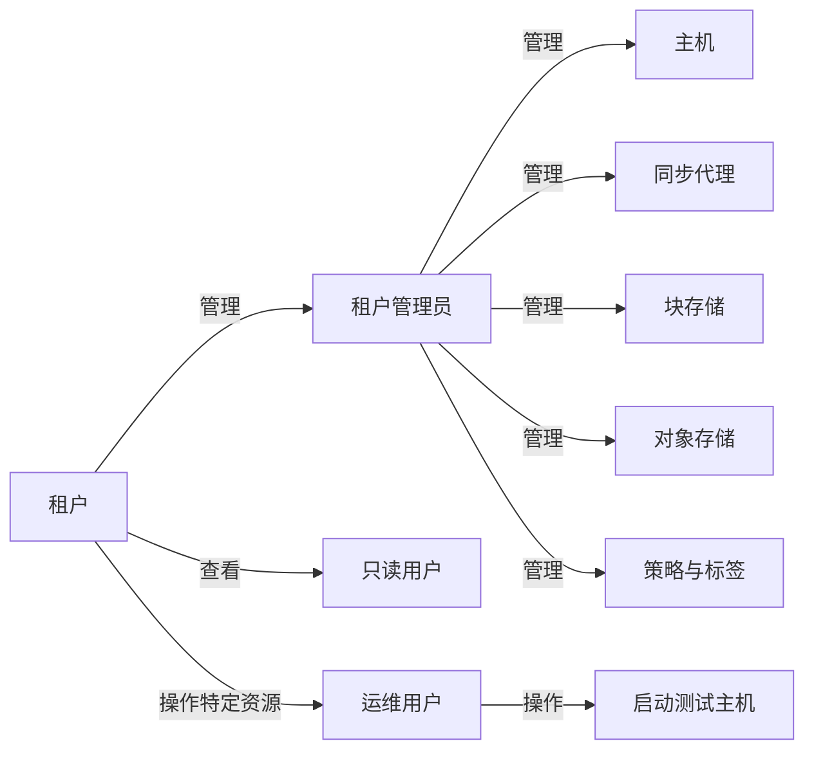

# 多租户体系

## 1. 设计理念

本产品支持多租户资源隔离，旨在为使用我们灾备产品的用户提供严格的资源隔离机制，以确保数据安全性和操作权限的明确划分。

## 2. 资源隔离机制

所有用户的资源均与租户相关联，确保不同租户之间的数据和操作互不影响。具体隔离的资源包括但不限于：

- **生产站点资源**：包括主机、源端Sync Proxy等。
- **目标端资源**：如块存储、对象存储等。
- **策略与标签**：用户创建的策略和标签均按照租户进行隔离。

在多租户架构下，用户的所有资源均绑定至其所属租户，确保资源访问权限的精准控制。

## 3. 租户内部资源可见性

在同一租户下，租户内的所有用户均可以访问该租户的所有资源。同时，在主机列表中，用户可以看到某个资源最初由哪位用户加入到流程中，以便于审计和管理。

## 4. 角色与权限

目前，多租户的管理是通过运维管理平台进行统一管理，在用户使用界面暂时无法对租户内的用户进行管理。

租户下的用户可以被赋予不同的权限，以满足不同使用场景的需求。主要角色包括：

- **租户管理员**：具备租户内的所有管理权限，包括资源创建、修改、删除等。
- **只读用户**：仅具备查看权限，不允许进行任何变更操作。
- **操作用户**：无法添加主机，但可以执行演练主机启动等特定操作。

通过上述角色权限划分，确保租户内的不同用户可以在合理的权限范围内使用系统，既保证了操作灵活性，又增强了安全性。

## 5. 资源管理示意图

## 6. 结论

本产品的多租户设计严格遵循资源隔离原则，同时提供了合理的用户权限管理机制，确保不同租户之间的数据安全，同时提升租户内部的协作与管理效率。

