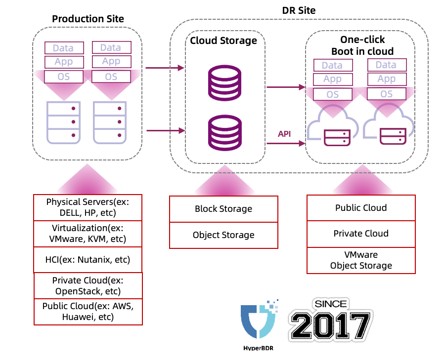

# 概述

HyperMotion 和 HyperBDR 由 OneProCloud 自 2017 年起开发，是一款云原生灾难恢复解决方案，旨在实现主机资源在不同平台间的无缝迁移。

该解决方案提供一键式灾难恢复，支持从物理机、虚拟化环境、超融合平台、私有云和公有云等多种环境进行恢复，目标位置可以是公有云、私有云或 VMware。此外，它还支持不同公有云与私有云之间的灾难恢复，提供全方位的恢复方向。

HyperMotion 和 HyperBDR 的云原生特性体现在三个关键方面。首先，它深度集成了云平台接口，整个保护和恢复过程中利用了超过 50 个 API。

其次，利用云原生存储特性，如块存储快照功能和对象存储方式，并结合创新的 Boot in Cloud 技术，实现了高效且成本节约的快速恢复。

第三，它确保从用户源端到云存储的直接数据传输，无需本地缓存。

HyperMotion 和 HyperBDR 的安装与使用简便，后续的培训课程将提供实际演示。总的来说，HyperMotion 和 HyperBDR 能够为 x86 主机资源提供备份与恢复功能，具备分钟级的 RPO 和 RTO 能力。
