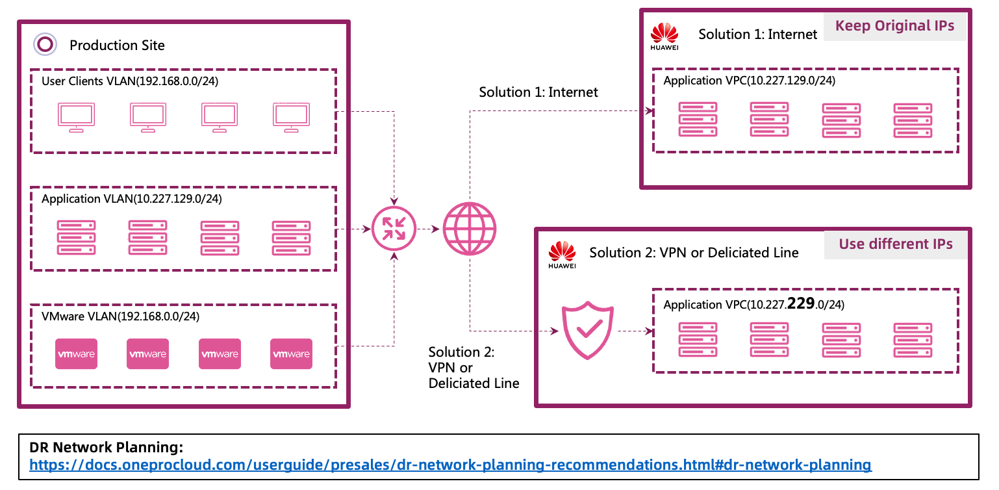

# 项目交付

## 我们能做这个项目吗？

当我们首次与用户沟通时，如何判断我们是否可以向他们推荐云迁移平台（HyperMotion）与云容灾平台（HyperBDR）的灾难恢复解决方案？

以下是判断是否可以推荐的一种简单方法：

- 首先，如果用户的业务系统运行在服务器上，并且他们需要灾难恢复，那么他们可能是潜在客户。如果他们部分使用 Oracle RAC 或云原生关系数据库服务，可能需要我们之前提到的混合解决方案。如果他们只想保护 Oracle 或者完全使用云原生服务，可能无法使用云容灾平台（HyperBDR）进行灾难恢复。
- 其次，目前云迁移平台（HyperMotion）与云容灾平台（HyperBDR）主要支持 X86 架构的服务器，暂不支持 ARM 或 IBM Power 系列。
- 第三，用户应使用常见操作系统，如 CentOS、Redhat、SUSE、Windows 等。然而，一些云服务商提供的操作系统可能会经过定制，修改了内核，因此标准的云迁移平台（HyperMotion）与云容灾平台（HyperBDR）产品可能无法直接使用，可能需要进行定制开发。
- 最后，如果用户能接受分钟级的恢复点目标（RPO），那么他们很可能是云迁移平台（HyperMotion）与云容灾平台（HyperBDR）的潜在用户。

## 项目甘特图概览

为了便于理解整个项目交付流程，我们使用甘特图进行说明：

1. 在确认云迁移平台（HyperMotion）与云容灾平台（HyperBDR）可以满足客户需求后，我们需要对客户的业务系统进行调研，以确定支持范围。

2. 根据调研结果，我们根据灾难恢复网络、RPO 和 RTO 的要求，决定使用的云存储类型，并最终形成交付计划。

3. 一旦项目进入交付阶段，我们根据清单对用户的源端和网络环境进行预配置。同时，在云平台上进行网络配置及云迁移平台（HyperMotion）或云容灾平台（HyperBDR）的安装和配置。

4. 在生产环境和云迁移平台（HyperMotion）或云容灾平台（HyperBDR）安装配置完成后，我们进入产品使用阶段，根据计划进行数据同步。同步的数据量取决于数据量和带宽等因素。

5. 初始同步完成后，建议进行演练，以确认灾难恢复数据的完整性。

6. 最后，进行云迁移平台（HyperMotion）或云容灾平台（HyperBDR）的监控，并进行报警配置，完成项目交付，进入维护阶段。

## 调研

灾难恢复调研主要涉及三个方面：主机、网络和应用。

1. 进行主机调研时，我们需要收集主机的详细信息，以确定云迁移平台（HyperMotion）或云容灾平台（HyperBDR）是否完全支持它们。可以使用官方文档中提供的方法进行此操作。

2. 网络调研旨在确定用户现有的网络拓扑和带宽情况。通过这些信息，我们可以在云平台上规划灾难恢复网络，并决定是否需要在用户的生产站点与备份站点之间使用 VPN 或专线。

3. 应用系统调研可以与主机调研同时进行，主要是确定用户业务系统的重要性，并根据重要性级别在云迁移平台（HyperMotion）或云容灾平台（HyperBDR）中配置不同的灾难恢复策略。此外，我们需要根据系统之间的相互依赖关系，确定灾难恢复期间系统接管的顺序。

### 有用链接

- [云平台支持矩阵](https://oneprocloud.feishu.cn/sheets/VRqksSPEPhRTPStp3kVcItXNnyh?sheet=Y9fpqO)
- [公有云 Boot in Cloud 功能特性矩阵](https://oneprocloud.feishu.cn/sheets/S7LisoSWdhm2G4t0rdycwxEunEd?sheet=1OatFu)
- [专有云 Boot in Cloud 功能特性矩阵](https://oneprocloud.feishu.cn/sheets/S7LisoSWdhm2G4t0rdycwxEunEd?sheet=2fOzMl)
- [源端功能支持矩阵](https://oneprocloud.feishu.cn/sheets/S7LisoSWdhm2G4t0rdycwxEunEd?sheet=0hEfBi)
- [Linux Agent 兼容性及限制](/product-overview/limitations/linux-agent.html)
- [Windows Agent 兼容性及限制](/product-overview/limitations/windows-agent.html)
- [VMware 无代理兼容性及限制](/product-overview/limitations/vmware-agentless.html)

## RPO 与 RTO 规划

RPO 和 RTO 的规划需要基于用户业务系统的要求。以下是一些 RPO 和 RTO 规划的最佳实践，您可以通过点击链接了解更多内容。

目前，云迁移平台（HyperMotion）与云容灾平台（HyperBDR）的最小 RPO 时间为 5 分钟，并需要根据数据增量的大小匹配相应的网络带宽。

在 RTO 规划方面，云平台的块存储模式与数据量无关，恢复时间始终在 15 分钟内。而对象存储模式则与数据量相关，具体的指标参数可以参考最佳实践内容。

根据用户业务系统的预期 RTO，合理选择适当的存储类型。

## 工作负载灾难恢复网络规划

用户的灾难恢复网络规划与生产网络和灾难恢复网络之间的连接直接相关。这里，我们还提供了一些最佳实践内容供您参考。然而，网络规划通常是一个复杂的话题，需要经验丰富的网络工程师根据实际情况制定合理的规划。基于一些典型案例，以下是一些建议：

如果用户通过公网同步数据，生产网络和灾难恢复网络的地址可以保持一致。

如果用户使用 VPN 和专线连接生产中心与灾难恢复中心，建议选择不同的接管网络。这样可以有效避免在演练或接管过程中对生产环境的影响。

## 部署清单使用

当我们正式进入部署阶段时，使用清单与交付流程相结合至关重要。清单为用户提供了明确的指导，帮助其逐步完成每个操作步骤。

选择清单时，首先根据源系统的类型进行选择。然后选择所使用的云平台存储类型，接着决定网络连接方式，是通过公网还是通过 VPN 或专线。最后，定位到对应的清单。

清单以表单格式呈现，用户需要根据指导逐步填写完成，以完成云迁移平台（HyperMotion）或云容灾平台（HyperBDR）的安装和配置工作。

### 清单链接

- [清单](/checklist/dr-checklist.html)
