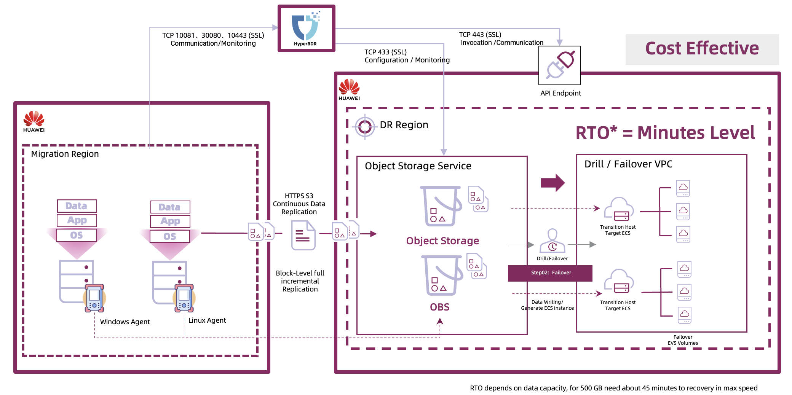

# 场景

## 场景1: VMware迁移/灾难恢复到云端

我们来探讨VMware迁移/灾难恢复到云平台的场景，这在许多项目中非常常见，因为VMware环境广泛存在。

云迁移平台（HyperMotion）主机迁移与云容灾平台（HyperBDR）灾难恢复过程可以分为三个主要阶段：主机选择与配置、数据同步，最后是演练或接管阶段。

在VMware主机迁移/灾难恢复中，云迁移平台（HyperMotion）与云容灾平台（HyperBDR）消除了需要在每个源主机上安装代理的需求。它通过VMware接口收集主机信息，并利用Change Block Tracking技术在每个快照时间点捕获数据增量。

源端同步代理（Tync Proxy）作为部署在用户VMware上的主机，充当用户生产中心的唯一网关。其主要功能是访问VMware数据并将其直接传输到云存储。此节点可进行横向扩展，建议当主机数量超过五十时增加额外的代理。

云迁移平台（HyperMotion）与云容灾平台（HyperBDR）提供灵活的同步策略设置，间隔可以从最短的5分钟到每小时或每月选项不等。通过最小5分钟增量同步粒度，云迁移平台（HyperMotion）与云容灾平台（HyperBDR）可以确保潜在的RPO（恢复点目标）时间短至5分钟。然而，实际的RPO时间可能会根据增量数据大小和网络带宽等因素有所不同，因此需要根据具体情况调整策略配置。

在云原生存储方面，可以选择块存储或对象存储，两者均支持一键启动。在华为云的块存储模式中，RTO（恢复时间目标）与源端主机的磁盘容量和数量无关，确保恢复时间在15分钟内。

另一方面，对象存储提供了成本优势，尽管恢复时间与磁盘容量紧密相关。可以根据业务系统的RTO要求，合理结合这些选项。

初次同步后，产品的Boot in Cloud功能支持一键恢复或在云中进行演练，用户可以通过简单的点击启动这一过程，将主机恢复到启动状态，服务会自动启动，通过端口访问业务系统变得无缝。

此外，值得一提的是，除了VMware平台支持的无代理方式，基于Ceph存储的OpenStack私有云也可以实现无代理的灾难恢复。虽然过程与VMware略有不同，云迁移平台（HyperMotion）与云容灾平台（HyperBDR）使用Ceph RBD在同步过程中捕获增量数据，但总体方法保持一致。

## 场景2: Linux/Windows主机迁移/灾难恢复到云端

接下来，我们来探讨第二个场景：Linux或Windows主机迁移/灾难恢复到云平台。

如前所述，代理方式非常灵活。无论是物理机、虚拟化、超融合，还是各种私有云和公有云，代理方法都能处理所有无法通过无代理方式实现的保护和恢复任务。

常见的问题是，云迁移平台（HyperMotion）与云容灾平台（HyperBDR）是否能够保护容器平台、数据库或中间件服务。答案是肯定的——云迁移平台（HyperMotion）与云容灾平台（HyperBDR）可以保护安装在主机上的所有服务，除了Oracle RAC。然而，对于Oracle单实例版本，云迁移平台（HyperMotion）与云容灾平台（HyperBDR）仍然是一个可选方案。

另一个常见问题是如何实现零RPO，特别是在数据库场景中。由于其最小同步粒度为5分钟，云迁移平台（HyperMotion）与云容灾平台（HyperBDR）重点是保持每次同步时的数据完整性，旨在使每个快照时间点在恢复时可恢复。

对于RPO时间敏感的数据库项目，建议考虑混合方法。例如，可以使用Oracle Data Guard或Oracle GoldenGate实现Oracle数据库的实时灾难恢复，同时使用云迁移平台（HyperMotion）与云容灾平台（HyperBDR）保护其他业务系统。在接管过程中，一旦Oracle完成主备切换，业务系统可以恢复到云中，数据库路径可以更新以完成接管。

云迁移平台（HyperMotion）与云容灾平台（HyperBDR）简化了不同场景，因此同步和恢复过程与VMware非常相似，确保一致的产品体验。唯一的区别是需要在每个需要保护的主机上安装相应的代理。由于其内核级技术，代理有系统版本要求，但通常支持常见的Windows和Linux系统。具体兼容性检查将在后续讨论。

结合代理和无代理模式，可以实现无缝的一键混合恢复。在实际项目中，可以根据不同环境选择不同的保护方式。

## 场景3: 云主机迁移/灾难恢复到云端

不同云平台间，特别是公有云之间的迁移/灾难恢复，是用户常考虑的一个场景。

在这种情况下，安装代理到云主机中可以实现主机保护并恢复到其他云平台。

我们经常收到的一个问题是，云迁移平台（HyperMotion）与云容灾平台（HyperBDR）是否能够保护关系数据库服务（RDS）。由于某些限制，云迁移平台（HyperMotion）与云容灾平台（HyperBDR）不直接支持RDS保护。但类似于之前提到的Oracle保护方法，仍然可以采用混合方法在云中实现灾难恢复。

主机可以使用云迁移平台（HyperMotion）或云容灾平台（HyperBDR）保护，而数据库同步则可以利用平台特定的工具进行RDS灾难恢复，例如华为云的DRS服务。

对于对数据库保护敏感的业务，结合使用DRS服务进行数据库同步，并使用云迁移平台（HyperMotion）或云容灾平台（HyperBDR）保护主机服务，在实际项目中取得了成功。

## 场景4: 用云替代VMware

第四个场景是最近的一个关注点。由于VMware授权政策的变化，许多用户开始寻找替代方案，其中云是一个显而易见的选择。

然而，解决从VMware到云的过渡过程中与业务连续性相关的问题，并确保迁移后业务系统的保护和恢复，是用户在替换过程中需要重点考虑的因素。

通过使用云迁移平台（HyperMotion）或云容灾平台（HyperBDR），可以顺利解决用户的担忧。基本流程是先将业务系统迁移到云端（无需代理），然后利用云迁移平台（HyperMotion）或云容灾平台（HyperBDR）实现跨区域的灾难恢复。

这种方法不仅替代了VMware，还提供了跨区域灾难恢复解决方案，满足系统高可靠性的需求。

### 阶段1-迁移

首先，将业务系统保护到云平台的块存储中，无需代理。块存储在恢复时间方面具有优势，有效减少了切换窗口。

其次，利用产品的演练功能创建模拟环境，轻松验证业务系统在云中的运行。一旦验证完成，可以释放云资源以节省成本。在此期间，生产环境中的业务系统运行不受影响。

第三，在业务切换窗口期间，暂时中断业务系统访问，执行最终增量同步。由于增量同步数据量较小，数据同步和业务系统启动可以快速完成。验证无误后，完全关闭源系统以完成切换。

如果此阶段出现问题，只需重新启动源系统即可完成回滚。此外，增量数据可以继续同步，等待下一个切换窗口。

通过这些步骤，我们完成了替代VMware为云的第一阶段——迁移。

### 阶段2-备份与恢复-对象存储服务

当业务系统在云中运行顺利后，我们可以启动跨区域灾难恢复。可以选择具有成本效益的对象存储，如前所述。在对象存储模式下，数据同步不产生额外的计算费用，仅有对象存储的存储费用。

首先，我们需要在已部署到云中的业务主机上安装云迁移平台（HyperMotion）或云容灾平台（HyperBDR）代理。

其次，配置灾难恢复区域的对象存储和恢复平台的认证信息，并通过云平台控制台进行访问。

接下来，建立同步策略并开始保护过程。

最后，在演练或灾难发生时，启动灾难恢复区域中的业务系统，只需一键操作。

### 阶段2-备份与恢复–块存储服务

如果业务系统对RTO恢复时间有严格要求，我们可以利用灾难恢复区域中的块存储来确保快速恢复。灾难恢复步骤与之前提到的对象存储恢复过程相同。

当然，针对不同的RTO要求，可以考虑结合两种存储方法的混合方式，旨在在满足RTO性能需求的同时，尽量降低成本。

通过这种方式，我们不仅完成了VMware替代，还为云中的业务系统提供了高度可靠的保护。
