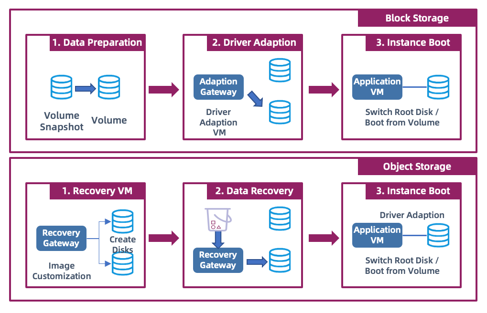
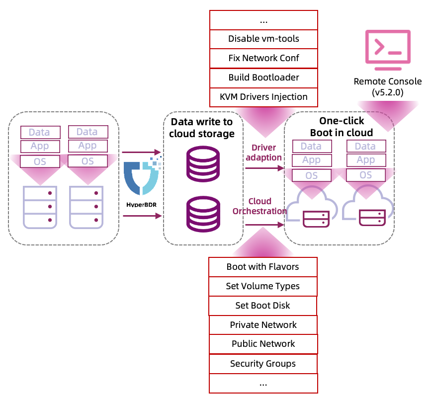
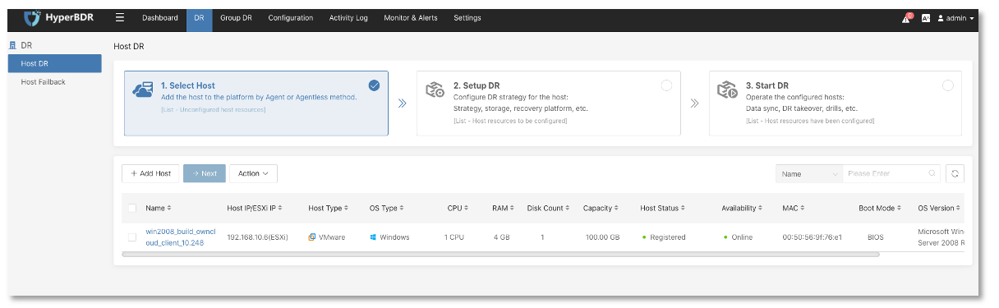

# Technical Highlights

## Implementation

The process of disaster recovery can be simplified into three main steps: syncing data, storing it, and recovering it when needed, like bringing back hosts.

HyperBDR tackles these key challenges:

* Getting Data Back: Since HyperBDR focuses on keeping hosts safe, the main task is figuring out how to grab data from your systems, especially at the basic level.
* Storing Data Right: Designed for cloud platforms, HyperBDR ensures data is stored sensibly in cloud services, ready for quick recovery.
* Making Everything Work Together: Unlike old-school setups, cloud platforms can be orchestrated easily. Hyper BDR taps into this capability to swiftly restore business systems.
* Simplifying Learning: Lastly, it aims for an easy-to-use interface, making it simple for users to understand and operate, thus reducing the learning curve.

## Block-level full incremental replication technology

Let's delve into how HyperBDR reads and stores data.

As mentioned earlier, to achieve host-level backup and recovery, HyperBDR employs block-level data synchronization, meaning it can back up data on all disks of the hosts using this method. It's important to note that these disks do not include network disks, such as NFS.

Once the synchronization level is determined, the next step is to address the issue of data synchronization, specifically acquiring full and incremental data.

In HyperBDR, there are primarily three methods for data synchronization:

- For Agent synchronization, incremental data is obtained mainly through kernel module I/O capture technology.
- For VMware, we primarily utilize CBT technology to capture incremental data from users.
- For OpenStack platforms using Ceph storage, we leverage the RBD interface to obtain data.

In block storage mode, data is directly written to the corresponding location of the cloud platform's block storage.

As mentioned before, during the data synchronization process, HyperBDR directly stores the captured data from the source host in cloud storage. Specifically, in block storage mode, data is directly written to the corresponding location of the cloud platform's block storage through the **Cloud Sync Gateway**. Finally, by calling the cloud platform's block storage snapshot interface, the data after each synchronization is locked.

The advantage of this approach is that during the data synchronization phase, there is no need to establish a one-to-one mapping between the source and target hosts. Only an appropriate number of cloud synchronization gateways and corresponding disks are needed.

A question that is often asked is, how many cloud synchronization gateways do I need during data synchronization?

First, the number of **Cloud Sync Gateways** does not directly correspond to the number of production environment hosts.
Secondly, the number of disks mounted on the cloud synchronization gateway corresponds one-to-one with the total number of disks on the production environment hosts. For example, if there are 10 hosts at the source, each with two disks, then only one **Cloud Sync Gateway** is needed on Huawei Cloud because each cloud host on Huawei Cloud can mount 20 disks.

In object storage mode, data is divided into regions of default 4 MB size. When a change is detected in a particular region, the data in that region is stored in the object storage, while the corresponding metadata information is stored in HyperBDR. Since the access interface for object storage itself uses HTTP, no additional computing resources are required for storage.

## Boot-in-Cloud

Boot-in-Cloud is a unique technology of HyperBDR, which implements one-click host startup function by comprehensively using the orchestration ability of cloud APIs and driver adaptation ability.

In block storage mode, the startup process includes the following steps:

Firstly, it is necessary to restore the block storage snapshot to a volume and repair the drive of the system's boot disk.
When finally recovering the host, since each cloud platform uses slightly different methods, for example, on Huawei Cloud, startup can be achieved by swapping the system disk and data disk.
The final host startup process is completed according to the specifications, volume types, boot disks, networks, and other information specified by the user in the disaster recovery configuration.

In object storage mode, the startup process is slightly different:

Firstly, the target platform needs to upload two custom types of images, one for the Linux system and one for the Windows system.
During the startup of the object storage host, firstly, a temporary recovery host is started, and the corresponding disks are created and mounted.
Then, the data is restored from the object storage to the block storage, and the drive repair process is carried out.
After completion, the temporary host will automatically restart, and once the restart is completed, the host startup is finished.

## Boot-in-Cloud In-Depth

In the Boot-in-Cloud process, Driver Adaptation is a crucial step and a key factor in HyperBDR's success in recovering hosts across different platforms.

Driver Adaptation primarily includes the following:

* Adaptation of drivers for different platforms: For instance, when transitioning from VMware to KVM platforms, it's necessary to inject virtio-related drivers to ensure the host can boot up properly and the network functions correctly.
* Conversion from UEFI to BIOS boot: Since cloud platforms have limited support for UEFI boot, if the source system uses UEFI boot, it needs to be automatically converted to BIOS boot at the cloud end.
* Network configuration: As most cloud platforms use DHCP for address allocation, while traditional environments typically use static IP addresses, adjustments to network configurations are needed during startup.
* Modification of configuration files: Primarily done to ensure compliance with the target cloud platform's operations. For example, after restoring a VMware host to a cloud platform, certain actions such as disabling vmware-tools may be necessary.
* Driver repair involves numerous tasks, which are not listed here. Unlike other disaster recovery software, HyperBDR's driver repair occurs after the fact. Regardless of whether it's in Agent or Agentless mode, no drivers or configurations are installed or injected in advance on the source production environment hosts, aiming to minimize the impact on the source production environment.

## Wizard-style minimal operation

Despite the complexity of its underlying logic, HyperBDR simplifies the user experience by abstracting intricate processes into three simple steps: Select Host, Configure Disaster Recovery, and Start Recovery.

With these three steps, users can almost entirely complete all operational procedures within HyperBDR's Graphical User Interface (GUI) without the need for frequent logins to the production environment and target cloud platform.