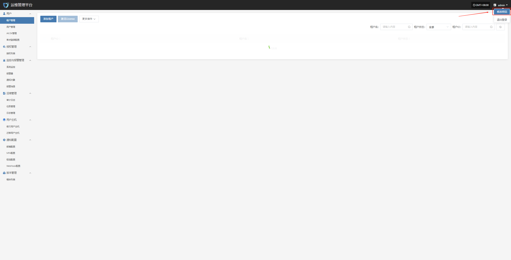
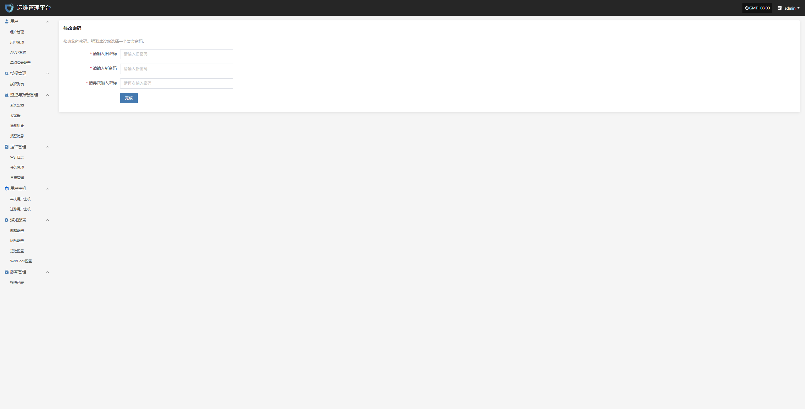

# **修改密码**

为了保护您的账号安全，我们建议您定期更换密码，尤其是使用安全性高的密码。

  * 点击页面右上角的用户名，展开下拉菜单。

  * 点击“修改密码”选项，跳转至新页面进行密码修改

根据页面提示在输入旧密码，新密码，再次输入新密码后，点击下方 **“完成”** 即可完成密码修改

> 注意：新密码长度8-20个字符，必须包含大小写字母和数字，支持特殊字符(除空格)。修改密码后，请务必牢记新的密码，以免影响后续系统访问。运维管理平台的登录密码也将同步更新。
## **密码管理建议**

* 建议定期更换密码，特别是在怀疑账户安全受到威胁时及时更新。

* 避免在多个平台使用相同密码，建议设置复杂且独特的密码以提升账户安全。

