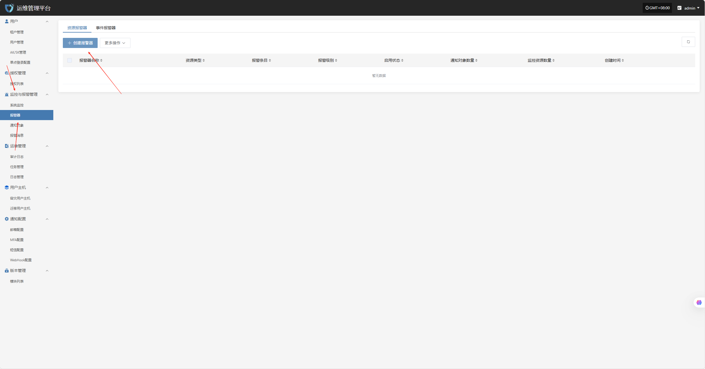
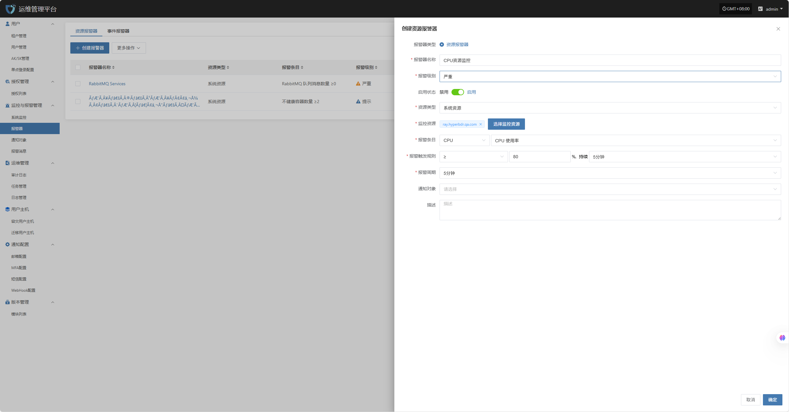
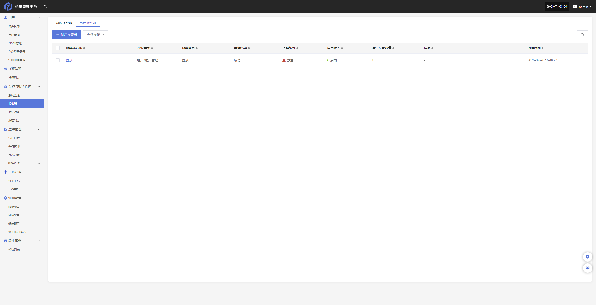
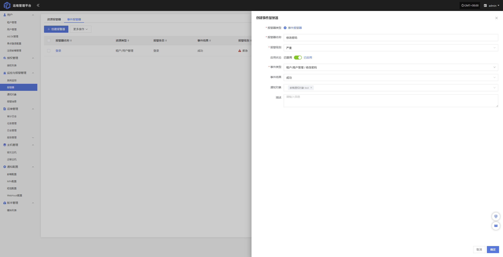
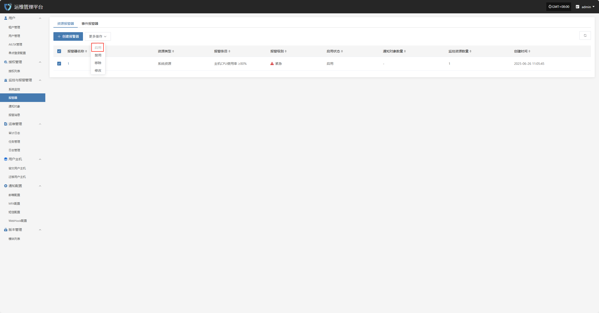
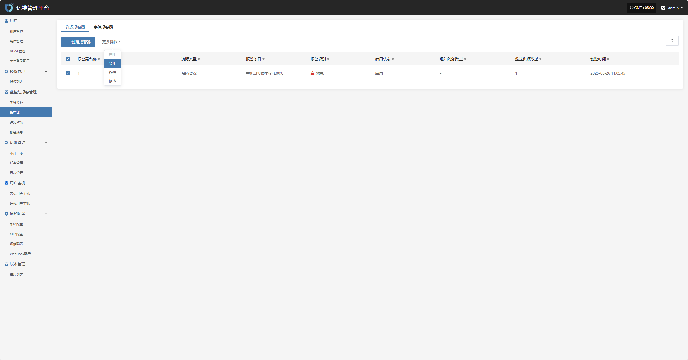

# **报警器**

“报警器”模块用于集中管理系统中触发的各类告警事件。通过对异常行为、资源状态或系统故障的实时监测，报警器可在第一时间触发通知，帮助运维人员快速响应、定位并处理问题，从而保障平台的稳定运行。

## **资源报警器**

为保障系统运行的稳定性与资源使用的可控性，已对 CPU、内存及磁盘等关键资源项设置了基础告警阈值。当资源使用率超过设定的预警值时，系统将自动触发告警通知，以便运维人员及时响应与处理，避免资源瓶颈对业务造成影响。

| **资源类型** | **告警指标**    | **告警规则**       | **告警级别** |
| -------- | ----------- | -------------- | -------- |
| 主机       | CPU 使用率     | ≥ 80%，持续 5 分钟  | 严重       |
| 主机       | 内存使用百分比     | ≥ 80%，持续 5 分钟  | 严重       |
| 主机       | 根磁盘已使用容量百分比 | ≥ 80%，持续 5 分钟  | 严重       |
| 主机       | 不健康容器数量统计   | ≥ 1 个，持续 5 分钟  | 严重       |
| RabbitMQ | 队列消息数量      | ≥ 10 个，持续 5 分钟 | 严重       |

### **创建报警器**

#### **配置示例：CPU 资源-告警配置**

登录运维管理平台后，依次点击，监控与报警管理--报警器--资源报警器--创建报警器

- 配置信息说明

| **配置项** | **示例值** | **说明** |
|------------|------------|------------|
| 报警器类型 | 资源报警器 | 指报警器所属类型。 |
| 报警器名称 | HyperBDR-host-CPU | 报警器的唯一标识名称，用于区分不同报警规则。 |
| 报警级别 | 紧急 | 报警触发后的告警等级，用于区分告警严重程度（如提示、严重、紧急等）。 |
| 启用状态 | 启用 | 表示该报警器当前是否生效，启用后按配置规则执行监控与告警。 |
| 资源类型 | 系统资源 | 指被监控资源的分类。 |
| 监控资源 | HyperBDR | 支持主机、RabbitMQ、MariaDB 数据库三种资源类型。管理员可根据实际运维需求，灵活切换资源类型并选择对应的监控目标。 |
| 报警条目 | CPU使用率 | 具体监控的指标项，如 CPU 使用率、内存使用率等。 |
| 报警触发规则 | > 80% 持续5分钟 | 定义报警触发条件，如指标超过指定阈值并持续一定时间后触发告警。 |
| 报警周期 | 5分钟 | 指监控指标的检测频率或统计周期。 |
| 通知对象 | 邮箱通知对象-test | 报警触发后接收通知的对象，可为邮箱、短信或其他通知组。 |
| 描述 | 这是用于CPU资源告警的配置示例 | 对该报警器用途或配置内容的补充说明。 |

> 根据实际情况填写对应级别名称，并根据上述表格明确监控范围

## **事件报警器**

为保障系统运行的安全性与可观测性, 支持通过对租户用户权限、AK/SK 凭证安全以及告警策略变更等关键管理行为进行事件告警配置，构建从行为审计到异常响应的全面可观测体系，确保运维管理过程中的合规性与系统运行的持续稳定性。

| **监控资源** | **事件类型** | **事件结果** | **告警级别** |
| -------- | -------- | -------- | -------- |
| 事件       | 修改密码     | 成功       | 严重       |
| 事件       | 删除租户     | 成功       | 严重       |
| 事件       | 登录     | 失败       | 严重       |

### **创建报警器**

#### **配置示例：修改密码成功-告警配置**

登录运维管理平台后，依次点击，监控与报警管理--报警器--事件报警器--创建报警器

- 配置信息说明

| **配置项** | **示例值** | **说明** |
|------------|------------|------------|
| 报警器类型 | 事件报警器 | 指报警器所属类型。 |
| 报警器名称 | 修改密码 | 报警器的唯一标识名称，用于区分不同报警规则。 |
| 报警级别 | 严重 | 报警触发后的告警等级，用于区分告警严重程度（如提示、严重、紧急等）。 |
| 启用状态 | 启用 | 表示该报警器当前是否生效，启用后在满足条件时将触发告警。 |
| 事件类型 | 修改密码 |指需要监控的具体事件类别，如登录、修改密码、权限变更等。 |
| 事件结果 | 成功 |指事件触发的结果条件，如成功或失败，仅在满足该结果时触发告警。 |
| 通知对象 | 邮箱通知对象-test | 报警触发后接收通知的对象，可为邮箱、短信或其他通知组。 |
| 描述 | 这是用于CPU资源告警的配置示例 | 对该报警器用途或配置内容的补充说明。 |

> 根据实际情况选择填写对应监控事件类型

## **更多操作**

### **修改**

列表选择需要操作的报警器后，点击“修改”，可修改部分鉴权信息

### **启用**

点击“启用”按钮，可激活处于禁用状态的报警器

### **禁用**

点击“禁用”按钮，可禁用处于启用状态的报警器

### **移除**

点击“移除”按钮，可移除该报警器

