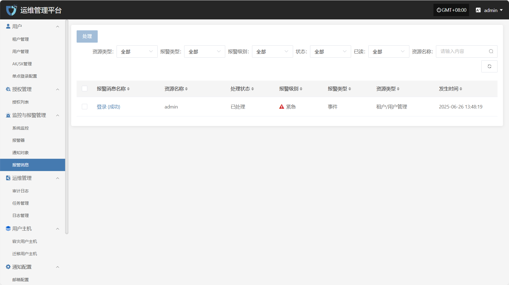
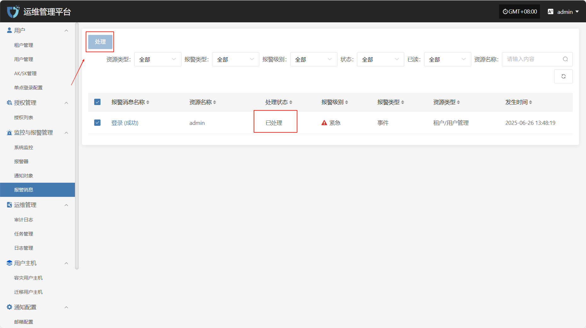

# **报警消息**

“报警消息”模块用于集中展示由报警器触发的各类告警信息，帮助用户快速了解系统在运行过程中发生的异常事件。本模块仅承担告警结果的可视化展示功能，通过统一的告警消息视图，用户可以清晰查看告警的级别、来源、内容及处理状态，便于及时响应与后续审计。

在“报警消息”页面上方，支持根据资源类型、报警类型、处理状态等多维条件进行筛选，便于用户高效查找和管理告警记录。

选中对应的报警消息后，点击右上角“处理”按钮，可更改其处理状态，便于后续管理与追踪。

