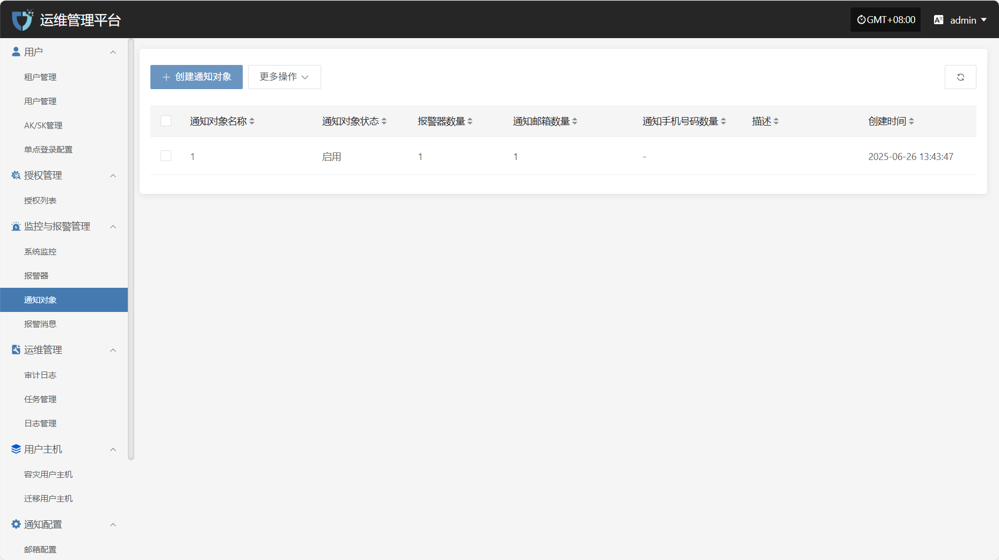
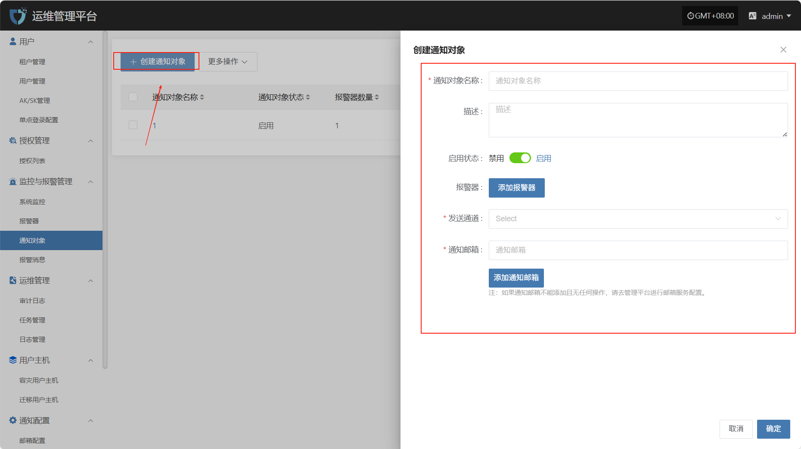
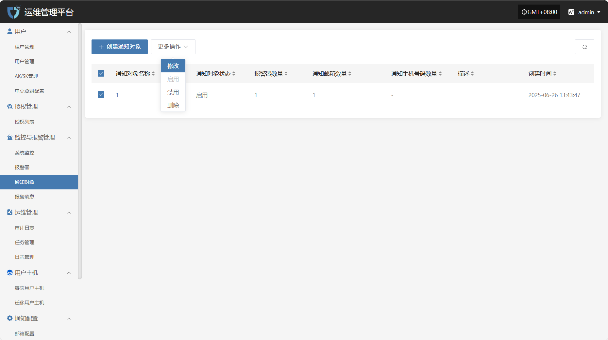
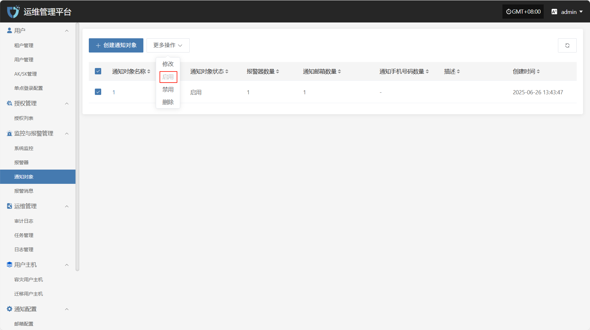
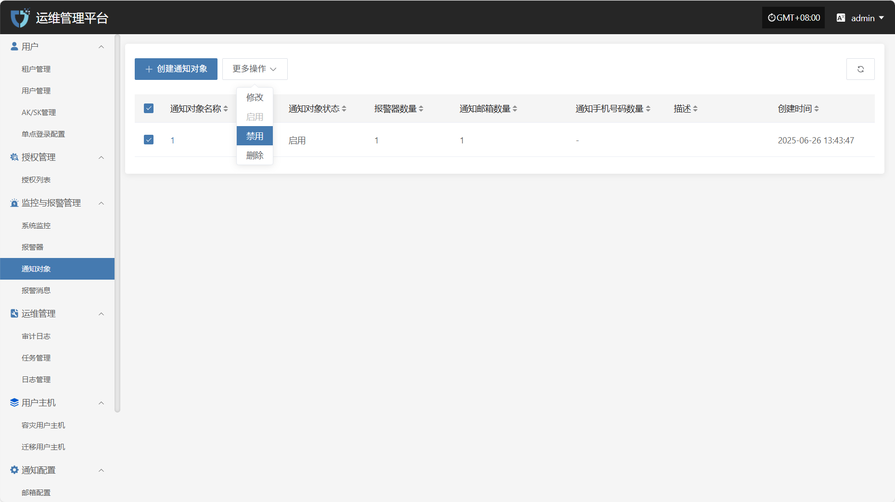
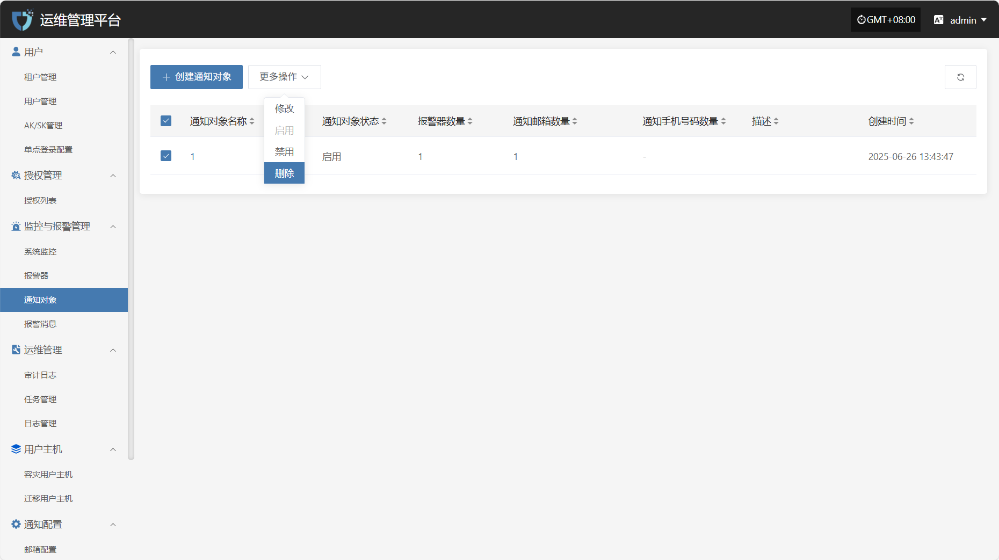

# **通知对象**

“通知对象”模块用于定义接收告警通知或系统消息的目标用户。通过配置通知对象，管理员可以将告警信息、事件通知或其他重要信息推送至指定人员，确保及时响应和处理。

## **创建通知对象**

点击左上角的“创建通知对象”按钮，开始创建通知对象。

* 鉴权信息说明

| **配置项**    | **示例值**           | **说明**                                        |
| ---------- | ----------------- | --------------------------------------------- |
| **通知对象名称** | 运营团队              | 配置通知的目标对象自定义名称，建议使用标识性字段便于管理。                 |
| **描述**     | 负责系统监控与维护         | 简要描述该通知对象的功能或职责，帮助理解其用途。                      |
| **启用状态**   | 启用 / 禁用           | 设置通知对象的状态，启用后该对象将接收相关通知，禁用后不接收任何通知。           |
| **报警器**    | 选择报警器名称           | 选择该通知对象所关联的报警器，可在报警器创建[点击查看](../monitor/alarm.md#创建报警器)                  |
| **发送通道**   | xxx@163.com       | 设置该通知对象的发送方式，可选择邮件通知。若未配置发送通道，请点击链接查看配置[点击查看](../notification/email.html#邮箱配置-1) |
| **通知邮箱**   | <ops@example.com> | 配置接收通知的邮箱地址，适用于通过邮件方式发送通知的对象，可配置多个            |

完成鉴权信息配置后，点击页面右下角的“确定”按钮，系统将创建通知对象并保存相关设置。

## **更多操作**

### **修改**

列表选择需要操作的通知对象后，点击“修改”，可修改部分鉴权信息

### **启用**

点击“启用”按钮，可激活处于禁用状态的通知对象

### **禁用**

点击“禁用”按钮，可禁用处于启用状态的通知对象

### **删除**

点击“移除”按钮，可移除该通知对象

