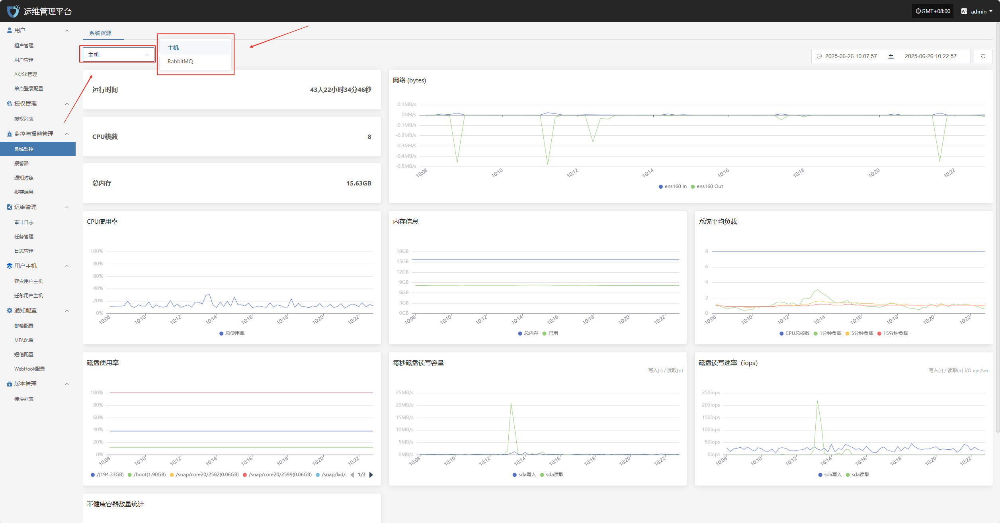
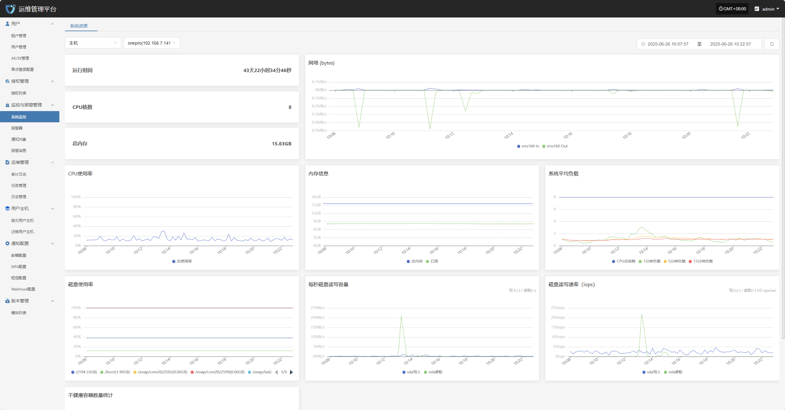
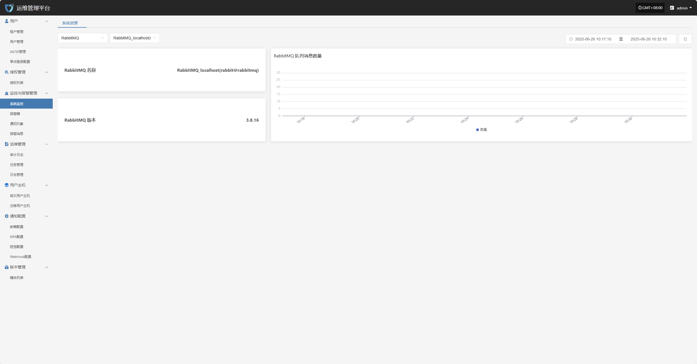

# **系统监控**

“系统监控”模块通过图表实时展示平台各关键组件的运行状态与性能指标，帮助管理员全面掌握系统健康状况，及时发现潜在异常，确保平台稳定高效运行。

用户可点击左上角资源类型下拉列表，切换查看主机、RabbitMQ 等不同资源的监控信息。

## **主机**

**主机监控**用于实时展示所选资源主机的资源使用情况，包括 CPU、内存、磁盘等关键性能指标，帮助管理员及时掌握系统负载状态。

* 相关监控项如下所示

| **监控项**      | **说明**                                 |
| ------------ | -------------------------------------- |
| 运行时间         | 当前系统或核心组件自启动以来的累计运行时长。                 |
| CPU 核数       | 系统可用的物理/逻辑 CPU 核心数量。                   |
| 总内存          | 系统检测到的可用物理内存总量。                        |
| 网络（Bytes）    | 网络接口的发送和接收数据总量，单位为字节。                  |
| CPU 使用率      | 当前 CPU 使用百分比，反映系统负载情况。                 |
| 内存信息         | 包括已用内存、可用内存、缓存等详细使用情况。                 |
| 系统平均负载       | 显示系统在过去 1、5、15 分钟的平均进程负载，反映整体处理能力。     |
| 磁盘使用率        | 当前磁盘空间的使用情况，按挂载点统计，通常以百分比形式显示。         |
| 每秒磁盘读写容量     | 反映当前每秒写入和读取磁盘的数据量，单位为 MB/s 或 KB/s。     |
| 磁盘读写速率（IOPS） | 当前磁盘每秒进行的读写操作次数（I/O ops/sec），用于评估磁盘性能。 |
| 不健康容器数量统计    | 当前处于异常或非运行状态的容器数量，用于监控平台容器运行健康状况。      |

## **RabbitMQ**

**RabbitMQ 监控**用于跟踪消息队列服务的RabbitMQ 名称、版本、队列消息数量等指标，确保平台任务调度与消息通信的稳定性。

* 相关监控项如下所示

| **字段名称**        | **说明**                           |
| --------------- | -------------------------------- |
| RabbitMQ 名称     | 显示当前监控的 RabbitMQ 节点名称及节点标识。      |
| RabbitMQ 版本     | 当前运行的 RabbitMQ 服务版本号。            |
| RabbitMQ 队列消息数量 | 当前节点中所有队列内累计的待处理消息数量，用于评估消息堆积情况。 |
