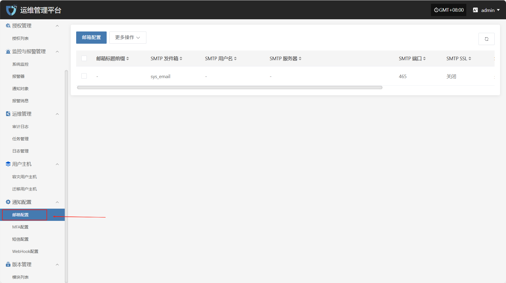
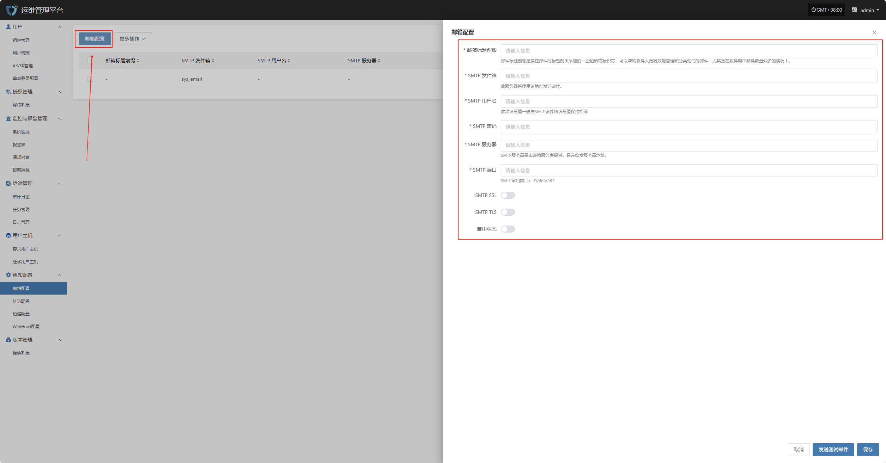
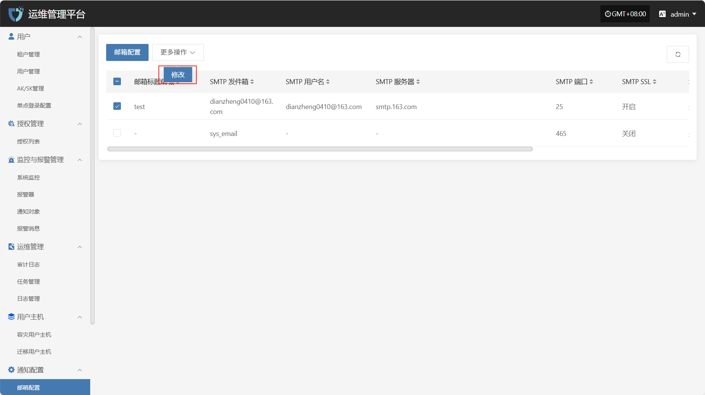

# **邮箱配置**

“邮箱配置”模块用于设置系统邮件通知相关参数。通过配置SMTP服务器地址、端口号、发件人邮箱及认证信息，系统可实现告警通知、任务状态、系统事件等信息的邮件推送功能，确保通知的及时性与可靠性，帮助用户实时掌握系统运行状态。

在左侧导航栏中点击 **“通知配置”**，然后选择 **“邮箱配置”** 进入邮箱通知设置页面。

## **邮箱配置**

点击左上角的“邮箱配置”按钮，开始设置邮箱鉴权信息。

* 鉴权信息说明

| **配置项**  | **示例值**                           | **说明**                                                                            |
| -------- | --------------------------------- | --------------------------------------------------------------------------------- |
| 邮箱标题前缀   | HyperBDR                          | 邮件标题前缀是指在邮件的标题前面添加的一些短语或标识符，可以帮助收件人更有效地管理和分类他们的邮件，尤其是在收件箱中邮件数量众多的情况下。             |
| SMTP 发件箱 | no-reply@oneprocloud.com        | 发件人邮箱地址，系统将通过该地址发送通知邮件。                                                           |
| SMTP 用户名 | no-reply@oneprocloud.com        | 用于SMTP身份验证的用户名，通常与发件邮箱地址一致。                                                       |
| SMTP 密码  | \*\*\*\*\*\*\*\*                  | SMTP服务器认证所需的密码，部分邮箱可能要求填写授权码（需在邮箱服务端获取）。                                          |
| SMTP 服务器 | smtp.qq.com | 邮件服务提供商的SMTP服务器地址，如使用QQ邮箱则为 smtp.qq.com，使用企业邮箱则需填写对应SMTP地址。 |
| SMTP 端口  | 465                               | 用于SMTP通信的端口号。常见端口包括25（非加密）、465（SSL）、587（TLS）。                                     |
| SMTP SSL | 启用                                | 是否启用SSL加密传输。启用后邮件将通过SSL方式发送，提升传输安全性。                                              |
| SMTP TLS | 不启用                               | 是否启用TLS加密传输，部分SMTP服务需启用该项。                                                        |
| 启用状态     | 启用                                | 是否启用当前邮箱配置。启用后，系统将使用此配置发送通知邮件；如关闭，则不会通过邮箱发送通知。                                    |

鉴权信息填写完成后，可点击下方&#x7684;**“发送测试邮件”**&#x6309;钮，验证邮件发送是否正常。测试通过后，点击页面右下角&#x7684;**“保存”**&#x6309;钮，完成邮箱配置。

> **注意：** 点&#x51FB;**“取消”**&#x540E;，所有未保存的邮箱鉴权配置信息将被清空，请确保在离开页面前已完成“保存”操作。

## **更多操作**

### **修改**

点击“修改”，可对鉴权信息进行编辑操作

