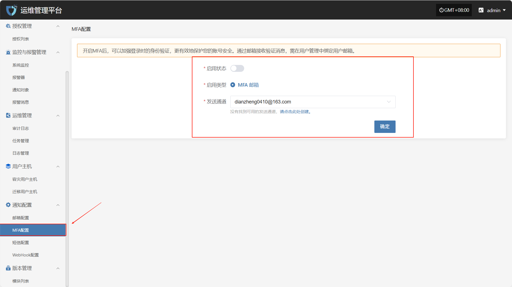

# MFA配置

“MFA配置”模块用于启用并管理多因素认证（Multi-Factor Authentication），增强系统账户的安全性。通过配置MFA，用户在登录系统时除输入用户名和密码外，还需输入动态验证码，有效防止账户被盗用或恶意访问。

开启MFA后，可以加强登录时的身份验证，更有效地保护您的账号安全。通过邮箱接收验证消息，需在用户管理中绑定用户邮箱。

> **注意：** 启用 MFA 后，请确保用户已正确绑定对应邮箱，否则将无法正常登录系统。

在左侧导航栏中点&#x51FB;**&#x20;“通知配置”**，然后选择 **“MFA配置”** 进入MFA设置页面。

* 配置说明

| 配置项  | 示例值             | 说明                                             |
| ---- | --------------- | ---------------------------------------------- |
| 启用状态 | 是 / 否           | 通过页面按钮选择是否启用多因素认证功能。启用后，用户登录需通过邮箱验证码完成身份验证。    |
| 启用类型 | MFA邮箱           | 当前支持的验证类型。系统目前支持通过邮箱方式进行 MFA 验证。               |
| 发送通道 | 163\*\*@163.com | 指定用于发送验证码的邮箱账号。若未找到可用通道，请前往“邮箱配置”模块中添加并启用发件邮箱。 |

在完成所有配置项填写后，点击页面右下角&#x7684;**“确定”**&#x6309;钮，保存当前 MFA 设置状态。
