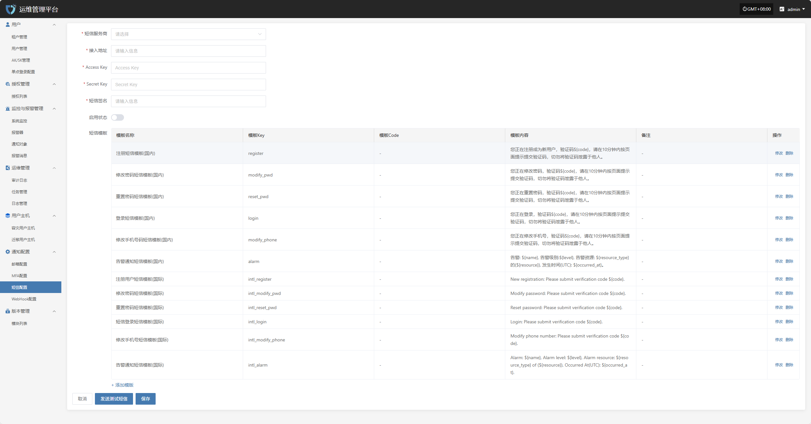
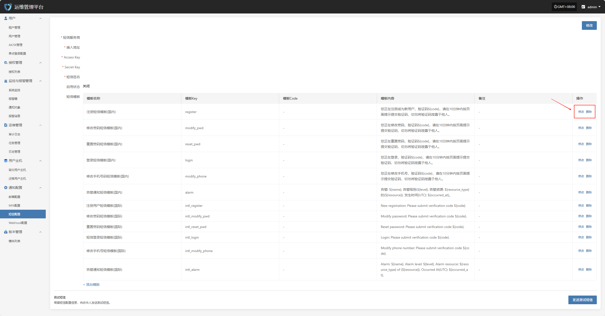
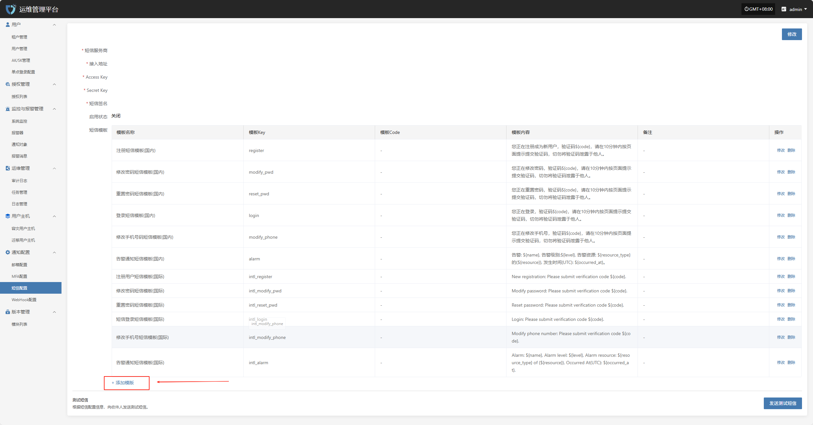

# **短信配置**

“短信配置”模块用于设置系统短信通知的发送通道。通过对接短信服务商平台并配置相应的访问密钥、签名、模板等信息，系统可实现包括登录验证、告警通知、任务状态等在内的短信推送功能。该功能有助于用户在第一时间获取关键系统事件，提升系统的响应效率和安全性。

在左侧导航栏中点&#x51FB;**“通知配置”**，然后选&#x62E9;**“短信配置”**&#x8FDB;入短信通知设置页面。

## **修改**

点击又上角的“修改”按钮，开始设置短信鉴权信息。

* 配置信息说明

| **配置项**    | **示例值**                                 | **说明**                                  |
| ---------- | --------------------------------------- | --------------------------------------- |
| 短信服务商      | 阿里云                                     | 选择系统接入的短信服务提供商。需确保在该服务商平台开通短信服务并获得相关凭据。 |
| 接入地址       | https://dysmsapi.aliyuncs.com           | 服务商提供的短信 API 接入地址，不同服务商地址可能不同。          |
| Access Key | AKIDEXAMPL\*\*\*\*\*\*\*\*\*\*\*\*\*    | 用于身份认证的访问密钥（Access Key ID），由短信服务商提供。    |
| Secret Key | wJalrXUtnFE\*\*\*\*\*\*\*\*\*\*\*\*\*\* | 与 Access Key 配套使用的密钥，用于安全验证，请妥善保管。      |
| 短信签名       | OnePro                                  | 已在短信服务平台备案的签名，用于短信发送时展示在短信内容前。          |
| 启用状态       | 启用 / 关闭                                 | 是否启用当前短信配置。启用后系统将通过该配置发送短信通知，关闭则不发送。    |

鉴权信息填写完成后，可点击下方&#x7684;**“发送测试短信”**&#x6309;钮，验证短信发送是否正常。测试通过后，点击页面右下角&#x7684;**“保存”**&#x6309;钮，完成短信配置。

> **注意：** 点&#x51FB;**“取消”**&#x540E;，所有未保存的短信鉴权配置信息将被清空，请确保在离开页面前已完成“保存”操作。

### **短信模板**

用于配置系统在发送通知短信时所使用的内容模板。每条短信模板包含模板编号、内容格式及变量参数，用于统一短信通知格式，提升信息表达的一致性和可识别性。短信模板需在短信服务商平台预先创建并审核通过，方可在系统中使用。

#### **修改/删除**

在模板列表页面，点击对应模板右侧的“修改”或“删除”按钮，可对短信模板进行编辑或移除操作。

#### **添加模板**

当默认短信模板无法满足当前业务需求时，您可以点击页面上的“添加模板”按钮，自定义并添加新的短信模板以适配不同场景。

