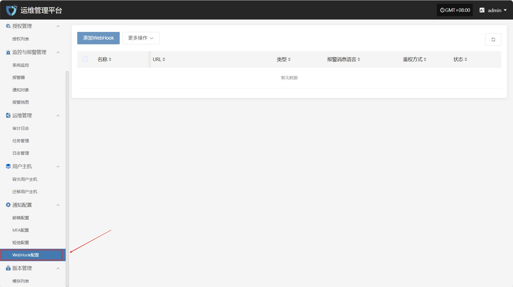
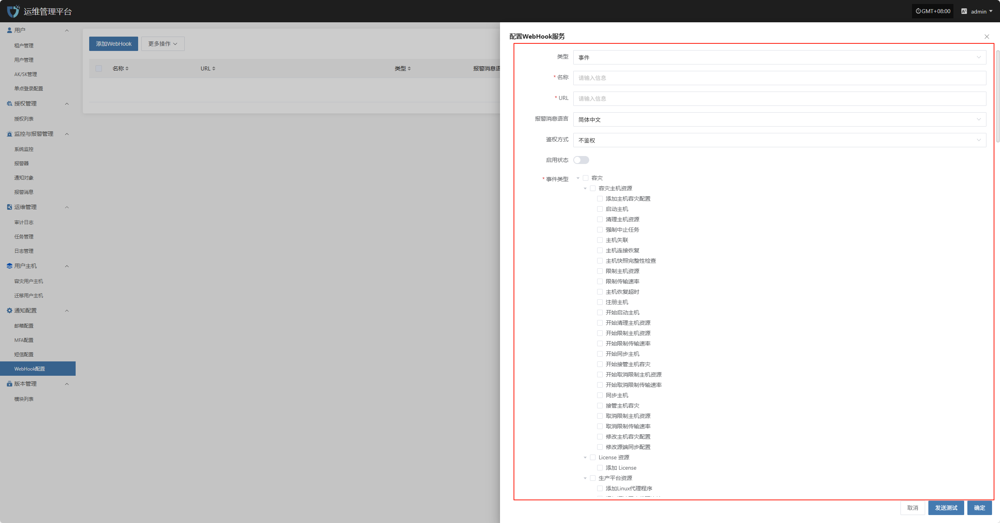
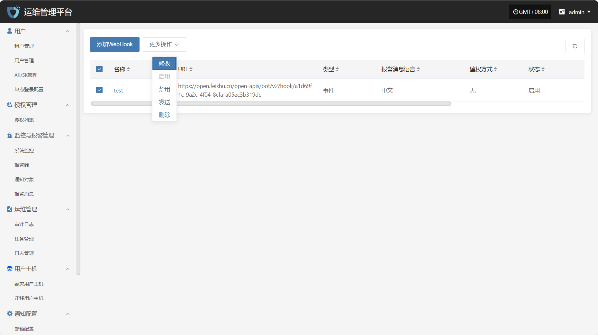
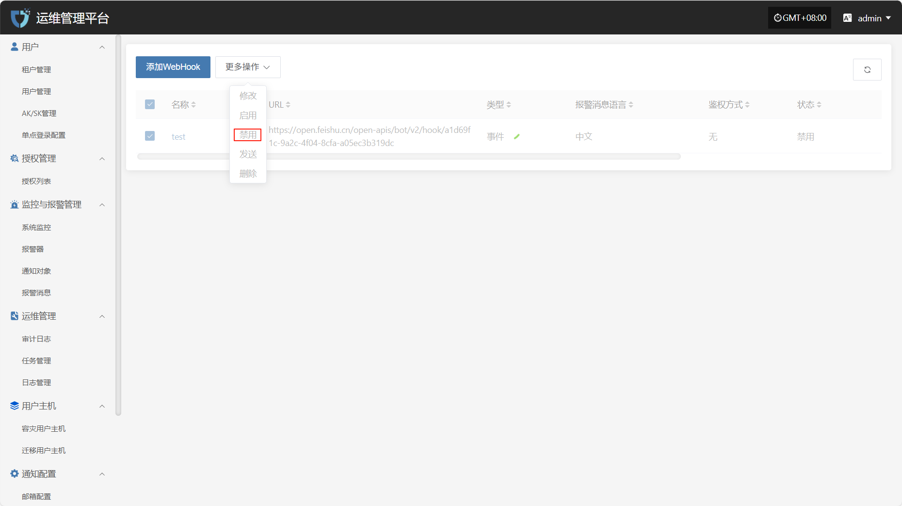
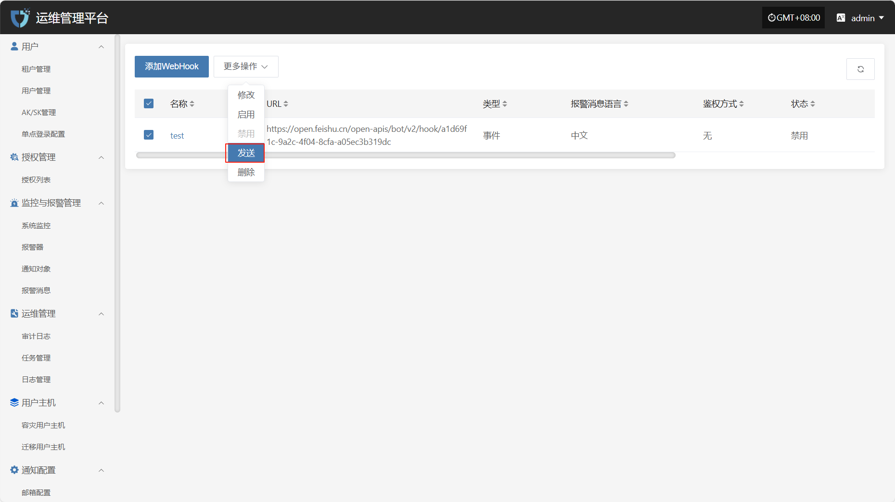
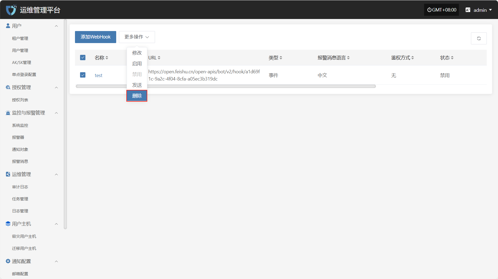

# **WebHook**

"WebHook"用于实现系统事件的实时通知和数据推送。当指定事件发生时，系统会向预配置的 URL 发送 HTTP 请求，将事件信息推送到第三方服务或自定义应用，实现系统与外部平台的联动与自动化通知。

在左侧导航栏中点&#x51FB;**“通知配置”**，然后选&#x62E9;**“WebHook”**&#x8FDB;入WebHook通知设置页面。

## 添加WebHook

点击左上角的“添加WebHook”按钮，开始设置WebHook鉴权信息。

* 鉴权信息说明

| **配置项** | **示例值**                       | **说明**                                  |
| ------- | ----------------------------- | --------------------------------------- |
| 类型      | 事件 / 告警                       | Webhook 的类别，区分不同的推送用途，如系统事件或告警通知。       |
| 名称      | test                          | 用于标识该 Webhook 配置的名称，便于管理和区分。            |
| URL     | <https://example.com/webhook> | 接收事件推送的目标地址，系统会向此 URL 发送 HTTP 请求。       |
| 报警消息语言  | 简体中文                          | 推送消息的语言，可根据用户需求选择对应语言版本。                |
| 鉴权方式    | 不鉴权                           | 选择 Webhook 请求的鉴权方式。                     |
| 启用状态    | 启用 / 禁用                       | 是否启用该配置，启用后系统会按设定事件类型推送通知。              |
| 事件类型    | 主机失联                          | 触发 Webhook 推送的具体事件类型，如主机失联、主机恢复超时等，可多选。 |

鉴权信息填写完成后，可点击下方&#x7684;**“发送测试”**&#x6309;钮，验证WebHook服务发送是否正常。测试通过后，点击页面右下角&#x7684;**“保存”**&#x6309;钮，完成WebHook配置。

> **注意：** 点&#x51FB;**“取消”**&#x540E;，所有未保存的WebHook鉴权配置信息将被清空，请确保在离开页面前已完成“保存”操作。

## 更多操作

### 修改

点击“修改”，可对鉴权信息进行编辑操作

### 启用

点击“启用”按钮，可激活处于禁用状态的 Webhook

### 禁用

点击“禁用”按钮，可禁用处于启用状态的 Webhook

### 发送

点击“发送”按钮，系统将向配置的目标地址发送测试消息，用于验证 Webhook 设置是否正确

### 删除

点击“删除”按钮，即可删除选中的配置项，操作不可恢复，请谨慎确认

