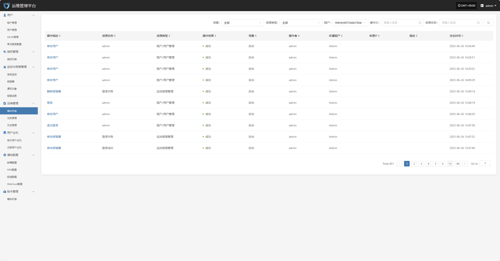
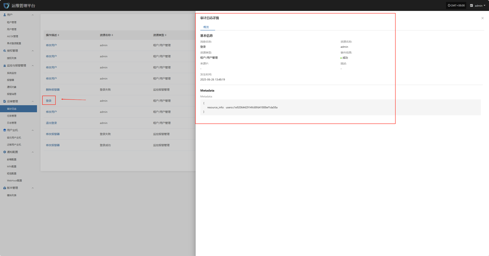

# **审计日志**

“审计日志”模块用于记录和展示平台上的所有重要操作行为，提供详细的操作历史记录。通过审计日志，管理员可以追踪系统使用情况、权限变更、用户行为等，保障系统操作的透明性和安全性，便于事后审查、故障排查及合规性审计。

页面上方，支持根据场景、资源类型、租户等多维条件进行筛选，便于用户高效查找和管理告警记录。

在审计日志列表中，点击任意一条日志的“操作描述”字段，即可查看该操作的详细内容，包括具体变更项与执行参数。

