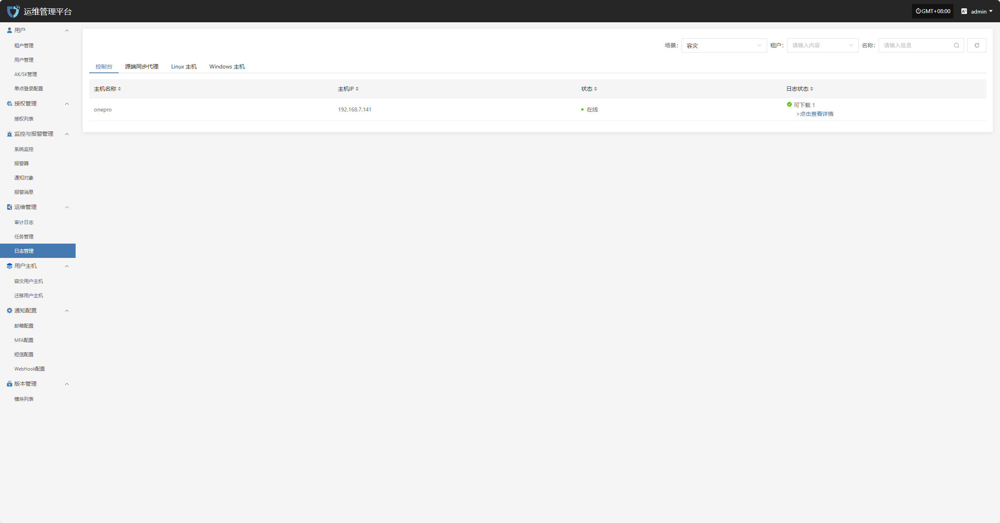
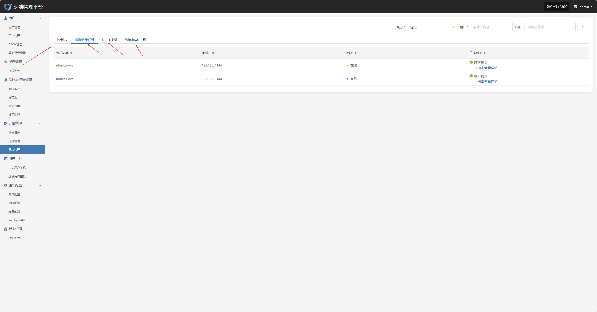
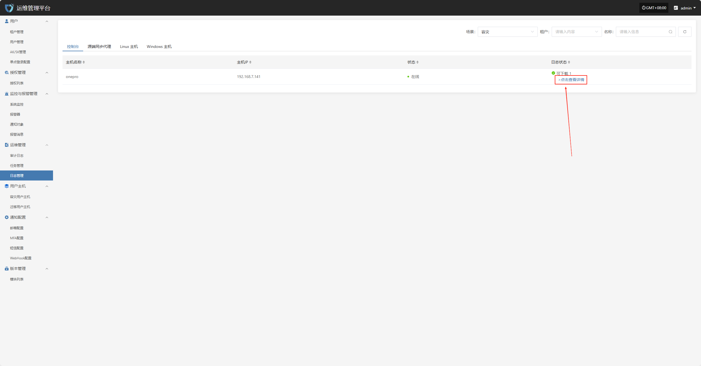
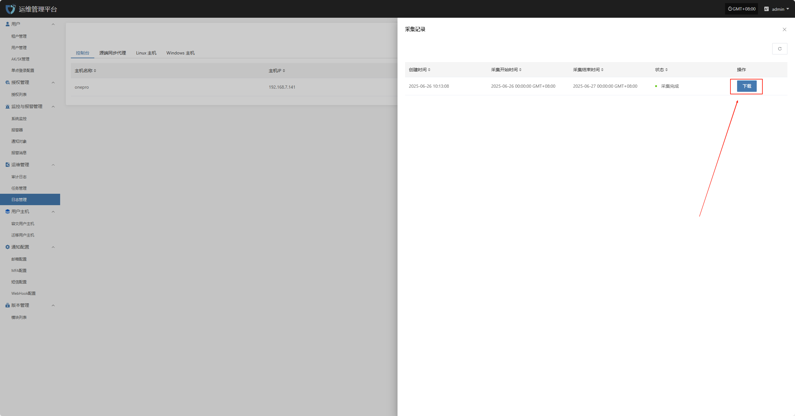

# **日志管理**

“日志管理”模块用于查看和管理平台中主机的日志信息，支持按主机类型（如源端同步代理、Linux 主机、Windows 主机）进行分类展示。用户可通过筛选功能快速定位目标主机，并查看其日志状态、下载日志文件或查看日志详情，便于问题排查与系统审计。

为便于查看不同主机或组件的日志信息，页面上方提供“控制台”、“源端同步代理主机”等类型标签，点击即可切换日志列表内容。

## **日志下载**

点击“> 点击查看详情”可进入日志详情页面，查看对应主机的详细日志列表，系统将按时间顺序展示各类日志文件，支持下载操作。

在日志详情页面，点击对应日志条目的“下载”按钮，即可将该日志文件下载到本地设备，便于离线查看与问题排查。

> **注意事项：** 日志文件需在收集完成后方可查看或下载。如当前主机未执行日志收集，请先进行收集操作。 [点击查看指南](../../dr/operations/download-logs.html#收集示例-控制台)

