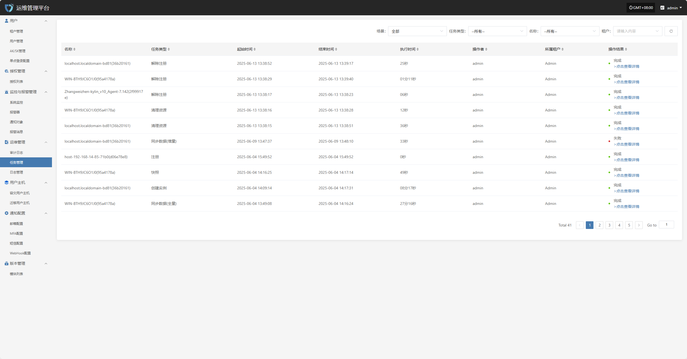
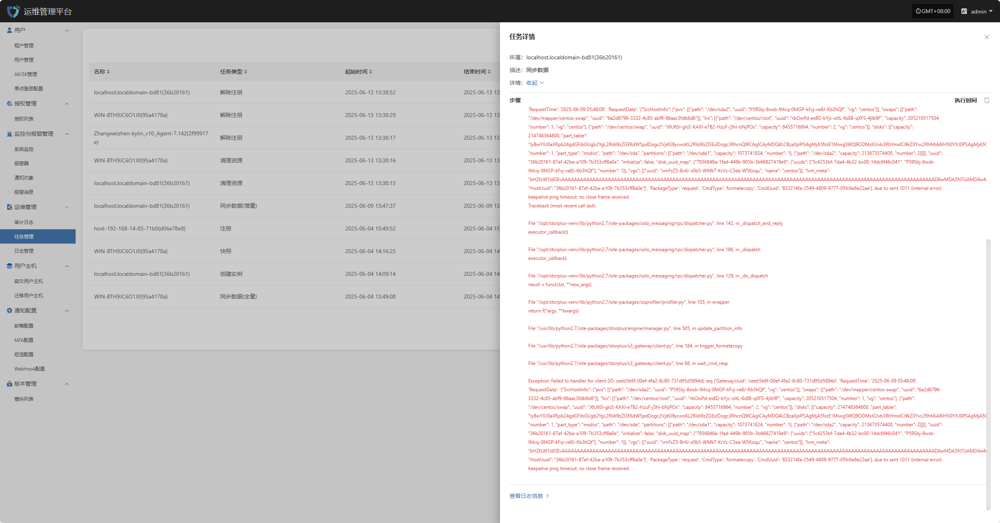

# **任务管理**

“任务管理”模块用于集中展示平台中各类任务的执行记录与状态详情，帮助用户了解任务的执行过程、耗时及执行人信息。用户可通过点击任务记录查看完整的执行详情，用于问题排查和结果确认。

页面上方，支持根据场景、资源类型、租户等多维条件进行筛选，便于用户高效查找和管理告警记录。

用户可在任务管理列表中，点击操作结果字段中的“点击查看详情”链接，查看该任务对应的完整执行日志，便于问题排查与结果确认。

