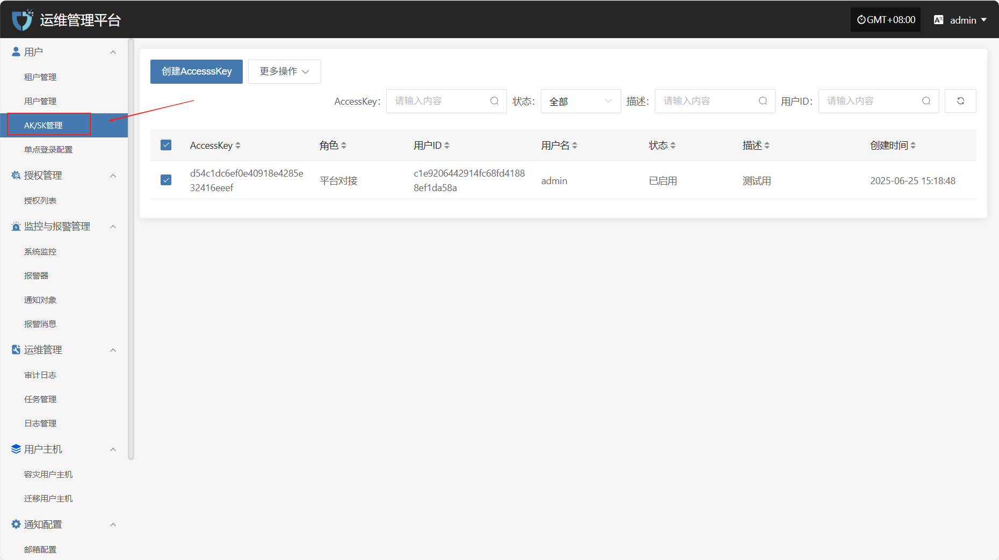
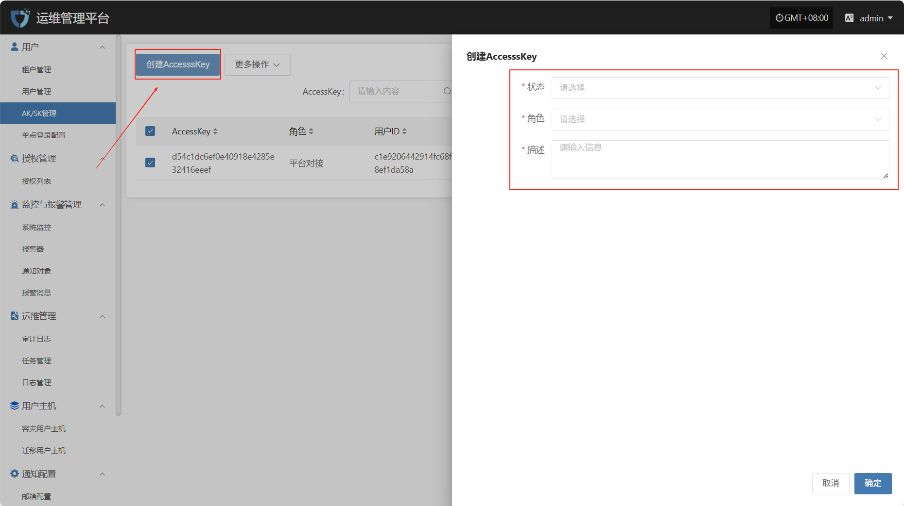
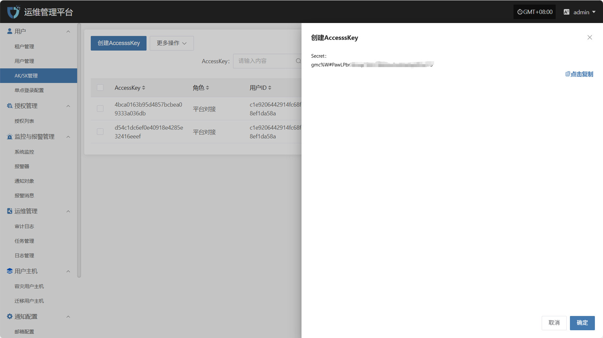
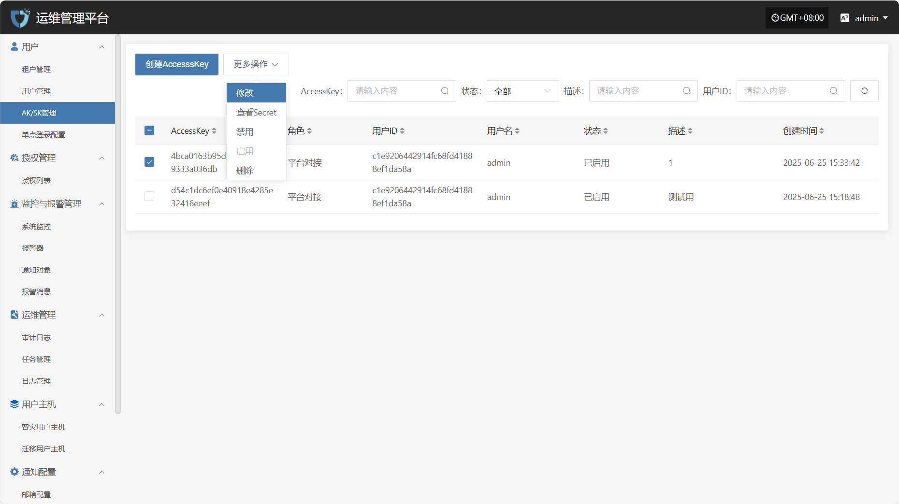
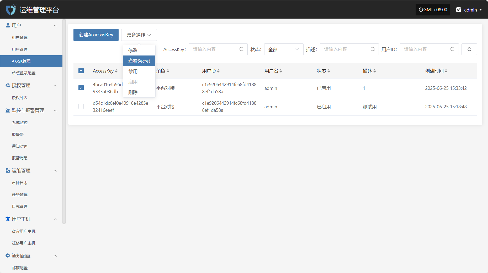
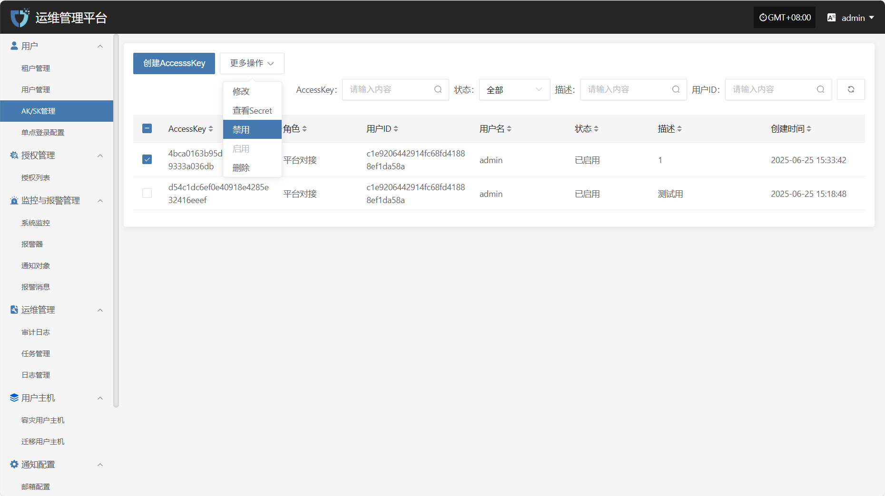
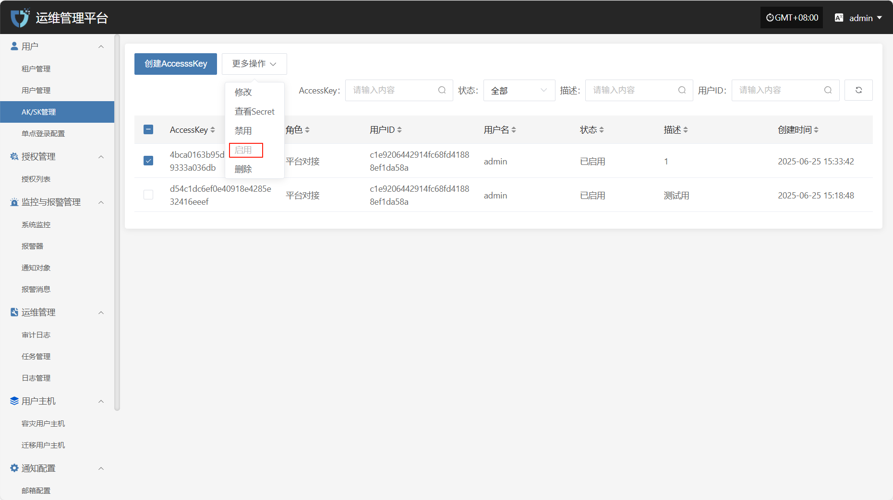
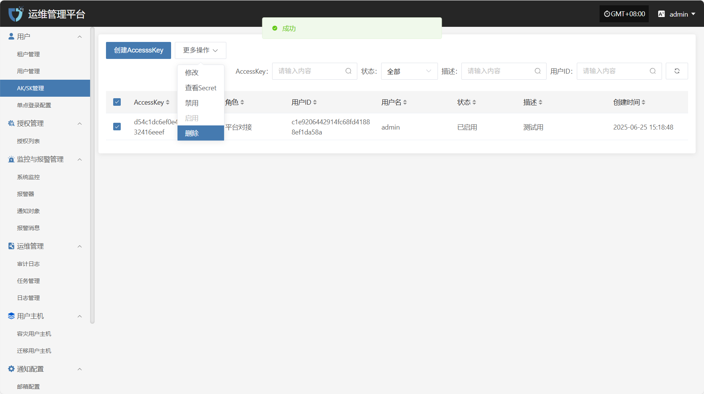

# AK/SK管理

“AK/SK 管理”模块用于为用户生成和管理访问密钥（Access Key / Secret Key），以支持系统接口的身份验证与安全访问。通过分配 AK/SK，系统可实现对 API 调用用户的身份识别和权限控制，是进行自动化对接、第三方系统集成的重要基础。

可通过右侧搜索框按照条件进行筛选查询。

## 创建AccesssKey

点击左上角的“创建AccesssKey”按钮，开始创建AccesssKey。

* 鉴权信息说明

| **配置项** | **示例值** | **说明**                           |
| ------- | ------- | -------------------------------- |
| 状态      | 启用      | 表示当前密钥的使用状态。启用表示可用于系统访问，禁用则暂不可用。 |
| 角色      | 平台对接    | 分配给密钥的角色，用于限定该 AK/SK 的权限范围。      |
| 描述      | 测试ak    | 对该密钥的用途或背景的简要说明，便于识别和管理。         |

填写完所有配置信息后，点击“确定”完成密钥创建。Secret 值将在创建成功后立即显示，请务必妥善保存

## 更多操作

### 修改

列表选择需要操作的Ak后，点击“修改”，可修改部分鉴权信息

### 查看Secret

点击“查看Secret”后，可重新查看Secret 值

### 禁用

点击“禁用”按钮，可禁用处于启用状态的Ak

### 启用

点击“启用”按钮，可激活处于禁用状态的Ak

### 删除

点击“删除”按钮，可移除该Ak

