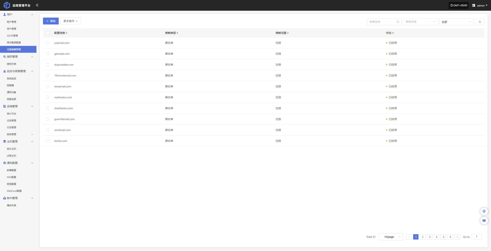
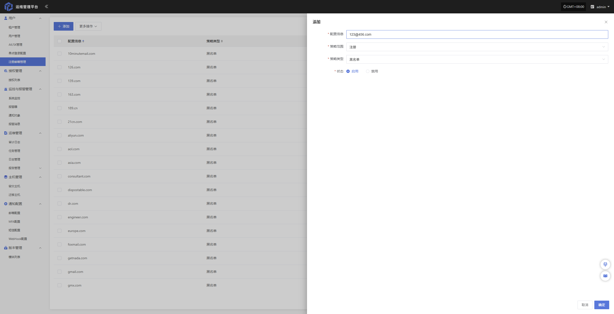
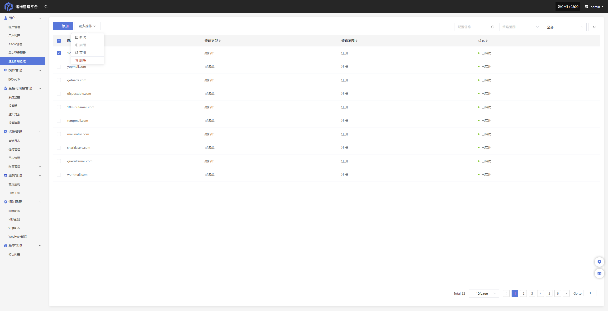

# 注册邮箱管理

该功能用于对用户注册所使用的邮箱进行黑名单管理。管理员可将指定邮箱或邮箱域名加入黑名单，加入后将禁止使用该邮箱或域名进行注册。

通过该功能，可有效限制特定来源的注册行为，提升系统安全性与账号管理规范性。

> 系统初始默认屏蔽 51 个邮箱地址，支持根据实际需求对已屏蔽邮箱进行调整，同时可新增需屏蔽的邮箱地址。

## 添加

点击左上角添加即可开始添加管理邮箱

- 配置信息说明

| **配置项** | **示例值** | **说明**                 |
| ------- | ------- | ---------------------- |
| 配置信息     | 456.com   | 需限制的邮箱地址或邮箱域名（如填写 456.com 表示限制该域名下的所有邮箱）。   |
| 策略范围     | 注册   | 指该策略生效的业务范围，例如“注册”表示仅对用户注册行为生效。   |
| 策略类型      | 黑名单      | 表示被配置的邮箱或域名将被禁止使用。 |
| 状态      | 启用      | 表示该策略当前是否生效，启用后立即按策略执行。 |

## 更多操作

### 修改

列表选择需要操作的配置信息后，点击“修改”，可修改部分鉴权信息

### 启用

点击“启用”按钮，可激活处于禁用状态的邮箱管理策略

### 禁用

点击“禁用”按钮，可关闭处于启用状态的邮箱管理策略

### 删除

点击“删除”按钮，可移除该邮箱管理策略

