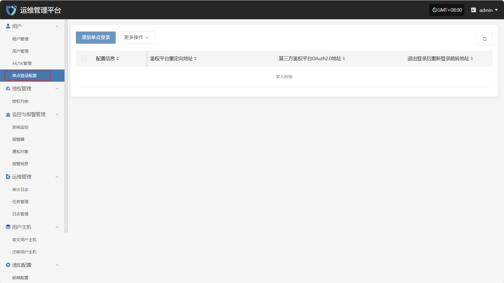
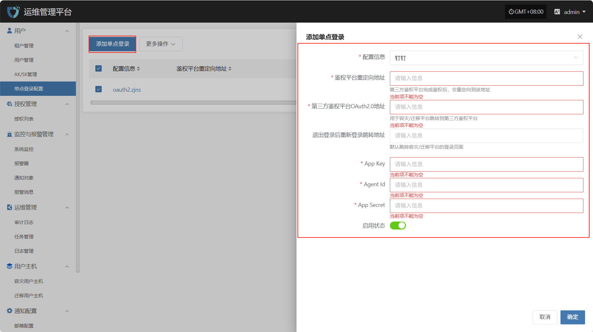
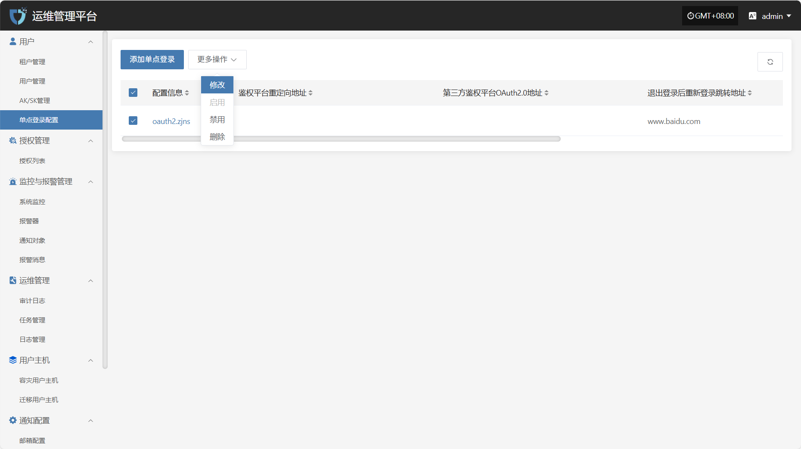
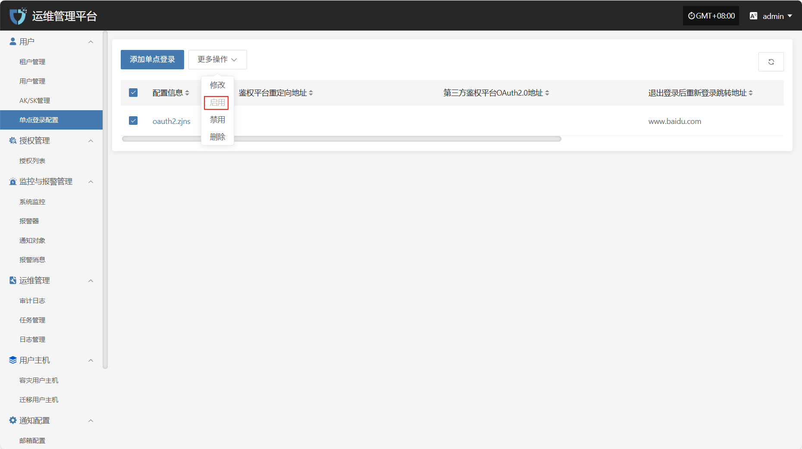
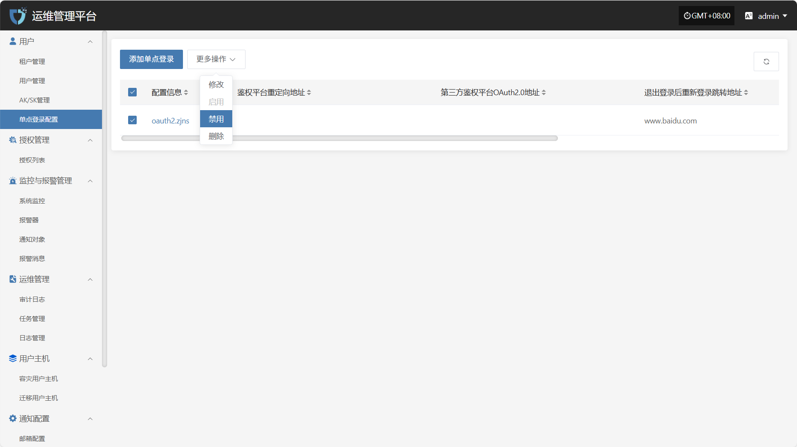

# **单点登录配置**

“单点登录配置”模块用于对接第三方身份认证系统，实现用户在多个系统间的统一身份认证与自动登录，提升系统集成效率与用户体验。

## **添加单点登录**

点击左上角的“添加单点登录”按钮，开始添加单点登录。

* 鉴权信息说明

| **配置项**           | **示例值**                            | **说明**                                   |
| ----------------- | ---------------------------------- | ---------------------------------------- |
| 配置信息              | 钉钉                                 | 当前支持钉钉、浙江农信、BinaryOwl三种                  |
| 鉴权平台重定向地址         | https://example.com/callback     | 第三方鉴权平台完成认证后，跳转回本系统的地址。必须为平台已备案的合法回调地址。  |
| 第三方鉴权平台OAuth2.0地址 | https://login.dingtalk.com/oauth | 系统跳转至钉钉进行 OAuth2.0 鉴权的入口地址。              |
| 退出登录后重新登录跳转地址     | https://example.com/login        | 用户退出登录后重新访问系统时的默认跳转登录地址。通常为容灾/迁移平台登录页。   |
| App Key           | 请填写                                | 钉钉开放平台申请的 App Key，用于标识第三方应用身份。           |
| Agent ID          | 请填写                                | 钉钉应用对应的 Agent ID，用于指定接入的微应用标识。           |
| App Secret        | 请填写                                | 与 App Key 配套的密钥，用于签名与身份校验。请妥善保管，避免泄露。    |
| 启用状态              | 启用 / 禁用                            | 控制当前单点登录配置是否生效。 |

> 注意：当选择浙江农信或BinaryOwl时则只需要填写APl Base URL和退出登录后重新登录跳转地址即可

## **更多操作**

### **修改**

列表选择需要操作的配置信息后，点击“修改”，可修改部分鉴权信息

### **启用**

点击“启用”按钮，可激活处于禁用状态的单点登录配置

### **禁用**

点击“禁用”按钮，可禁用处于启用状态的单点登录配置

### **删除**

点击“删除”按钮，可移除该单点登录配置

