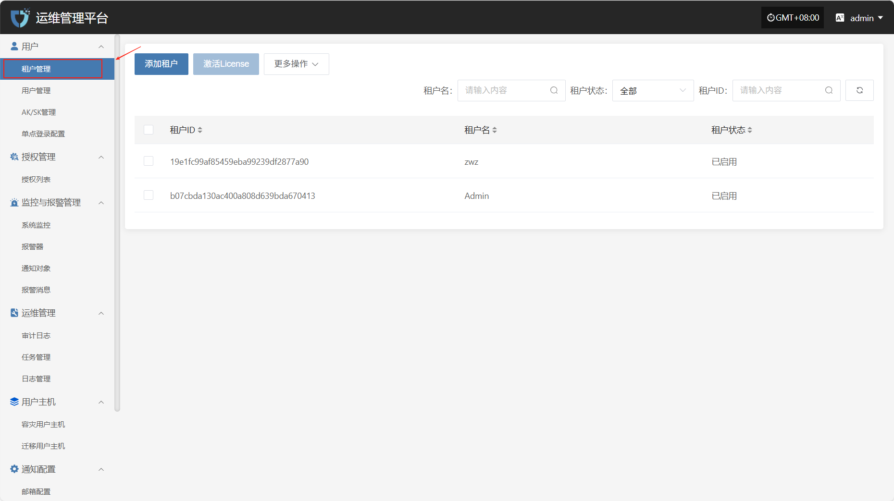
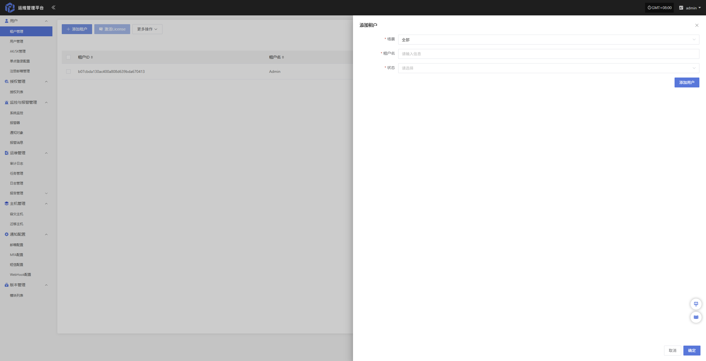
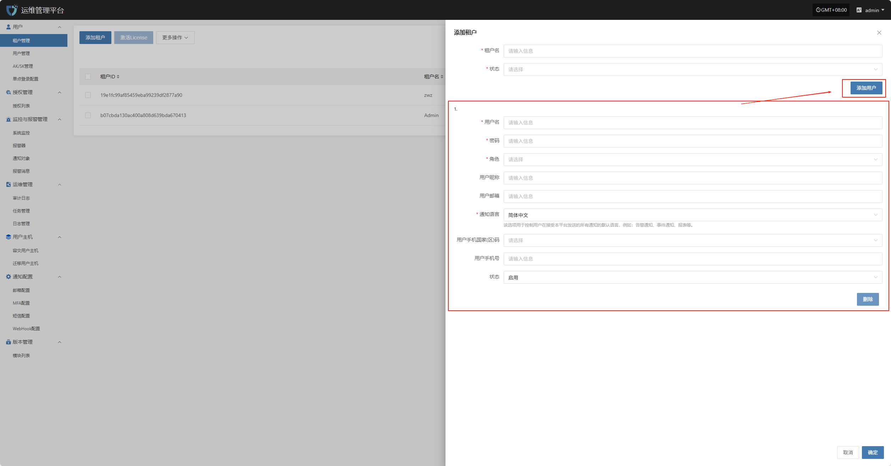
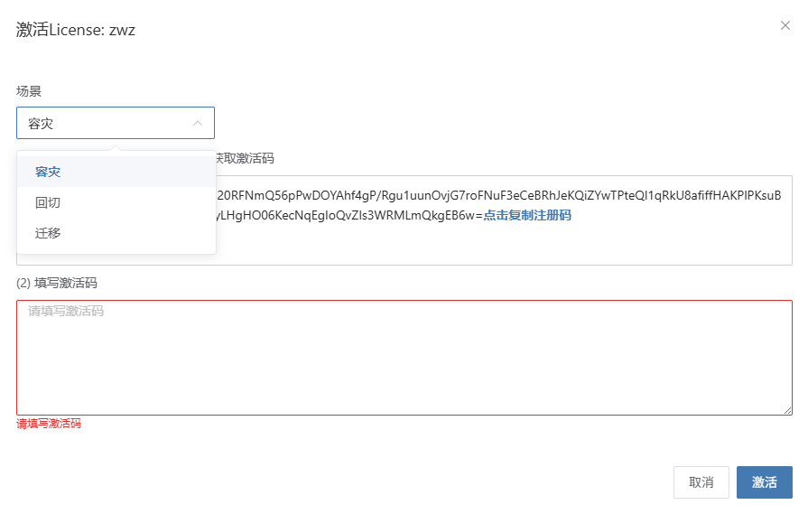
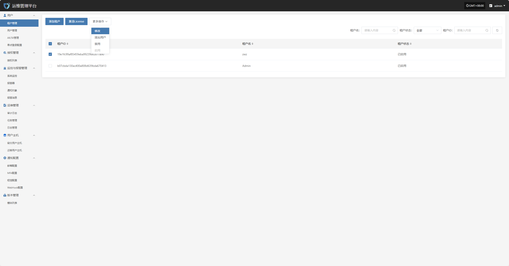
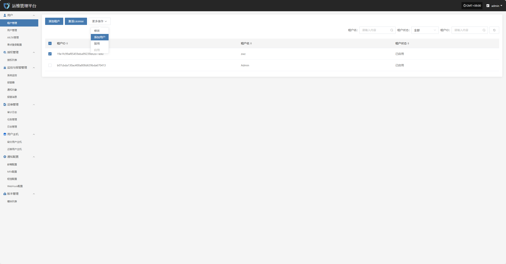
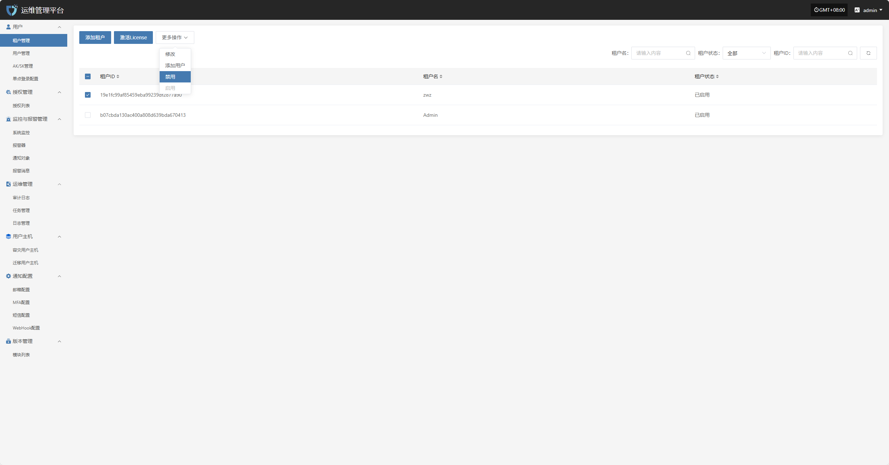
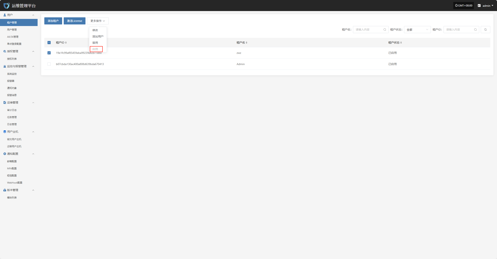

# **租户管理**

“租户管理”模块用于统一管理系统中的各个租户信息。管理员可在此创建、编辑、查看和删除租户账户，并为租户分配资源、配置权限与隔离策略，实现多租户环境下的统一调度与权限控制。

可通过右侧搜索框，按租户名称、状态或租户 ID 进行筛选查询。

## **添加租户**

点击左上角的“添加租户”按钮，开始创建租户。

* 鉴权信息说明

| **配置项** | **示例值** | **说明**                 |
| ------- | ------- | ---------------------- |
| 租户名     | test1   | 系统中用于标识租户的名称，应保持唯一性。   |
| 状态      | 启用      | 表示当前租户的使用状态，可设置为启用或禁用。 |

在填写完租户鉴权信息后，点击“确定”即可创建新租户。若需为该租户分配初始用户，可在下方点击“添加用户”按钮，完成用户绑定操作（可添加多个用户）。

* 添加用户说明

| **字段名称**   | **示例/默认值**  | **说明**                           |
| ---------- | ----------- | -------------------------------- |
| 用户名        | dame1       | 系统登录所使用的唯一用户名，不可重复。              |
| 密码         | xxxxxxxxxx  | 设置用户初始登录密码，建议包含大小写字母和数字。         |
| 角色         | 平台管理员       | 分配用户在平台中的角色，不同角色对应不同权限范围。        |
| 用户昵称       | dame1       | 用户在系统中显示的名称，可为中文或英文，支持自定义。       |
| 用户邮箱       | xxx@163.com | 用于接收通知、验证码等系统信息，需填写有效邮箱地址。       |
| 通知语言       | 简体中文        | 控制用户接收系统通知（如告警、事件）的默认语言。         |
| 用户手机国家(区)码 | 中国          | 选择手机号码所属国家或地区                    |
| 用户手机号      | 1766932xxxx | 用户手机号码，用于接收短信通知等服务。              |
| 状态         | 启用          | 设置该用户账户的启用状态，启用后可正常登录系统，禁用则无法访问。 |

完成租户信息配置后，点击页面右下角的“确定”按钮，系统将创建新租户并保存相关设置。

## **激活License**

列表选择需要激活的租户后，点击页面左上角的“激活License”按钮，进入License激活流程。

根据实际使用需求，选择不同场景获取相应的注册码。

点击下方链接“点击申请”可在线申请激活码，或联系对应客户经理获取激活码。[点击申请](https://hypermotion-license.oneprocloud.com/qr_code?featureCode=fqYuBYFPBsFc5+Xbg3zFi0aqvgtUJJP0dKHjhL/NeUThqvnxrzImzuEv6NkkOvnFx4JEVi9pgx7Cme4AQ7UsDvI0WM3Xk80N1busaC3kEYGmS8D5mI5e/VypZA2Jl8f1ex1fF6kHD+nHqBY+hFpe24gBkk3snedxrQq1zPU6ZlI=\&username=admin\&domain=192.168.7.141\&scene=dr\&mobile=\&FailbackFeatureCode=GoRIoJJlSorp6szdSNs9%2F85%2Frv3Jpbo8w%2F6ErZloOe9djEVGnLkEu5VQCowmdJCEdIi1l%2FS5h5Q7QQcu31ueJLH9q6vnL9HutFK6Q3pRuckA08GLEf6Ykg7GVosobLdSzPC8hMv4cJPU2eTO561tmDjlnuYNbcEFPhiT8k1Ab5U%3D\&email=dianzheng0410%40163.com\&origin_type=cn\&lang=zh)

在收到激活码后，请将其输入到指定输入框中，点击“激活”按钮以完成License激活。

## **更多操作**

### **修改**

点击“修改”，可对鉴权信息进行编辑操作

### **添加用户**

点击“添加用户”按钮，可添加并绑定新用户至当前租户。

### **禁用**

点击“禁用”按钮，可禁用处于启用状态的租户

### **启用**

点击“启用”按钮，可激活处于禁用状态的租户

