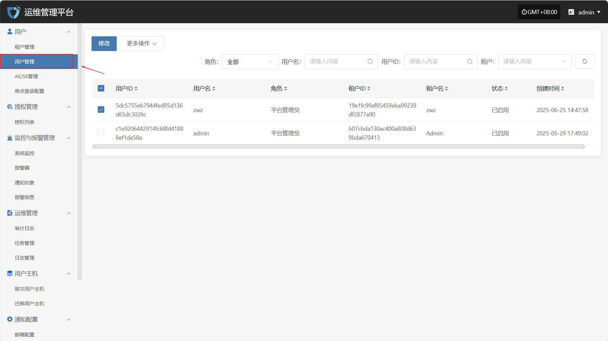
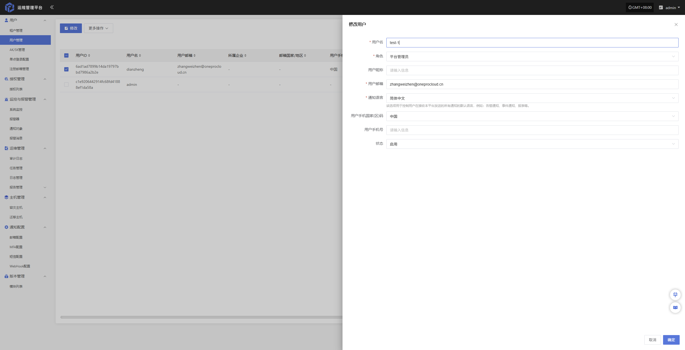
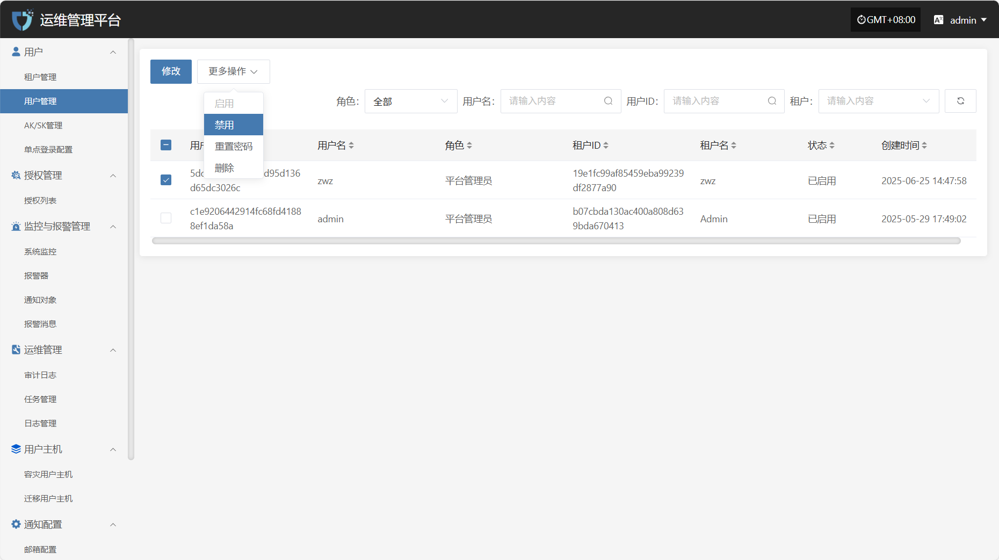
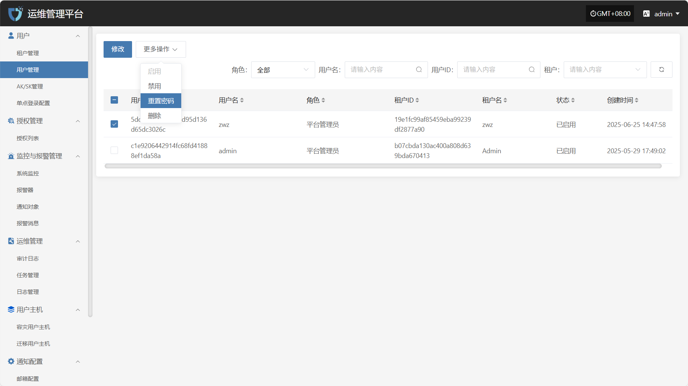
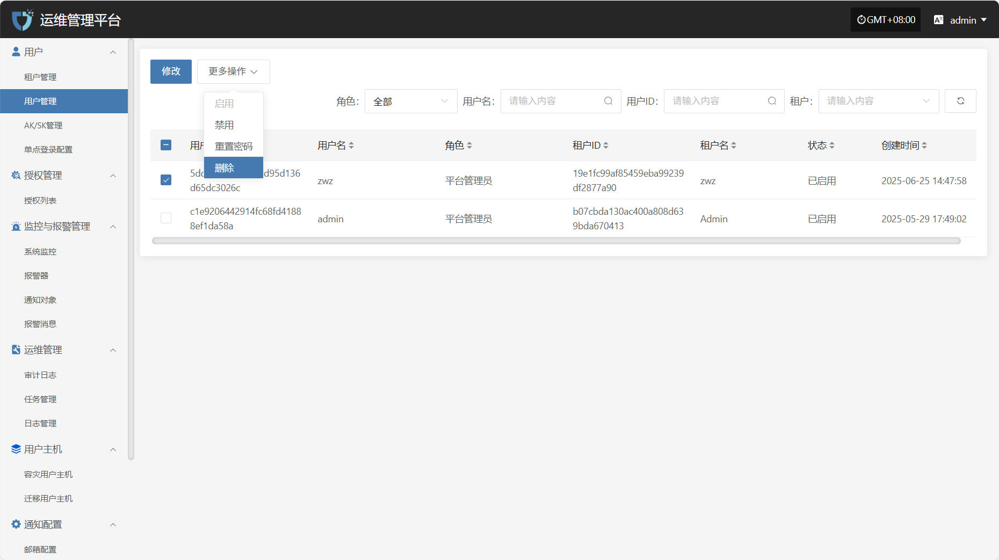

# **用户管理**

“用户管理”模块用于统一管理系统中的所有用户账户，包括用户的编辑、状态控制及权限分配。通过该模块，管理员可实现对不同租户下用户的集中配置与精细化管理，保障系统的安全性与操作规范性。

可通过右侧搜索框，按角色类型、用户名、租户名称或租户 ID 进行筛选查询。

## **修改**

列表选择需要操作的用户后，点击右上方“修改”，可修改用户部分鉴权信息

* 用户鉴权信息说明

| **字段名称**   | **示例/默认值**  | **说明**                           |
| ---------- | ----------- | -------------------------------- |
| 用户名        | dame1       | 不可修改                             |
| 角色         | 平台管理员       | 分配用户在平台中的角色，不同角色对应不同权限范围。        |
| 用户昵称       | dame1       | 用户在系统中显示的名称，可为中文或英文，支持自定义。       |
| 用户邮箱       | xxx@163.com | 用于接收通知、验证码等系统信息，需填写有效邮箱地址。       |
| 通知语言       | 简体中文        | 控制用户接收系统通知（如告警、事件）的默认语言。         |
| 用户手机国家(区)码 | 中国          | 选择手机号码所属国家或地区                    |
| 用户手机号      | 1766932xxxx | 用户手机号码，用于接收短信通知等服务。              |
| 状态         | 启用          | 设置该用户账户的启用状态，启用后可正常登录系统，禁用则无法访问。 |

完成用户信息修改后，点击页面右下角的“确定”按钮，保存相关设置。

## **更多操作**

### **启用**

点击“启用”按钮，可激活处于禁用状态的用户

### **禁用**

点击“禁用”按钮，可禁用处于启用状态的用户

### **重置密码**

点击“重置密码”按钮，可为该用户重新设置登录密码

### **删除**

点击“删除”按钮，可移除该用户账户

