# DR OM Object Storage

[[toc]]

# I. Disaster Recovery Scenario Overview

This user guide explains the use of HyperBDR to backup various types of hosts from the source platform to Huawei public cloud by supporting S3 protocol object storage.

# II. Basic requirements

- The hosts (VMware virtual machines) that need to be protected against disasters.

- Installation of HyperBDR disaster recovery tool and the login credential.

- Object storage.

# III.  Workflow

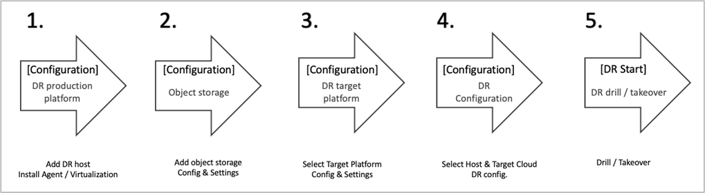

# IV. Disaster Recovery Operations

## 1. Configure the Production Platform 

### 1.1. Log in to HyperBDR Disaster Recovery Tool 

### 1.2. Disaster Recovery of VMware Virtual Machines to Huawei Cloud

#### 1.2.1. Configuring the Production Platform (VMware)

**[Note]**

- When the source  ( the host to be protected) is a VMware virtual machine, relevant configurations need to be performed.

- This scenario can achieve agentless disaster recovery, meaning that there is no need to install an agent in each VMware virtual machine to achieve non-intrusive operations.

**[Basic requirements]**

- A vCenter/ESXi cluster

- Installation of VMware vSphere Client and login to the vCenter/ESXi cluster.

- Installation of HyperBDR disaster recovery tool and the login credential.

- Enable the network policy for the VMware virtual machines on production platform to HyperBDR and the cloud synchronization gateway.

**Step 1:** Click **"Configuration"**, click on **"Production Site"** in the left menu, and than click the **""+Add""** button to add the agentless proxy component **"Hamal"** in the **VMware** tab.  

>  For the initial addition of VMware, you need to install the **"Hamal"** component (refer to Step 2).  

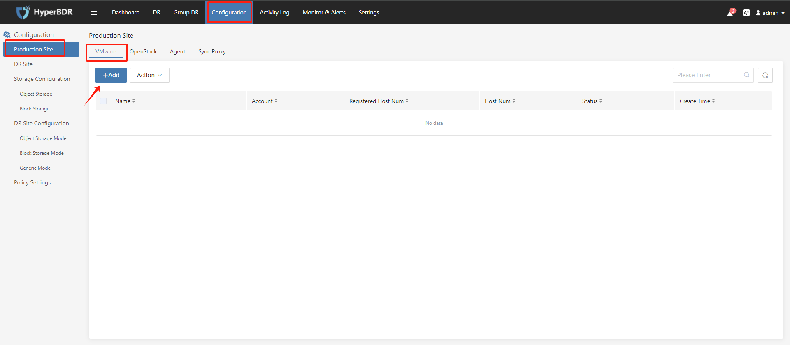

**Step 2:** Install Hamal as per the prompts

> If you have already installed Hamal as outlined in the VMware DR Solution POC Preparation Doc, you can proceed directly to **Step 3**.

(1) Download the OVA to the VMware end or prepare a CentOS7.x version virtual machine at the source end.

(2) Install the agent by executing the installation command in the background of the host imported through OVA or the prepared CentOS7.x virtual machine.

Note: Please operate according to the current display information on the disaster recovery tool. This action is performed by the user in the VMware vSphere Client environment

(3) After installation, return to the disaster recovery tool and click on the **"Next"** button.

> _Please refer to the following document for the procedure to deploy Hamal on the VMware side using the OVA template._
> _Documentation Link: _[_https://docs.oneprocloud.com/userguide/poc/vmware-pre-settings.html#import-ova-images-and-create-proxy-virtual-machine-in-vmware_](https://docs.oneprocloud.com/userguide/poc/vmware-pre-settings.html#import-ova-images-and-create-proxy-virtual-machine-in-vmware)

**Step 4:** Fill in the relevant information in the pop-up box to complete configurations

| **Auth Url** | vCenter/ESXi Url |
| --- | --- |
| **Username** | vCenter/ESXi Account (Administrator Privileges)  |
| **Password** | vCenter/ESXI Password |
| **SyncNode** | IP Information exported after the host installed from OVA in the previous step. |

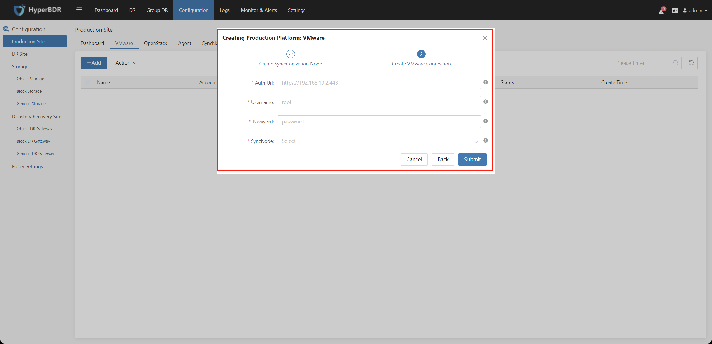

**Complete Configuration**

After vCenter/ESXI has been successfully added to the disaster recovery production platform. Repeat the above steps to add multiple vCenters as needed.

After completing the VMware production platform configuration, you can proceed to [1.2.2. Add disaster recovery host(s)].

#### 1.2.2. Add Disaster Recovery Host(s) 

After clicking on **"DR,"** select **"Host DR"** from the left menu, then click on **"+Add Host"** on the right side, and choose the **"Agentless"** -> **"VMware"**  option.

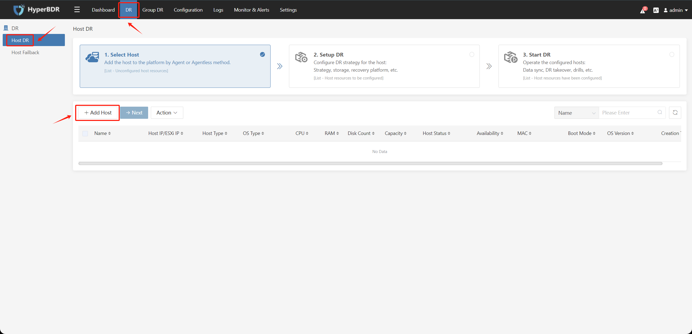

Select one of the VMware source connections and click on the **"Next"** button.

Select the VMware hosts to be protected against disasters from the list of all VMware hosts in the vCenter/ESXi and click on the **"Submit"** button:

If there are multiple hosts, you can search in the upper right corner and perform batch selection. 

On the disaster recovery page, you can view the list of VMware hosts to be protected against disasters. Select the hosts to be operated on, click on the **"Next"** button, and proceed to the disaster recovery configuration operation:

After adding the source end disaster recovery hosts, 

you can proceed to [4. Perform disaster recovery operations]

### 1.3. Disaster Recovery of Physical and Various Virtual Hosts to Huawei cloud

#### 1.3.1 Install Agent on the source Linux host

View documents for operation.

Document Link: [https://docs.oneprocloud.com/userguide/poc/agent-pre-settings.html#install-agent-on-the-source-linux-host](https://docs.oneprocloud.com/userguide/poc/agent-pre-settings.html#install-agent-on-the-source-linux-host)

#### 1.3.2 Install Agent on the source Windows host

View documents for operation.

Document Link: [https://docs.oneprocloud.com/userguide/poc/agent-pre-settings.html#install-agent-on-the-source-windows-host](https://docs.oneprocloud.com/userguide/poc/agent-pre-settings.html#install-agent-on-the-source-windows-host)

---

## 2. Object Storage Settings
### 2.1. Adding Object Storage
**(1) Click on **"Configuration"** in the upper menu bar, select **"Object Storage"** under **"Storage"** on the left, and click on **"+Add"** .**  
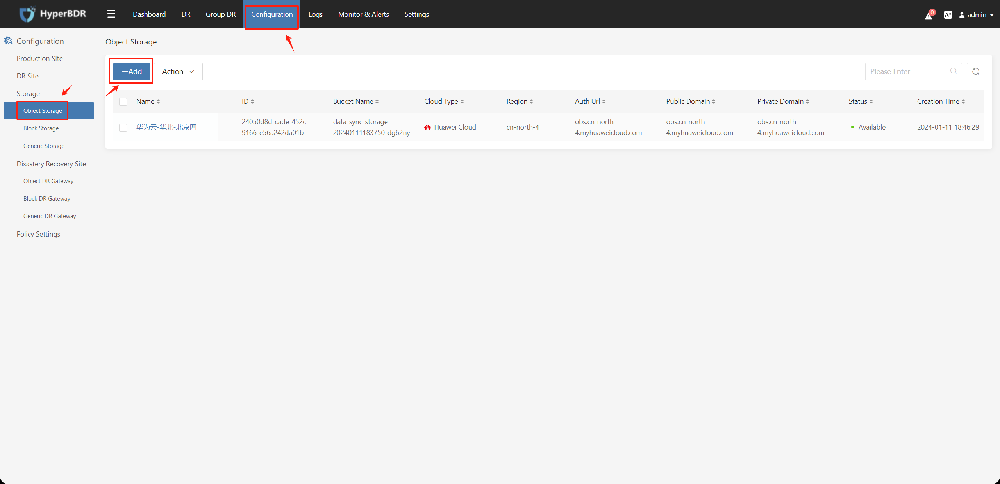

·       Object storage that supports the S3 protocol can be added, including public cloud object storage such as Huawei Cloud object storage and custom object storage deployed through Minio.

**(2) In the **"Object Storage platform"**, select the Huawei Cloud Object Storage region you are using.**  
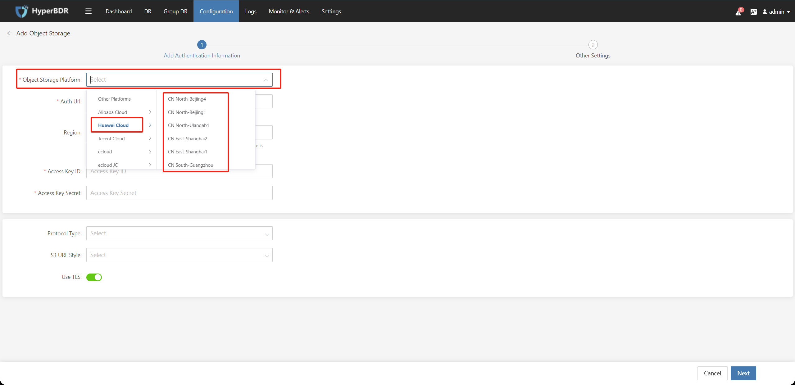

**(3) Fill in the Access Key (AK) and Access Secret Key (SK) for authenticating against the Object Storage. After confirming, click **"Next"**.**  
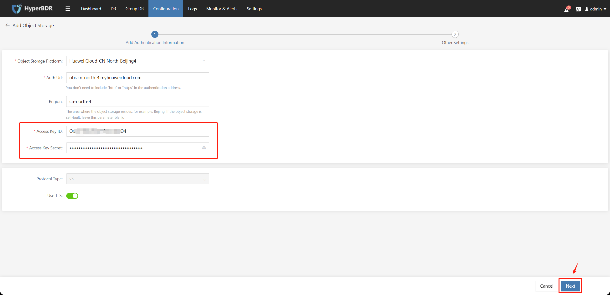

**(4) Set the Object Storage bucket name and click **"Submit"**.**  
> You can either use an existing Object Storage bucket within the region or create a new one with a custom name.

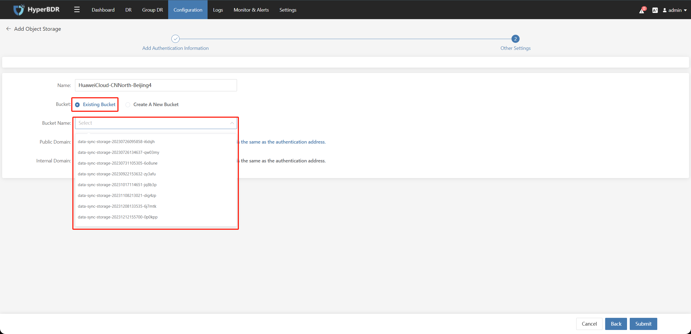

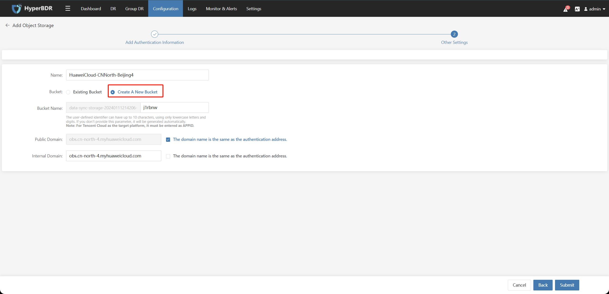

**(5) Object Storage has been successfully added.**  
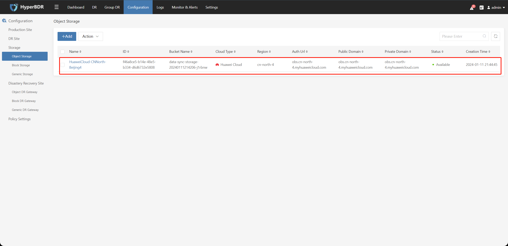

---

## 3. Disaster Recovery Platform Operation

### 3.1. Configure the disaster recovery platform (Huawei Cloud)

**(1) Click on **"Configuration"** in the top menu, choose **"Object DR Gateway"** on the left, and click the **"Add"** button.**

**(2) Follow the steps and fill in the information according to create the link for the disaster recovery platform.**

After authentication is completed, an image will be automatically uploaded under the Huawei Cloud authentication tenant for disaster recovery drills and recovery purposes.

When adding the target disaster recovery platform, the Huawei Cloud authentication information needs to be filled in as shown below:

- Access Key ID: Huawei Cloud account Access Key ID
- Access Key Secret: Huawei Cloud account Access Key Secret
- Region ID: Huawei Cloud account Region ID
- Project ID: Huawei Cloud account Project ID

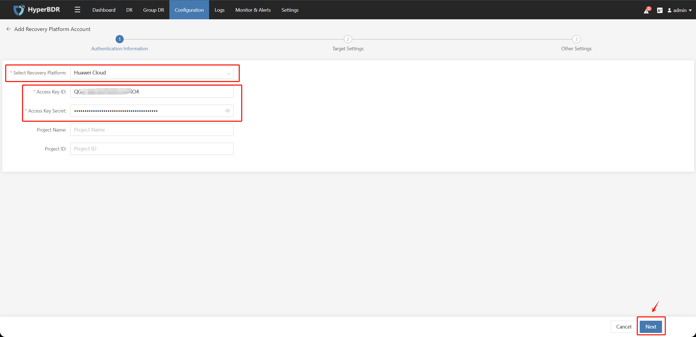

After filling in the details, click on the **"Next"** button:

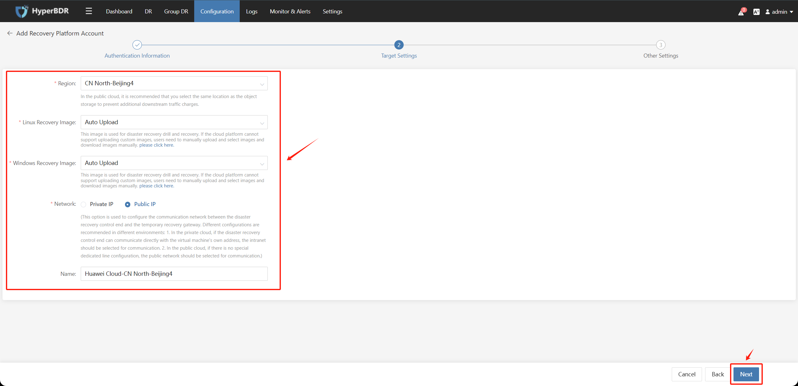

| **Parameter** | **Description** |
| --- | --- |
| **Region** | The region of the disaster recovery platform. Select from the drop-down menu if there are multiple regions. |
| **Network** | Default public network |
| **Linux recovery image** | This image is used for disaster recovery drills and recovery. If the cloud platform does not support uploading custom images, users need to manually upload and select them. |
| **Windows recovery image** | This image is used for disaster recovery drills and recovery. If the cloud platform does not support uploading custom images, users need to manually upload and select them. |

After confirming the information, click on the **"Submit"** button and wait for the completion to be completed in the disaster recovery management platform.

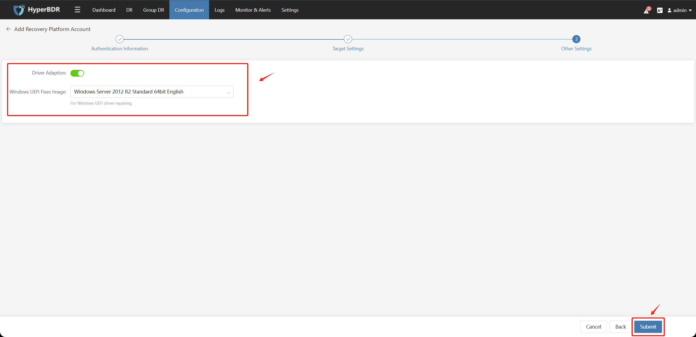

After configuring the disaster recovery platform on Huawei Cloud, you can proceed to [1. Configure the production platform] or proceed to [4. Perform disaster recovery operations]

---

## 4. Perform Disaster Recovery Operations
When the hosts to be protected against disasters have already been added, select the hosts and click on the **"Next"** button to go to the disaster recovery configuration page:  

### 4.1. Disaster Recovery Configuration
On the Hops DR page, select the hosts to be protected against disasters, click on the **"Setup DR"** button, select **"Object Storage Recovery"** and follow the configuration steps:  

**Disaster recovery configuration step 1:** Specify DR Platform; Select the configuration information of the disaster recovery platform where the disaster recovery host is located, and click the "Next" button.

> If the disaster recovery platform information is empty, it means that no disaster recovery platform has been added yet. You need to configure the disaster recovery recovery operation before proceeding with the subsequent operations.

Choose "Object Storage" for the select storage type and select the configured object storage and recovery platform.  
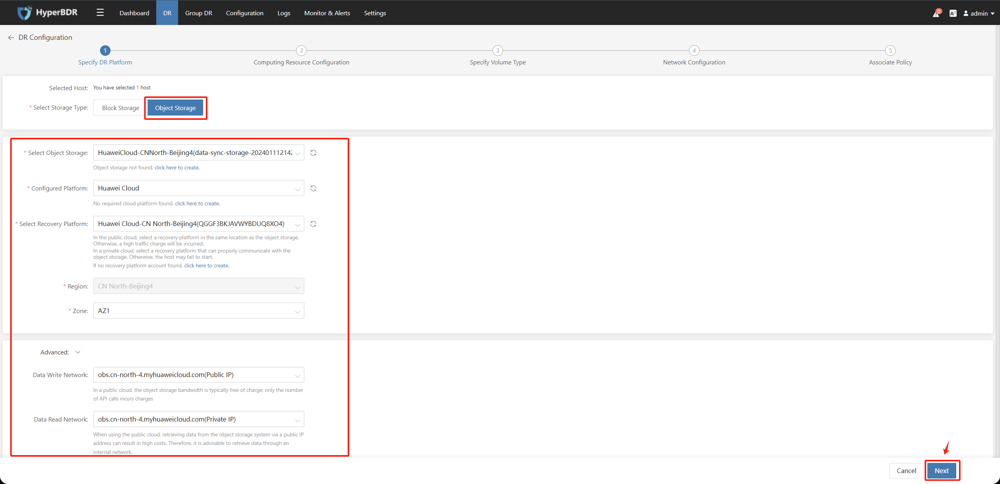

**Disaster recovery configuration step 2:** Computing Resource Configuration; Select the flavor and OS type for the disaster recovery host on the target disaster recovery platform. Once configured, click on the "Next" button.  
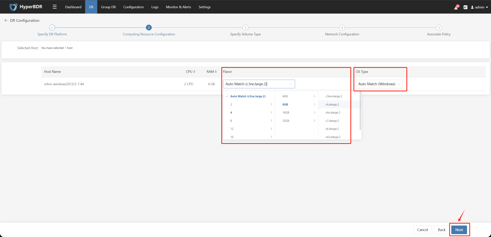

**Disaster recovery configuration step 3:** Specify Volume Type; Choose the volume type used by the disaster recovery host on the target disaster recovery platform. If there are multiple volumes, you can configure them separately for system and data volumes. Once configured, click the "Next" button.  
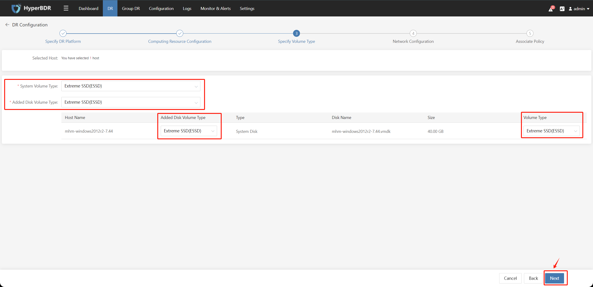

Select the disk for booting. If the first disk in your original system is not designated for booting, you must specify the boot disk here, or it may result in startup failure.  
> Note: In block storage mode, due to limitations in the cloud platform API interface, once data synchronization is completed, the option for the boot disk cannot be changed. Before initiating synchronization, please reconfirm the selected disk for booting. If chosen incorrectly, you will need to clear data and initiate synchronization again. Exercise caution to ensure the accurate selection of the boot disk and avoid unnecessary re-synchronization steps.

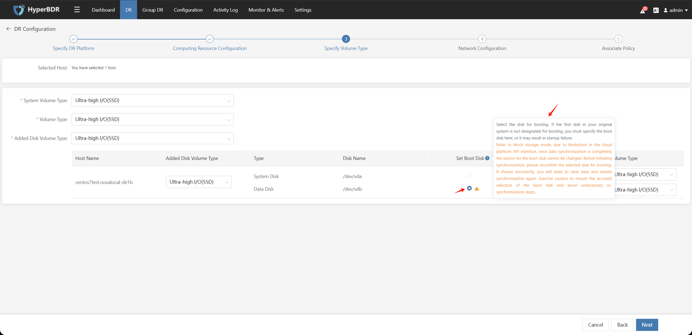

**Disaster recovery configuration step 4:** Network Congfiguration; Select the VPC network, Subnet, and whether to specify an IP address at startup, configure a public IP, and security group for the disaster recovery host on the target disaster recovery platform. Once configured, click the "Next" button.

> VPC networks and Subnets need to be created in advance under your Huawei Cloud account.

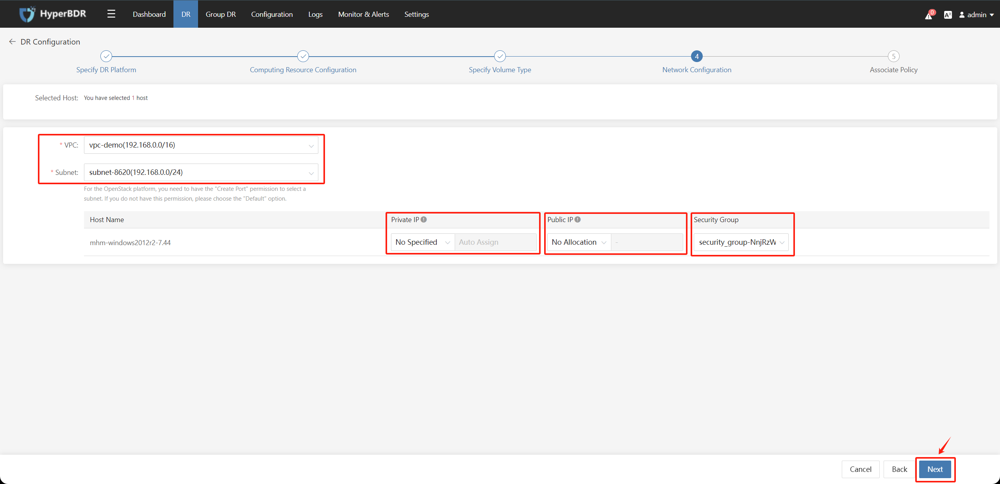

**Disaster recovery configuration step 5:** Associat Policy;  Associate the corresponding disaster recovery policy with the standby host (association can be skipped for now). If there is no policy, you can create a new one. After completion, click the "Submit" button.

> Before starting the policy configuration, the hosts that have already been configured will automatically enter the **"Start DR"** phase.

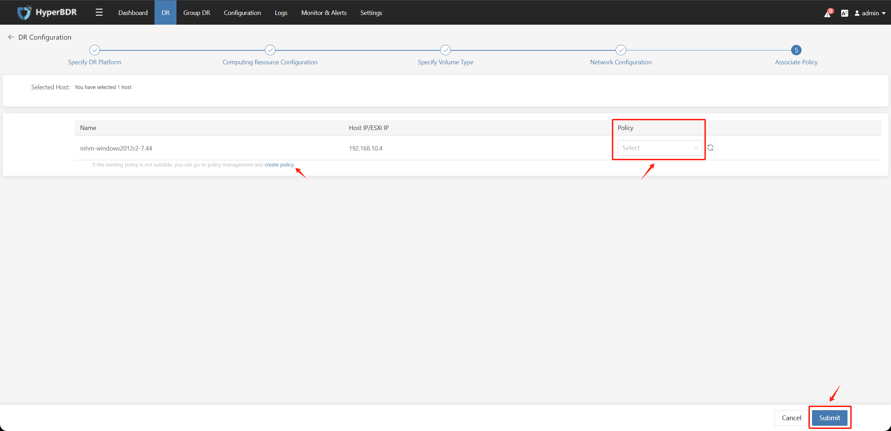

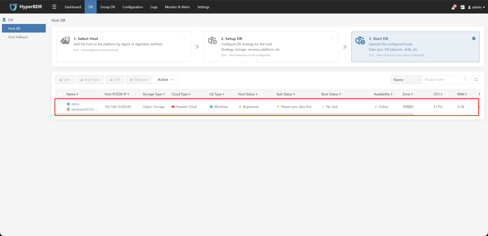

> After completing the disaster recovery configuration, you can still choose to modify the disaster recovery configuration for the host in the **"Action"** section.

---

### 4.2. Data Synchronization (Full / Incremental)

In the **"Start DR"** step, you can select one or more hosts to be protected against disasters, and click on the **"Sync"** button to synchronize data:

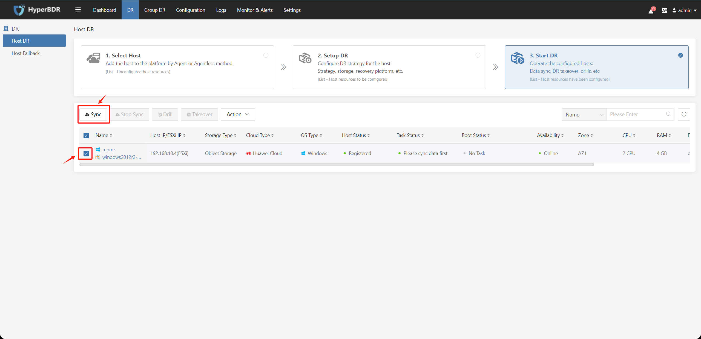

Confirm the disaster recovery hosts that need to be synchronized and click on the **"Submit"** button:

> For the first synchronization, full data will be synchronized. For subsequent synchronizations, incremental data will be synchronized. You can also select run full synchronization, which means that all data will be synchronized during this synchronization.

Wait for the data synchronization of the disaster recovery hosts to complete.

---

### 4.3. DR Drill / DR Takeover

After the data synchronization (snapshot synchronization) is completed, select the host and click on the "Drill" / "Takeover"  button accordingly:

> The  "Drill" / "Takeover"  functions are consistent, these functions indicate starting the disaster recovery host on the disaster recovery platform, and relevant verification and takeover work can be performed after the start.

Select the snapshot time point when starting the disaster recovery hosts and click on the **"Submit"** button to start the host instance.

> **Note:** This action will start an instance on the Huawei platform according to the disaster recovery parameters set for this disaster recovery host. This instance is a host recovered to the cloud. The snapshot time point is generated each time data is synchronized and is used for selection during startup. (The number of reserved snapshot time points can be configured as needed.)

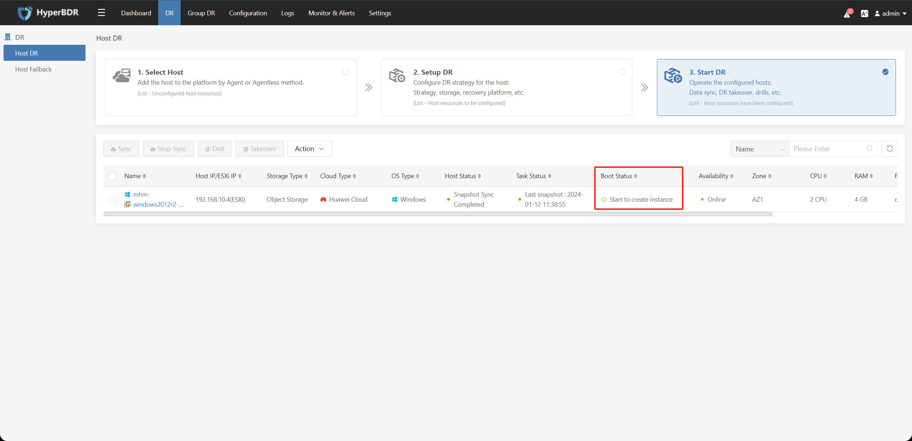

---

### 4.4. View Disaster Recovery Result

After the disaster recovery host is started, if the host startup status displays the relevant configuration information of the host on the disaster recovery platform, it means that the disaster recovery drill/disaster recovery takeover was successful. You can log in to Huawei Cloud to view the running status of the disaster recovery host:  

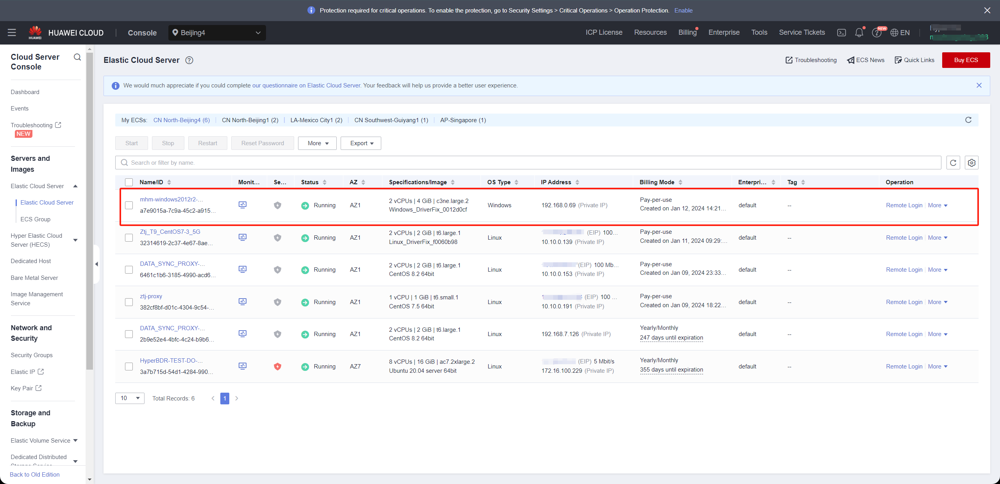

### 4.5. Clean Up Verification Host

Select the host that needs to be **"Clean Up Verification Host"**, and in the **"Action"** section, click on the **"Clean Up Verification Host"** option. Wait for the cleaning process to complete.

---

## 5. Host Group Disaster Recovery

Host group disaster recovery is mainly applicable to groups of disaster recovery host resources with similar attributes and requirements. These groups can be based on business units or other dimensions of resource sets. All operational configurations are done at the host group level. This includes setting up host group synchronization strategies, where all disaster recovery host data synchronization commands within the group are issued simultaneously to ensure that all host data in the host group remains consistent at the underlying level.

> When adding a disaster recovery host to host group disaster recovery, it is necessary to ensure that the single host disaster recovery configuration is completed before it can be added to the disaster recovery host group. Otherwise, it cannot be directly added to the host group disaster recovery.

### 5.1 Create Host Group

Go to the "Group DR" on the left menu bar and then click the "+Add" button:

**Step1: Basic Info**

Configure basic information for the Host Group, including "Name" and "Description." You can add information in these two sections according to your needs. Then, click the "Next" button.

**Step2: Select Hosts**

Select the disaster recovery host resources that have completed the disaster recovery configuration on the left side. Click the "Add Resource" button to include the corresponding disaster recovery hosts in the resource group. Then, click the "Next" button.

**Step3: Associate Policy**

Choose the policy used by the resource group. If a synchronization policy has been created in advance, you can select it directly. If not, click the "Create Policy" button to create a new disaster recovery policy.

**Step4: Boot Sequence**

Adjust the startup sequence of the host resources in the associated resources on the left, and click "Finish" after confirmation.  

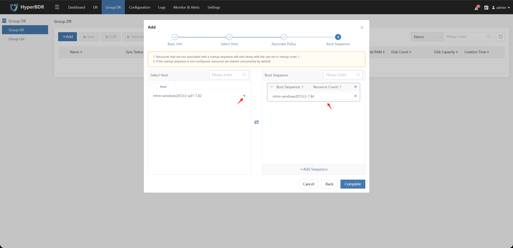

### 5.2. Modify Host Group

Click the "Action" button after selecting the resource group to modify the **Basic Info**, **Select Hosts**, **Associate Policy**, and **Boot Sequence** of the resource group.

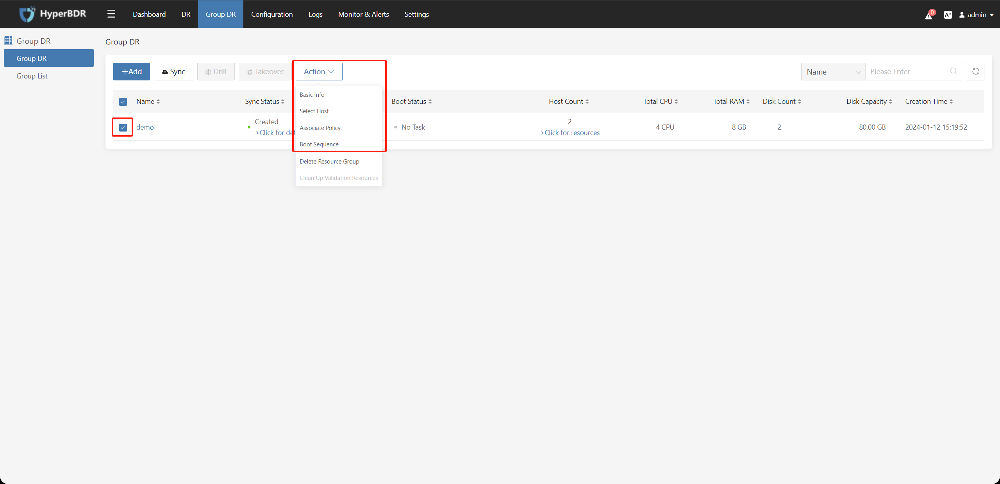

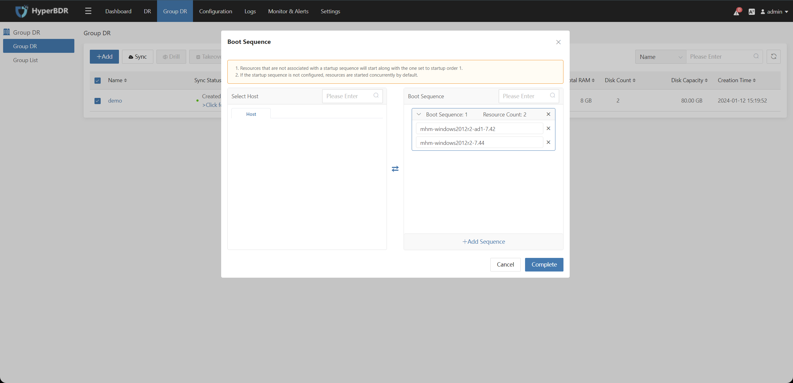

### 5.3. Delete Host Group

Go to [Group DR] and click the on “Delete Host group” button :
Check the resource group, and click the "Delete Resource Group" button to perform the operation of deleting the resource group.

According to the prompt for host group deletion, select the relevant configuration options, enter the character **"Yes"** to confirm deletion, then click the [Submit] button to complete deletion.
::: tip
**Notes:**  
**1:** This operation only deletes the host group, and the resources in the host group will be retained. The disaster recovery hosts in the host group will still be displayed separately in the host disaster recovery, and the disaster recovery operation can still be performed on a single disaster recovery host, and the data that has been synchronized will not be cleared from the disaster recovery platform.  
**2:** This operation not only deletes the host group, but also the resources in the host group. The disaster recovery hosts in the host group will be directly cleared from the disaster recovery platform, and all synchronized data will be cleared.  
**3:** (Not recommended) I confirm that I want to force clean up resources, which may cause residual resources (only used when cleaning fails). [Use in special scenarios only such as disaster recovery hosts in the host group lose contact or cleaning fails. This option will directly clear the records without initiating a call request.]
:::

### 5.4. Host Group – Data Synchronization

Select the configured host group, click the “Sync” button, and then the “Submit” button to perform data synchronization. You can also automatically perform data synchronization according to the configured Host Group Policy Management.

> For the disaster recovery hosts that are first added to the host group, it is necessary to perform data synchronization even if the data synchronization operation has been performed in the Host Disaster Recovery during the disaster recovery process.

> The synchronization policy of the host group will automatically execute data synchronization tasks according to policy settings.

### 5.5. Host Group - DR Drill / Takeover

Wait for data synchronization to complete (synchronization snapshot completed), check the host group that needs to be disaster recovery drilled/taken over, then click on the "Drill" / "Takeover" button.

::: tip
Note: For disaster recovery hosts that are first added to the host group, it is necessary to perform data synchronization operation, otherwise it will not be possible to perform disaster recovery drill/takeover even if the disaster recovery hosts in the host group have already performed data synchronization operation during Host Disaster Recovery.
:::

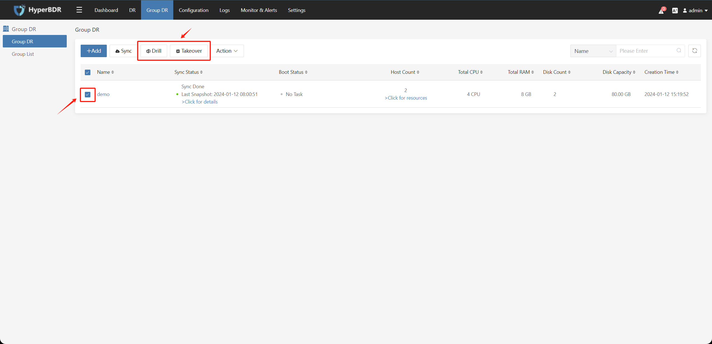

In the pop-up box, select the synchronization time point snapshot copy, after confirming that the information is correct, click the **"Submit"** button.

> The synchronization time point records the recoverable data time point for each snapshot copy generated after each data synchronization is completed.

When the host group status showing disaster recovery drill / takeover is completed, you can log in to the disaster recovery platform for drill and takeover operations.

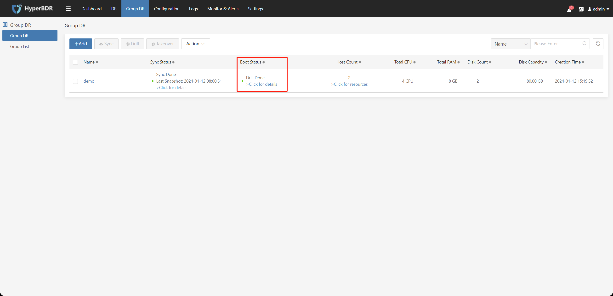

### 5.6. Host Group - Clean Up Validation Resources

Check the resource group that needs to clean up and verify resources, click the "Action" button, and select the "Clean Up Validation Resources" button.

> This operation means that the disaster recovery hosts in the host group that have already performed disaster recovery drill / takeover and the disaster recovery host instances generated on the disaster recovery platform will be deleted. This action prevents the risk of manual operation of deleting instances on the disaster recovery platform.

::: warning
Note: If the disaster recovery host restored on the disaster recovery platform has taken over the business, **do not** perform this operation, as this operation will directly delete the instances generated on the disaster recovery platform.
:::

After confirming that the resources to be cleaned on the disaster recovery platform are accurate, enter the character **"Yes"** in the input box to confirm and click the “Submit” button.

## 6. Policy Management

### 6.1. Create Policy

Click "Configuration" on the top menu bar, select "Policy Settings" on the left, and click "Create Policy".

The Create Policy page allows you to modify various parameters of the policy configuration.

#### 6.1.1 Policy Name、Snapshot Retain Count、Policy Status

| **Parameter** | **Description** |
| :---: | --- |
| Policy Name | Fill in the synchronization policy name and customize the configuration, which can be shared by other disaster recovery host groups. |
| Snapshot Retain Count | The range of snapshot quantities is an integer between 1 and 128; if not set, the default is 128. Once the number of snapshots reaches the set quota, deletion will start from the earliest snapshot, always maintaining the set number of snapshots. |
| Policy Status | Control the activation and deactivation of the synchronization policy. |

#### 6.1.2 Synchronization Policy

Check **Synchronization Policy : Incremental Synchronization**, You can enable and configure parameters for the incremental synchronization policy.  

Check **Synchronization Policy : Full Synchronization**, You can enable and configure parameters for the full synchronization policy.

| **Parameter** | **Description** |
| :---: | --- |
| Cycle | Sync policy execution cycle can be set to **Every N minutes**, **Every N hours**, **Every N days**, **Weekly**, **Monthly** for setting the triggering conditions for periodic sync tasks. |
| Minutes | You can configure it when the **Cycle** is set to **Every N minutes**.   Execute once every N minutes, where N is an integer in the range [5-59].  |
| Hours Amount | You can configure it when the **Cycle** is set to **Every N hours**.   Execute once every N hours, where N is an integer in the range [1-23]. |
| Day | You can configure it when the **Cycle** is set to **Every N days**.   Execute once every N hours, where N is an integer in the range [1-30]. |
| Date（Weekly） | You can configure it when the **Cycle** is set to **Weekly**.   Execute the synchronization policy on one day or days of the week every n week.   Execute once a week, where N can take values in the range [Monday, Tuesday, Wednesday, Thursday, Friday, Saturday, Sunday], and multiple selections are allowed. |
| Date（Mouthly） | You can configure it when the **Cycle** is set to **Mouthly**.   Execute every certain date of the month, where the selectable range is [1-31, end of the month], and multiple selections are allowed.   **29**: The current option will only be executed in leap years of February and will be skipped in other years of February.   **30**: The current option will not be executed in February.   **31**: Only executes in January, March, May, July, August, October and December.   **E.O.M**: The current option will be executed in the last day of each month. |
| Start Time | You can configure it when the **Cycle** is set to **Every N minutes **or** Every N hours**.   Setting the Start Time for Synchronization. |
| Time（Weekly） | You can configure it when the **Cycle** is set to **Weekly**.   Setting the Start Time for Synchronization. |
| Time（Mouthly） | You can configure it when the **Cycle** is set to **Mouthly**.   Setting the Start Time for Synchronization. |

#### 6.1.3 Speed Limit Policy

Support Multi-time period speed limiting(Supports setting different speed limits for different time periods within the same cycle, only supports selecting one cycle mode.)

| **Parameter** | **Description** |
| --- | --- |
| Cycle | Speed Limit Policy execution cycle can be set to **Every N days**, **Weekly**, **Monthly** for setting the triggering conditions for speed limit tasks. |
| Day | You can configure it when the **Cycle** is set to **Every N days**.   Execute once every N days, where N is an integer in the range [1-30]. |
| Date（Weekly） | You can configure it when the **Cycle** is set to **Weekly**.   Execute the speed limit policy on one day or days of the week every n week.   Execute once a week, where N can take values in the range [Monday, Tuesday, Wednesday, Thursday, Friday, Saturday, Sunday], and multiple selections are allowed. |
| Date（Monthly） | You can configure it when the **Cycle** is set to **Mouthly**.   Execute every certain date of the month, where the selectable range is [1-31, end of the month], and multiple selections are allowed.   **29**: The current option will only be executed in leap years of February and will be skipped in other years of February.   **30**: The current option will not be executed in February.   **31**: Only executes in January, March, May, July, August, October and December.   **E.O.M**: The current option will be executed in the last day of each month. |
| Speed Limit Time | Set the time for speed limit tasks |
| Host Speed Limit | The host speed limit value should be an integer ≥1. Unit: Mbps |

#### 6.1.4 Retention Policy

Check "Sequence Retention", enabling and configuring the snapshot retention policy. (Set snapshot retention based on sequence to retain snapshots at specific time points for a specified duration. For example, retain the first snapshot of each month for 3 weeks. Note: Ensure sufficient quota is available for creating new snapshots during the setup, otherwise data synchronization may fail.)

### 6.2. Modify Policy

Check the created Policy, click on "Action," select "Modify," and you can modify the parameters of the policy.

### 6.3. Policy Associated Host

Select the created policy, click on "Action," choose "Associate Host," check the hosts that are not associated with the strategy, and click "Submit" to establish the association.

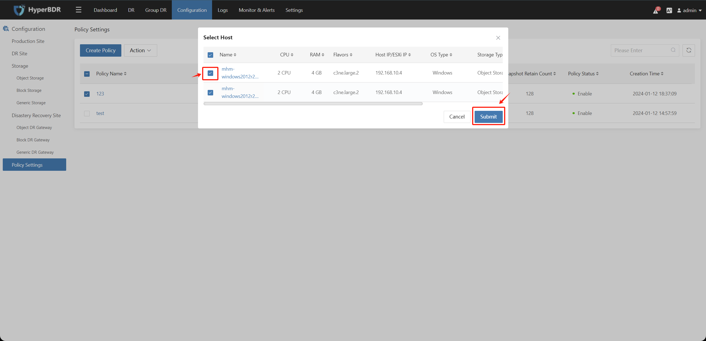

### 6.4. Delete Policy

Select the created policy, click on "Action," choose "Delete," and click "Submit" to delete the that is not associated with any hosts.

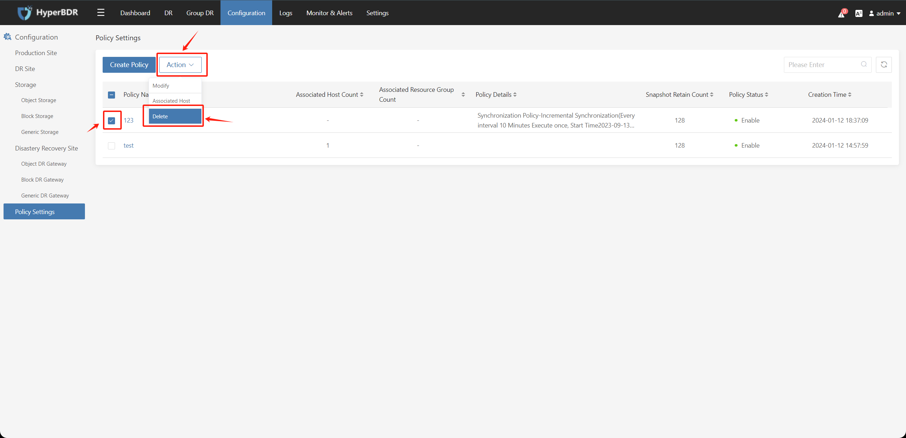

::: tip
If the policy is already associated with resources (hosts, resource groups), deletion is not supported. Please unbind the associated resources (hosts, resource groups) before deleting them.
:::

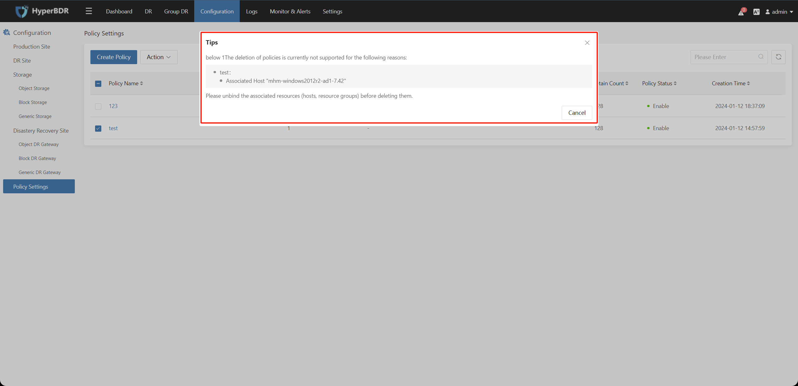

### 6.5 Policy Unbind Associated Resources (Host, Resource Group)

Click on the policy name, select the "Associate Hosts" or "Associate Resource Group" tab, check the resources to unbind, click the "Unbind Hosts" or "Unbind Resource Group" button, and confirm to unbind the associated resources.

## 7. Alarm Management

::: tip
Currently, two methods of Email alerts and SMS alerts are supported.
:::

### 7.1 Alarm Sending Configuration

#### 7.1.1 Use Email Alerts

1. Log in the Broadview coss console

> Login Address: https://<HyperBDR IP\>:30443  
> Default administrator user: admin  
> Default administrator password: P@ssw0rd

2. Configure SMTP

3. Send Test Email

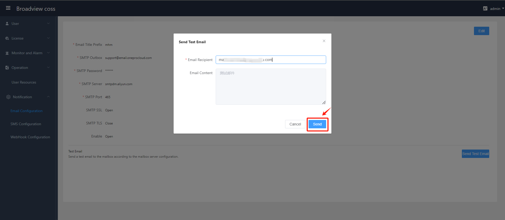

#### 7.1.2 Use SMS Alerts

1. Log in the Broadview coss console

> Login Address: https://<HyperBDR IP\>:30443  
> Default administrator user: admin  
> Default administrator password: P@ssw0rd

2. Configure SMS Service

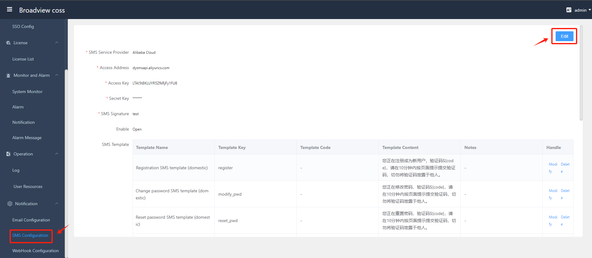

3. Send Test SMS

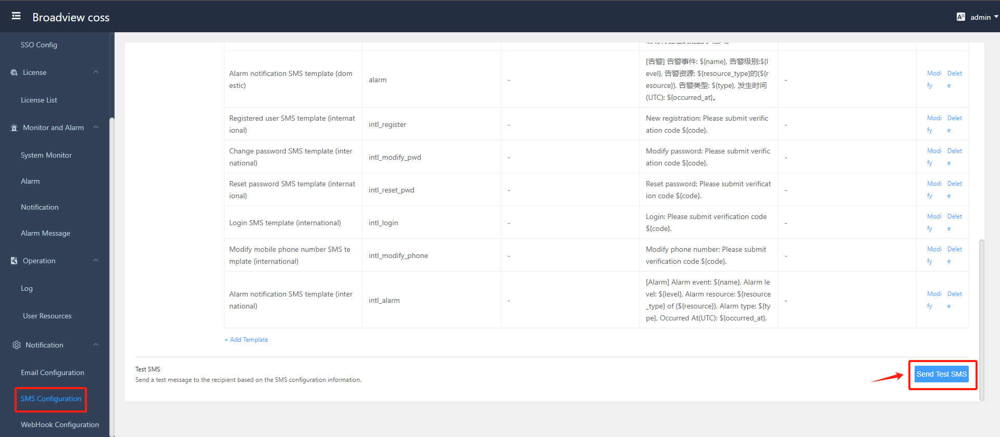

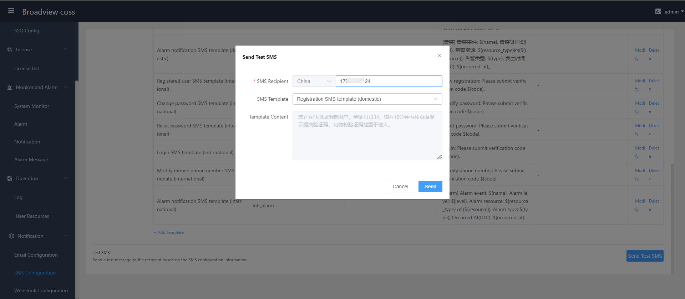

### 7.2 Notification Configuration

> Logged into the HyperBDR console by default

1. Add Notufication

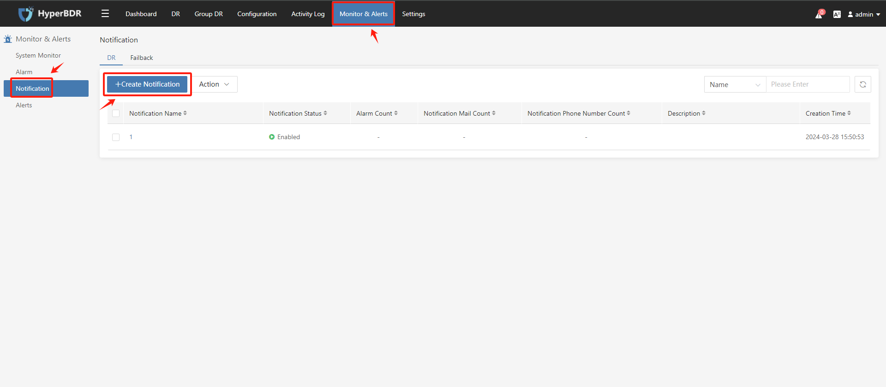

2. Configure Notufication

### 7.3 Alarm Rule Configuration

#### 7.3.1 Resource Alert

1. Create Resource Alert

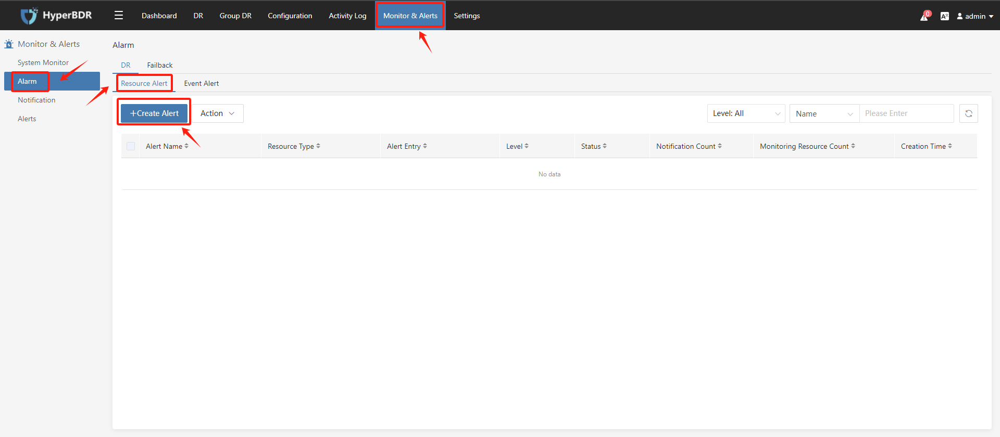

2. Configure Resource Alert

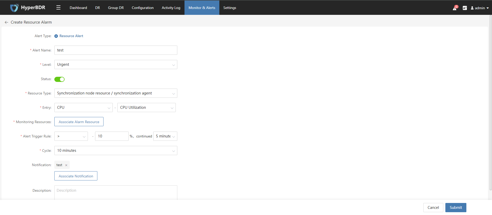

#### 7.3.2 Event Alert

1. Create Event Alert

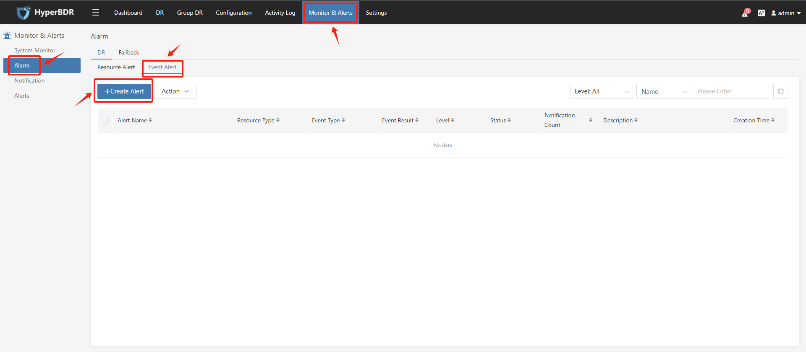

2. Configure Event Alert

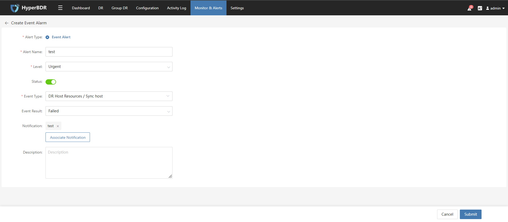

