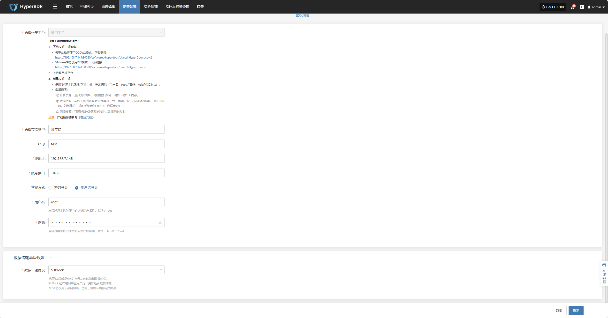
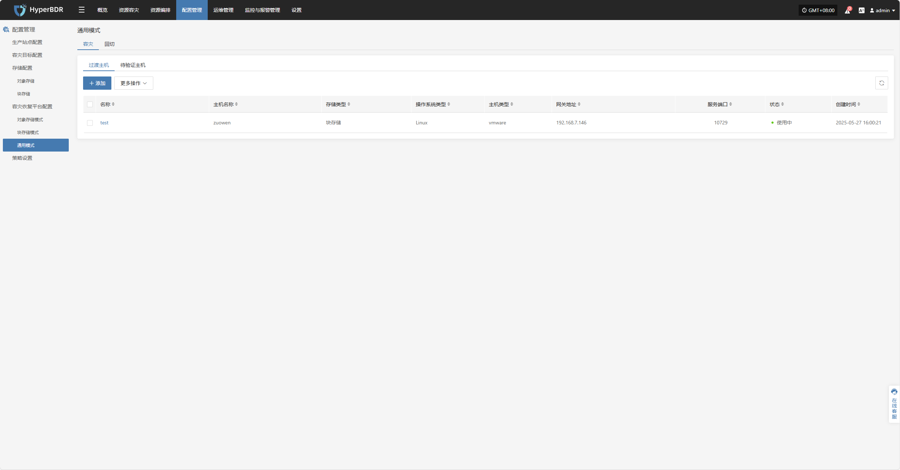
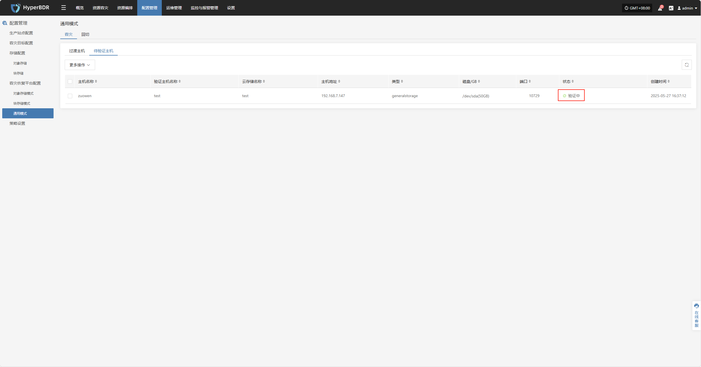
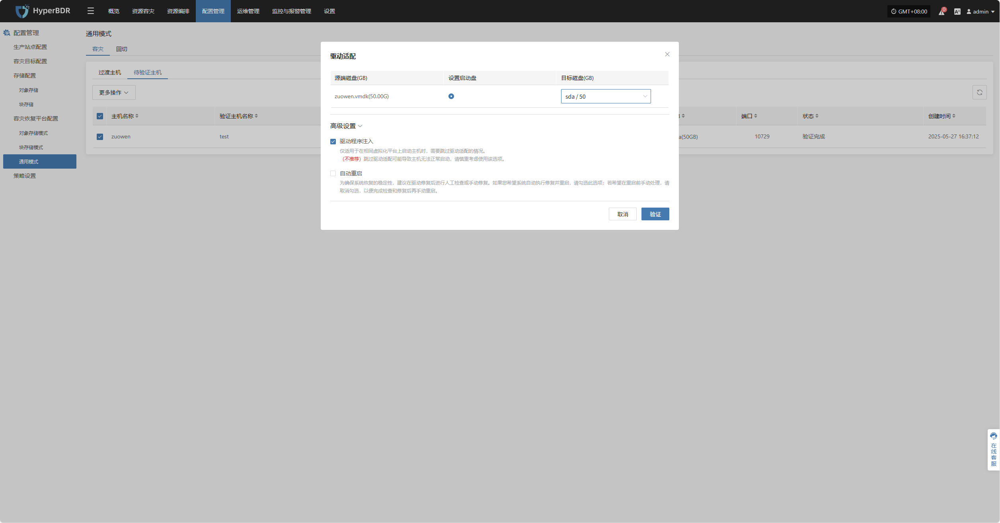
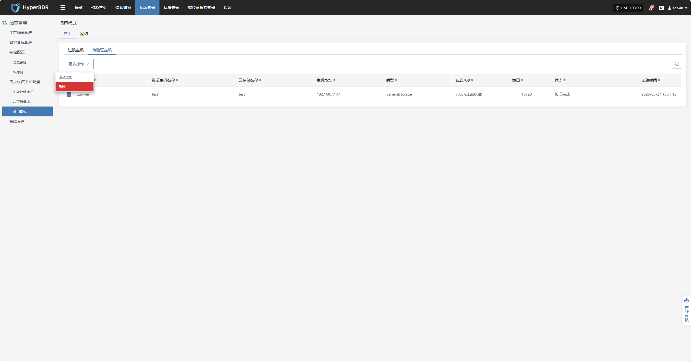

# **容灾恢复平台配置**

当主生产站点发生故障时，系统可自动或手动切换至的备用运行环境。为确保容灾切换过程中业务的连续性和数据的可用性，需提前完成容灾平台的相关配置。

平台支持容灾和回切两种类型，分别适用于不同的业务场景：

* **容灾**：用于在源主机发生故障或不可用的情况下，将业务快速切换至备用平台，保障业务连续性和数据安全。

* **回切**：用于在容灾完成后，将业务平稳迁移回源平台，确保系统运行恢复至原始状态。

用户可根据实际需求，分别配置容灾或回切策略，实现全流程的业务连续性管理。

## **对象存储模式**

### **支持的云平台列表**

| 云厂商名称                           | 配置说明 |
| ------------------------------- | ---- |
| 阿里云                             |      |
| 阿里云 专有云(wv3.16.x)               |      |
| 阿里云 专有云(v3.18.x)                |      |
| 华为云                             |      |
| 华为云 HCS Online(v23.3)           |      |
| 火山引擎                            |      |
| 腾讯云                             |      |
| 天翼云合营云                          |      |
| 移动云                             |      |
| AWS(SDK v1.34.93)               |      |
| AWS中国(SDK v1.34.93)             |      |
| GDS 万国数据本地云                     |      |
| Open Telekom Cloud(SDK v3.1.86) |      |
| OpenStack社区版本(Juno+)            |      |
| TM CAE                          |      |
| UCloud                          |      |
| VMware                          |      |
| XHERE(NeutonOs\_3.x)            |      |

## **块存储模式**

> 注：对【块存储模式】的所有操作，请到【存储配置】->【块存储】->【容灾】中进行。

## **通用模式**

### **过渡主机**

#### **添加过渡主机**

通过【配置管理】>【容灾恢复平台配置】>【容灾】>【过渡主机】>【添加】，进入“过渡主机”页面后，点击右上角的【添加】 按钮，在弹出的配置窗口中，填写所需主机信息，如名称、IP 地址、所属区域等。

信息填写完成后，点击“确认”提交，系统将开始创建过渡主机。待状态显示为“可使用”时，表示添加完成，可进行后续操作。

##### **过渡主机配置说明**

| **配置项**               | **示例值**         | **说明**                                                                                                                                                                                                 |
|:--------------------:|:------------------:|:--------------------------------------------------------------------------------------------------------------------------------------------------------------------------------------------------------:|
| 恢复平台             | 通用平台           | 仅能选择通用平台，需要下载过渡主机镜像：[参考链接](https://docs.oneprocloud.com/zh/userguide/poc/agent-pre-settings.html)                                                                            |
| 存储类型             | 对象存储           | 选择用于备份数据写入的存储类型，支持块存储和对象存储两种。                                                                                                                                              |
| 存储名称             | test               | 自定义的对象存储名称。                                                                                                                                                                                  |
| 存储 IP 地址         | 192.168.7.146      | 用于连接存储服务的目标地址。                                                                                                                                                                            |
| 服务端口             | 10729              | 存储服务监听的端口号，默认为 10729。                                                                                                                                                                    |
| 鉴权方式             | 用户名登录         | 对象存储认证方式，当前使用用户名 + 密码方式。                                                                                                                                                          |
| 用户名               | root               | 存储连接的认证用户名。                                                                                                                                                                                  |
| 密码                 | Acb@132.Inst       | 存储连接的认证密码，建议部署后修改默认值。                                                                                                                                                             |
| 数据传输高级设置     | iSCSI              | 源端与同步网关之间的数据传输协议，支持 S3Block 和 iSCSI： • S3Block：适用于广域网环境，传输效率高； • iSCSI：适用于网络环境稳定的专网场景。 **注意：当存储类型为对象存储时，该选项不可用。** |

#### **更多操作**

选中目标主机后，点击页面中的【更多操作】按钮可进行删除操作

##### **删除**

选中目标主机后，点击【更多操作】 > 【删除】可移除该过渡主机。

### **待验证主机**

> 仅完成“资源容灾 > 数据同步 > 容灾演练”流程后的主机，才会显示在“待验证主机”列表中。未完成数据同步的主机将不会出现在此位置。

启动容灾演练后，相关主机会显示在此列表中。请等待验证流程完成，方可继续后续操作。

#### **更多操作**

选中目标主机后，点击页面中的【更多操作】按钮可进行驱动注入、删除操作

##### **驱动注入**

选中目标主机后，点击【更多操作】 > 【驱动适配】，可向该过渡主机注入必要驱动，完成主机恢复

##### **删除**

选中目标主机后，点击【更多操作】 > 【删除】可移除该待验证主机。

