# **容灾恢复平台配置**

当主生产站点发生故障时，系统可自动或手动切换至的备用运行环境。为确保容灾切换过程中业务的连续性和数据的可用性，需提前完成容灾平台的相关配置。

平台支持容灾和回切两种类型，分别适用于不同的业务场景：

* **容灾**：用于在源主机发生故障或不可用的情况下，将业务快速切换至备用平台，保障业务连续性和数据安全。

* **回切**：用于在容灾完成后，将业务平稳迁移回源平台，确保系统运行恢复至原始状态。

用户可根据实际需求，分别配置容灾或回切策略，实现全流程的业务连续性管理。

## **对象存储模式**

### **支持的云平台列表**

| 云厂商名称                           | 配置说明 |
| ------------------------------- | ---- |
| 阿里云                             |[点击查看](../dr-site-configuration-obs/alibaba.md)      |
| 阿里云 专有云(wv3.16.x)               |      |
| 阿里云 专有云(v3.18.x)                |      |
| 华为云                             |[点击查看](../dr-site-configuration-obs/huawei.md)      |
| 华为云 HCS Online(v23.3)           |      |
| 火山引擎                            |      |
| 腾讯云                             |[点击查看](../dr-site-configuration-obs/tengxun.md)      |
| 腾讯云 专有云企业版                             |[点击查看](../dr-site-configuration-obs/tengxun-tce.md)      |
| 天翼云合营云                          |      |
| 移动云                             |      |
| AWS(SDK v1.34.93)               |      |
| AWS中国(SDK v1.34.93)             |[点击查看](../dr-site-configuration-obs/aws.md)      |
| GDS 万国数据本地云                     |      |
| Open Telekom Cloud(SDK v3.1.86) |      |
| OpenStack社区版本(Juno+)            |      |
| TM CAE                          |      |
| UCloud                          |      |
| VMware                          |      |
| XHERE(NeutonOs\_3.x)            |      |

## **块存储模式**

> 注：对【块存储模式】的所有操作，请到【存储配置】->【块存储】->【容灾】中进行。
> [👉点击查看](../configuration/storage-configuration.md#块存储)

## **通用模式（容灾）**

通用模式适用于当前尚未支持自动化回切或容灾流程的环境。在该模式下，用户需要手动完成部分操作

### **过渡主机**

#### **添加过渡主机**

通过【配置管理】>【容灾恢复平台配置】>【容灾】>【过渡主机】>【添加】，进入“过渡主机”页面后，点击右上角的【添加】 按钮，在配置窗口中，请仔细阅读注意事项，并根据页面提示准备相应的主机。

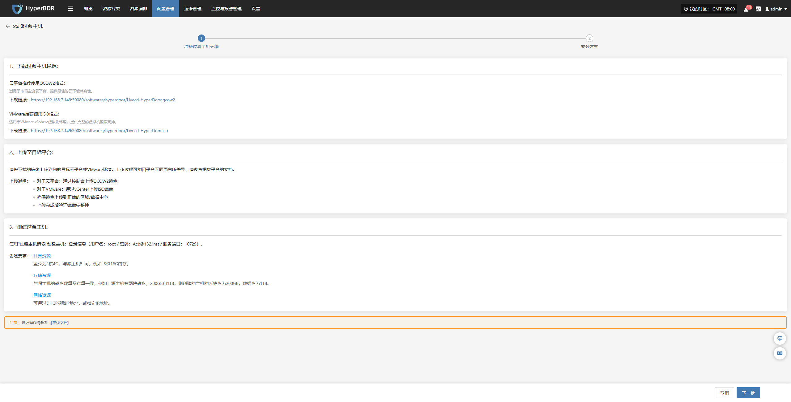

请在目标云平台资源准备完成后，点击‘下一步’以继续配置流程。系统提供两种安装方式，用户可根据页面提示选择任意一种完成配置。

##### **安装方式一：从控制台访问过渡主机**

控制台可以主动访问过渡主机网络，过渡主机位于私有网络或具有公网IP，需要从控制台发起数据同步到过渡主机

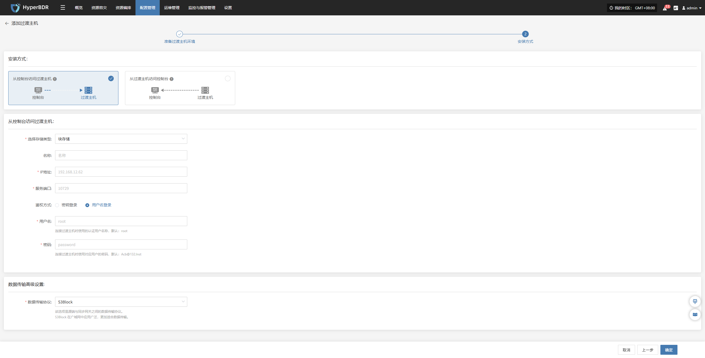

在配置窗口中，选择存储方式并，填写临时过渡主机信息，如名称、IP 地址、服务端口等。

* **过渡主机配置说明**

| **配置项**  | **示例值**       | **说明**                                                                                                                        |
| -------- | ------------- | ----------------------------------------------------------------------------------------------------------------------------- |
| 存储类型     | 对象存储          | 选择用于备份数据写入的存储类型，支持块存储和对象存储两种。                                                                                                 |
| 名称       | test          | 用于HyperBDR平台标识名称主机                                                                                                            |
| IP 地址    | 192.168.7.146 | 过渡主机的地址。                                                                                                                      |
| 服务端口     | 10729         | 存储服务监听的端口号，默认为 10729。                                                                                                         |
| 鉴权方式     | 用户名登录         | 鉴权登录认证方式，当前使用用户名 + 密码方式。可任选密钥或用户名密码登录方式。                                                                                      |
| 用户名      | root          | 存储连接的认证用户名。                                                                                                                   |
| 密码       | Acb@132.Inst  | 存储连接的认证密码，建议部署后修改默认值。                                                                                                         |
| 数据传输高级设置 | iSCSI         | 源端与同步网关之间的数据传输协议，支持 S3Block 和 iSCSI：\ • S3Block：适用于广域网环境，传输效率高；\ • iSCSI：适用于网络环境稳定的专网场景。\ **注意：当存储类型为对象存储时，该选项不可用。** |

信息填写完成后，点击“确定”，系统将开始创建过渡主机。待状态显示为“可使用”时，表示添加完成，可进行后续操作。

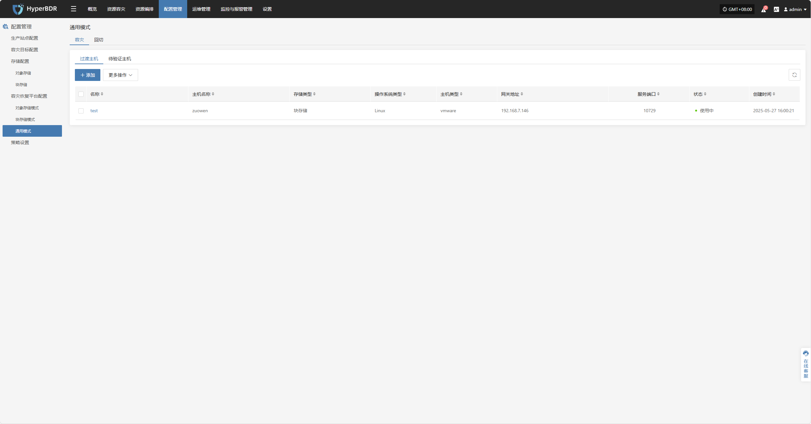

##### **安装方式二：从过渡主机访问控制台**

过渡主机可以主动访问控制台网络，控制台位于私有网络或具有公网IP，需要从过渡主机发起数据同步到控制台。

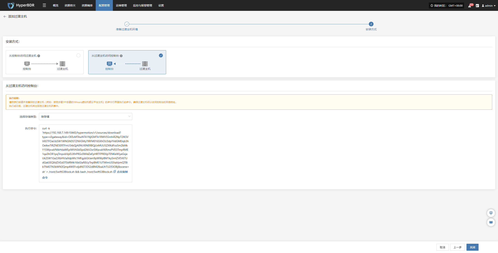

请在您已创建并准备好的过渡主机（例如：您在“添加过渡主机”步骤中创建的VMware虚拟机或云平台主机）的命令行界面复制并执行此命令。确保过渡主机可以访问控制台的网络地址。

对比上图结果执行成功后，过渡主机将出现在过渡主机列表中。

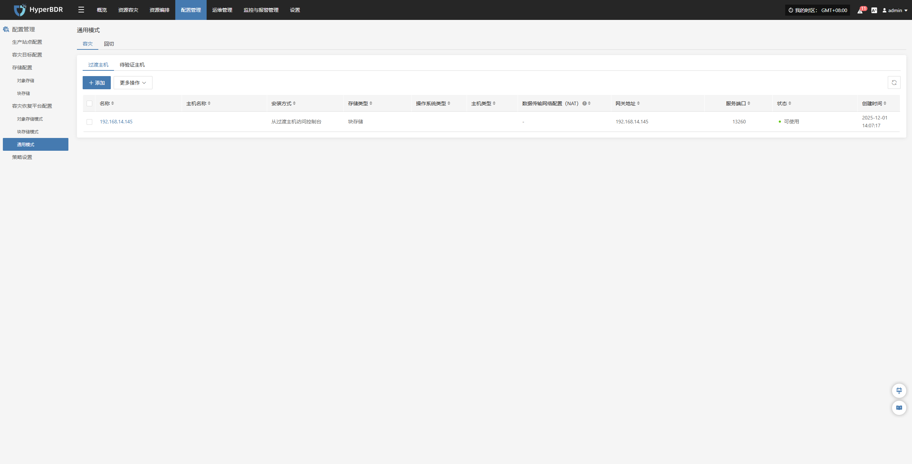

#### **更多操作**

选中目标主机后，点击页面中的【更多操作】按钮可进行更多配置

##### **数据传输网络配置(NAT)**

选中目标主机后，点击【更多操作】 > 【数据传输网络配置(NAT)】可指定数据流同步使用的外部映射 IP 地址。

> 注：该功能主要用于在存在内外网络隔离或 NAT 转换的网络环境中，引导数据流使用正确的出口地址，从而保证源端与目标端之间的数据传输链路连通。

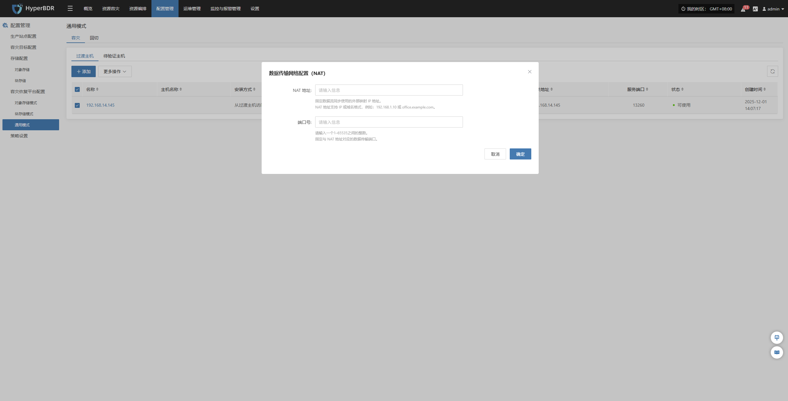

根据网络结构配置主机 NAT 映射地址，完成添加，确保数据流量可正常传输。

##### **删除**

选中目标主机后，点击【更多操作】 > 【删除】可移除该过渡主机。

### **待验证主机**

> 仅完成“资源容灾 > 数据同步 > 容灾演练”流程后的主机，才会显示在“待验证主机”列表中。未完成数据同步的主机将不会出现在此位置。

启动容灾演练后，相关主机会显示在此列表中。请等待验证流程完成，方可继续后续操作。

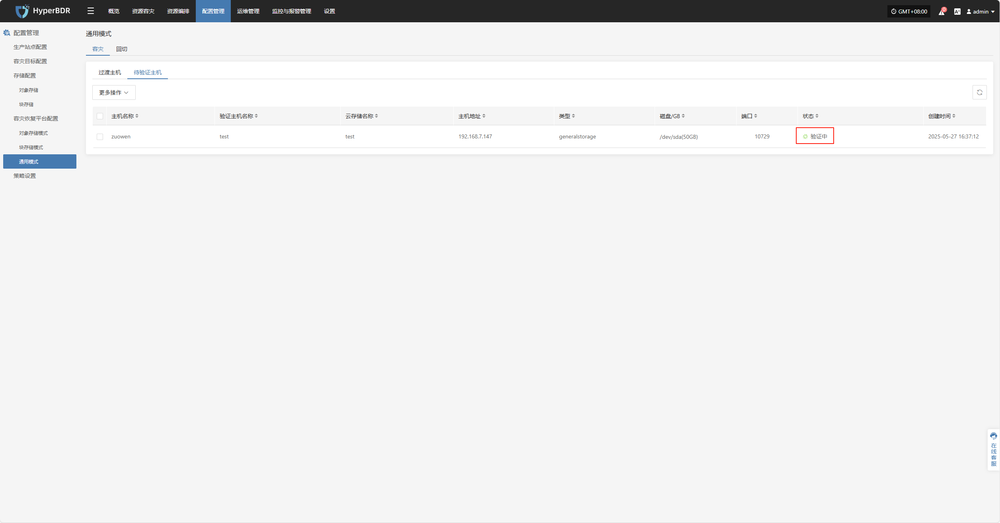

#### **更多操作**

选中目标主机后，点击页面中的【更多操作】按钮可进行驱动注入、删除操作

##### **驱动注入**

选中目标主机后，点击【更多操作】 > 【驱动适配】，可向该过渡主机注入必要驱动，完成主机恢复

##### **删除**

选中目标主机后，点击【更多操作】 > 【删除】可移除该待验证主机。

## **通用模式（回切）**

通用模式适用于当前尚未支持自动化迁移或容灾流程的环境。在该模式下，用户需要手动完成部分操作

### **过渡主机**

#### **添加过渡主机**

通过【配置管理】>【容灾恢复平台配置】>【回切】>【过渡主机】>【添加】，进入“过渡主机”页面后，点击右上角的【添加】 按钮，在配置窗口中，请仔细阅读注意事项，并根据页面提示准备相应的主机。

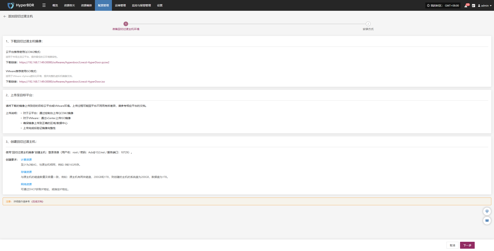

请在目标云平台资源准备完成后，点击‘下一步’以继续配置流程。系统提供两种安装方式，用户可根据页面提示选择任意一种完成配置。

##### **安装方式一：从控制台访问回切过渡主机**

控制台可以主动访问过渡主机网络，过渡主机位于私有网络或具有公网IP，需要从控制台发起数据同步到过渡主机

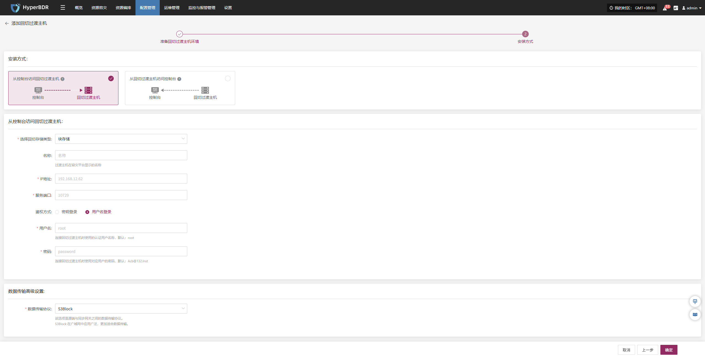

在配置窗口中，选择存储方式并填写临时过渡主机信息，如名称、IP 地址、服务端口等。

* **过渡主机配置说明**

| **配置项**  | **示例值**       | **说明**                                                                                                                        |
| -------- | ------------- | ----------------------------------------------------------------------------------------------------------------------------- |
| 存储类型     | 对象存储          | 选择用于备份数据写入的存储类型，支持块存储和对象存储两种。                                                                                                 |
| 名称       | test          | 用于HyperBDR平台标识名称主机                                                                                                            |
| IP 地址    | 192.168.7.146 | 过渡主机的地址。                                                                                                                      |
| 服务端口     | 10729         | 存储服务监听的端口号，默认为 10729。                                                                                                         |
| 鉴权方式     | 用户名登录         | 鉴权登录认证方式，当前使用用户名 + 密码方式。可任选密钥或用户名密码登录方式。                                                                                      |
| 用户名      | root          | 存储连接的认证用户名。                                                                                                                   |
| 密码       | Acb@132.Inst  | 存储连接的认证密码，建议部署后修改默认值。                                                                                                         |
| 数据传输高级设置 | iSCSI         | 源端与同步网关之间的数据传输协议，支持 S3Block 和 iSCSI：\ • S3Block：适用于广域网环境，传输效率高；\ • iSCSI：适用于网络环境稳定的专网场景。\ **注意：当存储类型为对象存储时，该选项不可用。** |

信息填写完成后，点击“确定”，系统将开始创建过渡主机。待状态显示为“可使用”时，表示添加完成，可进行后续操作。

##### **安装方式二：从过渡主机访问控制台**

过渡主机可以主动访问控制台网络，控制台位于私有网络或具有公网IP，需要从过渡主机发起数据同步到控制台。

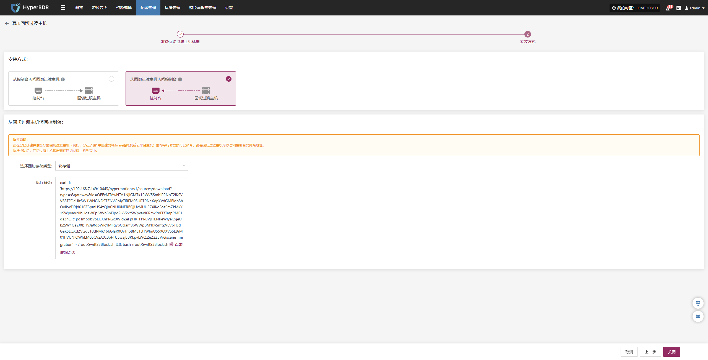

请在您已创建并准备好的过渡主机（例如：您在“添加过渡主机”步骤中创建的VMware虚拟机或云平台主机）的命令行界面复制并执行此命令。确保过渡主机可以访问控制台的网络地址。

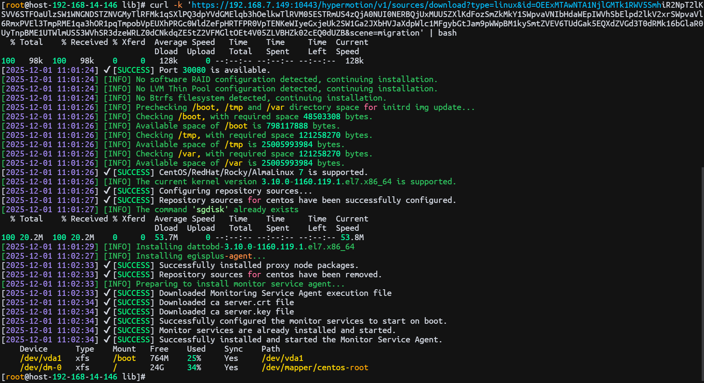

对比上图结果执行成功后，过渡主机将出现在过渡主机列表中。

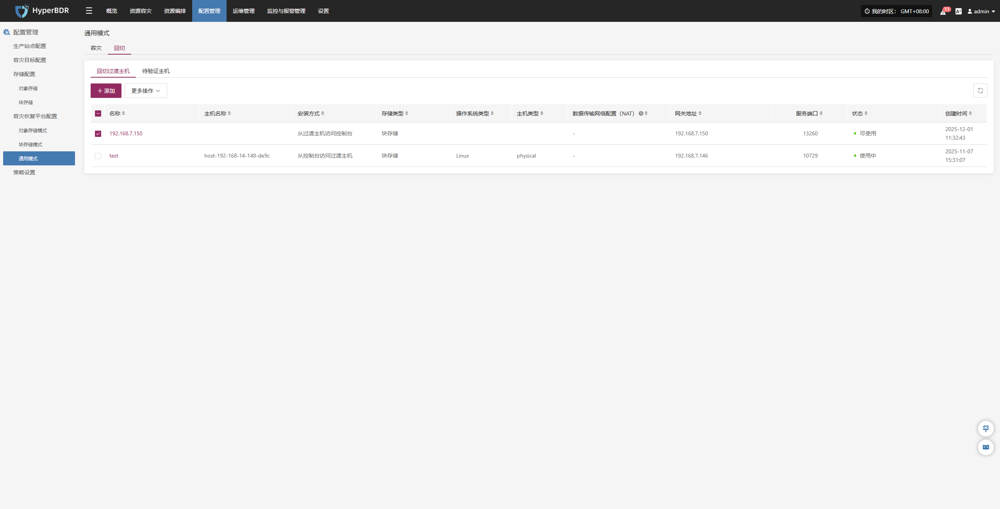

#### **更多操作**

选中目标主机后，点击页面中的【更多操作】按钮可进行更多配置

##### **数据传输网络配置(NAT)**

选中目标主机后，点击【更多操作】 > 【数据传输网络配置(NAT)】可指定数据流同步使用的外部映射 IP 地址。

> 注：该功能主要用于在存在内外网络隔离或 NAT 转换的网络环境中，引导数据流使用正确的出口地址，从而保证源端与目标端之间的数据传输链路连通。

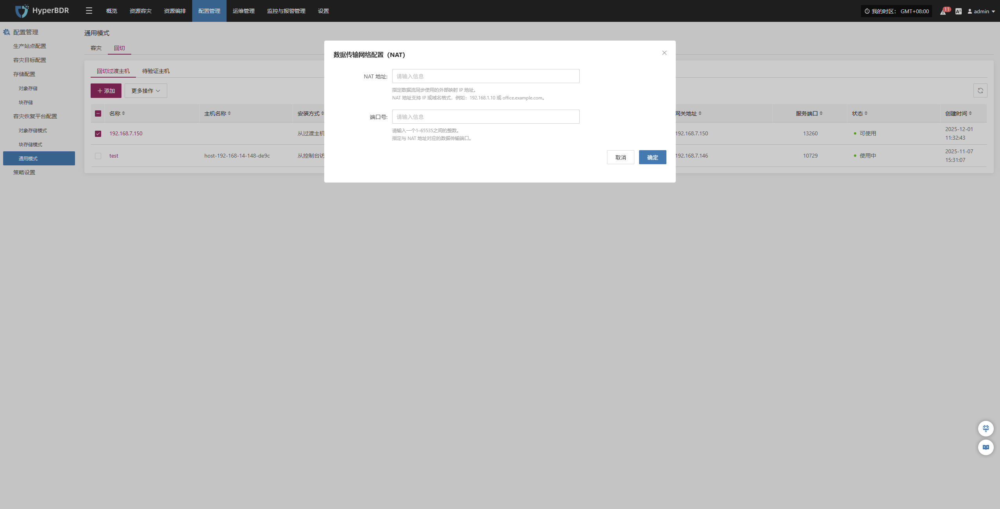

根据网络结构配置主机 NAT 映射地址，完成添加，确保数据流量可正常传输。

##### **删除**

选中目标主机后，点击【更多操作】 > 【删除】可移除该过渡主机。

### **待验证主机**

> 仅完成“资源容灾 > 数据同步 > 容灾演练”流程后的主机，才会显示在“待验证主机”列表中。未完成数据同步的主机将不会出现在此位置。

启动容灾演练后，相关主机会显示在此列表中。请等待验证流程完成，方可继续后续操作。

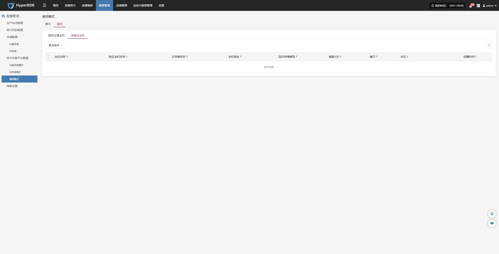

#### **更多操作**

选中目标主机后，点击页面中的【更多操作】按钮可进行驱动注入、删除操作

##### **驱动注入**

选中目标主机后，点击【更多操作】 > 【驱动适配】，可向该过渡主机注入必要驱动，完成主机恢复

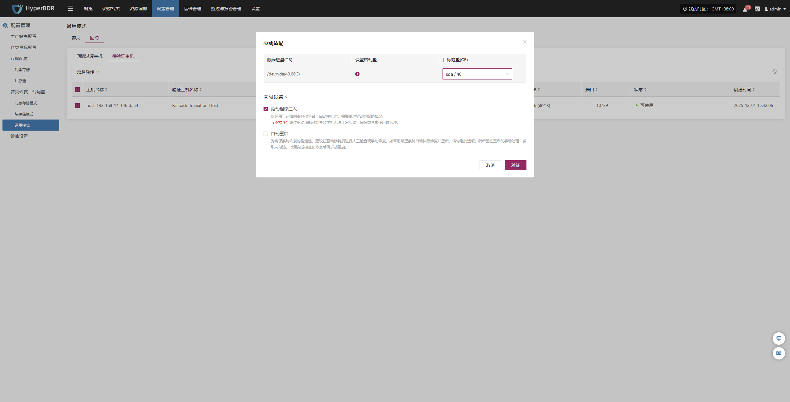

##### **删除**

选中目标主机后，点击【更多操作】 > 【删除】可移除该待验证主机。

