# **策略设置**

**策略设置模块**用于统一配置和管理容灾过程中的关键控制策略，帮助用户灵活制定数据同步、资源调度与存储保留方案。该模块支持三类策略类型：**同步策略**用于定义数据同步的频率与方式，**限速策略**用于控制同步过程中的网络或IO资源使用，**保留策略**则通过设定快照或副本的保留时限与数量，优化存储占用并保障恢复需求。

## **创建策略**

通过顶部菜单【配置管理】 > 【策略设置】进入策略设置页面，用户可分别&#x5728;**“容灾”**&#x548C;**“回切”**&#x4E24;个模块中，针对不同场景配置对应的策略。

用户可点击【创建策略】按钮新增策略，并根据业务需求填写相应的策略配置内容。系统支持同时存在多种策略类型，用户可灵活管理同步策略、限速策略与保留策略，实现多维度的容灾策略控制。

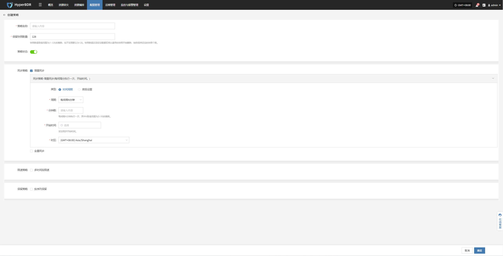

在输入策略名称、设置快照保留数量并选择策略状态后，开始配置下列详细策略配置。

### **同步策略**

设置同步策略时，可通过选择时间周期或高级配置不同类型，使用不同方式配置对应同步策略。

> 增量同步与全量同步可并行配置使用，为确保同步任务顺利执行，建议合理安排时间，避免时间重叠产生冲突。

#### **增量同步**

在策略设置中，通过“同步策略”定义是否启用增量同步机制，系统将在初始全量同步完成后，按照设定频率或触发条件执行增量同步任务，实现持续、轻量化的数据保护。

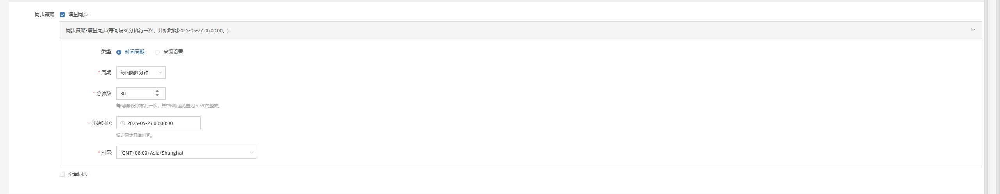

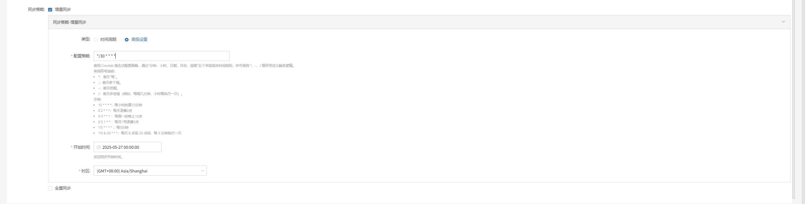

##### **时间周期配置说明**

| **配置项** | **配置值**                   | **说明**                             |
| ------- | ------------------------- | ---------------------------------- |
| 类型      | 时间周期                      | 同步任务的调度类型。                         |
| 周期      | 每间隔 N 分钟                  | 表示按固定时间间隔循环执行。                     |
| 分钟数     | 30                        | 每间隔 N 分钟执行一次，其中 N 范围为 \[5–59] 的整数。 |
| 开始时间    | 2025-05-27 00:00:00       | 同步任务的首次执行时间，后续按周期触发。               |
| 时区      | (GMT+08:00) Asia/shanghai | 同步任务调度的时区，如 `UTC+8`，建议明确设置以避免时间偏差。 |

##### **高级设置配置说明**

| **配置项** | **配置值**                   | **说明** |
|------------|------------------------------|----------|
| 类型       | 高级配置                     | 使用 Crontab 表达式灵活配置时间规则。 |
| 配置策略   | `*/30 * * * *`               | 使用 Crontab 表达式配置策略，通过“分钟、小时、日期、月份、星期”五个字段组合时间规则。  **常用符号说明：** `*`：表示“每”； `,`：表示多个值； `-`：表示范围； `/`：表示步进值（如每隔几分钟、小时执行一次）。  **示例表达式：** `15 * * * *`：每小时的第15分钟； `0 2 * * *`：每天凌晨2点； `0 0 * * 1`：每周一凌晨0点； `0 5 1 * *`：每月1号凌晨5点； `*/5 * * * *`：每5分钟执行一次； `*/5 8-20 * * *`：每天8点至20点，每5分钟执行一次。 |
| 开始时间   | 2025-05-27 00:00:00          | 设定同步任务首次执行的开始时间。 |
| 时区       | (GMT+08:00) Asia/Shanghai   | 同步任务调度使用的时区，例如 `UTC+8`。建议明确设置以避免时间偏差。 |

#### **全量同步**

在策略设置中，系统会优先执行全量同步任务，完成后目标端拥有源端的完整数据副本。此过程会占用较多的系统资源和网络带宽，可能需要较长时间完成，用户应合理安排同步时间以避免影响业务运行。

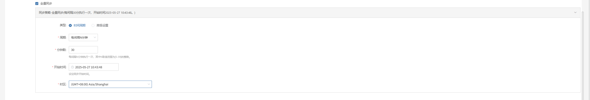

##### **时间周期配置说明**

| **配置项** | **配置值**                   | **说明**                             |
| ------- | ------------------------- | ---------------------------------- |
| 类型      | 时间周期                      | 同步任务的调度类型。                         |
| 周期      | 每间隔 N 分钟                  | 表示按固定时间间隔循环执行。                     |
| 分钟数     | 30                        | 每间隔 N 分钟执行一次，其中 N 范围为 \[5–59] 的整数。 |
| 开始时间    | 2025-05-27 00:00:00       | 同步任务的首次执行时间，后续按周期触发。               |
| 时区      | (GMT+08:00) Asia/shanghai | 同步任务调度的时区，如 `UTC+8`，建议明确设置以避免时间偏差。 |

##### **高级设置配置说明**

| **配置项** | **配置值**                   | **说明** |
|------------|------------------------------|----------|
| 类型       | 高级配置                     | 使用 Crontab 表达式灵活配置时间规则。 |
| 配置策略   | `*/30 * * * *`               | 使用 Crontab 表达式配置策略，通过“分钟、小时、日期、月份、星期”五个字段组合时间规则。  **常用符号说明：** `*`：表示“每”； `,`：表示多个值； `-`：表示范围； `/`：表示步进值（如每隔几分钟、小时执行一次）。  **示例表达式：** `15 * * * *`：每小时的第15分钟； `0 2 * * *`：每天凌晨2点； `0 0 * * 1`：每周一凌晨0点； `0 5 1 * *`：每月1号凌晨5点； `*/5 * * * *`：每5分钟执行一次； `*/5 8-20 * * *`：每天8点至20点，每5分钟执行一次。 |
| 开始时间   | 2025-05-27 00:00:00          | 设定同步任务首次执行的开始时间。 |
| 时区       | (GMT+08:00) Asia/Shanghai   | 同步任务调度使用的时区，例如 `UTC+8`。建议明确设置以避免时间偏差。 |

### **限速策略**

用户可以定义多个时间段，每个时间段配置独立的速率限制，满足业务高峰期和非高峰期的带宽管理需求。

> 支持在同一周期内设置不同时间段的限速，切换周期会清除当前设定的限速设置

#### **多时段限速**

多时段限速功能允许用户根据不同时间段，设置不同的带宽限速策略，以灵活控制同步任务的网络资源占用。

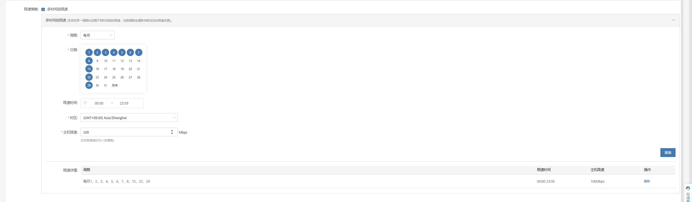

#### **多时段限速配置说明**

| **字段** | **示例值**                                         | **说明**                                     |
| ------ | ----------------------------------------------- | ------------------------------------------ |
| 周期     | 每N天 / 每周 / 每月                                   | 同步执行的周期类型，支持每日间隔、多周指定日和每月指定日三种方式           |
| 天数     | 1                                               | - 当周期为“每N天”时，天数表示每隔多少天执行一次，取值范围为\[1-30]的整数 |
| 日期     | 星期一、星期三（示例）                                     | - 当周期为“每周”时，选择具体星期几执行，可多选                  |
| 日期     | 5号（示例）                                          | - 当周期为“每月”时，选择具体日期（几号）执行，可多选               |
| 限速时间   | 00:00 - 23:59                                   | 带宽限速生效的时间段                                 |
| 时区     | (GMT+08:00) Asia/Shanghai                       | 限速时间对应的时区                                  |
| 主机限速   | 10 Mbps                                         | 同步时主机的最大带宽限制，单位为 Mbps                      |
| 限速详情   | 每月 1、2、3、4、5、6、7、8、15、22、29 00:00-23:59100Mbps。 | 设置完参数添加后会在该栏位进行显示                          |

### **保留策略**

保留策略用于定义系统中备份或同步数据的保存规则，帮助用户合理管理存储空间，防止数据过多占用导致资源浪费。

> 在设置时，请保证有充足的配额制作新的快照，否则同步数据将失败。

#### **按序列保留**

系统按照备份或同步任务执行的时间顺序，保留最新的若干份数据副本。当超过设定的保留数量时，系统会自动删除策略定义相关数据，确保备份数量始终保持在设定范围内。

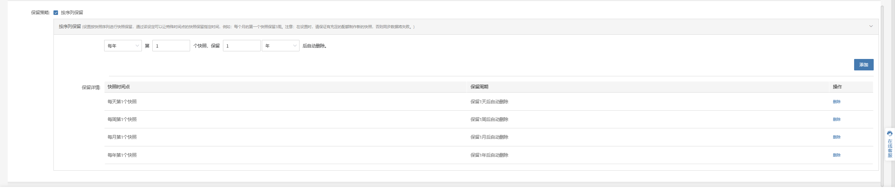

#### **按序列保留配置说明**

用户可通过四个下拉列表框，灵活设置不同时间粒度的数据保留数量。系统将按照设定的时间维度和数量，自动保留相应的数据副本，并删除超出保留数量的旧数据。

> 注意：均最小值为1，最大值不超过129

## **更多操作**

选中目标策略后，点击页面中的【更多操作】按钮可进行相关配置与修改。

### **修改**

选中目标策略后，点击【更多操作】>【修改】，可以修改对应策略的名称，快照数，策略等相关内容

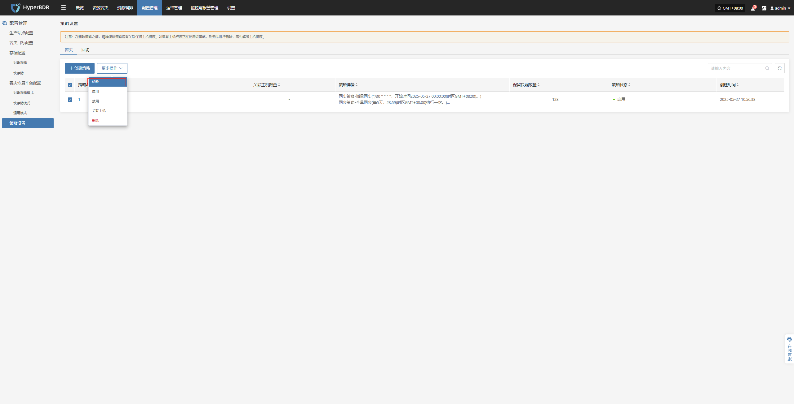

### **启用**

选中目标策略后，点击【更多操作】>【启用】，可修改策略状态

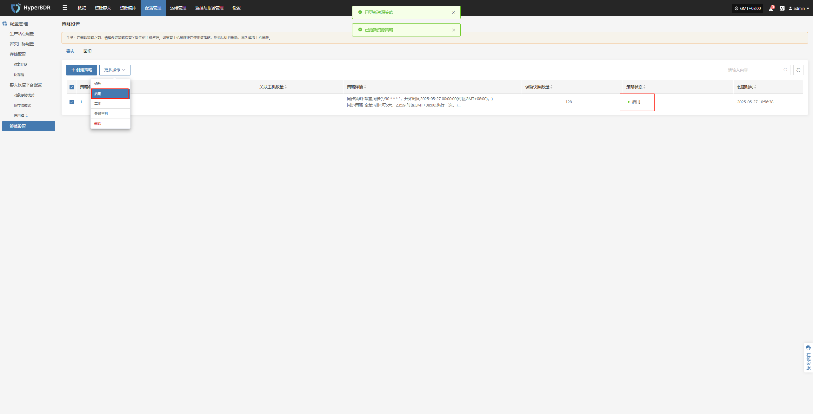

### **禁用**

选中目标策略后，点击【更多操作】>【禁用】，可修改策略状态

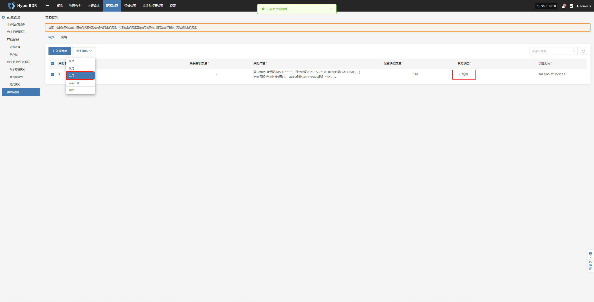

### **关联主机**

选中目标策略后，点击【更多操作】 > 【关联主机】，可将需要应用该策略的主机关联至当前策略。

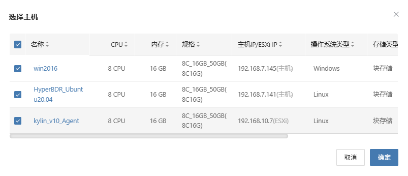

### **删除**

选中目标策略后，点击【更多操作】 > 【删除】可移除该策略。

> 注意：在删除策略之前，请确保该策略没有关联任何主机资源。如果有主机资源正在使用该策略，则无法进行删除，需先解绑主机资源。

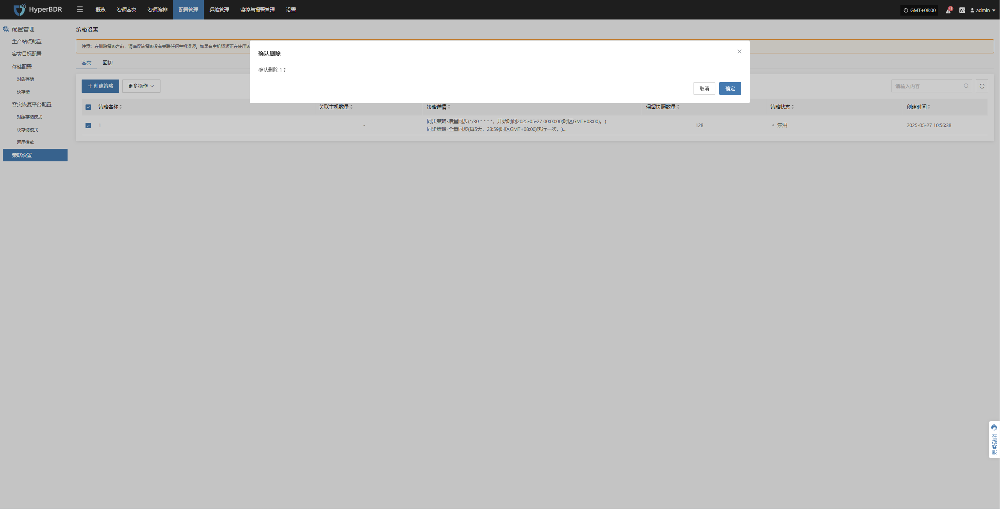

## **策略设置详情**

点击目标策略名称，即可查看其详细配置信息。

### **概览**

在策略详情页面，您可以全面查看该策略的所有配置项，包括同步策略、限速策略及保留策略等信息。

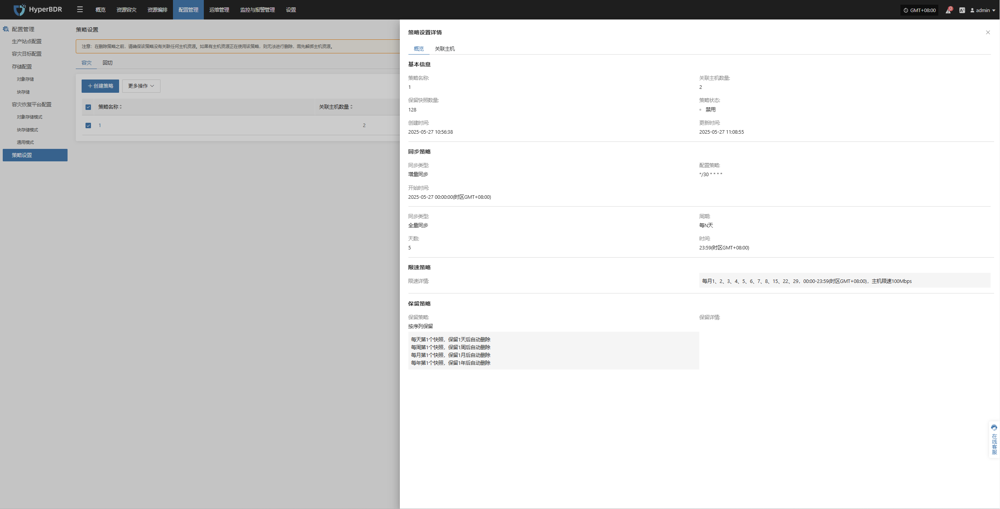

### **关联主机**

通过关联主机页面，您可以完整查看所有已绑定该策略的主机信息，包括主机名称、IP 地址及其他相关详情。

### **解绑主机**

选中需要解绑的主机后，点击【解绑主机】按钮，确认操作即可完成解绑。

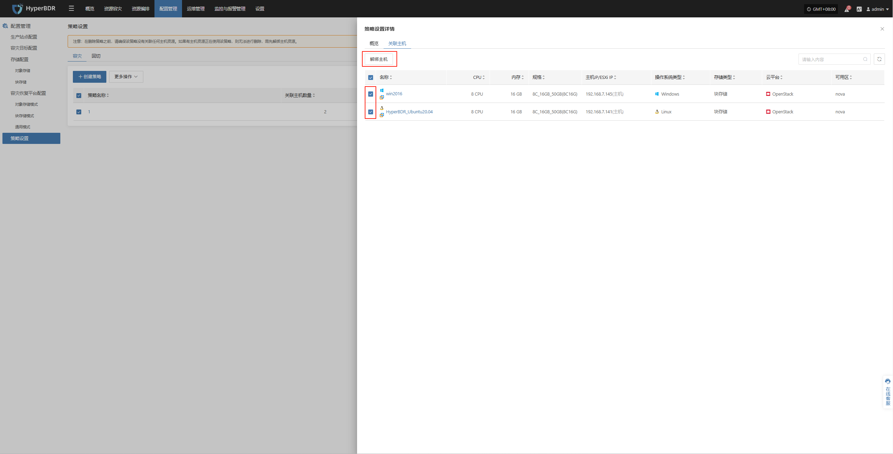

