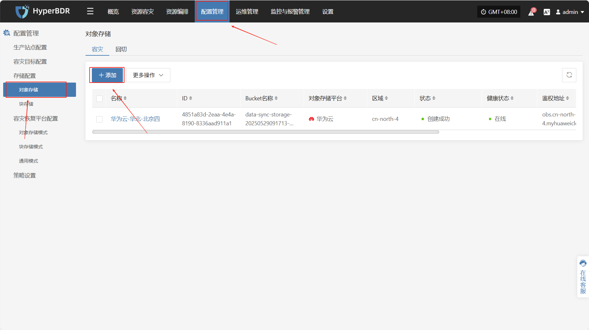
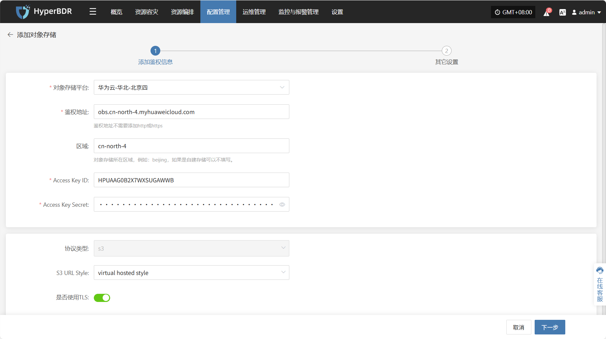
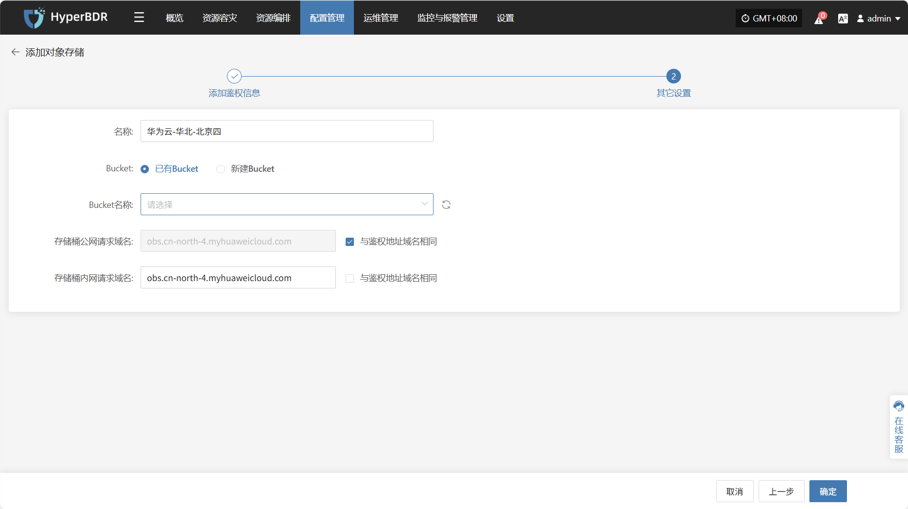
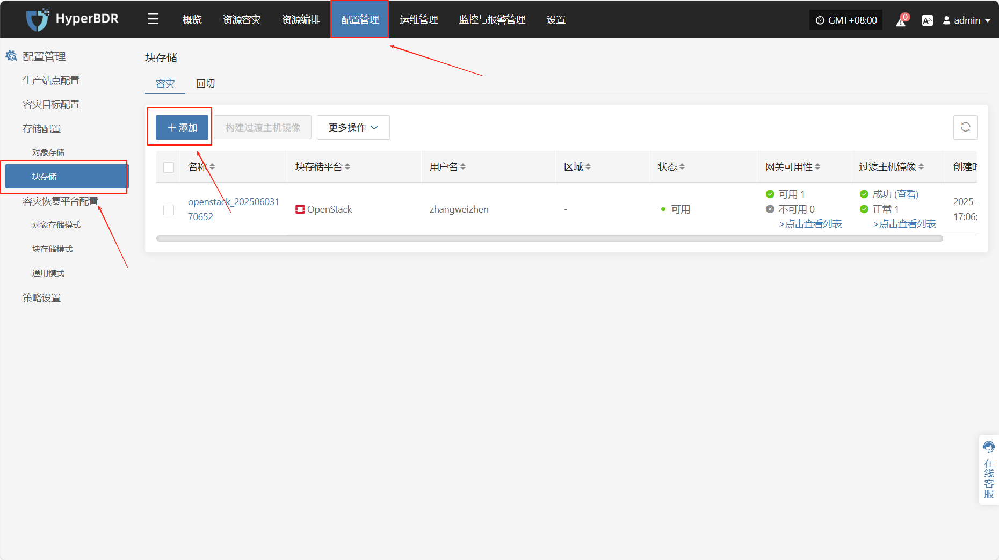

# 存储配置

用于定义容灾或备份过程中数据的写入目标。当前系统支持以下类型的存储配置

## **对象存储**

### **支持的云平台列表**

| 云厂商名称                           |
| :-------------------------------: |
| 其它平台                            |
| 阿里云                             |
| 华为云                             |
| 火山引擎                            |
| 腾讯云                             |
| 天翼合营云                           |
| 移动和云                            |
| 移动云                             |
| AWS                             |
| GDS 万国数据本地云                     |
| HCS Online                      |
| Open Telekom Cloud(SDK v3.1.86) |
| TM CAE                          |

您可参考下列“配置示例”完成相关设置，本文以华为云配置为示例。

### **配置示例**

#### **添加华为云**

通过顶部导航栏依次选择 **“配置管理” → “存储配置” → “对象存储”** 进入对象存储页面，点击右上角 **“添加”** 按钮，可进行对象存储的新增配置操作。

##### **添加鉴权信息**

在对象存储配置页面中，平台类型选择 **“华为云”** 后，选择不同的地区存储如：华东、华北等，根据接入对象存储的实际情况，填写以下鉴权信息字段：

| 配置项               | 示例值                               | 说明                                    |
| ----------------- | --------------------------------- | ------------------------------------- |
| 对象存储平台            | 华为云-华北-北京四                        | 展开下列列表内容，当前实例选择为“华为云-华北-北京四”          |
| 鉴权地址              | obs.cn-north-4.myhuaweicloud.com  | 鉴权服务地址，无需添加 `http://` 或 `https://` 前缀 |
| 区域                | cn-north-4                        | 对象存储所在地域，例如 `beijing`，自建存储可留空         |
| Access Key ID     | ygOfXlSs2F4rYBmO                  | 用于访问对象存储的访问密钥 ID                      |
| Access Key Secret | ••••••••••••••••••••••••••        | 对应的访问密钥 Secret，填写时默认隐藏，仅用于鉴权          |
| 协议类型              | s3                                | 指定对象存储协议类型，目前仅支持 `s3`                 |
| S3 URL Style      | path style / virtual hosted style | 当前选择 S3 接入风格                          |
| 是否使用 TLS          | 是 / 否                             | 是否启用加密传输（即 HTTPS），根据平台实际配置需求选择        |

##### **其他设置**

在填写完鉴权信息后，点&#x51FB;**“下一步”**&#x7EE7;续配置存储桶相关参数，完成对象存储接入。

| **配置项**   | **示例值**             | **说明**                                                                               |
| --------- | ------------------- | ------------------------------------------------------------------------------------ |
| 名称        | 华为云-华北-北京四          | 所选对象存储平台名称，默认为第一步选择的平台名称                                                             |
| Bucket    | 已有Bucket / 新建Bucket | 选择 Bucket 的创建方式，支持选择已有 Bucket 或新建一个新的 Bucket                                         |
| Bucket名称  | 以实际为准               | 若选择已有 Bucket，可通过下拉列表选择；若选择新建 Bucket，则手动填写名称。注意：自定义字符不超过10个字符，只允许数字和小写字母，如果不填写，则自动生成。 |
| 存储桶公网请求域名 | 以实际为准               | 用于公网访问 Bucket 的地址，可自定义或勾选`“与鉴权地址域名相同”`                                               |
| 存储桶内网请求域名 | 以实际为准               | 用于内网访问 Bucket 的地址，可自定义或勾选`“与鉴权地址域名相同”`                                               |

## **块存储**

### **添加块存储**

通过顶部导航栏依次选择 **“配置管理” → “存储配置” → “块存储”** 进入块存储页面，点击右上角 **“添加”** 按钮，可进行块存储的新增配置操作。

可在云平台列表中点击对应云平台后“配置说明”链接，查看具体的操作步骤。

### **支持的云平台列表**

| 云厂商名称                           | 配置说明 |
| ------------------------------- | ---- |
| 阿里云                             | [点击查看](../dr-site-configuration-block/alibaba.md)     |
| 阿里云 专有云(v3.16.x)                |      |
| 阿里云 专有云(v3.18.x)                |      |
| 华为云 HCS Online(v23.3)           |      |
| 华为云(推荐使用，SDK v3.1.86)           |[点击查看](../dr-site-configuration-block/huawei.md)      |
| 华为云Stack(HCS)(v8.2.x/v8.3.x)    |      |
| 甲骨文云(SDK v2.126.3)              |      |
| 金山云                             |      |
| 绿能云                             |      |
| 青云                              |      |
| 腾讯云                             |[点击查看](../dr-site-configuration-block/tengxun.md)      |
| 腾讯云 TStack旗舰版                   |      |
| 腾讯云 TStack企业版                   |      |
| 天翼云4.0                          |      |
| 移动和云                            |      |
| 移动云                             |      |
| AWS(SDK v1.34.93)               |      |
| AWS中国(SDK v1.34.93)             |[点击查看](../dr-site-configuration-block/aws.md)      |
| FiXo Cloud BS                   |      |
| Google Cloud(SDK v1.19.0)       |[点击查看](../dr-site-configuration-block/google.md)      |
<<<<<<< HEAD
<<<<<<< HEAD
| Microsoft Azure(SDK v30.3)      |[点击查看](../dr-site-configuration-block/azure.md)      |
=======
| Microsoft Azure(SDK v30.3)      |      |
>>>>>>> 454eacb (Google Cloud Storage Configuration Manual Update)
=======
| Microsoft Azure(SDK v30.3)      |[点击查看](../dr-site-configuration-block/azure.md)      |
>>>>>>> d1e0c08 (Azure Storage Configuration Manual Update and Partial Link Update)
| Open Telekom Cloud(SDK v3.1.86) |      |
| OpenStack社区版本(uno+)             |[点击查看](../dr-site-configuration-block/openstack.md)      |
| SMTX OS(v6.x.x)                 |      |
| TM CAE                          |      |
| UCloudStack                     |      |
| XHERE(NeutonOS\_3.x)            |      |
| ZStack(v4.x.x)                  |      |

