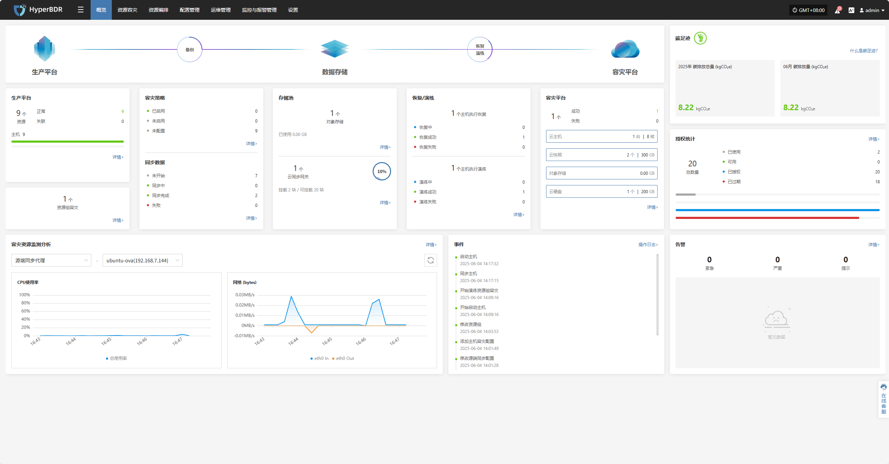
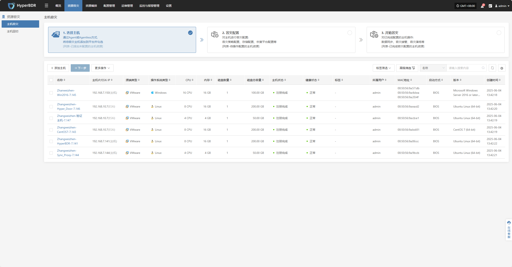
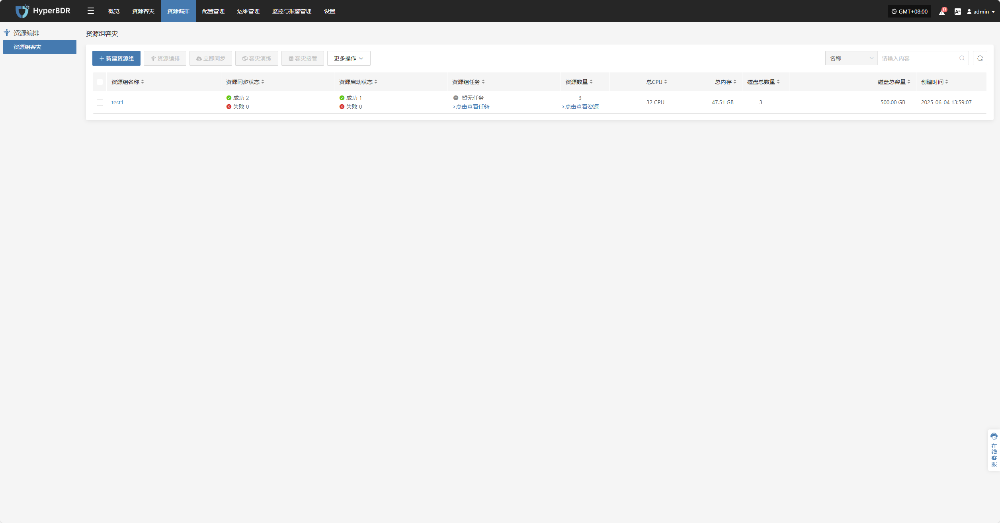
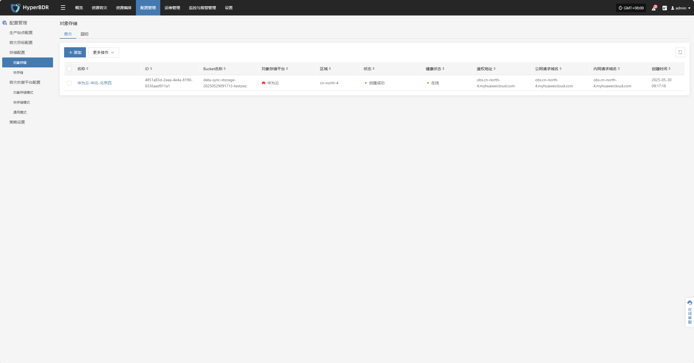
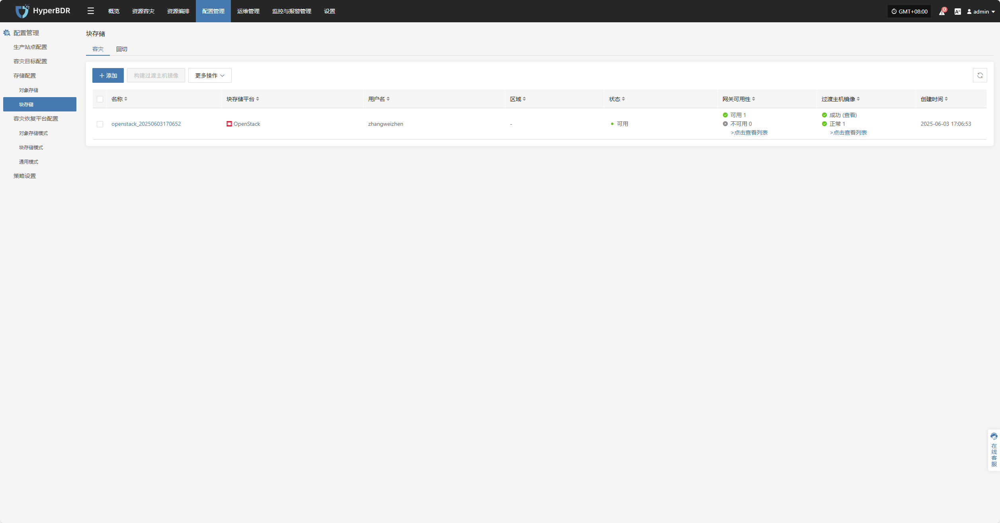
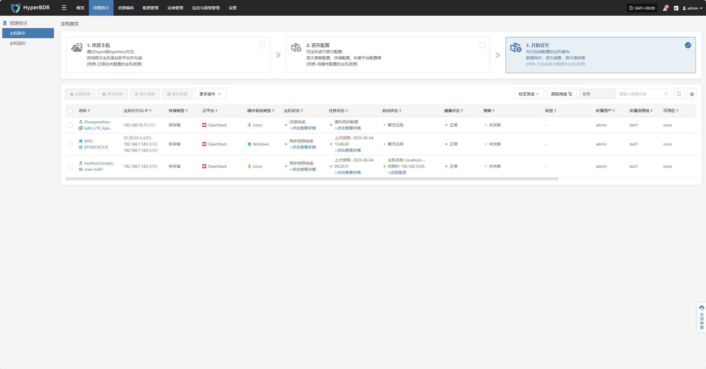
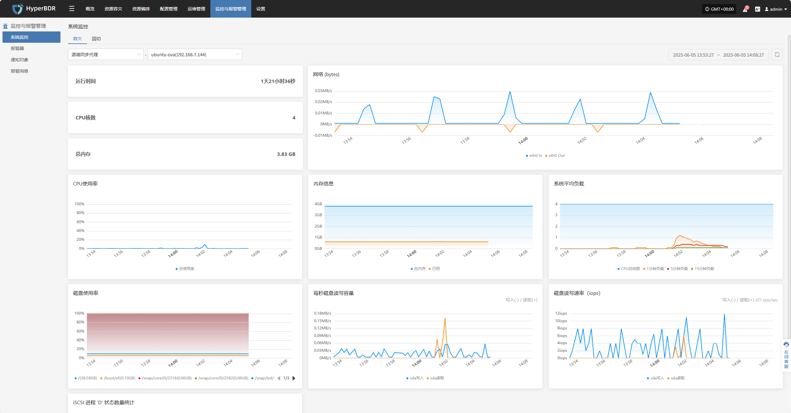
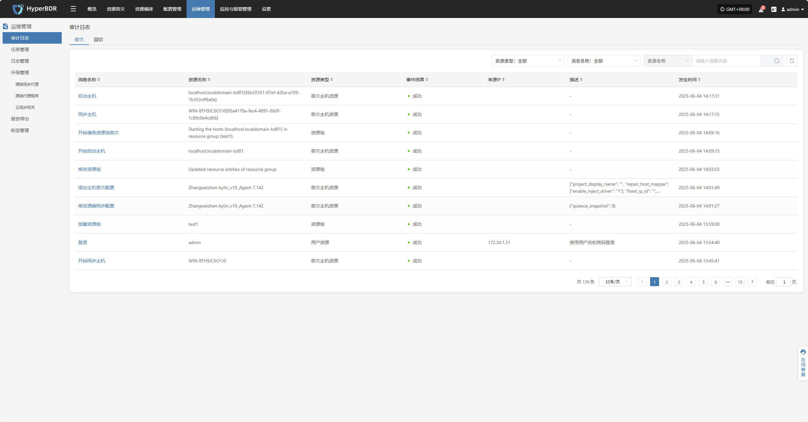
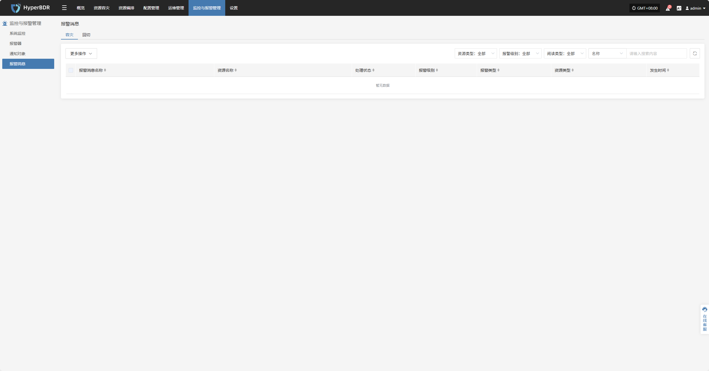
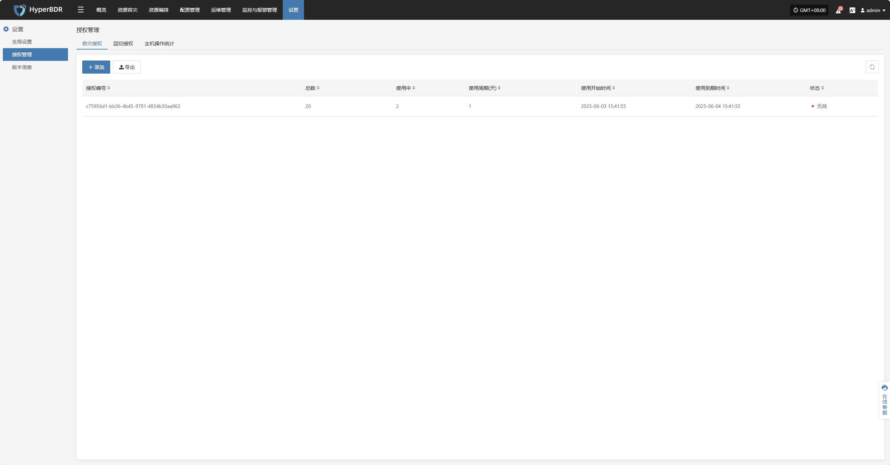

# **概览首页说明**

概览首页提供当前环境中生产平台、数据存储和容灾平台的整体运行情况，帮助用户快速了解系统资源状态、同步进度、任务执行结果、告警事件等关键信息，支持管理人员进行统一监控和决策。

## **页面结构与功能说明**

帮助用户快速理解各模块的作用与导航路径。通过对页面各区块功能的逐一说明，用户可全面掌握系统的使用入口与核心资源状态，为后续操作与管理提供指导。

### **顶部导航栏**

顶部导航栏提供系统主功能模块的快捷入口，包括：**概览、资源容灾、资源编排、配置管理、运维管理、监控与报警管理、设置**。
&#x20;

右上角区域显示当前登录用户信息、系统时间（含时区）及语言设置，方便用户查看与个性化配置。

### **系统核心结构概览**

展示系统架构的三大核心组件：**生产平台 → 数据存储 → 容灾平台**

### **区块内容说明**

概览首页通过多个功能区块直观展示系统中各类资源的当前状态与运行数据，包括生产平台、容灾策略、同步进度、存储配置、资源恢复演练、告警事件等内容。每个区块均支持跳转至对应模块页面，便于用户深入查看与操作。

#### **生产平台**

展示当前接入系统的生产资源总览，包括主机总数及其运行状态，帮助用户快速掌握生产环境的整体负载情况。

点击右下角“**详情**”按钮，可跳转至资源容灾页面，查看主机的详细信息与容灾配置状态。

#### **资源组容灾**

展示当前系统中已配置的资源组容灾组数量，便于用户了解资源组的容灾配置情况。

&#x20;点击右下角“**详情**”按钮，可跳转至资源组容灾页面，查看各资源组的详细配置信息与容灾状态。

#### **容灾策略**

该模块用于展示生产主机的容灾策略配置情况，帮助用户快速识别当前已具备容灾保护能力主机数量。

点击右下角“**详情**”按钮，可跳转至“开始容灾”页面，选择目标主机并关联相应策略。

#### **同步数据**

该模块用于展示源端主机数据同步的整体进展情况，是判断资源是否具备容灾能力的重要依据。

点击右下角“**详情**”按钮，可跳转至“开始容灾”页面，选择主机并执行立即同步操作。

#### **存储池**

##### **对象存储**

该模块展示当前已配置的对象存储池数量及其容量使用情况，帮助用户了解存储资源的总体占用情况。

点击右下角“**详情**”按钮，可跳转至存储配置页面，执行对象存储的配置与管理操作。

##### **云同步网关**

点击右下角“**详情**”按钮，可进入存储配置页面，进行块存储的配置和管理操作。

#### **恢复/演练**

“恢复 / 演练”区域用于展示当前平台上的容灾资源恢复状态，便于用户快速掌握资源的保护与演练情况。

##### **恢复**
展示当前处于“恢复”管理下的资源数量，以及恢复中、恢复成功、恢复失败不同状态的资源数量。

##### **演练**
展示当前处于“演练”管理下的资源数量，以及演练中、演练成功、演练失败不同状态的资源数量。

点击右下角“**详情**”按钮，可进入开始容灾页面，对主机进行演练、接管操作。

#### **容灾平台**

该模块展示当前系统已接入的所有容灾端平台的成功和失败数量，以及详细配置信息。 &#x20;

点击“详情”按钮可进入“开始容灾”界面，进行相关操作。

#### **容灾资源监测分析**

该模块用于实时统计并可视化展示系统中关键容灾资源的整体健康状况、配置状态及使用情况，帮助用户快速掌握容灾体系的运行稳定性。 &#x20;

用户可通过下拉列表选择不同的监控资源，支持以下资源类型及对应监控指标：

| **资源类型**      | **监控类型**  |
| ------------- | --------- |
| 源端同步代理        | CPU使用率、网络 |
| 云同步网关         | CPU使用率、网络 |
| Linux Agent   | CPU使用率、网络 |
| Windows Agent | CPU使用率、网络 |

点击右上角的“详情”按钮，可进入系统监控页面，查看更详细的信息。

#### **事件**

本模块集中展示与用户相关的关键动态信息，通过实时汇总和分类各类事件，帮助用户快速了解系统状态和任务进展。

点击右上角的“操作日志”按钮，可跳转至审计日志页面，查看详细的事件日志。

#### **告警**

该模块用于展示报警器触发的告警消息，帮助用户及时了解系统异常情况。

点击右上角的“详情”按钮，可跳转至报警消息页面，查看告警的详细信息。

#### **授权统计**

系统通过统计激活码的生成数量、使用状态和有效期等信息，帮助管理员高效管理授权资源。

点击右上角“详情”按钮，可跳转至授权管理页面，查看详细授权信息，并进行添加、导出等操作。

#### **碳足迹**

用户的碳排放数据是基于使用的云资源量进行计算得出。云产品在核算用户碳排放数据时会综合考虑不同国家或区域云数据中心Power Usage Effectiveness（简写PUE）、资源售卖情况、绿电使用比例、技术减碳措施等多个因素，由此计算出的不同地域或不同月份内的碳排放数据可能有所差异，这均属于正常情况。

云产品碳足迹覆盖了包括计算、存储、网络、数据库、CDN等多个云产品，在计算过程中，只计算在实际业务场景下的产生的资源。