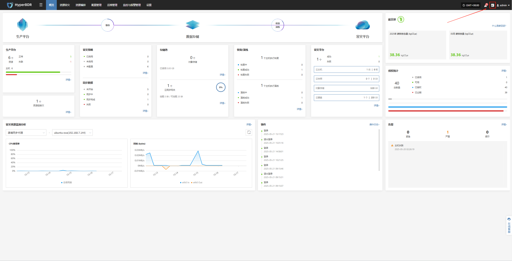
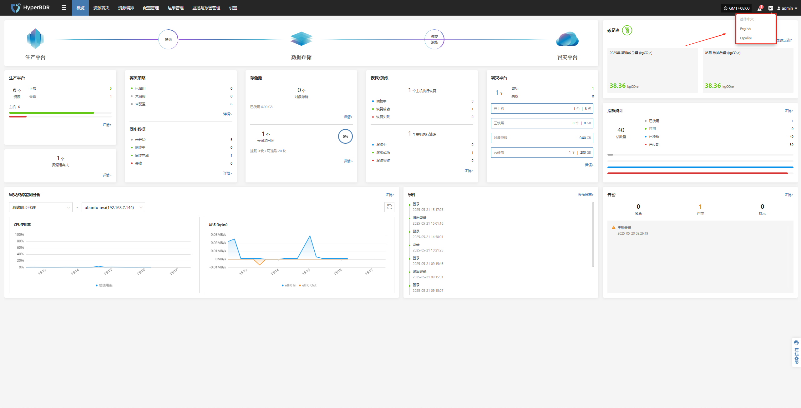

# **切换语言**

* 当前系统支持以下语言：

  * 简体中文

  * English

  * Español

* 在系统界面中，用户可以通过以下方式切换显示语言：

  * 点击右上角的"A图标"，展开下拉菜单。

    

  * 在弹出的语言列表中，选择您希望使用的语言，例如“简体中文”或“English”。

    > 默认语言为：简体中文

    

切换后系统将自动刷新界面并应用所选语言。
